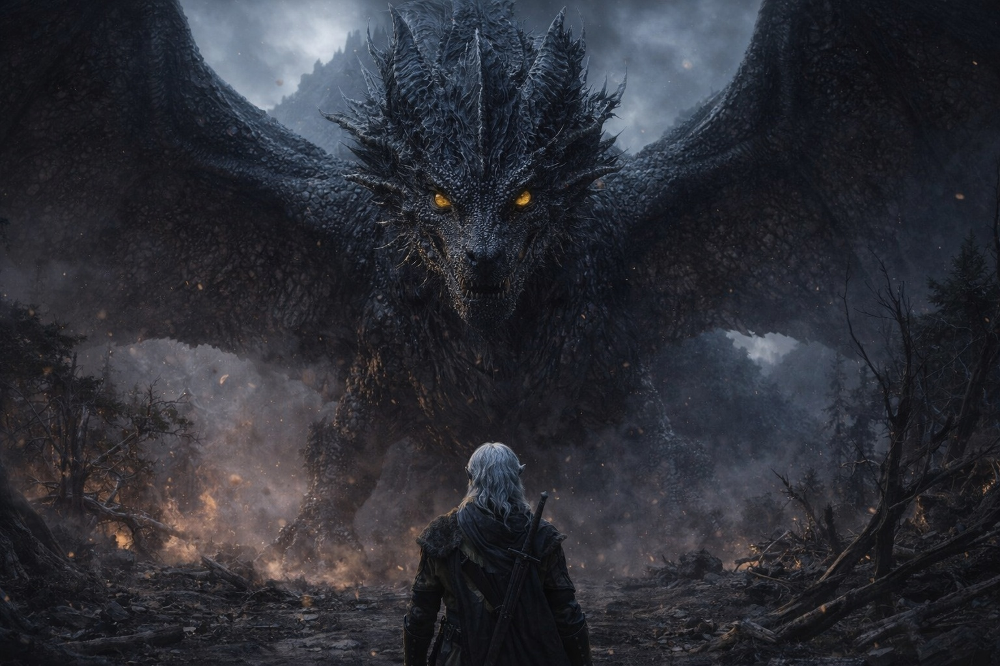
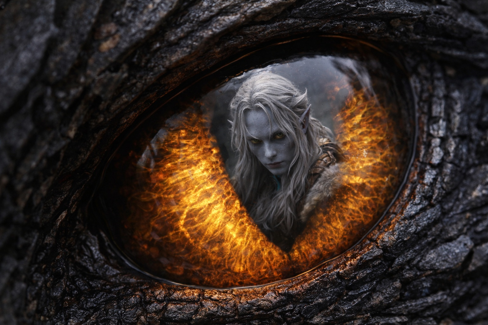

# Chapter 36.2 | The Scale of War: The Scale

---

The first sign was not heat.

It was absence.

The barrier's rhythm faltered—just once—like a skipped breath in a body too large to fail.

He recalculated.

The numbers did not change.

Then the ground trembled.

The thought arrived before the understanding. Drusniel stepped through the melted doorframe into open air and heat and light, and the first thing his mind registered was not the fire or the size or the impossibility. It was the memory of her choosing the open edge of the clearing. Nyxara standing in the center of the outpost chamber, near the widest point. Nyxara scanning the ceiling before choosing her seat, avoiding the low rafters, sitting where the space was largest.

She had always chosen the space where there was room. He had noticed. He had filed it as a commander's habit, a warlord's instinct for sightlines and exits. He had been looking at a mountain and seeing only the foothills.

She stood in the open ground between the outpost and the ridge, fifty paces from the nearest wall, a hundred from the nearest overhang. The space she'd chosen was the largest clearing within a league of the outpost. She'd walked there before the heat started, before the ward stones cracked, before the door melted. She had positioned herself where she had room.

The silhouette resolved into structure.
The structure resolved into taxonomy.

Dragon.

The data aligned.

The mountain path.
The open clearing.
The hesitation he had filed as caution.

The model had been correct.
The inputs had not.

He had removed the wrong variable.

It was not gradual. It was not dramatic in the way Drusniel's training had prepared him for, the way spellwork builds and crescendos and announces itself through layers of visible energy. It was simple and enormous: one moment she was there, a tall woman in dark armor standing in a clearing. The next moment the clearing was full.

Wings. Black wings that unfolded from a body that was suddenly the body, the real body, the thing the armor and the height and the commanding presence had been a compression of. The wings blocked the sky. Not metaphor. They spread across the clearing and past it, past the ridge, past the treeline, each one wider than the outpost had been long, membranes of black scaled skin stretched between bones as thick as the rafters she'd always avoided.

Scales like volcanic glass. Not smooth. Textured. Each one the size of his palm, overlapping in patterns that caught the dim Wyrmreach light and split it into something darker, light that went in and didn't come back. The body beneath the scales was massive in a way that made the word massive feel insufficient, a creature built on a framework that used mountains as reference points rather than rooms.

Her head turned. The eye that found him was larger than he was. Gold. Not the dark he'd cataloged in her human form — that had been a mask, or a compression, the color of fire banked so deep it read as darkness. Now the fire was unbanked. The same gold as the flickers he'd never quite caught in her gaze, scaled up until it was a landscape rather than a feature, an iris the color of banked fire with a pupil that contracted when it focused on him, adjusting for the difference in scale between what she was looking at and what she was looking from.

The same intelligence. The same patience. The same interest that had asked him about his beliefs and listened to his answers and understood the structure of his duty. Housed in something that could break the world by shifting its weight.

He felt small. Not diminished. Recalibrated. The way a mapmaker feels when he discovers his careful survey covered a single valley in a range of mountains, and the mountains continue in every direction further than the eye can reach. His understanding of Nyxara hadn't been wrong. It had been a detail in a portrait he hadn't known existed.

"YOU OPTIMIZED FOR PRESERVATION. I OPTIMIZED FOR PROGRESSION."

"I accounted for ambition," Drusniel said. "Not magnitude."

The ground continued to fracture.

She lowered her head. The motion was slow in the way that large things move slowly, not from hesitation but from the physics of mass, the inertia of a body that measured its movements in fractions of landscape rather than fractions of rooms. Her eye settled at a height that put it level with his chest. The iris contracted again. Focusing. Seeing him at the scale he actually occupied.

"SZORAVEL THINKS PREPARATION IS CONTROL." The words pressed against his ribs. Each consonant was a physical event. "IT IS NOT. CONTROL IS SCALE. HE PREPARED FOR A WORLD WHERE KNOWLEDGE GRANTS AUTHORITY. HE WAS WRONG. KNOWLEDGE GRANTS AWARENESS. SCALE GRANTS AUTHORITY."

Drusniel stood in the wind from wings that blocked the sky and the heat that radiated from a body that burned from within and the sound of a voice that was the same voice, the same person, the same patient intelligence that had escorted him through her domain and asked him about sacred duties and sat quietly while Szoravel planned three weeks of preparation. The same person. The same goals. The same genuine interest in his beliefs and his compatibility and his willingness to bear cost.

The same person who had decided that three weeks was too long, and who had the scale to make that decision matter.

Behind him, Srietz was pressed against the outpost wall. His ears were flat against his skull. His yellow eyes were calculating, running numbers that kept producing the same answer: the math doesn't work, the math doesn't work, the math doesn't work. Srietz had survived lords. He had not survived this.

Elion stood at the melted doorway. Still. His amber eyes fixed on Nyxara's form with an expression Drusniel couldn't read, an expression that was not fear but recognition, the look of someone whose interior voice had just said something that made everything else quiet.

"I GAVE HIM THREE WEEKS," Nyxara said. The trees were still falling. The wind was still tearing. "HE USED THEM TO BAR A DOOR."

She lifted her head. The motion put her profile against the sky, and Drusniel saw her clearly, fully, the way she had always existed: a black dragon whose wingspan could shadow a valley, whose fire had melted a warded door from fifty paces, whose patience with mortal timekeeping had finally, comprehensively expired.

Not a monster. Not a villain. A being that operated at a scale where his careful planning and Szoravel's precise protocols and the Drow's centuries of barrier guardianship were all the same thing: small. Well-intentioned. Insufficient.

The arguments about timing felt like debates about weather held inside a hurricane.

---

**End of subchapter — continues in Chapter 36.3**
