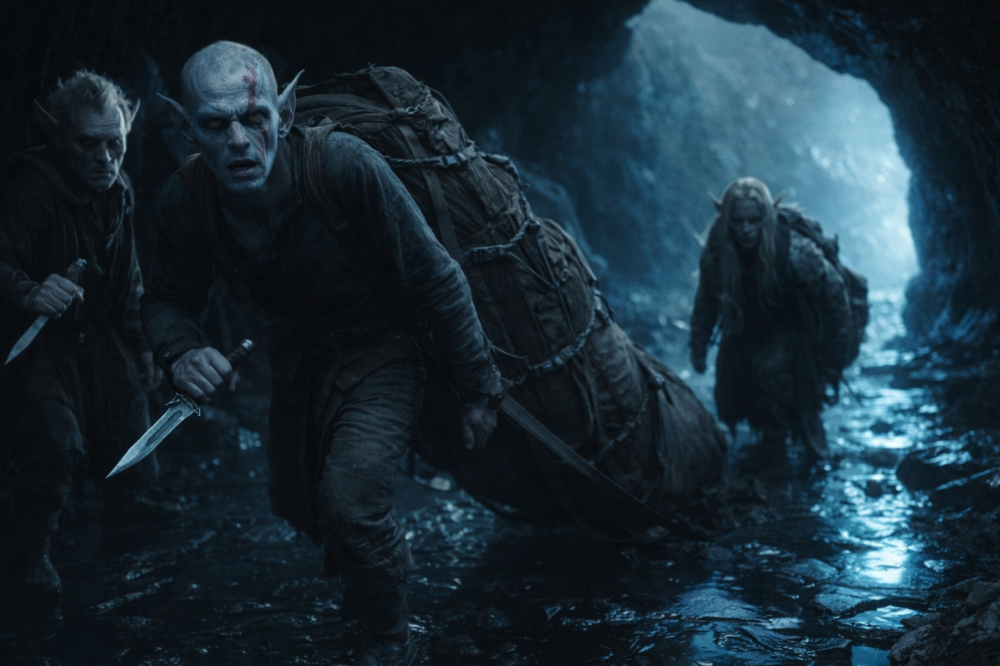
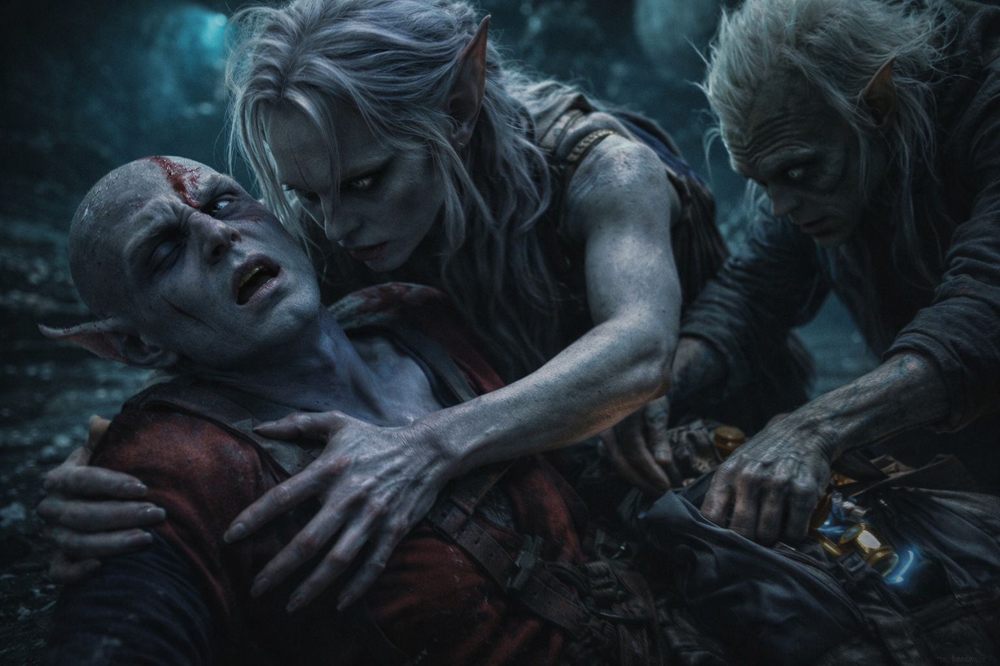
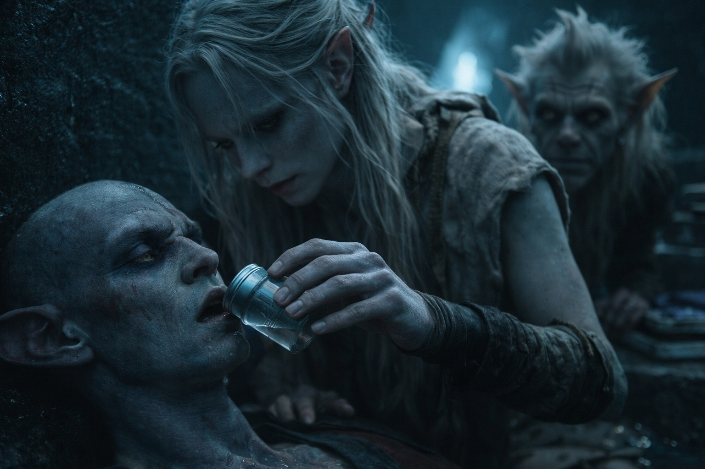
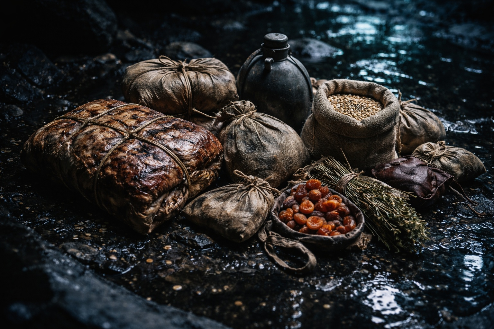

## Chapter 17 | Part 6

--- 

Twenty-three hours.

Drusniel had stopped counting minutes somewhere around the fifteenth hour, but he tracked the larger increments obsessively. Each hour that passed was another hour of Elion's absence, another hour of uncertainty, another hour closer to the point where hope became foolish.

Srietz had stopped pretending to rest. The goblin sat rigid near the cave entrance, ears twitching at every sound, eyes fixed on the darkness beyond.

"Srietz calculates probabilities," he said quietly. "Srietz does not like the probabilities."

"What do they tell you?"

"That twenty-three hours is long. That shapeshifter transformations are exhausting. That Wyrmreach is dangerous even for those who know its paths." A pause. "That Srietz should begin planning for alternatives."

"What alternatives exist?"

"Fewer than Srietz would like." The goblin's voice was flat. "Srietz could attempt the journey alone—slow, dangerous, probably fatal. Srietz could try to find food in the caves—possible but unlikely to sustain two people. Srietz could—"

He stopped.

Something was moving in the darkness.

Drusniel's hand went to his knife—the only weapon he'd kept from their escape. Beside him, Srietz pressed back against the wall, making himself as still as stone.

The movement resolved into a shape. Humanoid. Dragging something behind it.

*Elion.*

He looked worse than Drusniel had imagined possible. His skin was grey, slick with sweat, hanging loosely on bones that seemed too prominent. He moved in lurches, each step an obvious effort, and his eyes—those were the worst. Empty. Exhausted past the point where exhaustion was a meaningful word.

But he was carrying something. A pack, improvised from what looked like animal hide, bulging with supplies.

"Elion—"

The shapeshifter collapsed.

Drusniel caught him before he hit the ground, feeling the fever heat radiating from skin that trembled with continuous small spasms. Whatever transformation had taken him to the goblin village and back, it had cost everything he had.

"Srietz, the supplies—"

"Srietz is examining." The goblin moved quickly, tearing open the pack. "Food. Preserved meat, some grain, dried fruit. Water—no, water containers. Medicine perhaps? Srietz recognizes some of these—"

"Help me."

Together, they dragged Elion deeper into the cave, away from the entrance, propping him against a wall that held some residual warmth. His breathing was shallow, rapid, and his skin felt like paper over kindling.

"Water," Drusniel said. "He needs water. The condensation—"

Srietz was already moving, returning moments later with a makeshift container of collected moisture. Drusniel held it to Elion's lips, forcing small sips past the shapeshifter's barely-responsive mouth.

"Stupid," Elion whispered. "Told you... might not come back."

"You came back."

"Barely." A ghost of a smile. "The village... they traded. Fair enough. Asked questions I couldn't answer. Left before they got suspicious."

"You should rest."

"Can't." Elion's eyes flickered open, focusing with obvious effort. "The transformation... I'm locked. For at least a day. Maybe more. Can't change. Can barely move." He looked at Drusniel, then at Srietz. "You'll have to protect us if something comes."

"Nothing's coming," he said. "The caves are safe. You said so yourself."

"Safe... ish." Elion's eyes closed. "Don't let me... die in my sleep. Wake me. If anything..."

He was unconscious before he finished the sentence.

Srietz sat back on his heels, surrounded by the supplies Elion had brought. Food for days. Medicine. Tools. Everything they needed to survive long enough to plan their next move.

"Srietz recalculates," the goblin said quietly.

"Recalculates what?"

"Everything." He looked at Elion's unconscious form. "The shapeshifter returned. The shapeshifter nearly died returning. Srietz did not expect this."

"You thought he'd leave us."

"Srietz thought he'd choose survival over obligation. Most do. Srietz would have." The goblin looked away, jaw working. "Srietz was wrong. Srietz does not enjoy being wrong. But this wrongness is... preferable to the alternative."

"Watch over him," Drusniel said. "I'll sort the supplies, plan rationing. We need to figure out our next move while he recovers."

"And then?"

"Then we decide when Elion can stand."

Srietz looked at Elion, then at the food.

"Srietz recalculates."

Drusniel began dividing the rations.

---

**End of Chapter 17.6 —> 18.1: [Northbound: The Counting](/northbound-the-counting/)**