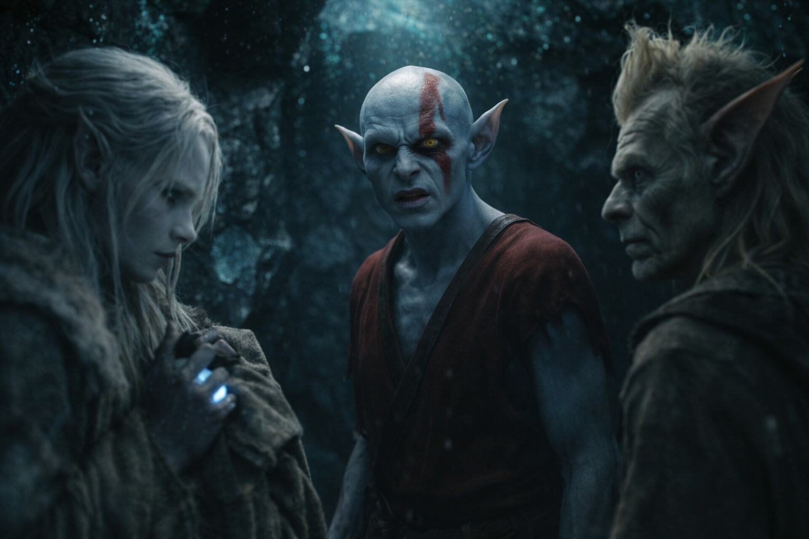
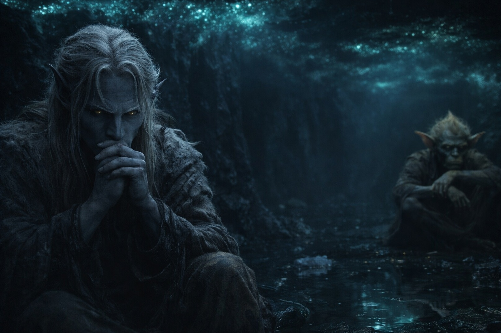

## Chapter 17 | Part 3

--- 

"I'll go."

Elion said it simply, as if he were offering to fetch water rather than volunteering for something that might kill him.

Drusniel had explained the situation carefully—knowledge of a goblin settlement, direction and distance, terrain that would take days to cross on foot.

"Source?" Srietz asked.

"One I don't trust."

"Better answer than Srietz expected. Worse answer than Srietz wanted."

"You're not recovered." Drusniel studied the shapeshifter's face, noting the pallor, the slight tremor in his hands. "The shifts during our escape—"

"Were minor. This would be... different." Elion looked toward the cave entrance, toward the wilderness beyond. "But I'm the only one who can cover that distance in time. I'm the fastest. And I know how to move through Wyrmreach without being seen."

"You know through memories that aren't yours."

"Still knowledge. Still useful." A pause. "I've done this before, Drusniel. I know what it costs. I'm choosing to pay it."

Srietz shifted in his corner.

"Srietz has another question. What happens if the transformation... doesn't work?"

"It always works." Elion's voice was flat. "The question is what shape I'm in afterward."

"And what shape is that?"

"Usually? Barely functional. Sometimes worse." He met Drusniel's eyes. "I won't lie to you. There's a chance I don't come back. Not because I won't try, but because the transformation takes everything I have, and traveling after uses what's left. If there's not enough left..."

"Then why risk it?"

"Because if I don't, we all die slowly in this cave." Elion's mouth twitched. "I've survived worse odds. Probably."

Drusniel looked toward the passage he had explored. He could not have walked another hundred steps.

Elion might not survive the journey. Keeping him here would leave them without food.

"What do you need from us?"

"Space. You won't want to be close when I change." Elion moved to the center of the cave, away from the walls, away from them. "And Drusniel—don't reach for the air while I change. Transformation magic reacts badly to outside pressure."

"I won't."

Elion closed his eyes. For a moment, nothing happened. He stood in the faint phosphorescent glow, breathing slowly, and Drusniel wondered if the shapeshifter had changed his mind.

Then it began.

The first sound was a crack—bone, unmistakably. Elion's spine bent in a direction spines weren't meant to bend, vertebrae sliding and reforming under skin that rippled like water over stone.

Srietz scrambled backward, hands pressed against his ears. "Srietz did not know. Srietz takes back what Srietz said about wanting to understand—"

More cracking. Elion's arms stretched, elongating, joints multiplying. His legs folded backward at angles that made Drusniel's stomach lurch. The sound of flesh tearing—not external, but internal, muscles reorganizing, tendons reattaching to new anchoring points.

Drusniel made himself watch, though each crack made him flinch.

He could no longer tell where Elion's shoulders ended and his arms began.

Elion's face was the worst. The bones shifted beneath skin that stretched too thin, revealing shapes that had no business existing. His jaw elongated. His skull narrowed. His eyes migrated, just slightly, to positions better suited for what he was becoming.

He didn't scream. Drusniel didn't know if that made it better or worse.

The smell of sweat reached him, followed by burned flesh. Drusniel blinked hard; the light above Elion blurred.

He lost count of the minutes.

When it ended, Elion wasn't Elion anymore.

The creature stood low on long limbs, its body narrowed for running. Drusniel could not name it.

It looked at him with eyes that still held something familiar. Then it turned and was gone, moving into the darkness faster than anything that size should move.

Neither of them spoke.

"Srietz will not sleep tonight," the goblin said eventually, voice shaking. "Srietz will not sleep for many nights."

Drusniel sat down heavily. His legs had stopped working somewhere during the transformation, and he hadn't noticed until now.

"Neither will I."

Drusniel settled against the obsidian wall and began counting.

One hour. Two. The phosphorescent glow pulsed overhead, marking time in light instead of sound. Srietz didn't move from his corner. Neither did Drusniel.

They waited. It was the only thing left to do.

---

**End of Chapter 17.3 —> 17.4: [The Second Choice: The Wait](/the-second-choice-the-wait/)**
