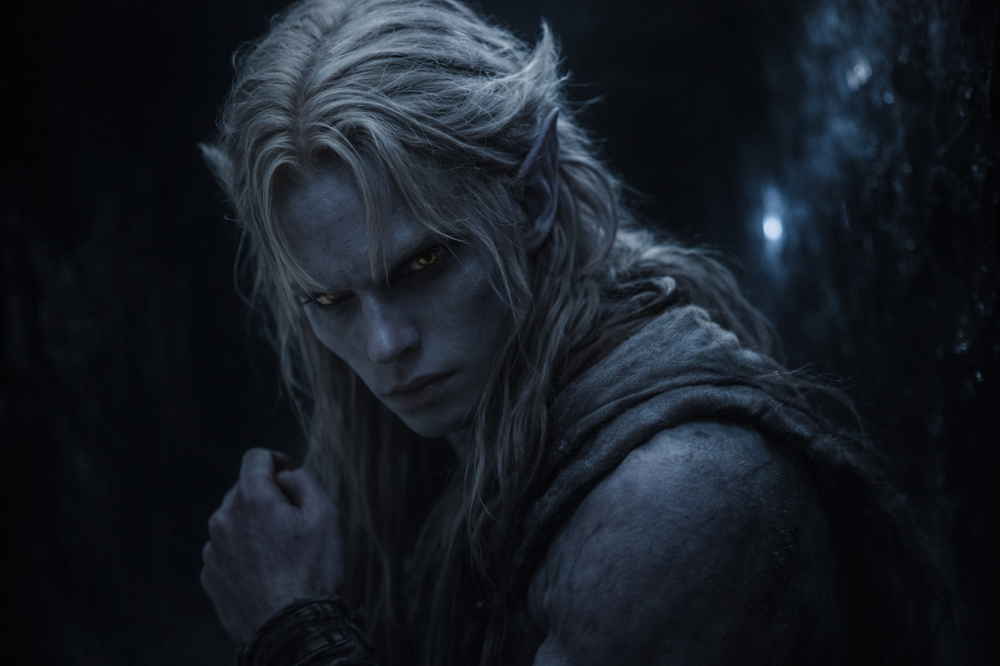
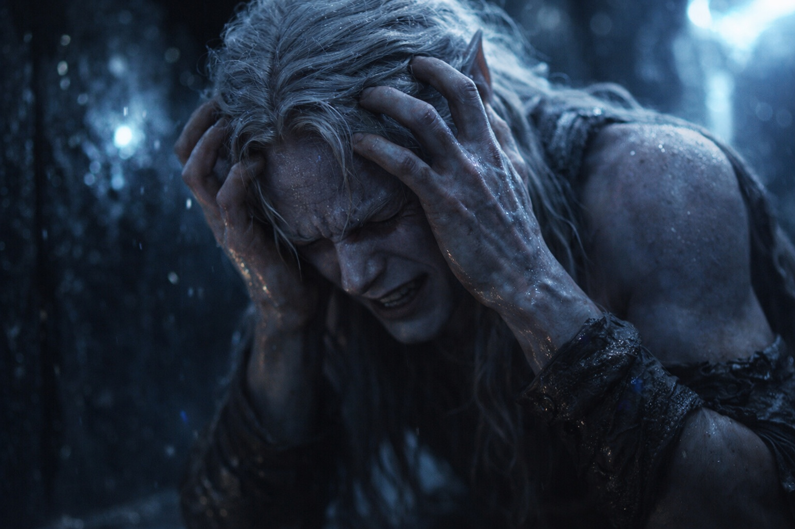

## Chapter 17 | Part 2

--- 

Drusniel found the deeper passage while the others slept.

He could not sleep. The passage branched beyond the light, and one branch might lead to food. He left the others resting.

Pale growth lit the turns in the obsidian passage. He counted his steps and touched the wall at each junction, fixing the way back in his mind.

At five hundred steps, his legs buckled. He caught the wall, but could not push himself away from it. The Voice spoke.

The pressure behind his eyes returned, the same as on the Nightmare Sea.

**A route. One debt.**

Drusniel held himself against the wall. The words had made no sound.

"I didn't call you."

"A way out?"

The first debt remained unpaid. He still did not know what payment would require.

"What will you take?"

Nothing answered. His fingers slipped on the smooth wall. He lowered himself until he could brace a foot against the opposite side of the passage.

He waited. The offer did not change.

Drusniel had accepted the first debt to save himself.

"Where does it lead?"

Still no answer. Elion and Srietz were waiting behind him, with nothing to eat. He had found no exit.

"I accept."

Pain struck behind his eyes. He knew the way to a goblin settlement: the turns, the distance, the stretches of exposed ground. He had never walked it. He pressed his forehead against the wall, trying to keep the route clear through the pain.

When the pain eased, he was sitting on the floor, gasping.

**Two debts.**

The voice was already gone by the time he could respond.

Drusniel stayed against the wall until he could stand.

Two debts.

He stood, oriented himself toward the return path, and began the five-hundred-step walk back.

---

**End of Chapter 17.2 —> 17.3: [The Second Choice: The Transformation](/the-second-choice-the-transformation/)**
