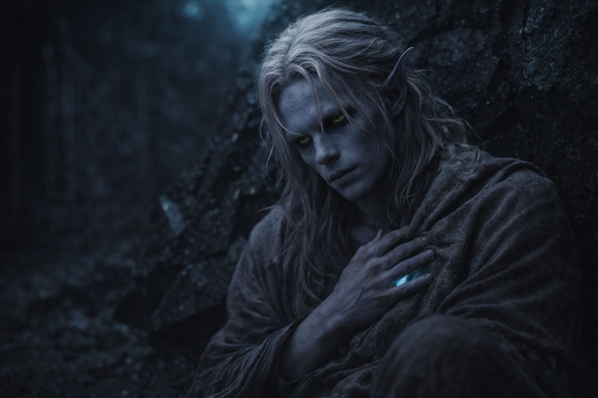

## Chapter 17 | Part 5

--- 

He couldn't leave it alone.

In the sixteenth hour of waiting, with Srietz dozing fitfully and no sign of Elion's return, Drusniel went back to the wall.

Annariel had made him copy this dialect until his fingers cramped. He had called it useless. Now he crouched in an obsidian cave, sounding out damaged words by touch.

The first inscription continued around a fracture in the stone.

Fragment: *"...the realm was shaped to contain what could not be destroyed..."*

Several lines had been gouged away.

Farther along, another survived beneath a shelf of glassy rock.

Fragment: *"...dual nature may cross where single nature cannot..."*

That was worse.

If *dual nature* meant affinity—and he had no proof that it did—then the line might have something to do with how he had crossed into Wyrmreach. If *contain* meant prison rather than boundary, then the first fragment changed the question of what the barrier was for.

Two *ifs*. A damaged wall. Poor evidence.

He kept reading.

Most of what remained was useless: names without context, broken warnings, half a prayer. Lower down, however, the script changed. The letters were rougher, cut quickly rather than carved.

<video controls playsInline preload="metadata" poster="./fragments-and-survival-notes_sora.jpg" width="100%">
	<source src="./ReadCave.mp4" type="video/mp4" />
	Your browser does not support the video tag.
</video>

Fragment: *"...follow the small ones through the fire roads. They know the paths that cool..."*

Fragment: *"...when the heat turns, move. The stone breathes and closes..."*

Fragment: *"...where the black shelf splits, do not take the lower path..."*

Drusniel read those twice.

Practical instructions were easier to trust. Someone had walked those roads, encountered specific hazards, and cared enough—or feared enough—to leave notes behind.

He returned to the first two fragments.

*Contain what could not be destroyed.*

*Dual nature may cross.*

He wanted them to fit. That was precisely why he distrusted the fit.

The Null rested beneath his shirt. It had crossed with him. Whether that mattered was another question.

When he returned to the main chamber, Srietz was awake.

"Drusniel found more writing."

"Yes."

"Useful?"

"Some of it."

"Dangerous?"

"I don't know yet."

Srietz considered that. "Srietz prefers dangers with measurements."

"So do I."

"Then perhaps count how long Elion has been gone."

Drusniel looked toward the cave mouth. Elion had been gone sixteen hours.

The wall could wait.

He sat beside the water they had collected and resumed counting time.

---

**End of Chapter 17.5 —> 17.6: [The Second Choice: The Return](/the-second-choice-the-return/)**