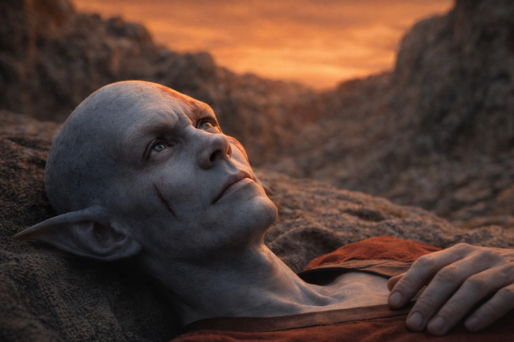

# Chapter 46.2 | What Cannot Be Taken Back: The Reunion

---

He found them in a depression between two rock formations, northeast of the rejection point, where the changed terrain offered a natural shelter from the wind and from whatever else the changed world was producing. Srietz had chosen the location the way Srietz chose everything: with the precision of a person who calculated angles of approach, sight lines, and defensibility before he calculated comfort.

Srietz saw him first.

The goblin was sitting on a rock at the depression's edge, facing the direction Drusniel was coming from, which meant he had been watching. Which meant he had been waiting. Which meant he had calculated the probability that Drusniel would survive the act and walk out of the barrier zone and follow the tracks northeast and arrive at this location, and the calculation had produced a number sufficient to justify sitting on a rock and watching.

Srietz stood up. Then sat back down. Then stood up again. His hands moved to the small leather satchel at his hip, the one that held his tools and his notes and the objects he used to calculate things, and his hands touched the satchel the way hands touch things when they need to touch something and the thing they want to touch is not available.

He did not speak.

Drusniel walked the last hundred feet. Each step was visible to Srietz, and in each step Srietz could see what the act had cost: the burns, the blood, the slowness, the way Drusniel held his left arm against his ribs, the absence of the artifact, the dark crystals, the posture of a body that had been used as a conduit and returned to its owner with the damage intact.

Drusniel reached the depression's edge. Looked down. Elion was there, lying on his back on a blanket Srietz had arranged, his eyes open, staring at the amber-rust sky. The Sage was quiet. For the first time since Drusniel had known him, the Sage was quiet. Elion's eyes were clear. Not clouded with the Sage's dual presence, not flickering between his own awareness and the ancient intelligence that shared his body. Clear. Just Elion. The clarity might have been a gift. It might have been worse.

"It's done," Elion said. Not a question.

"Yes."

Elion continued looking at the sky. The amber-rust that was the answer to every question anyone was going to ask about what had happened. He did not sit up. He did not look at Drusniel. He looked at the sky because the sky was the result and looking at it was the same as looking at the act.

"The Sage is quiet," Elion said. "Since the cascade. Since the field collapsed. It's not gone. I can feel it in there, like a weight at the bottom of a well. But it's not speaking. It's not directing. For the first time in my life, my thoughts are my own thoughts and nothing else, and I do not know what to do with that because I have never had thoughts that were only mine."

The silence after that was long enough to hold the weight of what had happened and wide enough to hold the distance between three people who had been through something that did not have a word.

Srietz had not spoken. He stood at the depression's edge, three feet from Drusniel, close enough to touch and not touching. The third person was gone from his posture. The armor of distance, the linguistic shield that kept the world at the right remove, was down, and what was underneath was a goblin looking at a drow with an expression that Drusniel had never seen on Srietz's face because Srietz had never allowed it to be there.

"Are you hurt?" Srietz said.

Not *Is Drusniel hurt*. Not *Srietz observes damage*. Not the third-person construction that organized the world into categories that could be managed. Just: *Are you hurt*. First person implicit. Second person direct. The grammar of a person speaking to another person without the armor between them.

"Yes," Drusniel said.

Srietz looked at the burns. The blood. The way Drusniel stood. The damage that was visible and the damage that was not visible and that Srietz could calculate from the visible damage the way a mathematician calculates the whole from the parts.

"Can Srietz fix it?"

The third person came back. The armor going on. The world returning to the structure that Srietz needed it to have in order to function in it. *Can Srietz fix it*. The question asked in the grammar of distance because the answer was going to require distance to survive.

"No," Drusniel said.

Srietz nodded. The nod was small and it contained everything. The acknowledgment that the damage was beyond repair. The acceptance that the role Srietz had occupied, the companion who calculated and prepared and mitigated, had reached the limit of what calculation and preparation and mitigation could address. The understanding that what Drusniel had done was not the kind of thing that a goblin with a satchel of tools could fix, and that the inability to fix it was not failure but scale.

He handed Drusniel water.

The canteen was the one Srietz had carried since the coast. The water was clean, which meant Srietz had found a source and filtered it, which meant Srietz had been functioning, which meant the goblin had survived the barrier's rejection and carried Elion to shelter and established a camp and found water and sat on a rock and waited. All of that. In the time it had taken Drusniel to kneel in the ash and stand and walk out and follow the tracks. Srietz had done what Srietz always did: the next thing, and the thing after that, and the thing after that, until the list of things ran out or the world provided new things to do.

Drusniel drank. The water tasted like water, which was a small mercy that he catalogued the way he catalogued everything, automatically, without deciding to, the habit that survived catastrophe the way the thumb-tap survived catastrophe, because habits do not care about context.

He sat. Not beside Srietz, not opposite. Just close. The distance that had existed between them since the volcano was still there, the space created by disagreement and differing calculations and the knowledge that Drusniel's path led somewhere Srietz could not follow. The distance was still there. But it was smaller. Because Srietz was not the kind of person who abandoned broken things, and Drusniel was broken, and the breaking had closed a distance that agreement never could have.

They sat in the depression. Three of them. The amber-rust sky above. The changed terrain around them. The barrier behind them, somewhere to the southwest, damaged and leaking something that should not exist in this world. Nyxara was gone. The sky held no dragon. Whatever she was doing, whatever scale her operations occupied, it did not include this: three damaged people in a rock depression, sharing water, saying nothing, waiting for whatever came next.

"What happens now?" Srietz asked.

It was the first time he had asked a question without already knowing the answer. The first time the calculations had produced no result, the variables too many and too changed for the equations that had served him to produce anything but error.

"I don't know," Drusniel said.

"Srietz doesn't know either." A pause. The calculations running anyway, because Srietz could not stop calculating any more than Drusniel could stop cataloguing. "Srietz has calculated many outcomes. None of them are good." He looked at the sky. The wrong color that was not going to become the right color. "But some of them have us in them. Srietz will take those."

Drusniel looked at the goblin. The words were quiet and they were the most honest thing Srietz had ever said, more honest than the probabilities and the calculations and the third-person constructions that organized the world into something survivable. *Some of them have us in them. Srietz will take those.*

One, two, three, four. His thumb against his thigh. The count that meant nothing. The count that meant everything.

They sat. They waited. They did not know what for.

---

**End of Chapter 46.2 — continues in Chapter 46.3: [What Cannot Be Taken Back: The Terminal State](/what-cannot-be-taken-back-the-terminal-state/)**
