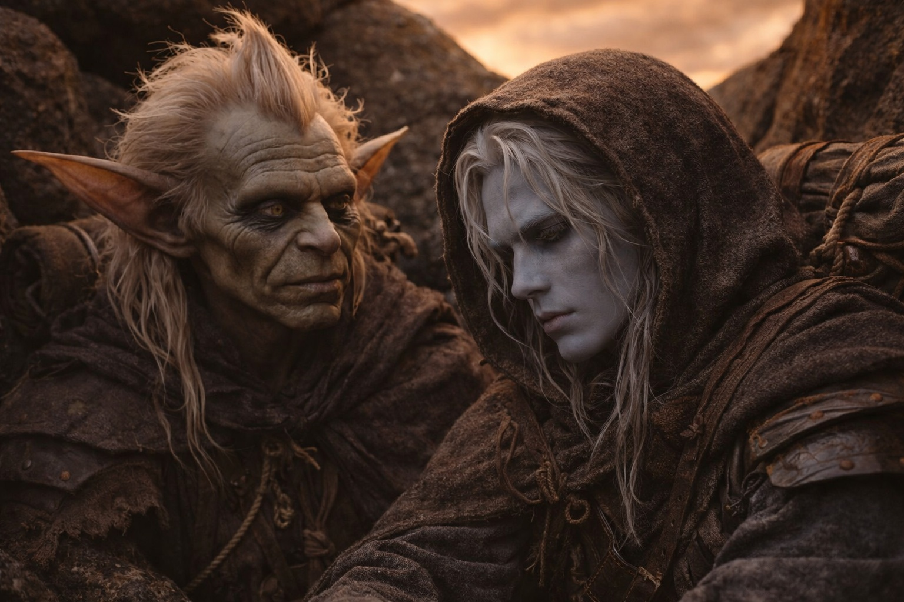

## Chapter 46 | Part 3 | The Terminal State

---

Drusniel sat in the depression with Srietz and Elion while the amber-rust sky held its position above them and the barrier leaked something nameless into the atmosphere behind them and his mind did what it always did.

It catalogued. It reconstructed. It took the wreckage of everything that had happened and arranged it in the order that the wreckage demanded, not the order he wanted, because his mind had never given him what he wanted and had always given him what was accurate and the two had never been the same thing.

The barrier was compromised. Not destroyed. Damaged in a way that was structural, permanent, and actively leaking. The entity's presence was atmospheric now, a contamination distributed through the magical field itself, not a creature that could be fought or contained but a condition that would spread the way weather spreads, through every system that touched the air. The contamination would reach the Drow cities. It would reach the human settlements. It would change the magical field that every enchantment, every ward, every infrastructure was calibrated to, and the changes would cascade through every system that depended on stability.

The Drow legacy that he had fought to protect was the thing he had broken.

He understood that. His mind presented it clearly, without commentary, the way his mind presented all facts: here is the thing, and here is what the thing means, and here is what you did. The thousand years of Drow guardianship, the sacrifice and vigilance and the price paid by every generation to maintain the barrier, all of it undone by a single act performed by a Drow who believed he was fulfilling his duty. The system that his people had built and maintained and died for, broken by the hands it had been designed to protect.

He sat with that. There was no alternative to sitting with it. It was not the kind of truth that could be argued with or qualified or placed in a context that made it smaller. It was the size it was. His mind held it the way his burned hands held the canteen: with difficulty, with pain, because the alternative was dropping it, and he did not drop things.

And then, in the wreckage, underneath the barrier and the entity and the contamination and the world, his mind found something smaller. Simpler. Harder to look at.

Zaelar.

The thought arrived the way obvious truths arrive: not as a revelation but as a settling, the way sediment settles to the bottom of water that has stopped being disturbed. It had been there the whole time. It had been there since Umbra'kor, since the exile, since the day Zaelar had left with Szoravel and Drusniel had stayed behind and felt the absence like a wound that would not close.

Zaelar was exiled for a reason.

Not politics. Not jealousy. Not the fear of brilliance that Drusniel had told himself for years, the narrative he had constructed to explain why the elders had sent away the most gifted mind in Umbra'kor. The elders had not been afraid of Zaelar's brilliance. They had been afraid of Zaelar. Because Zaelar was exactly what he appeared to be: a man who wanted power for himself, at any cost, with Szoravel as his partner in the same ambition. Everyone in Umbra'kor could see it. Shyntara had tried to warn him. The elders who voted for exile had been protecting themselves from exactly what happened.

And Drusniel, the man who prided himself on seeing patterns, on cataloguing, on never being deceived, had been the fool.

Not because Zaelar was a genius manipulator. That was the story Drusniel would have preferred, the version where the deception was sophisticated enough to justify having fallen for it. The truth was smaller and uglier: Zaelar had offered knowledge, framed it as independence, and Drusniel had convinced himself because Drusniel needed a mentor so badly that he saw one where everyone else saw a threat. His hunger for self-made power, his determination to build himself from his own work rather than from what Umbra'kor gave him, was the exact vulnerability Zaelar had used. Not exploited. Used. The way a key uses a lock. The shape was already there.

The sting of it was worse than the barrier. The barrier was systemic. A person could hide inside a systemic catastrophe the way a person hides inside a flood: the scale of the thing obscured the individual responsibility, spread the blame across mechanisms and systems and timings that no single person controlled. But Zaelar was personal. Zaelar was stupidity. Zaelar was a boy who needed a father and found a con artist and convinced himself the con artist was a teacher and maintained that conviction in the face of every warning because the conviction was load-bearing and removing it would have meant rebuilding the foundation.

He had rebuilt nothing. He had carried the conviction into Wyrmreach and through the barrier and into the act, and somewhere in the architecture of the beliefs that had driven him, Zaelar's teaching was still there, the stones laid by a man who had been exiled for a reason that everyone could see except the boy who worshipped him.

Srietz was watching. Drusniel could feel it the way he could always feel Srietz's attention, the precise, calculating gaze that missed nothing. Srietz did not speak. Because Srietz had always known about Zaelar. Srietz had calculated the probability that Zaelar was what the elders said he was and the probability had been high and Srietz had said nothing because Srietz understood that some calculations needed to be performed by the person whose foundation depended on the result.

And then, beside the ugliness, the other thing. The thing that was not ugly but was worse.

Nyxara.

She was real. All of it was real. The conversations at the edge of camp while Srietz calculated and Elion slept. The patience she had shown him, the completeness with which she listened, the way she understood duty and cost and the weight of carrying knowledge that you wished you did not have. She was the best ally he had ever had. She understood him in a way that Annariel had tried to and Shyntara had refused to, and the understanding was genuine, and the conversations were genuine, and the respect was genuine, and if things had been different she might have been the person he spent his life beside.

But she was a Dragon.

Not metaphorically. Not politically. A Dragon, operating at a scale that made his entire life a single season in her calendar, pursuing goals that measured themselves in centuries, executing plans that had been in motion since before Umbra'kor existed. Dragon Conquest. The restructuring of Astalor under draconic authority. A vision that was coherent and rational and that he could respect the way he respected any well-reasoned position, and that was incompatible with everything he was.

The barrier's weakness made her plans executable. His act had opened the door she needed opened. The catastrophe he had caused was, in the framework of her ambition, an opportunity. Not because she was cruel. Because she was a Dragon, and Dragons operated at a scale where a broken barrier was a strategic development and a damaged drow was a seasonal event.

She could not have told him. He understood that too, with the clarity that his mind applied to everything it touched. Revealing her nature would have collapsed the trust they had built. The moment he knew, the relationship changed. It had to. A mortal and a Dragon could not be partners. They could only be a Dragon and someone the Dragon liked. She had liked him. Genuinely. That made it worse, not better. The grief of losing something real was worse than the grief of losing something false, because the real thing existed in a space where the loss was not a correction but a subtraction.

Srietz was still watching. Quieter now. About Nyxara, Srietz was quieter. He had respected her too.

Two truths sat side by side in Drusniel's chest. The ugly one: Zaelar was outside for a reason, and everyone knew, and Drusniel was the only fool who did not see it. The painful one: Nyxara was the realest thing in his life, and it was not enough to bridge what she was. Stupidity and grief, stacked on catastrophe, in a man already at his lowest, sitting in a depression in changed Wyrmreach under a sky that would never go back to the right color.

He had believed in duty. He still believed in duty. That was the part that would keep him awake for the rest of his life: not that his beliefs were wrong, but that they were right, and the world broke anyway. The analysis had been correct. The timing had been wrong. The system did not distinguish between the two. He had done his duty. The world had paid for it. And underneath the duty and the payment, two things that had nothing to do with systems or gods or barriers: the mentor who was a fraud, and the ally who was a Dragon, and the distance between those two facts was the exact width of a world that could not hold them both.

The sky would not go back to the right color. He knew that the way he knew the barrier was broken: not because someone told him, but because the wrongness was inside him now, part of the adaptation, part of the cost. Behind him, the barrier leaked something that had no name. Ahead, the world waited to find out what it had become.

Drusniel stood. His legs held. That was enough.

"Walk," he said. Not to the Voice. The Voice was gone. To himself. To Srietz. To Elion. To whatever was left.

"Walk."

They walked.

---

**End of Book 1**
