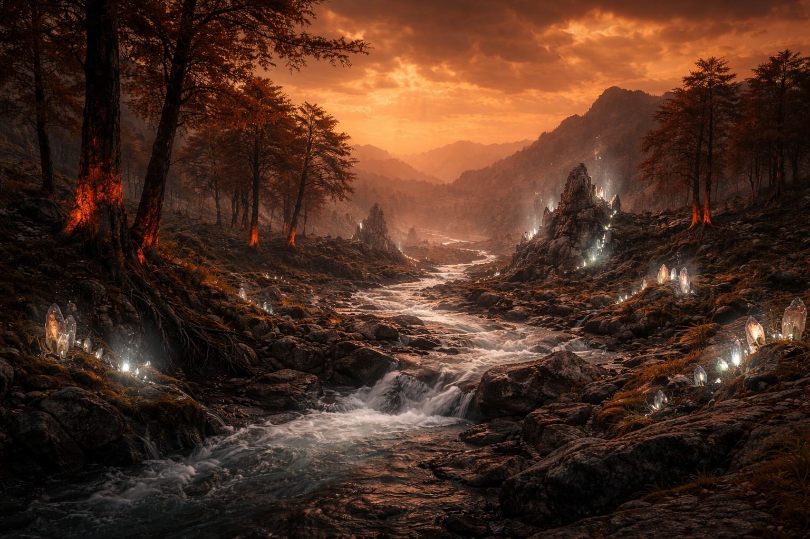
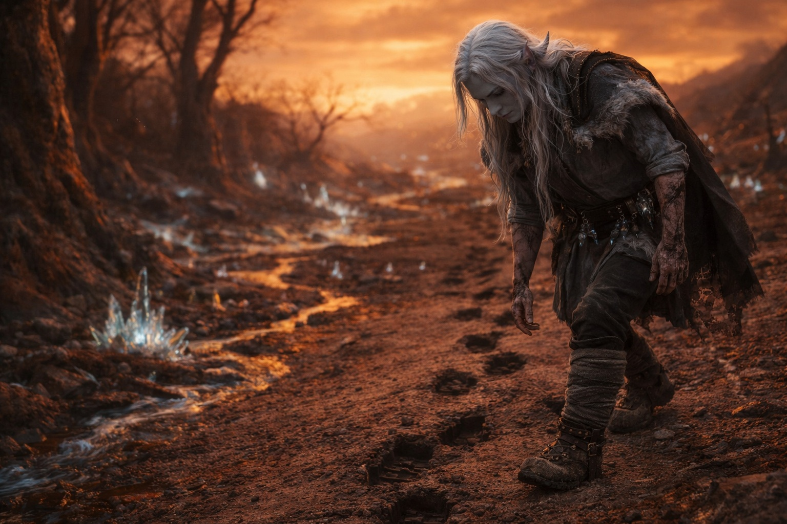

# Chapter 46.1 | What Cannot Be Taken Back: The Walk Back

---

He stood because standing was the next thing and the next thing was all that remained.

His legs held. The crystal adaptation had been calibrated to keep him functional, and functional meant standing and standing meant walking and walking meant leaving the barrier's damaged interior and returning to whatever the world had become while he was inside it breaking it. His ribs complained. His burned hands complained. His empty magic complained in the way that empty things complain, which is by being empty at a volume that the mind cannot ignore.

One, two, three, four. His thumb against his thigh. Then he walked.

The barrier's interior gave way to the barrier zone, the transitional space between the mechanism's center and the open world. The change was gradual. The dead energy veins in the floor thinned, then disappeared. The cracked dome overhead ended and the amber-rust sky took its place, uninterrupted, permanent. The ground shifted from engineered stone to the Wyrmreach terrain he had walked for weeks, the obsidian-threaded earth, the sparse vegetation, the landscape that had been harsh before the breach and was now harsh in a different way.

The world on this side of the barrier was still the world. But it was the world with something new in it, something that had not been there yesterday, and every tree and stone and patch of sky knew it, even if they could not say what had changed.

He walked through it.

The terrain was altered in ways that were specific enough to catalogue and wrong enough to resist cataloguing. A stream that should have flowed east now flowed north, the water running against the grade of the land as if the rules governing water's relationship to gravity had been locally renegotiated. A stand of trees whose bark had changed color on one side, the south-facing surfaces darkened to a deep rust that matched the sky. Crystals in the rock formations that had been inert for centuries now glowing faintly, not with the organized pulse of the barrier's network but with something undirected, the energy of a system that had lost its routing and was leaking at every junction.

Magic behaved differently here. He could not feel it with his depleted affinities, could not reach for it the way he once reached, but he could see it. The air above certain rock formations shimmered with heat that was not heat. The ground in certain places hummed with a vibration that his feet felt and his empty magic channels recognized the way an empty cup recognizes the shape of water. The magical field was destabilized, and the destabilization was visible to anyone who knew what stable had looked like.

He walked slowly. The slowness was not a choice but a fact, the fact of a body that was operating on whatever reserves the crystal adaptation had not consumed and that found each step to be an expenditure it tracked with increasing concern. His burned hands hung at his sides. His four dark crystals sat at his belt, dead weight. He carried nothing useful. The artifact was behind him on the barrier floor. The crystals were spent. The magic was gone.

He was a person walking through a changed landscape with nothing but his body and his habits and the count in his thumb.

He found the rejection point after two hours.

The ground told the story. Scorch marks in the earth where the barrier's protocol had pushed Srietz and Elion back, the energy discharge leaving blackened streaks in the soil in a pattern that radiated from a central point. The central point showed the impressions of a body, two bodies, the shapes pressed into the scorched ground where they had fallen when the barrier decided they were not compatible and returned them with the efficiency of a mechanism that did not distinguish between rejection and violence.

Signs of struggle afterward. Not against the barrier. Against the ground. The marks of hands and knees in the dirt, the scrabbling of someone getting up, of someone lifting someone else. Boot prints, deep, carrying weight. Srietz's prints, carrying Elion. The depth of the impressions telling a story that Drusniel read with the automatic precision of a tracker who had spent weeks reading terrain: Srietz had picked up Elion and walked. Northeast. Away from the barrier. Carrying his companion because his companion could not walk and because Srietz did not leave people behind regardless of what the probabilities suggested.

Drusniel followed the tracks.

The trail was clear because Srietz was not trying to hide it. The goblin's prints were deep and steady, the stride of someone carrying significant weight over difficult terrain and managing it through the application of will to a body that had no business being as durable as it was. Beside the deep prints, lighter ones, where Elion had been set down and had tried to walk, and then the deep prints again, where Srietz had picked him up when the trying failed.

The trail led northeast through the changed landscape. Past the stream that flowed the wrong way. Past the trees with the rusted bark. Through terrain that was Wyrmreach and was not Wyrmreach and was something in between that did not yet have a name.

He followed. One foot in front of the other. The most basic form of purpose: someone had walked this way, and he was walking after them, and the walking was enough because walking meant direction and direction meant he was not standing still in the ruins of the thing he had done.

His ribs hurt. His hands hurt. His empty magic channels ached with the phantom weight of affinities that no longer filled them. The amber-rust sky pressed down from above, the contamination visible in the light, the wrongness that was now environmental, atmospheric, permanent. He breathed it because his adapted lungs processed it and because there was no alternative air.

One, two, three, four. Following the tracks of a goblin carrying a man through a world that had been changed by the person following them.

---

**End of Chapter 46.1 — continues in Chapter 46.2: [What Cannot Be Taken Back: The Reunion](/what-cannot-be-taken-back-the-reunion/)**
