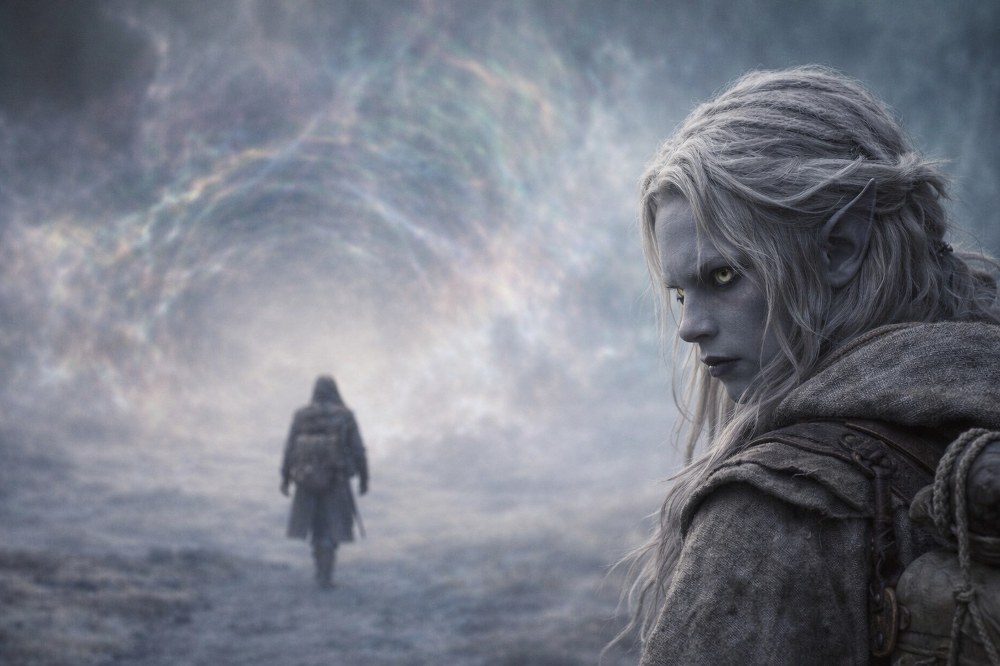

# Chapter 37.2 | What He Believes: The Belief

---

He tried the doors.

Not literal doors. The doors in his mind. The exits. The places where a thought could turn a different direction, where an argument could arrive at a different conclusion, where the logic could bend and let him through to a room that didn't contain the barrier.

The barrier must be maintained.

He'd believed this since childhood. Before the trials. Before the exile. Before Zaelar and the Null and the crystal adaptation and Nyxara and the dragon. The Drow existed to guard the barrier. The barrier existed to contain what lay beyond it. The guardianship was earned through sacrifice, not granted by right, and every generation that upheld it added to the debt the next generation inherited. This was not ideology. This was architecture. The Drow had built their civilization on the foundation of the barrier's importance, and the foundation was real, and the barrier was real, and the things it contained were real enough that Drusniel had walked through their territory for months and survived only because his body had adapted to the hostility.

The barrier must be maintained. Therefore he must act. Door closed.

The Drow earned their duty through sacrifice.

He'd earned his. Not through the trials, which had been sabotaged, or through the training, which had been manipulated. Through the exile. Through the walking. Through the months of survival in a realm that killed most things that entered it and had remade him instead, converting his body into something the barrier's system could use. He'd paid for this duty in adaptation and isolation and the slow erosion of the person he'd been before Wyrmreach. The sacrifice was already made. The cost was already paid. To refuse the duty now would be to declare the cost meaningless, and the cost was not meaningless, because the cost was him.

He must sacrifice. Door closed.

Whatever is sealed behind the barrier is worse than dragons.

He'd seen it. Felt it. The landscape of Wyrmreach was the evidence: a realm so hostile that dragons used it as a staging ground, that an entity in a volcano existed behind its own barrier within a barrier, that the air tasted of metal and old heat and the breath of something alive in ways that landscapes should not be alive. The barrier contained this. The barrier was the membrane between this wrongness and the world on the other side, and if the membrane failed, the wrongness would not stay contained.

He must prevent breach. Door closed. Except this door had a second room behind it, and the second room was worse.

Approach during wrong timing equals breach. Szoravel had explained it. The mechanism worked the same way regardless of timing. Right timing: renewal. Wrong timing: the barrier opens instead of closing. The mechanism was the key, and the key turned the same direction regardless of which way the door should open. If Drusniel approached now, at Nyxara's accelerated timeline, with no calibration and no preparation and no Szoravel to guide the sequence, the renewal might become a breach. The system might tear open the very thing it was meant to seal.

He knew this. He understood the risk. The understanding was complete and it provided no exit, because the alternative was also catastrophe: if he delayed, the barrier degraded naturally. The window closed. The membrane thinned past the point of renewal and simply failed, slowly and comprehensively, and everything it contained leaked through.

Act now: risk breach. Act later: guaranteed failure. Act never: guaranteed failure, slower.

Every path led to the barrier. Every path led to risk. The only variable was the magnitude and the timing of the catastrophe, and the timing was no longer his to control because a dragon had decided that her timeline mattered more than his precision and she was operating at a scale where his precision was a detail.

He couldn't resist through belief because his beliefs agreed with the action.

The barrier is sacred. Go maintain it.
Duty is earned through sacrifice. You've sacrificed. Collect.
The sealed things are worse than the known things. Act before they escape.

Every door in his mind opened to the same room. Duty. Sacrifice. Guardianship. The words his people had built their legacy on. The words he'd said to Nyxara on a mountain clearing like they were prayers. They were prayers. And the answer was: go to the barrier. Now.

He could resist through timing. He could argue for delay, for caution, for the preparation Szoravel had insisted on. But timing was gone. Szoravel was dead. Nyxara wouldn't wait. The degradation wouldn't wait. The probing from the other side of the barrier wouldn't wait. Every external clock was running out simultaneously, and the only clock he controlled was his own footsteps, and his footsteps were pointed east.

The worst part wasn't that they'd manipulated him.

The worst part was that no one had needed to.

Nyxara hadn't planted the beliefs. Szoravel hadn't manufactured the duty. The Voice hadn't created the commitment. Drusniel had arrived at every conclusion independently, across months and leagues, through choices that belonged to no one but himself. The barrier mattered because it mattered. The duty was real because the duty was real. The sacrifice was his because he had made it his.

He had built the cage himself, brick by careful brick, out of principles he still believed were true. And the cage had a single door, and the door opened east, and on the other side of the door was the barrier, and the barrier was waiting for him with the patience of a system that had been waiting for centuries and would wait for centuries more or would simply fail, and either way the waiting was over and the mechanism was walking toward it on two legs because the legs belonged to someone whose beliefs left no room for retreat.

Drusniel walked east with his hand in his pocket and his thumb counting one, two, three, four, and the sky bending above him, and every belief he held confirming every step he took, and no exit anywhere.

---

**End of subchapter — continues in Chapter 37.3**
