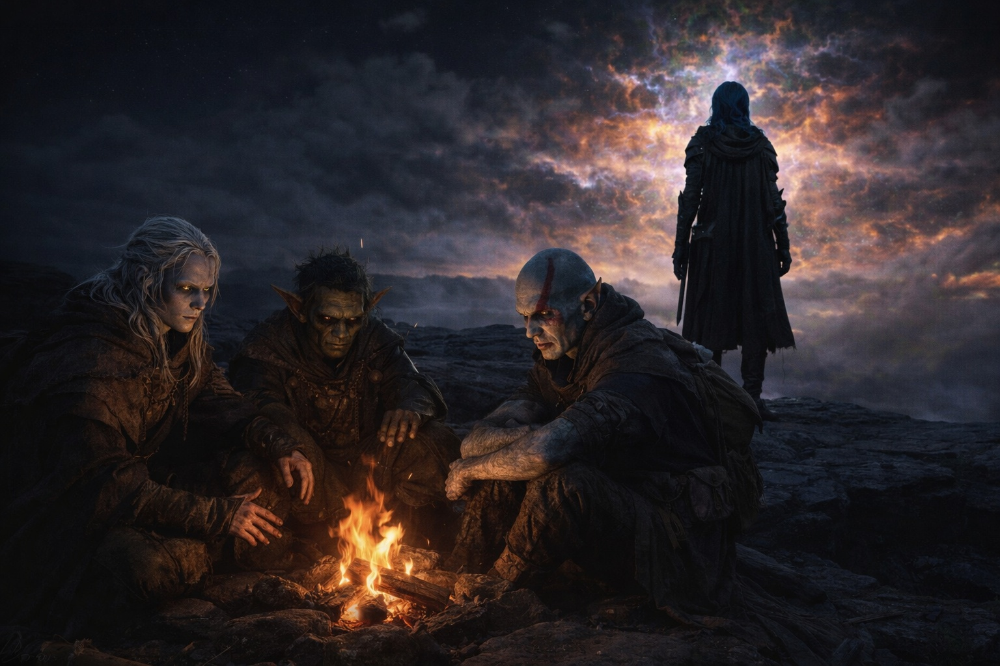
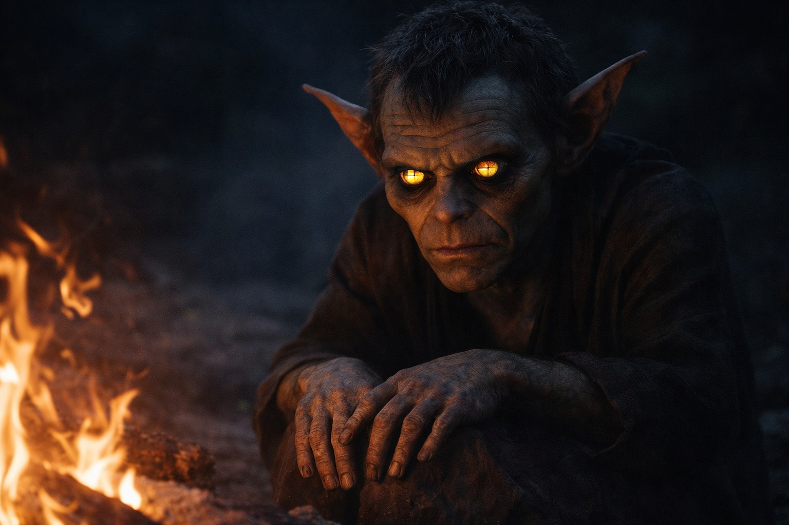
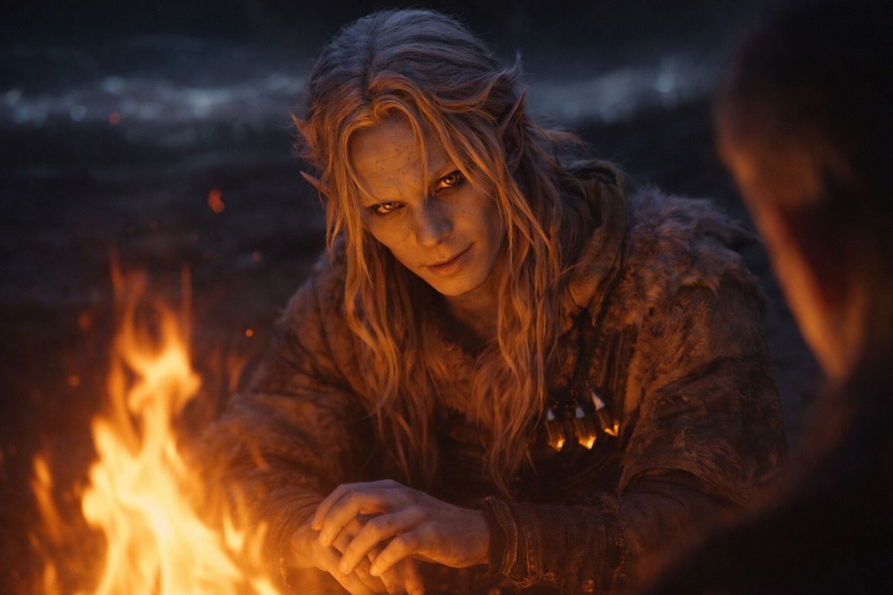
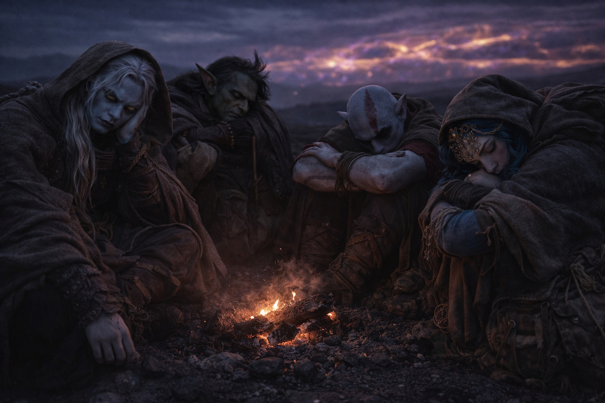

# Chapter 37.3 | What He Believes: The Companions

---

They built a fire because fire was what you did when the walking stopped and the dark came.

Nyxara didn't sit with them. She stood at the edge of the camp's firelight, facing east, facing the barrier's distortion where the sky had stopped pretending to be sky and become something else, a color field that pulsed and bent and radiated a pressure Drusniel could feel in his teeth. She stood the way she always stood: where there was room. Except now he understood why, and the understanding made the habit feel like a monument instead of a quirk.

Srietz built the fire. His hands moved with the competence of someone who had built fires in hostile environments for years, finding fuel where fuel shouldn't exist, coaxing flame from materials that should have been too damp or too dead or too wrong to burn. He didn't speak while he worked. The silence was louder than his usual chatter.

Elion sat on the ground near the fire with his knees drawn up and his arms wrapped around them and his amber eyes fixed on a point approximately six inches in front of his face. He was shaking. Not from cold. From the Sage. Whatever the entity inside him was communicating, it had been increasing in volume for days, and the barrier's proximity was making it worse. Elion's face had gone hollow, the cheekbones sharper, the eyes brighter, as if the Sage was burning through him from the inside.

Drusniel sat across the fire from Srietz and told them what he knew.

Not everything. Not the Voice. Not the debts. Not the presence behind his sternum that was preparing to speak in a language made of obligation. He told them the mechanics. The barrier. The renewal mechanism. His role as conduit. The timing problem.

"The barrier degrades," he said. The fire popped and sent sparks into the wrong-colored dark. "The renewal window is opening. If a compatible interface approaches during the window and engages the mechanism, the barrier seals. If the timing is wrong, the mechanism opens the barrier instead of closing it."

"And you're the interface," Srietz said. His voice was flat. Not hostile. Exhausted. The flatness of someone who had been running calculations for days and kept arriving at the same deficit.

"I'm the interface."

"At her timing. Not yours."

"There is no mine. Szoravel's timing died with Szoravel. The degradation is accelerating. If I wait for the right moment, there may not be a right moment. The window could close before I'm ready, and then the barrier fails naturally."

"And if you go now?"

"Risk. The calibration isn't complete. The approach protocol isn't finished. I'm operating on partial information with no guide."

"So the timing is wrong."

"The timing is wrong whether I act or don't. The question is which kind of wrong."

Srietz stared at the fire. His yellow eyes reflected the flame in two flat discs. His clever fingers were still, which was remarkable. Srietz's fingers were always doing something: mixing, testing, measuring, adjusting. Still fingers on Srietz meant still thoughts, which meant the thoughts had finished and the answer was bad.

"Srietz will not help you destroy the barrier," he said.

"I'm not destroying it. I'm maintaining it."

"At her timing. On her terms. With no preparation and no calibration and no protocol and no Szoravel." He paused. "She killed the only person who could have made this work properly. She killed him and then she asked you to do the thing he was supposed to guide. That is not maintenance. That is improvisation at dragon speed."

The words were precise. They were also correct. Drusniel heard them and catalogued them alongside everything else: the risk, the timing, the beliefs, the cage he'd built from principles he still held. Srietz was right. Nyxara had collapsed the timeline and destroyed the guide and set the pace and was walking Drusniel toward the barrier at a speed that served dragon planning, not mortal precision.

"Then we wait for the right moment," Srietz said.

"Nyxara won't wait."

"Then we leave. We walk south. We find another path. Srietz knows routes. Srietz always knows routes."

"The degradation won't wait either. If I leave, the barrier fails. Slower. But it fails."

Srietz was quiet. The fire crackled. Nyxara's silhouette stood at the camp's edge, facing east, patient.

"Something is coming." Elion's voice. Thin. His eyes hadn't moved from the point six inches in front of his face, but his mouth was forming words that came from somewhere deeper than his own vocabulary. "I can feel it. The Sage is... it won't stop. Something on the other side of the barrier. Something that wants it open. Not the dragon. Something older. It's been pushing at the membrane for days. Weeks. The probing Nyxara mentioned. It's not testing. It's knocking."

The fire popped. Sparks rose. The wrong-colored dark absorbed them.

"The thing in the volcano," Srietz said quietly.

Drusniel looked at the goblin. Srietz's yellow eyes were on him, wide and bright and calculating. The volcano. The entity they'd crossed through on the way to the outpost, the presence in the mountain that the Voice had named as something that wanted the barrier open for reasons incompatible with anyone's survival.

"If you do this at the wrong time," Srietz said, "the barrier opens. And whatever is inside..."

"I know."

"The thing in the volcano. The thing that wants out."

"I know."

"And you're going to do it anyway."

The question was not accusation. It was arithmetic. Srietz's voice held the particular tone of someone totaling a column of numbers and discovering that the sum was negative regardless of how the individual items were arranged.

"What would you do?" Drusniel asked.

Srietz was quiet for a long time. The fire settled. Elion shook. Nyxara stood at the edge of the light, facing east, and did not look back.

Then she did.

She crossed the camp without hurry, without performance. Crouched beside the fire, close enough that Drusniel could see her face in the light, and for one moment the calculation was gone and what remained was something older: fatigue. Not physical. The weariness of someone who had carried weight for so long that the carrying had become invisible, even to herself. She set a flask beside his knee. Her hand rested on his shoulder. Brief. The pressure deliberate, measured, the way you touch something you intend to be careful with.

She stood. Walked back to the edge. Faced east again. Said nothing.

A person who collects things does not touch the things she collects with that particular weight. Drusniel filed the thought beside the one from the valley, in the place where things that didn't fit went. Two now. Two moments where the pattern broke and something underneath showed through.

"Srietz would run," Srietz said finally. "But Srietz is smarter than you."

He didn't leave.

The fire burned. The dark pressed. Srietz fed it another piece of the dead wood that shouldn't have burned but did, and the flame climbed, and neither of them spoke about the morning. They didn't need to. The morning was coming the way the barrier was coming, the way the Voice was coming, the way all delayed things come: on their own schedule, indifferent to whether the people waiting for them were ready.

Elion's shaking stopped. His eyes refocused. He looked at Drusniel across the fire with an expression that was partly his and partly the Sage's and entirely afraid.

"It's louder here," he said. "The Sage. It's louder near the barrier. Whatever it knows about what's coming, it's screaming it. I can't make out the words. Just the volume." He paused. "And the direction. It's pointing the same direction as everything else."

East. The barrier. The mechanism. The conduit. The timing that was wrong and the action that was necessary and the catastrophe that might follow either way.

They knew what he was walking into. They walked with him anyway. Srietz because leaving meant admitting the cost was wasted. Elion because the Sage wouldn't let him stop. Drusniel because stopping had never been an option.

The fire burned until it didn't, and then it was dark, and then it was almost morning, and none of them had slept, and the barrier's distortion pulsed on the horizon like a heartbeat that belonged to no living thing.

---

**End of subchapter — continues in Chapter 37.4**
