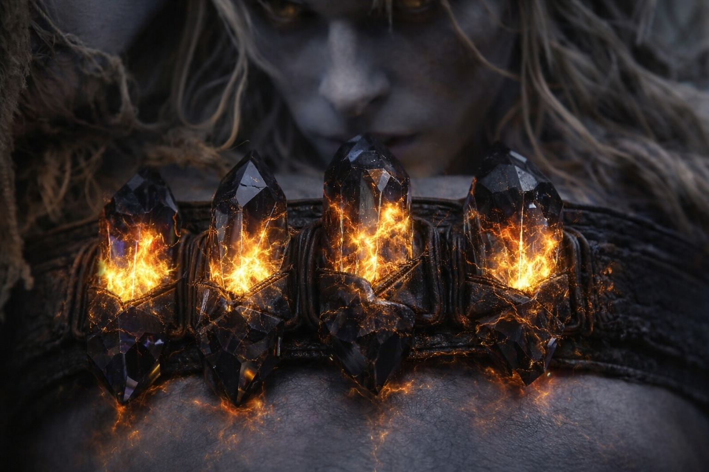

## Chapter 37 | Part 4 | The Return

---

It came back the way an old debt comes back: not when you expect it, but when the interest has finished compounding.

They were walking. Night had not lifted so much as changed texture, the dark becoming a different kind of dark as they moved closer to the barrier, the air thickening with a pressure that Drusniel's adapted body processed and his unadapted mind could not. The sky's distortion was overhead now, not just at the horizon. Colors that had no names ran in bands across the firmament, and the light from no visible source cast shadows that pointed in directions that didn't correspond to any angle Drusniel could identify.

Nyxara walked ahead. Srietz walked behind Elion, keeping the shapeshifter between himself and the barrier. Elion moved with the mechanical precision of someone whose body was on autopilot while the consciousness handled something urgent and interior.

Drusniel took a step. His left foot hit the dark stone. And the Voice spoke.

Not a whisper. Not the gradual intrusion of previous appearances, the slow emergence from silence like a figure forming in fog. This was a hand closing around the inside of his skull. Full. Immediate. A presence that filled every corner of his consciousness the way water fills a glass: comprehensively, without gaps.

MY INVESTMENT HAS MATURED.

The words were not loud. They were complete. They occupied the space behind his sternum and the space behind his eyes and the space where thoughts formed and decisions lived, and they left no room for anything else. The Voice was not speaking to him. It was speaking inside him. Using the architecture of his mind the way a musician uses an instrument: because the instrument was built for exactly this purpose.

Drusniel stopped walking. His crystals screamed at his belt. The Null in his pack vibrated against his spine with a frequency that resonated with the Voice's presence, the artifact and the entity harmonizing in a way that suggested they had been designed to.

"You." The word left his mouth before he chose to speak it. His body responding to the presence with the reflexive acknowledgment of something it recognized at a level deeper than thought.

MY PATH. MY TIME. MY BEARER.

Possessive. Not angry. Not pleased. Not purposeful in any way that implied emotion. The Voice spoke the way a clock strikes: because the mechanism has reached the hour. The words were execution, not expression.

"I didn't walk this path for you."

YOU WALKED IT. THE "FOR" IS IRRELEVANT.

Silence. Not from the Voice. From the world. The sounds of the plateau, the wind through distorted air, the footsteps of his companions, all of it receded as the Voice's presence expanded, filling the silence the way it filled his mind: totally, without negotiation.

YOU CARRIED WHAT I ASKED. The Voice began counting. Drusniel felt each item land like a stone placed on a scale. THE ARTIFACT. MY COMPONENT. YOU BORE IT ACROSS THE NIGHTMARE SEA. ACROSS THE TERRITORIES. THROUGH THE MOUNTAIN. TO HERE.

"I carried it because the barrier—"

YOU CARRIED IT. The interruption was not sharp. It was simply present, the way a wall is present when you walk into it. YOU SPOKE THE NAME I NEEDED. IN THE VOLCANO. THE WORD THAT OPENED THE PASSAGE. YOU SPOKE IT BECAUSE YOU HAD NO CHOICE. THE DEBT WAS COLLECTED AT THE TIME.

The volcano. The passage through the mountain. The word he'd spoken when the heat had become lethal and the only way through was the way the Voice provided. He'd spoken it because the alternative was death, and the Voice had provided the way because the Voice needed him alive. Not as mercy. As investment.

YOU WALKED THROUGH FIRE FOR ME. THE NIGHTMARE SEA. YOUR BODY BROKE AND YOUR BODY REMADE AND THE REMAKING WAS MY DOING. THE CRYSTALS AT YOUR BELT ARE MY SIGNATURE. THE ADAPTATION IN YOUR BLOOD IS MY COST, PREPAID.

The crystals. The adaptation. The changes to his body that had made him compatible with Wyrmreach, that had converted him from a drow who should have died in the first week to a conduit who could interface with the barrier's mechanism. He'd assumed the adaptation was the realm's effect on his biology. Natural. Passive. The Voice was telling him it was deliberate. Invested. A cost the Voice had paid in advance against a return it was now preparing to collect.

"The adaptation was you?"

EVERYTHING THAT KEPT YOU ALIVE WAS ME. THE SURVIVAL. THE COMPANIONS. THE PATH.

"Srietz found us. Elion chose to follow."

THEY FOUND YOU BECAUSE YOU WERE FINDABLE. THEY FOLLOWED BECAUSE THE PATH I BUILT WAS WIDE ENOUGH FOR THREE. THE LEDGER INCLUDES THEM. THEIR SURVIVAL IS MY COST. THEIR PRESENCE IS YOUR DEBT.

Drusniel felt the debts settle into place. Not metaphor. Physical. Each obligation landed in his chest like a weight hung from a hook, pulling downward, toward the barrier, toward the mechanism, toward the act the Voice was preparing to claim. Survival. The companions. The passage through the volcano. The artifact. The crystals. The adaptation. Each one a line in a ledger that had been accumulating since the moment the Voice first spoke, and the ledger was full, and the Voice was reading it aloud because the time for reading had arrived.

"The mountain had no voice," Drusniel said. He didn't know why he said it. The words came from a place that was arguing for the sake of argument, testing the walls of a room that had no exits.

EVERYTHING HAS A VOICE. MOST ARE TOO SMALL TO HEAR.

The Voice withdrew. Not gone. Not retreating. Contracting. Pulling back from the edges of his consciousness to the center, to the space behind his sternum where it lived, where the debts lived, where the crystal adaptation hummed its steady confirmation of everything the Voice had claimed. The withdrawal was not mercy. It was a clerk closing the ledger after the final entry.

The world returned. Sound. Wind. Footsteps. The distorted sky and the dark stone and the barrier pulsing on the horizon.

Srietz was staring at him. The goblin had stopped walking ten paces back and was watching Drusniel with the particular stillness of someone who had just witnessed a conversation they couldn't hear and understood its shape from the way it changed the person having it.

"Your face," Srietz said.

Drusniel touched his face. Nothing physical. No blood, no mark, no sign. But Srietz's yellow eyes said different. Srietz's yellow eyes said the conversation had left marks that weren't visible and weren't gone.

"When?" Drusniel asked the dark.

The Voice answered from behind his sternum. Not gone. Never gone. Just waiting in the space where all debts wait until the payment is due.

WHEN THE PATH OPENS. YOU WILL KNOW BECAUSE YOUR FEET WILL MOVE.

"And if I refuse?"

Silence. The kind of silence that is an answer. The Voice didn't need his permission. It had never needed his permission. It had only needed his beliefs, and he'd given those away freely, in a cave, in a mountain, in a conversation with a dragon who smiled like she already knew.

Drusniel walked. The barrier pulsed. The debts settled in his chest like stones in a well, one on top of another, each one adding weight, each one pulling downward, each one named and counted and irreversible.

The Voice waited. The barrier waited. The morning came the color of something that wasn't dawn.

---

**End of Chapter 37.4 —> 38.1: [We Were Right: The Analysis](/we-were-right-the-analysis/)**