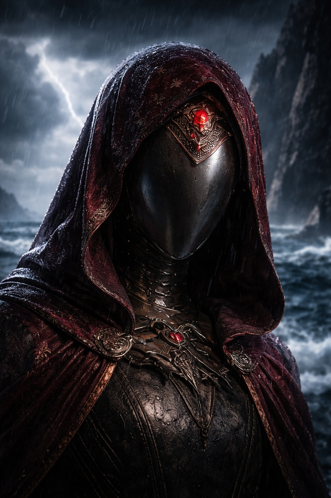

## Lore | Descubriendo las Regiones de Astalor

---

El mapa estaba equivocado.

No de forma evidente. La tinta era nítida, las costas estaban trazadas con cuidado y las fronteras seguían la notación estándar de la Academia. Pero la sabia Meridia lo comparó con tres mapas más antiguos del archivo restringido, y las fronteras no coincidían. Nunca coincidían.

Extendió los cuatro sobre su mesa, sujetó las esquinas con tinteros y empezó a escribir lo que la Academia nunca enseñaría: un resumen honesto.

## Imperio Divino Lumeshireano

La mayor nación humana, o eso afirmaba. El [Imperio Divino Lumeshireano](https://www.drusniel.com/the-resilient-defense-of-the-lumeshirean-divine-empire/) sostenía sus fronteras con una mezcla de fe, paladines y una maquinaria política que ni sus propios ciudadanos entendían del todo.

> "El imperio está enredado en una red de maquinaciones políticas, alianzas y traiciones con la Teocracia Contiana."

Meridia anotó: *el imperio enfrenta amenazas de Grukmar al sur y de los norteños desde Frostgard. Los informes oficiales hablan de unidad bajo fe y deber. Los informes de guarnición cuentan otra historia. Los reportes archivados como "inexplicables" llenan armarios enteros en cada puesto fronterizo.*

## Teocracia Contiana

Dónde empezaba la [Teocracia Contiana](https://www.drusniel.com/the-contian-theocracys-quest-for-magical-supremacy/) y dónde terminaba la Academia era una pregunta que nadie respondía igual dos veces. Las torres de magos dominaban la ciudad. El conocimiento era moneda. El poder, el interés que generaba.

> "Aunque afirman neutralidad, los contianos mantienen facciones de toda clase de alineamientos."

Neutralidad. Meridia subrayó la palabra y añadió un signo de interrogación. En Contia, el aliado de hoy podía convertirse en el experimento de mañana.

Un golpe en la puerta.

No se movió a cubrir los mapas. Eso solo lo empeoraría.

—Té, sabia Meridia. —Lenn, el archivero auxiliar, entró con una bandeja. La dejó en la única esquina libre del escritorio y su mirada recorrió los mapas desplegados. La mano se le congeló en el borde de la bandeja.

—Esos son del ala sellada.

—Investigación para la revisión curricular —dijo ella, sin levantar la vista.

—La revisión curricular terminó el mes pasado.

—Entonces voy lenta. —Mojó la pluma—. Gracias por el té, Lenn.

Él se quedó. Ella podía sentirlo sopesando opciones. Reportarla, o fingir que no había visto nada. Lenn era lo bastante joven como para creer que la Academia premiaba la honestidad.

—Dejo la puerta abierta —dijo, lo cual no significaba nada y lo significaba todo.

—Ciérrala.

La cerró.

Después de eso, Meridia escribió más rápido.

## Imperio de Frostgard

En el norte helado, [Frostgard](https://www.drusniel.com/ice-and-iron-the-warriors-of-the-empire-of-frostgard/) resistía. Los norteños lo llamaban hogar, guerreros que tallaban su historia en hielo y juraban por dioses que los templos del sur se negaban a reconocer.

> "Los confines de Frostgard están plagados de gigantes, una amenaza constante para los norteños."

Nota de Meridia: *los informes oficiales de Frostgard se centran en gigantes y clima. Los no oficiales, los que pasan entre guardianes al caer la noche, mencionan asentamientos que se apagan sin aviso. Poblaciones que desaparecen entre una ruta de suministros y la siguiente. Las canciones dicen que los norteños no se quiebran. Los archivadores sugieren otra cosa.*

## Reino Montañoso de Stonehold

Los enanos y gnomos de [Stonehold](https://www.drusniel.com/forge-and-fire-the-mountain-kingdom-of-stoneholds-stand-against-chaos/) construyeron sus ciudades dentro de las montañas. Ciudades-fortaleza, las llamaban. El sonido de martillos contra yunque, si uno creía a los poetas, nunca se detenía. Los ingenieros describían otro sonido: grietas en piedra que no debería agrietarse. Frío donde debería haber calor.

La mayor preocupación de Stonehold, según el recuento oficial, eran las tribus Grukmar presionando sus bordes. La preocupación de los consejos mineros, según reportes sellados que Meridia no debería haber leído, estaba más abajo.

## Reino de Elenoria

Los elfos de [Elenoria](https://www.drusniel.com/eternal-woods-the-kingdom-of-elenorias-dance-with-nature/) vivían entre bosques antiguos, en ciudades cultivadas de madera viva. Su arquería era célebre. Su vínculo con la naturaleza llenaba cientos de canciones.

Los mapas mostraban las mismas fronteras para Elenoria durante siglos. Pero Meridia había visto los registros de patrulla. Senderos que no coincidían con la cartografía. Arboledas que parecían moverse. Exploradores que entraban y regresaban... distintos. Los elfos lo llamaban armonía. Si tenían archivo restringido, no lo compartían con forasteros.

## Tribus Grukmar

Las [Tribus Grukmar](https://www.drusniel.com/the-unruly-might-of-the-grukmar-tribes/) eran aquello que las demás naciones temían cuando dejaban de temerse entre sí. Orcos, goblins y cosas peores ocupaban un territorio que ninguna fuerza externa logró cartografiar por completo.

Las incursiones sobre Stonehold y Lumeshire estaban bien documentadas. Lo menos documentado era por qué cambiaban los patrones de ataque. Algunos años la frontera quedaba en calma. Los generales lo llamaban victoria. Los capitanes de frontera, que sabían más, lo llamaban el silencio antes de algo peor.

## Dominio Umbra'kor

Los elfos oscuros del [Dominio Umbra'kor](https://www.drusniel.com/shadows-reign-the-umbrakor-dominions-pact-with-darkness/) vivían bajo la superficie, en cavernas que el mundo exterior prefería no imaginar. Servían, según las historias, como amortiguador entre el mundo conocido y lo que fuera que quedara más allá.

Meridia encontró esa afirmación en siete textos distintos. Ninguno coincidía en *contra qué* amortiguaban.

## Dominio de Wyrmreach

Más allá del mar tempestuoso se extendía el [Dominio de Wyrmreach](https://www.drusniel.com/the-mysteries-of-the-wymreach-dominion/).

En canciones y relatos, los viajeros hablaban de horrores en esa tierra lejana, pero casi nadie regresaba para confirmar qué era verdad.

Para la mayoría, seguía siendo un lugar de leyenda temida, no de conocimiento directo.

> "Solo los elfos oscuros de Umbra'kor pueden establecer contacto con ese reino."

Meridia dejó la pluma. Miró los cuatro mapas, sus fronteras en desacuerdo, sus márgenes llenos de anotaciones que discutían entre sí a través de los siglos.

Esos eran los reinos de Astalor. Al menos, los que la Academia reconocía. Si el mapa mostraba el mundo tal como era, o tal como alguien decidió que debía verse, era una pregunta que Meridia aprendió a no formular en voz alta.

Guardó sus notas en el cajón que mantenía bajo llave. Después tomó el té que Lenn había traído. Estaba frío.

Lo bebió de todas formas. El té frío era el menor de sus problemas.

---

*Nota del compilador: El resumen regional anterior fue hallado entre los papeles personales de la sabia Meridia tras su traslado a la Biblioteca Exterior. La Academia no ha avalado su contenido. Varios pasajes contradicen el currículo aprobado. El archivero auxiliar Lenn, al ser consultado sobre la procedencia del documento, declaró no tener conocimiento de su creación.*

**Fin de Lore 3 — continúa en Lore 1: [La Búsqueda de la Supremacía Mágica por la Teocracia Contiana](/echelones-arcanos-la-busqueda-de-la-teocracia-contiana-por-la-supremacia-magica/)**