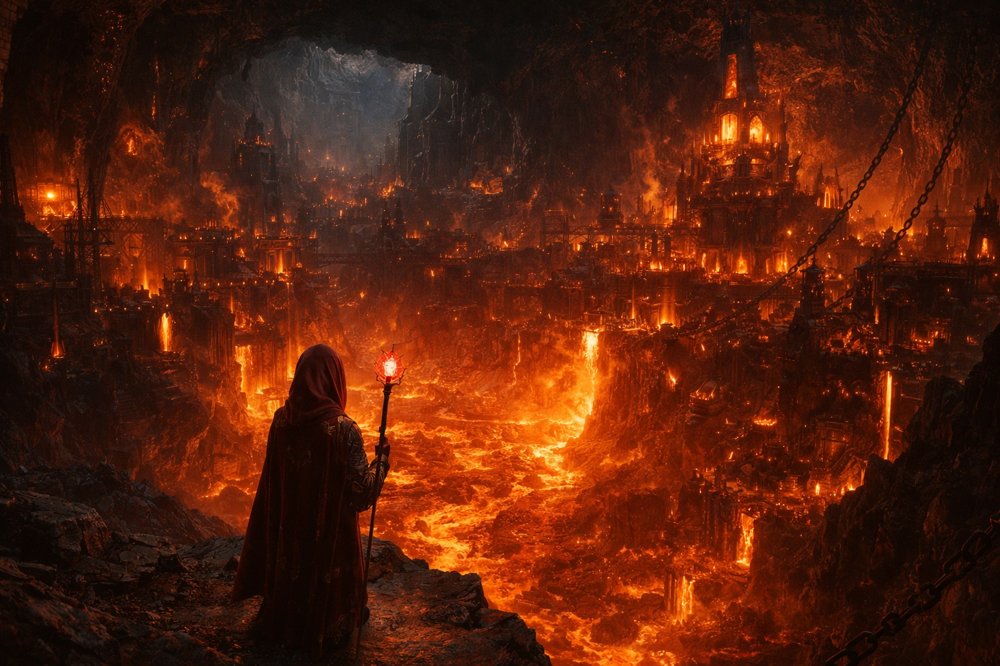
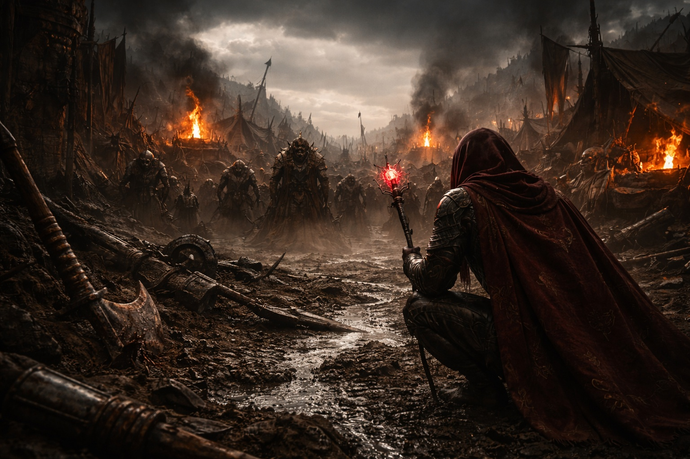

## Lore | Descubriendo las Regiones de Astalor

---

Meridia no conseguía hacer coincidir las fronteras.

El mapa más reciente estaba trazado con cuidado; la tinta aún era nítida. Pasó un dedo por la frontera oriental y la comparó con las tres hojas antiguas. Cada una situaba la línea en un lugar distinto.

Sujetó las esquinas con tinteros y empezó un resumen, dejando espacio junto a cada afirmación para anotar su fuente.

## Imperio Divino Lumeshireano

La mayor nación humana, o eso afirmaba. El [Imperio Divino Lumeshireano](/escudos-arriba-la-defensa-resiliente-del-imperio-divino-de-lumeshire/) mantenía sus fronteras mediante una combinación de fe, paladines y una maquinaria política que ni sus propios ciudadanos lograban comprender del todo.

> «El Imperio y Contia renuevan sus acuerdos. Ambos mantienen tropas junto a la frontera disputada.»

Meridia anotó: *Incursiones de Grukmar al sur; presión de Frostgard al norte. Las historias oficiales describen un imperio unido bajo la fe y el deber. Los informes de guarnición que he visto piden refuerzos una y otra vez. Faltan varios anexos marcados como «inexplicados».*

## Teocracia Contiana

Era difícil establecer en los mapas dónde empezaba la [Teocracia Contiana](/echelones-arcanos-la-busqueda-de-la-teocracia-contiana-por-la-supremacia-magica/) y dónde terminaba la Academia. Meridia encontró una misma torre marcada como templo en una hoja y como academia en otra.

> «Contia se declara neutral. Sus distintas facciones se reservan el derecho a pactar por separado.»

Meridia subrayó *neutralidad* y escribió al lado: *¿Qué facción firmó esto?*

Un golpe en la puerta.

No se movió a cubrir los mapas. Eso solo lo empeoraría.

—Té, sabia Meridia. —Lenn, el archivero auxiliar, entró con una bandeja. La dejó en la única esquina libre del escritorio y su mirada recorrió los mapas desplegados. La mano se le congeló en el borde de la bandeja.

—Esos son del ala sellada.

—Investigación para la revisión curricular —dijo ella, sin levantar la vista.

—La revisión curricular terminó el mes pasado.

—Entonces voy lenta. —Mojó la pluma—. Gracias por el té, Lenn.

Él se quedó junto al escritorio, mirando los sellos del archivo. Meridia siguió escribiendo.

—Dejaré la puerta abierta —dijo, recogiendo la bandeja vacía.

—Ciérrala.

La cerró.

Después de eso, Meridia escribió más rápido.

## Imperio de Frostgard

Las hojas del norte situaban [Frostgard](/hielo-y-hierro-los-guerreros-del-imperio-de-frostgard/) más allá de los pasos de montaña. Las canciones copiadas en sus márgenes describían guerreros que tallaban historias en el hielo. Una copia sureña los llamaba bárbaros; Meridia no encontró una fuente anterior para su relato.

> "Los confines de Frostgard están plagados de gigantes, una amenaza constante para los norteños."

Nota de Meridia: *Los informes públicos de Frostgard atribuyen las pérdidas a gigantes y al clima. Las copias de cartas de los guardianes mencionan asentamientos hallados vacíos entre viajes de suministros. No incluyen una lista de desaparecidos.*

## Reino Montañoso de Stonehold

Los enanos y gnomos de [Stonehold](/fragua-y-fuego-la-postura-del-reino-montanoso-de-stonehold-contra-el-caos/) construyeron sus ciudades dentro de las montañas. Ciudades-fortaleza, las llamaban. El sonido de martillos contra yunque, si uno creía a los poetas, nunca se detenía. Los ingenieros describían otro sonido: grietas en piedra que no debería agrietarse. Frío donde debería haber calor.

Los informes oficiales de frontera señalaban a Grukmar como la mayor preocupación de Stonehold. Un informe minero sellado pedía en cambio una inspección subterránea. Meridia alisó un pliegue de la copia, pero el número del pozo era ilegible.

## Reino de Elenoria

Los elfos de [Elenoria](/bosques-eternos-la-danza-del-reino-de-elenoria-con-la-naturaleza/) vivían entre bosques antiguos, en ciudades formadas a partir de madera viva. Su arquería era célebre. Su vínculo con la naturaleza llenaba cientos de canciones.

Los mapas aprobados repetían las fronteras de Elenoria durante siglos. Las copias de registros de patrulla describían senderos que no coincidían con ellos; una mencionaba exploradores que habían regresado sin poder responder preguntas. Meridia marcó ese relato como no verificado: no tenía acceso a los archivos élficos.

## Tribus Grukmar

Los mapas extranjeros señalaban a las [Tribus Grukmar](/choque-de-clanes-el-poder-indomito-de-las-tribus-grukmar/) con nombres de bandas de orcos y goblins. Más allá de sus rutas de incursión terminaban las líneas de los topógrafos. Meridia dejó sin sombrear las zonas en blanco.

Las incursiones contra Stonehold y Lumeshire figuraban en ambos archivos militares. En los años tranquilos, los generales se atribuían la victoria; los capitanes de frontera preguntaban adónde habían ido los asaltantes. Ninguno aportaba registros del interior de Grukmar.

## Dominio Umbra'kor

Los elfos oscuros del [Dominio Umbra'kor](/el-pacto-del-dominio-umbrakor-con-la-oscuridad/) vivían en cavernas bajo la superficie. Servían, según afirmaban las historias, como barrera entre el mundo conocido y lo que fuera que aguardara más allá.

Meridia encontró esa afirmación en siete textos distintos. Ninguno coincidía en *contra qué* servían de barrera los elfos oscuros.

## Dominio de Wyrmreach

Más allá del mar tempestuoso se extendía el [Dominio de Wyrmreach](/profundidades-oscuras-el-dominio-wymreach/).

En canciones y relatos, los viajeros susurraban sobre cosas terribles en esa tierra lejana, pero pocos de los que viajaban allí regresaban para confirmar qué era verdad.

Meridia había copiado la siguiente afirmación de una historia de la costa. Su autor no nombraba a ningún viajero que hubiera regresado:

> "Solo los elfos oscuros de Umbra'kor pueden establecer contacto con ese reino."

Meridia dejó la pluma. Miró los cuatro mapas, sus fronteras en desacuerdo, sus márgenes llenos de anotaciones que discutían entre sí a través de los siglos.

Numeró los mapas en el orden en que los había consultado. La frontera oriental seguía teniendo cuatro posiciones posibles. Dejó las cuatro en sus notas.

Guardó sus notas en el cajón que mantenía bajo llave. Después tomó el té que Lenn había traído. Estaba frío.

Bebió sin apartar los ojos de la puerta.

---

*Nota del compilador: El resumen regional anterior fue hallado entre los papeles personales de la sabia Meridia tras su traslado a la Biblioteca Exterior. La Academia no ha avalado su contenido. Varios pasajes contradicen el currículo aprobado. El archivero auxiliar Lenn, al ser consultado sobre la procedencia del documento, declaró no tener conocimiento de su creación.*

**Fin de Lore 3 — continúa en Lore 1: [La Búsqueda de Supremacía Mágica de la Teocracia Contiana](/echelones-arcanos-la-busqueda-de-la-teocracia-contiana-por-la-supremacia-magica/)**
