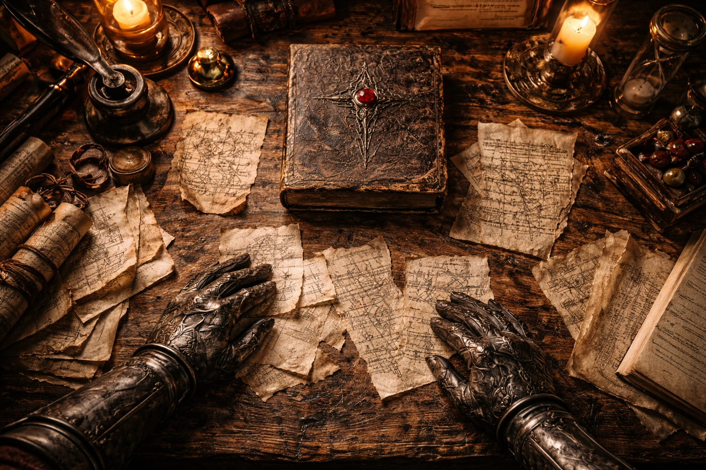
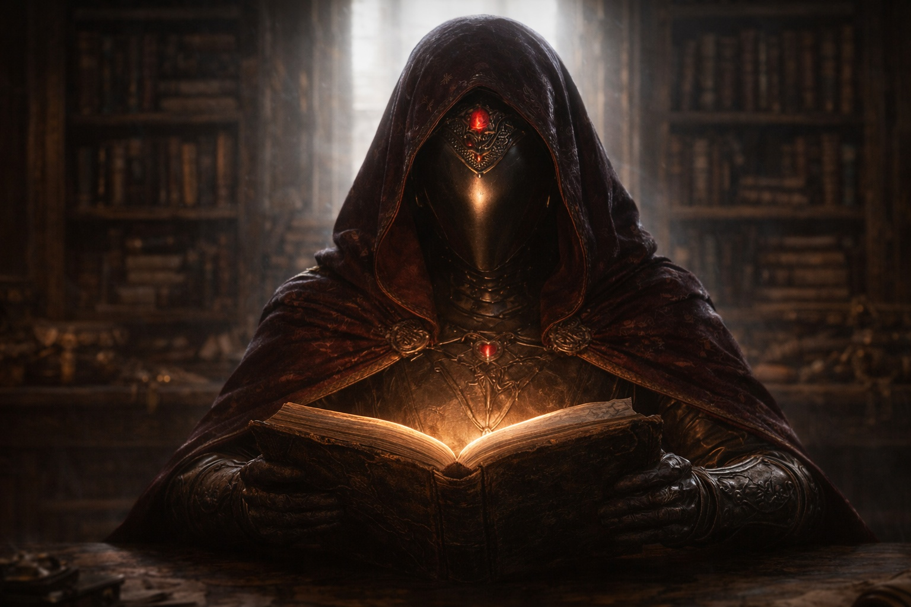

## Lore | La Nada y el Segundo Sol

--- 

El libro olía a ceniza.

No la ceniza limpia de un brasero de templo —algo más antiguo, algo mal. La Sabia Meridia levantó la cubierta con dedos enguantados y sintió el cuero agrietarse bajo su toque como piel seca.

—¿Dónde lo encontraste? —preguntó.

El mercader se encogió de hombros —un gesto que lograba transmitir tanto ignorancia como evasión deliberada.

—Sótano inundado en el distrito del río. Edificio viejo. Nadie lo reclamó.

Meridia pasó la primera página. El pergamino estaba manchado por daño de agua, pero la escritura permanecía clara: escritura angular, estilo pre-unificación, quizás ochocientos años de antigüedad. Quizás más. La tinta tenía un leve tinte bronceado que sugería pigmento mineral en lugar de agalla estándar.

*Un original*, se dio cuenta. No una copia. Nadie hacía copias en esa tinta ya. La fórmula estaba perdida.

Le pagó al mercader el doble de lo que pedía. Él se fue rápidamente, como aliviado de deshacerse de su carga.

---

Le pagó al mercader el doble de lo que pedía. Él se fue rápidamente, como aliviado de deshacerse de su carga.

La traducción tomó tres semanas.

No porque el idioma fuera difícil —Meridia había estudiado las lenguas antiguas desde la infancia— sino porque el texto se negaba a comportarse como debería comportarse un texto. Palabras que parecían claras en la primera lectura se volvían ambiguas en la segunda. Las oraciones se reorganizaban cuando apartaba la mirada. Los números se contradecían entre párrafos.

Empezó a mantener múltiples copias de sus notas, comparándolas cada mañana para ver qué había cambiado. A veces nada cambiaba. A veces todo lo hacía.

Para el final de la primera semana, entendió que el libro no era un solo documento. Era una compilación —fragmentos de al menos cuatro fuentes diferentes, encuadernados juntos por alguien que o no notó las contradicciones o no le importó.

*Al principio*, decía el primer fragmento, *solo había vacío —interminable y vacío. Entonces llegó una chispa.*

*Al principio*, decía el segundo fragmento, *solo había sonido —una nota sin origen, sin fin. La chispa era una mentira que el sonido se decía a sí mismo.*

*No hubo principio*, decía el tercer fragmento. *El concepto de principio fue inventado después, para hacer los registros ordenados.*

Meridia hizo tres columnas en su cuaderno: *Fuego*, *Sonido*, y *Sin Origen*. Asignó cada fragmento a una categoría, esperando que surgieran patrones.

Los patrones que surgieron no fueron tranquilizadores.

---

Meridia hizo tres columnas en su cuaderno: *Fuego*, *Sonido*, y *Sin Origen*. Asignó cada fragmento a una categoría, esperando que surgieran patrones.

Los patrones que surgieron no fueron tranquilizadores.

La sección sobre los dioses era peor.

*La locura humana convocó 12 dioses mayores*, afirmaba una fuente.

*La sabiduría humana los invitó*, decía otra.

*Los dioses ya estaban presentes*, insistía una tercera. *Simplemente eligieron ese momento para revelarse. La convocación fue teatro.*

Marginalia en tres manos diferentes discutían entre sí a través de las páginas:

*Esto contradice el relato del Templo de Azarion —comparar con el Códice Vespertino.*

*El Códice Vespertino es una falsificación. Todos lo saben.*

*Si es una falsificación, ¿por qué la Archisacerdotisa lo cita cada equinoccio?*

Meridia se encontró trazando los argumentos con su dedo, tratando de seguir la lógica. La lógica no seguía. Cada voz estaba segura. Cada voz estaba segura de manera diferente.

---

*Si es una falsificación, ¿por qué la Archisacerdotisa lo cita cada equinoccio?*

Meridia se encontró trazando los argumentos con su dedo, tratando de seguir la lógica. La lógica no seguía. Cada voz estaba segura. Cada voz estaba segura de manera diferente.

A la sección sobre los Primeros Pactos le faltaban dieciséis páginas.

La numeración saltaba de la página cuarenta y tres a la sesenta —un vacío marcado solo por una nota en tinta carmesí:

*Estas páginas fueron removidas por orden del Tercer Concilio. El contenido fue considerado peligroso para la estabilidad doctrinal. El texto de reemplazo sigue.*

El texto de reemplazo tenía tres párrafos de largo y no decía nada útil. Alababa la sabiduría de los Pactos sin explicar qué contenían los Pactos. Celebraba la armonía entre dioses y mortales sin describir cómo se logró esa armonía.

Meridia lo leyó dos veces, luego escribió en sus notas: *Algo importante estaba aquí. Algo que querían que no supiéramos.*

Continuó.

---

Continuó.

*Seis dioses crearon nuevas razas*, afirmaba el libro. *Tres dieron a luz seres de pura bondad. Tres crearon seres de pura maldad.*

La mano marginal estaba de vuelta, más afilada ahora:

*La palabra traducida como 'bondad' se traduce más exactamente como 'utilidad.' La palabra para 'maldad' está más cerca de 'resistencia' o 'salvajismo.' Estas no son categorías morales. Son funcionales.*

Otra mano, diferente tinta:

*¿Funcionales para quién?*

No seguía ninguna respuesta.

---

No seguía ninguna respuesta.

La sección final —lo que quedaba de ella— concernía al Segundo Sol.

Meridia apenas podía leerla. Las páginas estaban dañadas por humo, sus bordes curvándose hacia adentro como si el fuego hubiera venido desde dentro en lugar de desde fuera. Grandes rayas negras oscurecían la mitad del texto.

Lo que quedaba:

*...una nueva era amaneció. Especies diversas. Dioses activos. Conflic regionales—*

*—los nigromantes descubrieron la transmutación. Crearon dragones de—*

*—los dioses respondieron. Concedieron a sus seguidores—*

*—desterrados a Wyrmreach, un lugar remoto, prohibitivo—*

La última oración legible:

*Algunos lo llamaron sol. Otros negaron que fuera luz en absoluto. La verdad, si hay una verdad, permanece sin escribir.*

Debajo de eso, en la misma tinta carmesí de la nota de censura:

*Este libro está incompleto. Los capítulos finales fueron destruidos por orden de la Asamblea de Sabios. La llama que los consumió fue bendecida. La bendición no fue suficiente.*

---

*Este libro está incompleto. Los capítulos finales fueron destruidos por orden de la Asamblea de Sabios. La llama que los consumió fue bendecida. La bendición no fue suficiente.*

Meridia cerró el libro.

Meridia cerró el libro.

Sus manos temblaban —no de miedo, sino del agotamiento peculiar que venía de tratar de sostener ideas contradictorias simultáneamente. La verdad sobre la creación de Astalor no estaba oculta; estaba fragmentada. Esparcida a través de docenas de fuentes que no podían ponerse de acuerdo en hechos básicos.

¿Nació el universo del fuego o del sonido? ¿Los humanos convocaron a los dioses o meramente los reconocieron? ¿Fueron los Pactos un acuerdo o una rendición?

El libro no ofrecía respuestas. Solo preguntas usando las máscaras de respuestas.

Lo archivó en el archivo restringido, junto a diecisiete otros textos que había estudiado y no había podido reconciliar. Algún día, esperaba, vendría un erudito que pudiera dar sentido a las contradicciones.

Algún día.

Mientras tanto, enseñaba el Relato Oficial: limpio, ordenado, seguro. La historia que la Academia aprobaba porque los estudiantes necesitaban *algo* en qué creer.

No era verdad. Pero era estable. Y la estabilidad, en un mundo nacido de la contradicción, era lo más cercano a la verdad que cualquiera podía ofrecer.

---

*Nota del compilador: El texto precedente fue reconstruido de fragmentos sobrevivientes. Todas las traducciones permanecen disputadas. La Academia no toma posición oficial sobre autenticidad.*

*La última página del cuaderno de la Sabia Meridia fue encontrada en blanco, salvo por una sola línea escrita de su propia mano:*

*"No sabemos qué pasó. Solo sabemos lo que nos dijeron. Y lo que nos dijeron nunca fue pensado para ser creído —solo repetido."*

*Significado: incierto.*

**Fin de Lore 2 — continúa en Lore 3: [Descubriendo las Regiones de Astalor](/descubriendo-las-regiones-de-astalor/)**