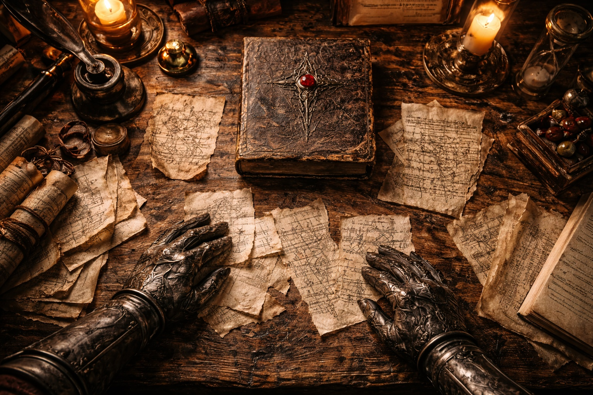

## Lore | La Nada y el Segundo Sol

---

El libro olía a ceniza.

La ceniza del lomo cayó sobre sus guantes. La sabia Meridia levantó despacio la cubierta; el cuero se agrietó por la bisagra.

—¿Dónde lo encontraste? —preguntó.

El mercader se encogió de hombros y mantuvo las manos lejos del escritorio. —Un sótano inundado en el distrito del río. Un edificio viejo. Nadie lo reclamó.

Meridia pasó la primera página. El agua había manchado el pergamino, pero la escritura angular seguía legible. Se parecía a la anterior a la unificación, quizá de hacía ocho siglos. La tinta tenía un matiz de bronce distinto de la tinta de agallas de su escritorio.

*¿Un original?* Nunca había visto una copia moderna con aquella tinta. Acercó la página a la lámpara, sin atreverse a probar con agua.

Le pagó al mercader el doble de lo que pedía. Él se fue rápidamente, como aliviado de deshacerse de su carga.

---

La traducción tomó tres semanas.

Meridia estudiaba las lenguas antiguas desde niña. Allí, una frase que había leído por la mañana parecía distinta al anochecer. Las palabras cambiaban de orden cuando apartaba la vista. Tenía que parar al cabo de una hora: le lloraban tanto los ojos que no distinguía las letras.

Guardaba copias separadas de sus notas y las comparaba cada mañana. A veces el error era claramente suyo. Otras mañanas no lograba explicar las diferencias.

Al terminar la primera semana había identificado al menos cuatro manos en el libro. Alguien había encuadernado los fragmentos sin conciliar sus versiones.

*Al principio*, decía el primer fragmento, *solo había vacío, sin límites. Entonces llegó una chispa.*

*Al principio*, decía el segundo fragmento, *solo había sonido: una nota sin origen ni fin. La chispa era una mentira que el sonido se contaba a sí mismo.*

*No hubo principio*, decía el tercer fragmento. *El concepto de principio fue inventado después, para hacer los registros ordenados.*

Meridia hizo tres columnas en su cuaderno: *Fuego*, *Sonido*, y *Sin Origen*. Asignó cada fragmento a una categoría, con la esperanza de que surgieran patrones.

Para la cuarta página había tachado la mitad de sus clasificaciones.

---

La sección sobre los dioses era peor.

*La locura humana convocó 12 dioses mayores*, afirmaba una fuente.

*La sabiduría humana los invitó*, decía otra.

*Los dioses ya estaban presentes*, insistía una tercera. *Simplemente eligieron ese momento para revelarse. La invocación fue puro teatro.*

Tres manos distintas se respondían en los márgenes:

*Esto contradice el relato del Templo de Azarion. Compárese con el Códice Vespertino.*

*El Códice Vespertino es una falsificación. Todos lo saben.*

*Si es una falsificación, ¿por qué la Archisacerdotisa lo cita cada equinoccio?*

Meridia siguió una anotación apretada hasta la encuadernación. Su autor había subrayado *falsificación* con tanta fuerza que rasgó el pergamino, pero no había dado fecha ni nombre.

---

A la sección sobre los Primeros Pactos le faltaban dieciséis páginas.

La numeración saltaba de la página cuarenta y tres a la sesenta. Una nota en tinta carmesí ocupaba el hueco:

*Estas páginas se retiraron por orden del Tercer Concilio. El contenido se consideró un peligro para la estabilidad doctrinal. A continuación, el texto de reemplazo.*

El texto de reemplazo tenía tres párrafos de largo y no decía nada útil. Alababa la sabiduría de los Pactos sin explicar qué contenían los Pactos. Celebraba la armonía entre dioses y mortales sin describir cómo se logró esa armonía.

Meridia lo leyó dos veces y anotó: *La retirada consta en el registro. No hay inventario de las páginas que faltan.*

Continuó.

---

*Seis dioses crearon nuevas razas*, afirmaba el libro. *Tres engendraron seres de pura bondad. Tres crearon seres de pura maldad.*

La mano marginal estaba de vuelta, más afilada ahora:

*Yo traduciría la palabra para «bondad» como «utilidad», y «maldad» como «resistencia» o «salvajismo». Compárense los usos del tratado dañado, no los del himno del Templo.*

Otra mano, diferente tinta:

*¿Útil para quién? El tratado llama «obediente» a un arado. Tu lectura no resuelve esto.*

No seguía ninguna respuesta.

---

Lo que quedaba de la sección final trataba del Segundo Sol.

Meridia apenas podía leerla. Las páginas presentaban daños por humo, y sus bordes se curvaban hacia adentro, como si el fuego hubiera surgido desde el interior en lugar del exterior. Grandes rayas negras oscurecían la mitad del texto.

Lo que quedaba:

*...una nueva era. Pueblos diversos. Conflictos region[...]*

*[...]los nigromantes afirmaban que los dragones procedían de[...]*

*[...]los sacerdotes lo negaron. Sus seguidores[...]*

*[...]enviados al este. El destino se ha leído como Wyr[...]*

La última oración legible:

*Algunos lo llamaron sol. Otros negaron que fuera luz en absoluto. La verdad, si hay una verdad, permanece sin escribir.*

Debajo de eso, en la misma tinta carmesí de la nota de censura:

*Este libro está incompleto. Los capítulos finales fueron destruidos por orden de la Asamblea de Sabios. La llama que los consumió fue bendecida. La bendición no fue suficiente.*

---

Meridia cerró el libro.

Le temblaban las manos al intentar abrochar los cierres. Las apoyó en el escritorio hasta que cedió el dolor detrás de los ojos. Otros diecisiete textos aguardaban en el archivo; ninguno le había dado una lectura que pudiera sostener a lo largo de aquel libro.

Volvió a abrir el cuaderno por las páginas ausentes. No había ninguna entrada que explicara si los Pactos habían sido un acuerdo o una rendición.

Archivó el libro junto a los demás y dejó sus lecturas discutidas en hojas sueltas entre las páginas. Otro traductor podría necesitarlas.

Para la siguiente clase sacó el Relato Oficial. Daba una fecha para cada suceso. Cotejó la de los Primeros Pactos con sus notas y volvió a comprobarla.

Dejó la fecha prescrita en la hoja de la clase. En su propio cuaderno puso un signo de interrogación al lado.

---

*Nota del compilador: El texto precedente fue reconstruido de fragmentos sobrevivientes. Todas las traducciones permanecen disputadas. La Academia no se pronuncia sobre su autenticidad.*

*En la última página del cuaderno de la sabia Meridia, una línea de su puño dice:*

*«No sabemos qué ocurrió. No encuentro la fuente de la fecha que debo enseñar.»*

*No consta a qué fecha se refería.*

**Fin de Lore 2 — continúa en Lore 3: [Descubriendo las Regiones de Astalor](/descubriendo-las-regiones-de-astalor/)**
