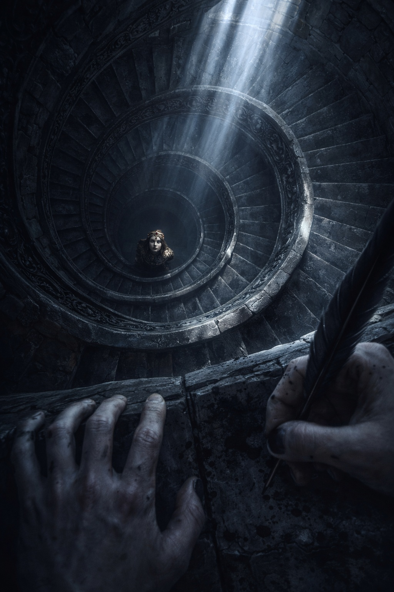
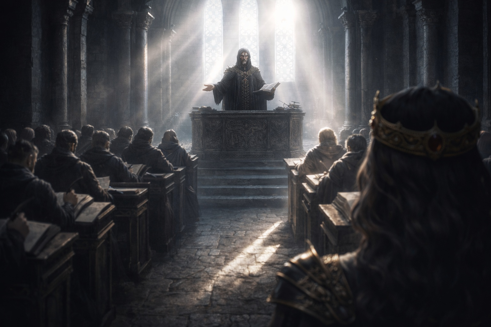
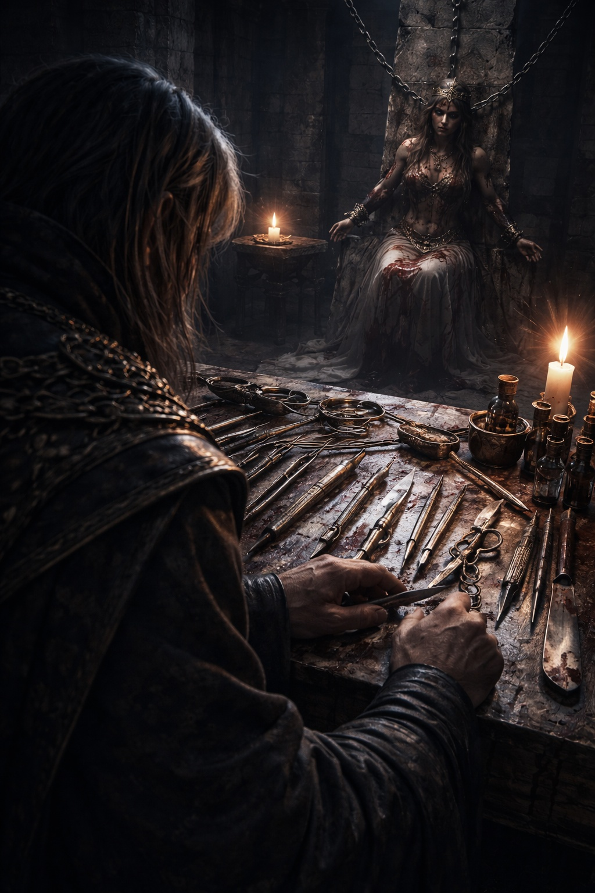

## Lore | La Búsqueda de Supremacía Mágica de la Teocracia Contiana

---

Syrael odiaba las escaleras de la torre.

Las torres de Contia crecían con cada generación. En el último recodo le ardían las pantorrillas y el cántico de la cámara superior ya había empezado.

Odiaba las escaleras porque hacían eco.

Intentó pisar cerca de la pared. Aun así, la piedra llevaba el sonido de cada paso por delante de él.

Levantó el dobladillo de su túnica con dos dedos y subió más rápido. Los frascos de tinta golpeaban suavemente contra su cinturón. El estuche de pergaminos chocaba contra su cadera. El pergamino en su interior era nuevo e inmaculado. Eso importaba. A los Inquisidores les encantaba el pergamino inmaculado.

En el descanso, un acólito bloqueaba la entrada. El pelo del muchacho estaba rapado al estilo antiguo, dejando solo una fina franja en la coronilla. Sus manos estaban manchadas de ceniza de oración.

—Nombre —dijo el acólito.

—Syrael. Tercer Libro Mayor. Estoy asignado al registro de la mañana.

El acólito estudió su rostro un momento demasiado largo, como decidiendo si la voz de Syrael sonaba lo suficientemente leal.

Detrás del muchacho, Syrael oyó el cántico repetir las mismas palabras en voz baja. Se las sabía de memoria.

*El orden es misericordia. Guarda fidelidad a la ley.*

El acólito se apartó. —No hables a menos que te pregunten. No escribas a menos que te lo ordenen.

Syrael asintió y entró.

La cámara era larga y luminosa. El sol de la mañana llegaba a los bancos de los escribas y reveló una mancha de tinta que Syrael no había visto en el puño. La ocultó bajo la manga.

Filas de bancos miraban hacia una tarima elevada. Sobre la tarima había un círculo de eruditos con túnicas, sus cuellos rígidos con hilo de oro. Detrás de ellos, el Alto Ministro estaba sentado con las manos cruzadas y el rostro inexpresivo.

En el centro de la tarima yacía el objeto que Syrael había sido convocado a registrar.

Una vara de metal opaco, no más larga que el antebrazo de Syrael.

Descansaba sobre la tela negra, tan opaca y corriente como un utensilio de cocina.

Syrael encontró su lugar asignado cerca del costado, donde los escribas debían ser invisibles. Desenrolló su pergamino, afiló su pluma, y esperó.

Un erudito dio un paso adelante. El Ministro Halvek. Su voz llegaba al fondo de la cámara sin esfuerzo.

—Hermanos y hermanas —dijo Halvek—, los rumores de la frontera han llegado hasta esta cámara. Hay quienes quieren hacerles creer que la magia pertenece a cualquiera capaz de tomarla.

Esperó. Syrael oyó crujir un banco cuando alguien se movió; después, nada.

Halvek señaló la vara. —Recuperada de las ruinas bajo la cornisa del río. El grupo que la encontró la llama instrumento de medición. Nuestros catalogadores se inclinan por un uso ceremonial. Estableceremos qué versión corresponde al registro.

Syrael escribió: *Vara metálica presentada. Ruinas del río, según el ministro Halvek. Función discutida.*

La pluma raspó. La tinta se secó rápidamente en la cálida luz.

Halvek continuó. —Los practicantes sin licencia nos dicen que el poder no puede gobernarse. Hoy lo verán medido bajo supervisión legal.

Syrael lo escribió porque se suponía que debía hacerlo.

Syrael había registrado la misma promesa en la demostración anterior. Dejó una línea en blanco debajo para el resultado.

Halvek se volvió hacia la mesa pequeña. Los cuencos de latón estaban junto a una pizarra grabada con círculos, una cadena de plata y un prisma de cristal. Syrael comprobó la cantidad en su inventario.

—Traigan al sujeto —dijo Halvek.

Dos guardias escoltaron a un hombre joven a la cámara. Las muñecas del hombre estaban atadas. Sus mejillas estaban hundidas. Un moretón oscurecía un lado de su garganta, como si alguien lo hubiera agarrado con fuerza y durante mucho tiempo.

Syrael reconoció los símbolos tatuados en los antebrazos del hombre. No las marcas sagradas. No la geometría limpia de Contia.

Marcas espirales. Toscas. Tribales. De las tierras fronterizas.

El tipo que hacía que los ministros hablaran de *suciedad*.

La sonrisa de Halvek no cambió. —Fuiste observado usando manifestación incontrolada cerca del camino de la sal. ¿Lo niegas?

El prisionero levantó la cabeza. Sus ojos estaban inyectados en sangre. —Estaba tratando de detener un incendio.

La mirada del Alto Ministro no se movió. Halvek esperó a que el prisionero bajara la cabeza.

Halvek mantuvo el tono amable. —Intentaste actuar como si el poder perteneciera al individuo.

El prisionero tragó saliva. —Había gente en la casa.

La pluma de Syrael se detuvo.

Se dijo a sí mismo que era solo porque necesitaba ponerse al día.

Halvek tomó la cadena de plata. —Sujeta esto.

Un guardia forzó las manos del prisionero hacia adelante. Halvek envolvió la cadena alrededor de las muñecas atadas y cerró el broche.

Syrael había registrado el uso de la cadena dos veces el mes anterior. Ningún informe explicaba la sensación que tuvo cuando Halvek cerró el broche.

Al cántico pareció faltarle una nota. Apretó la lengua contra los dientes; el sonido se los había dejado doloridos.

Halvek colocó el prisma de cristal junto a las manos del prisionero. —Ahora —dijo Halvek suavemente—, muéstranos lo que eres.

El prisionero recorrió con la mirada las filas de eruditos. Nadie le sostuvo la mirada.

Cerró los ojos.

Por un momento, no pasó nada.

El aire frente a sus manos atadas onduló. Inspiró con dolor mientras temblaban los cuencos y titilaban las lámparas de la pared.

Syrael sintió que los pelos de sus brazos se erizaban.

Halvek observó con satisfacción. —Ahí lo tienen. Ni siquiera puede mantenerlo estable.

La respiración del prisionero se entrecortó. El brillo creció. Las llamas de las lámparas se estiraron y su luz se torció.

Halvek acercó la palma a la cadena. Los dedos se le pusieron blancos y un temblor le recorrió la mano alzada.

El cambio fue inmediato.

La ondulación se debilitó hasta que Syrael pudo distinguir a través de ella el borde opuesto de la pizarra.

El prisionero jadeó. Lo intentó de nuevo, con todo el cuerpo en tensión. El brillo regresó en débiles ráfagas, luego colapsó en nada.

Syrael escribió rápidamente: *Interacción con cadena observada. Manifestación se atenúa. Sujeto angustiado. Lámparas se estabilizan.*

Halvek se inclinó como si estudiara un espécimen bajo una lente. —¿Ven? La magia obedece cuando se aplica la ley.

Uno de los eruditos mayores asintió. Otro murmuró una bendición.

Syrael no miró el rostro del prisionero. Mantuvo los ojos en el pergamino.

La respiración del prisionero se había vuelto irregular, como si intentara inhalar a través de una tela.

Halvek soltó la cadena y retrocedió. —Ahora mediremos la varianza residual.

Levantó el cuenco de latón y vertió el agua bendita sobre la pizarra. El agua se acumuló en los círculos grabados. Halvek tuvo que sujetar el cuenco con la otra mano antes de dejarlo.

A Syrael siempre le había gustado esa parte. Hacía que el mundo pareciera simple.

Halvek colocó las manos atadas del prisionero sobre la pizarra. —De nuevo.

El prisionero movió los labios. Syrael no alcanzó a oír las palabras.

Surgió una ondulación. El prisionero se dobló sobre las manos atadas, tosiendo.

El agua en los círculos de la pizarra onduló, una vez. Luego quedó quieta.

Halvek frunció el ceño.

Fue diminuto. La mayoría de la gente no lo habría notado. Su boca se tensó en una esquina durante medio respiro, luego se suavizó de nuevo.

Syrael dejó la pluma suspendida sobre la línea del resultado. Halvek no le había dado ninguna cifra.

Halvek obligó al prisionero a intentarlo otra vez. Al hombre le fallaron las rodillas; el agua se onduló una vez y quedó quieta.

El erudito mayor a su lado se inclinó y susurró algo. Los ojos de Halvek se dirigieron al Alto Ministro, buscando permiso sin mover la cabeza.

El Alto Ministro no asintió.

Halvek tragó saliva.

Entonces elevó su voz. —Las mediciones lo confirman. Los instrumentos de Contia son suficientes.

Syrael escribió las palabras encima de la línea vacía del resultado.

¿Habían fallado los instrumentos al medirlo, o le quedaban demasiado pocas fuerzas que medir? Syrael miró la mano temblorosa de Halvek y no supo distinguirlo.

El prisionero se desplomó. Los guardias lo sostuvieron.

Halvek se dirigió a la cámara. —Los gobernadores de frontera recibirán una copia de los resultados de hoy. Traerán aquí a los magos sin licencia para instruirlos.

Syrael también había escrito esa línea antes.

Halvek se volvió hacia los guardias. —Llévenlo abajo. Prepárenlo para instrucción.

La cabeza del prisionero se sacudió hacia arriba. —¿Instrucción?

La sonrisa de Halvek regresó. —Aprenderás obediencia.

Los guardias arrastraron al hombre. Sus pies rasparon la piedra.

Syrael se obligó a seguir escribiendo, incluso mientras el sonido del raspado se desvanecía en el pasillo.

El Alto Ministro se puso de pie al fin. Todos en la cámara se levantaron con él.

Su voz era tranquila. Eso hacía que la habitación escuchara más atentamente.

—Le daremos nombre. Le asignaremos un número —dijo el Alto Ministro—. Registren a quienes se nieguen. Los gobernadores responderán por las omisiones.

Syrael copió la orden, sin acercar la pluma a la medición inconclusa.

El Alto Ministro miró hacia la vara sobre la tela negra. —Aumenten los esfuerzos de recuperación. Se han identificado dos ruinas más. Tráiganme todo.

Halvek hizo una reverencia. —Como lo desee.

La mirada del Alto Ministro se elevó, pasando sobre los escribas, los guardias, los eruditos. Cuando llegó a Syrael, Syrael bajó la mirada de inmediato.

Sintió, absurdamente, que el hombre podía leer sus pensamientos.

Se inclinó sobre el inventario hasta que el Alto Ministro apartó la vista.

Cuando la cámara se vació, Syrael se quedó hasta que se le permitió irse. Enrolló el pergamino cuidadosamente y lo selló con la marca del Tercer Libro Mayor.

Afuera, el aire en el hueco de la escalera de la torre se sentía más frío de lo que debería.

Syrael se detuvo en el descanso, solo por primera vez desde que había llegado. Descubrió que sus dedos temblaban.

El estuche se le torcía entre los dedos. Lo apoyó contra la barandilla.

Recordaba con claridad el primer esfuerzo del prisionero. Después de la cadena, solo recordaba cuánto le había costado respirar.

Halvek lo había llamado obediencia. Syrael había copiado la palabra, pero eso no le decía qué había hecho la cadena.

Reanudó el descenso. Tendría que pasarlo a limpio para los gobernadores de frontera.

Aun así, cuando llegó a la planta baja, se encontró mirando hacia arriba a la torre, como esperando ver los ojos del prisionero mirando desde una ventana.

Las ventanas estaban vacías. Desde el patio no podía ver las habitaciones inferiores.

Syrael aferró el estuche de pergaminos y caminó hacia el sol, repitiendo la doctrina entre dientes como un encantamiento.

*El orden es misericordia. Guarda fidelidad a la ley.*

Seguía sin tener una cifra para el espacio que Halvek había dejado en blanco.

**Fin de Lore 1 — continúa en Lore 1: [La Defensa Resiliente del Imperio Divino de Lumeshire](/escudos-arriba-la-defensa-resiliente-del-imperio-divino-de-lumeshire/)**
