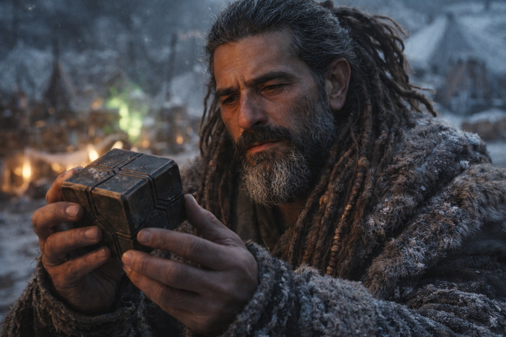
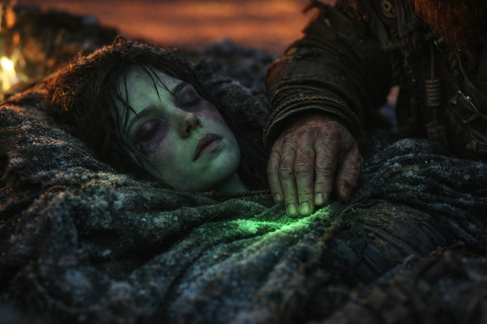

---
order: 1327
title: "Después de la Luz: La Piedra Fría"
description: "Se sentía como enterrar algo."
date: 2024-11-09
language: es
chapter: 43
subchapter: 2
storyline: west
canon_phase: main
canon_sequence: W-043-002
narrative_weight: medium
category: Frostgard
author: Dulint
type: Main
tags: ['#después de la luz', '#dulint', '#frostgard']
thumbnail: image.jpg
featured: false
counterpart_path: site/content/posts/en/frostgard/after-the-light-the-cold-stone/index.mdx
counterpart_title: "After the Light: The Cold Stone"
---

## Capítulo 43 | Parte 2 | La Piedra Fría

---

Dulint sacó el Faro de su bolsa del cinturón al amanecer, aunque amanecer era una palabra que ya no describía lo que sucedía en el horizonte. La luz llegó, pero llegó a través del ámbar-óxido, y el resultado fue una mañana que parecía un moretón sanando en la dirección equivocada.

La piedra descansaba en su palma. Fría. El tipo de frío que tienen los objetos cuando han estado fríos durante mucho tiempo y no tienen memoria de calidez.

La sostuvo como la había sostenido cada mañana desde que partieron de la costa. La giró. Buscó el pulso que solía vivir en la matriz cristalina, la tenue calidez que significaba que el sistema del Nexus estaba operativo y el Faro estaba conectado a la red de la que formaba parte. La calidez había sido sutil. No había apreciado cuánto dependía de ella hasta que desapareció, que era como funcionaban las cosas con la calidez sutil.

Nada. Sin calidez. Sin pulso. Sin presión direccional tenue que dijera *norte* o *más cerca* o *aún se mueve*. El Faro era una piedra en la mano de un enano, y la mano estaba fría, y la piedra más fría.

—Xandor.

El erudito vino. No había dormido. Sus ojos tenían la cualidad particular de un hombre que había pasado la noche intentando comprender algo que resistía la comprensión, y que había logrado solo comprender cuánto no comprendía.

—Déjame verlo.

Dulint le entregó el Faro. Xandor lo sostuvo contra la luz ámbar-óxido, lo giró, presionó su pulgar contra la faceta de interfaz primaria donde un toque calibrado de protección solía producir una respuesta. Nada. Cerró los ojos e intentó empujar su consciencia dentro de la piedra como lo había hecho con sus protecciones, la técnica de diagnóstico que le permitía a un mago entrenado leer el estado de un instrumento mágico.

Sus protecciones estaban muertas. Su técnica de diagnóstico no encontró nada contra lo que empujar. Era un cerrajero que intentaba abrir una cerradura con dedos entumecidos.

—La matriz cristalina está intacta —dijo—. Físicamente, el Faro no está dañado. La carcasa, las facetas, las superficies de interfaz. Todo presente. Todo funcional en términos de estructura.

—Pero.

—Pero el sistema al que se conectaba ya no existe. No del modo en que lo necesita. —Xandor giró la piedra una vez más—. El Faro era un nodo en una red. La red pasaba por la barrera, por el sistema del Nexus, por cualquier infraestructura que los Drow mantuvieran bajo la superficie del mundo. Esa infraestructura está perturbada. No destruida, quizás. Perturbada. El Faro está intentando conectarse a algo que ya no responde.

—Intentando.

—Del modo en que una brújula intenta encontrar el norte cuando el norte se ha movido. El mecanismo aún funciona. Aquello para lo que fue calibrado ha cambiado de posición, o naturaleza, o ambas.

Dulint miró la piedra. Pensó en la primera vez que había pulsado en su mano, allá en la costa, cuando la dirección había sido clara y la misión había sido simple y el mundo había estado organizado de una manera que incluía una barrera funcional y un cielo estable y magia que funcionaba como se suponía que la magia debía funcionar.

—¿Hay alguna posibilidad de que vuelva?

Xandor guardó silencio durante un largo rato. El fuego verde crepitaba detrás de ellos. Balin estaba sentado junto a él, su bastón sobre las rodillas, la grieta que atravesaba el duramen visible a la luz de la mañana. El bastón que había portado generaciones de plegarias acumuladas era dos piezas sostenidas por ataduras y costumbre. Aldric estaba de pie en el perímetro, su espada fría enfundada, observando que nada se acercara desde ninguna dirección.

—El Faro fue calibrado a un estado específico del sistema —dijo Xandor—. El estado del sistema ha cambiado. Para que el Faro funcione de nuevo, el sistema necesitaría regresar a su configuración previa. La barrera necesitaría estar intacta. El Nexus necesitaría estar operativo. La infraestructura necesitaría ser restaurada. —Hizo una pausa—. Mil años de mantenimiento drow mantuvieron ese sistema en funcionamiento. El mantenimiento se fue. Los que lo mantenían se fueron. El sistema no va a volver, Dulint. No en nuestra vida. No en la de nadie.

Dulint tomó el Faro de vuelta. Lo sostuvo. El peso era el mismo. La forma era la misma. El frío era diferente. Antes, el frío había sido el frío de una piedra que se calentaría cuando encontrara lo que estaba buscando. Ahora el frío era el frío de una piedra que había dejado de buscar.

Pensó en ponerlo de vuelta en la bolsa del cinturón. La bolsa que había revisado cada mañana, ajustado cada tarde, protegido a través de cada terreno y amenaza y legua de Frostgard congelado. La bolsa que había contenido el propósito de su expedición como un relicario contiene un hueso.

En cambio, abrió su mochila. Encontró el bolsillo interior donde guardaba las cosas que importaban pero no eran necesarias para la supervivencia inmediata. Una carta de su primo en Stonehold. Un trozo de hierro de la primera mina en la que había trabajado. Un botón de latón del abrigo de su padre.

Puso el Faro junto a ellos.

El peso se asentó en la mochila. Cerró el bolsillo. No miró a Xandor porque mirar a Xandor significaría reconocer lo que ambos ya sabían, y reconocerlo lo convertiría en un hecho en vez de una condición, y Dulint prefería darle a los hechos unas horas para ver si planeaban seguir siendo hechos antes de tratarlos como permanentes.

Balin observaba desde el fuego. Sus manos sobre el bastón partido, que sostenían las dos mitades como un hombre sostiene las piezas de una promesa rota. No había hablado desde que el bastón se agrietó. La oración requería un conducto. El conducto estaba dañado. La conexión entre un sacerdote y su fe no era lo mismo que la conexión entre un sacerdote y el instrumento que portaba su fe, pero en la práctica la distinción era más estrecha de lo que la teología sugería.

—¿El bastón? —preguntó Dulint.

Balin miró el duramen partido. —Sostiene. Apenas. La atadura que hice anoche mantiene las mitades alineadas, pero la resonancia se fue. El peso acumulado de plegarias, las generaciones de uso que le dieron a la madera su autoridad. Ese peso requería un campo mágico que ya no es estable. —Pasó su pulgar por la grieta—. Aún puedo orar. La oración va a algún lugar. Estoy menos seguro de que ese lugar sea al que solía ir.

Dulint asintió. No preguntó por la espada de Aldric. Había visto a Aldric desenfundarla dos veces durante la guardia nocturna, probando, y ambas veces la hoja había salido fría. La resonancia de forja que la había hecho más que acero se había ido como las protecciones de Xandor, como el peso del bastón de Balin, como el pulso del Faro. El mundo había cambiado y los instrumentos que medían el viejo mundo estaban calibrados a mediciones que ya no aplicaban.

Fue a revisar a Maris.

Yacía donde la habían acomodado, envuelta en cada capa de sobra, su cabeza sobre una manta doblada, su respiración superficial pero regular. Los moretones bajo sus ojos se habían oscurecido durante la noche. Su piel estaba pálida de un modo que no tenía nada que ver con el frío y todo que ver con lo que la conexión le había costado. La sangre había sido limpiada de su rostro, sus oídos, su ojo izquierdo. La limpieza era obra de Balin, cuidadosa y minuciosa, el trabajo de un hombre que no podía sanar con magia pero aún podía sanar con tela y agua y atención.

No se había movido. Ni una vez. Ni un espasmo, ni un murmullo, ni los pequeños cambios que las personas dormidas hacen cuando sus cuerpos se ajustan al suelo. Estaba presente del modo en que una persona en aguas profundas está presente: en algún lugar, pero no en la superficie.

—Sigue igual —dijo Aldric desde el perímetro. Había estado observando. Por supuesto que sí.

Dulint ajustó la capa alrededor de sus hombros. Revisó su pulso en la muñeca. Constante. Lento. El pulso de un cuerpo que estaba conservando todo lo que tenía porque no estaba seguro de cuánto necesitaría.

Se sentó sobre sus talones. Cinco personas sobre suelo congelado bajo un cielo ámbar-óxido junto a un fuego verde con un Faro muerto en una mochila y un bastón agrietado y una espada fría y un conjunto desmoronado de protecciones y una vidente que no despertaba.

Había sido minero. Entendía los derrumbes. El momento después del colapso, cuando el polvo se estaba asentando y el aire estaba viciado y la oscuridad era completa, y lo primero que hacías era no entrar en pánico y lo segundo que hacías era contar cabezas y lo tercero que hacías era averiguar cuánto aire tenías.

Lo primero: hecho. Nadie estaba entrando en pánico. Habían pasado el pánico. El pánico requería la creencia de que la situación podría ser temporal, y nadie aquí creía eso.

Lo segundo: hecho. Cinco cabezas. Todas presentes.

Lo tercero. Cuánto aire.

Dulint miró al cielo, el color equivocado que Xandor decía que no iba a desaparecer. Miró al fuego, el verde que debería haber sido naranja. Miró al terreno, la extensión congelada de Frostgard que habían cruzado durante semanas con un Faro que les decía adónde ir y una misión que les decía por qué.

El Faro estaba muerto. La misión había terminado. El adónde y el por qué se habían ido, y lo que quedaba era un enano en suelo congelado con cuatro compañeros y la pregunta más antigua del mundo.

Y ahora qué.

---

**Fin del Capítulo 43.2 —>  43.3: [Después de la Luz: La Decisión](/despues-de-la-luz-la-decision/)**

