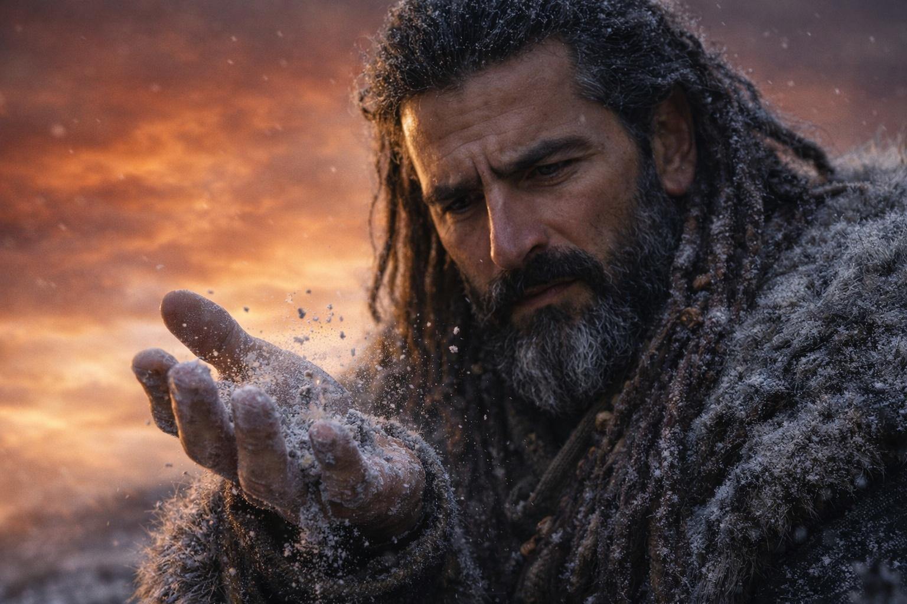
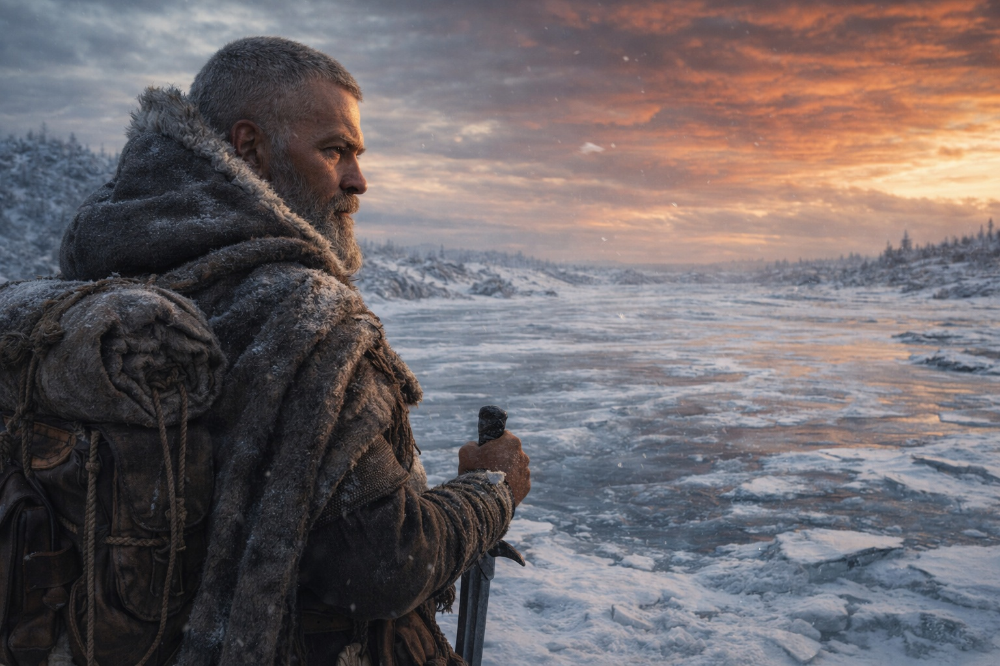
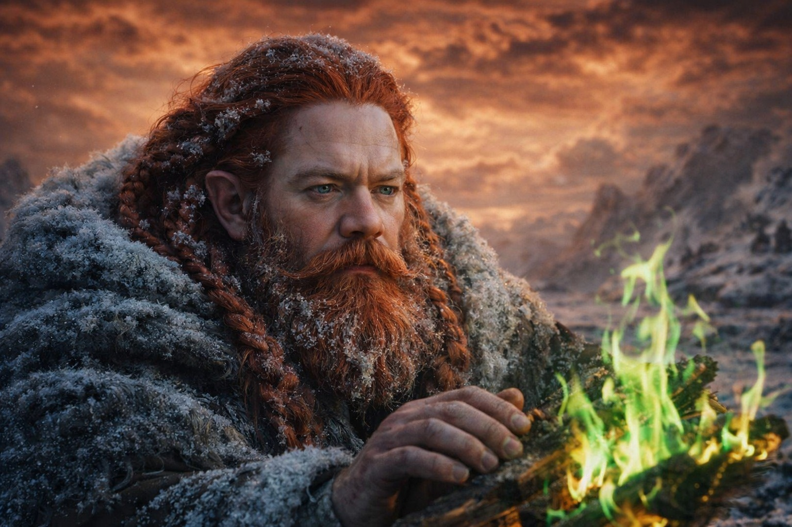

## Capítulo 43 | Parte 1 | Las Consecuencias

---

La fogata ardía verde.

Esa fue la primera señal. El fuego delgado que habían estado manteniendo contra el frío de Frostgard, alimentado con el mismo combustible que habían estado quemando durante días, se tornó del color de la llama de cobre sin explicación. La madera era la misma. El aire era el mismo. El fuego estaba mal.

Luego el agua en la cantimplora de Balin se convirtió en hielo. No se congeló. Se convirtió. Un momento líquida, al siguiente sólida, sin el proceso gradual de cambio de temperatura, sin la expansión que debería haber agrietado el cuero. El agua se convirtió en hielo del modo en que una palabra se convierte en otra en una traducción: instantáneamente, sin estado intermedio.

Luego la última de las piedras de protección de Xandor se desmoronó en su mano como arena mojada.

Dulint lo vio suceder. El erudito sostenía la piedra, la última pieza funcional de su dispositivo protector, y la giraba entre sus dedos con la atención compulsiva de un hombre que revisa el último activo en un balance que sabe en bancarrota. La piedra se ablandó. Los bordes se difuminaron. La matriz cristalina que le había dado a la piedra sus propiedades protectoras se disolvió, y lo que quedó en la palma de Xandor fue un puñado de polvo que el viento se llevó antes de que pudiera cerrar el puño.

—El campo ha cambiado —dijo Xandor. Su voz era la voz de un hombre cuya casa estaba en llamas y que estaba explicando los principios arquitectónicos que hacían posible el fuego—. El sustrato mágico. La capa fundamental de la que todas las aplicaciones estructuradas extraen. Ha sido reestructurado por la brecha. Los patrones de resonancia son diferentes. Las frecuencias están desplazadas. Cada encantamiento, cada protección, cada aumento que fue calibrado al antiguo campo está ahora operando en un entorno para el que no fue diseñado.

—En un idioma que el resto de nosotros hable —dijo Aldric. Sostenía su espada fría y la giraba como Xandor había girado la piedra de protección, en busca de la propiedad que había estado ahí ayer y hoy había desaparecido.

—Todo lo mágico está roto. No destruido. Desalineado. La magia del mundo está hablando un idioma diferente ahora, y nada de lo que construimos fue construido para entenderlo.

El fuego verde proyectaba sombras extrañas. El hielo en la cantimplora no se derretía. El viento se llevó el polvo de la piedra de protección hacia el nuevo cielo y el nuevo cielo lo tragó sin comentario.

Dulint hizo inventario del daño.

Las protecciones: desaparecidas. Todas. Cada círculo protector que Xandor había mantenido desde que salieron de Zuraldi, cada línea de tiza y ancla de cristal e intención académica, desmoronados, fallidos o que simplemente dejaron de funcionar. La teoría protectora en la que habían confiado estaba escrita en el idioma del antiguo campo, y el antiguo campo se había ido.

El bastón de Balin: partido. El encantamiento muerto. La madera seguía siendo madera, aún útil como bastón de caminar, pero el refuerzo menor que lo había hecho apto como arma estaba ausente. Balin había unido las dos mitades con cordón de cuero. La atadura resistía. La magia no.

La espada de Aldric: funcional como acero. La resonancia de forja que le había dado su filo, el rastro de la intención del herrero que la hacía mejor que metal ordinario, se había disipado con el cambio de campo. Cortaría. No cortaría como lo había hecho.

El terreno estaba mal. No dramáticamente. Sutilmente. El ángulo de la cresta detrás de ellos se había desplazado un grado que el ojo de topógrafo de Dulint captaba y su vocabulario no podía describir. Las formaciones de hielo al oeste habían cambiado de patrón durante la noche, los cristales crecían en configuraciones que no correspondían a ninguna condición de temperatura o viento que reconociera. Un pájaro que había visto cada mañana desde que entraron en esta latitud volaba en la dirección equivocada. Sin migrar. Confundido. El campo magnético de navegación en el que confiaba había sido perturbado por el mismo evento que perturbó todo lo demás.

Maris no se había movido.

Yacía donde Balin la había colocado, envuelta en capas, su respiración superficial y constante, sus ojos cerrados, su cuerpo presente y su consciencia ausente. La sangre de su rostro había sido limpiada. Los moretones bajo sus ojos se habían oscurecido. Balin revisaba su pulso cada quince minutos con la regularidad mecánica de alguien realizando una tarea porque la tarea era lo único que prevenía el sentimiento que esperaba detrás de la tarea.

—Está estable —dijo cada vez. No para informar. Para confirmar. La repetición como ritual, como un hombre cuenta sus pasos en una marcha larga no porque el número importa sino porque el conteo prueba que la marcha continúa.

Las capas grises se habían ido.

Dulint lo había notado dentro de la primera hora. Las figuras que habían estado observando desde una legua al sur, que habían estado presentes y visibles e inmóviles durante días, habían desaparecido. No huido. No retirado. El suelo donde habían estado estaba vacío, la nieve sin perturbar, como si hubieran sido arrancadas del paisaje del modo en que las piedras de protección habían sido arrancadas de las manos de Xandor: completamente, sin residuo.

—Sabían —dijo Aldric. Escrutaba la aproximación sur con la atención enfocada de un hombre cuya amenaza principal acababa de desvanecerse y que entendía que las amenazas desvanecidas eran más peligrosas que las visibles—. Sabían lo que venía y se fueron antes de que llegara.

—O fueron llamados de vuelta —dijo Xandor—. Si las capas grises sirven al mismo sistema al que servía el Faro, y ese sistema ha sido perturbado…

No terminó. La implicación era clara. Las capas grises eran componentes. El sistema al que pertenecían había cambiado. Los componentes habían sido retirados, reprocesados, o simplemente dejaron de funcionar en su forma actual.

Dulint miró al cielo. El color ámbar-óxido se había asentado. Sin profundizarse, sin extenderse, sin cambiar. Asentado. La condición permanente de un cielo que había sido reescrito por un evento que no podía deshacerse. Las nubes se movían a través de él en patrones que no correspondían al viento. La luz que alcanzaba el suelo estaba filtrada a través de la contaminación, y el filtrado confería a todo un matiz que hacía que lo familiar pareciera extranjero.

El mundo después de la brecha. Magia inestable. Terreno desplazado. Guardianes desaparecidos. Equipo degradado. Una de ellos inconsciente. La misión que los había traído a través de un continente concluida por el evento que habían intentado prevenir.

Dulint reavivó el fuego. Las llamas verdes aceptaron la madera como habían aceptado la madera antes; ardían con el mismo calor, proporcionaban la misma calidez. El color era lo único mal. El color y todo lo demás.

---

**Fin del subcapítulo  —> 43.2**

