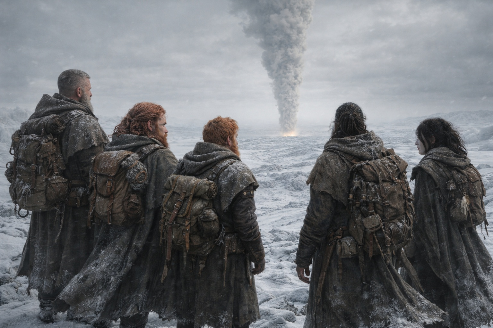

## Capítulo 35 | Parte 4 | El Fuego

---

Tres días después de la visión, vieron el humo.

Maris caminaba con el brazo de Balin cerca de su codo, sin tocarla, sin sostenerla, solo presente del modo en que una pared está presente junto a una escalera. Ella no lo había pedido. Él no lo había ofrecido. Simplemente se había convertido en el arreglo que su cuerpo negoció con el mundo después de la convulsión: ella caminaba, y Balin caminaba a distancia de alcance, y ninguno de los dos reconocía la geometría.

Su cuerpo era un libro de cuentas de costes. Las hemorragias nasales se habían detenido el segundo día, costrosas y oscuras dentro de ambas fosas nasales. La sangre de sus oídos se había secado hasta convertirse en un residuo parduzco que podía sentir al tragar, una arenilla en los canales que amortiguaba los sonidos más agudos del mundo. La sangre de sus ojos había sido lo peor, no porque doliera más sino porque Balin la había visto y su rostro había hecho algo para lo que ella no tenía energía de abordar. Podía ver. La visión en su ojo izquierdo estaba ligeramente borrosa, el tipo de borrosidad que podía ser temporal o podía ser el primer borrador de permanente. No lo mencionó.

Habían forzado la marcha. Dulint marcaba el ritmo y el ritmo era castigador, el tipo de marcha forzada que devoraba provisiones y desgastaba articulaciones y convertía las reservas del cuerpo en distancia a un tipo de cambio que nadie podía sostener por mucho tiempo. Xandor seguía el ritmo por pura obstinación y su bastón y la negativa de un hombre viejo a ser la razón por la que otros aminoraran. La cojera de Balin había regresado, genuina ahora, el bastón de caminata haciendo trabajo real. Aldric caminaba en el flanco con la mano en su espada y los ojos en la línea de la cresta donde las capas grises habían sido visibles al amanecer, más cerca ahora, igualando su velocidad, manteniendo la distancia como si estuvieran atados.

El terreno había cambiado. Las praderas heladas habían dado paso a colinas rocosas que ascendían hacia el noreste en dirección a algo, una elevación en el paisaje que Aldric llamaba estribaciones y Xandor llamaba la sombra de la barrera, el lugar donde la membrana entre este lado y el otro empezaba a afectar la geografía. El aire sabía diferente aquí. Más delgado. Más afilado. El frío era un frío diferente, no el frío honesto del invierno sino algo metálico, el frío de la proximidad a una cosa que no debería existir.

El Faro había estado estable desde la visión. No más fuerte. Sin gritar. Estable del modo en que una brújula está estable cuando caminas directamente hacia lo que señala. Dulint lo llevaba y no decía nada al respecto y su rostro era piedra.

El humo apareció en la mañana del tercer día.

Aldric lo vio primero porque Aldric veía todo primero. Se detuvo en una cresta y se quedó de pie y no se movió, y la quietud arrastró al resto hacia su posición como una corriente arrastra los desechos.

Noreste. En el horizonte. Una columna de humo, pálida contra el cielo gris, ascendiendo desde un punto más allá de las colinas. No era humo de fogata. No el hilo delgado de un asentamiento cocinando o un bosque ardiendo naturalmente. Este era grueso. Sostenido. El humo de algo grande ardiendo en un área concentrada, algo de piedra o metal que no habría ardido en absoluto sin calor extraordinario.

—Ahí es donde apunta el Faro —dijo Dulint.

Nadie necesitaba que lo dijera. Todos podían ver la dirección del Faro, podían sentirla en cómo el cuerpo de Dulint se inclinaba hacia el humo como si el artefacto en su mochila hubiera convertido su columna vertebral en una aguja. El humo se elevaba desde la dirección exacta hacia la que el Faro había estado gritando durante semanas.

Maris miró fijamente el humo y sintió la imagen residual detrás de sus ojos, la torre ardiendo, la piedra agrietándose, la cosa con alas.

—Esa es la torre —dijo.

Las palabras salieron planas. No lenguaje de distancia. No clínicas. Planas porque no había nada entre ella y el hecho, ningún amortiguador de análisis o pronombre de distancia, solo el reconocimiento desnudo de ver en el mundo real la cosa que había visto a través de la frecuencia del Faro cuatro noches atrás.

—La torre de la visión. —La voz de Xandor era firme. Sus manos en el bastón no.

—La torre ya no existe. Eso es lo que queda. Lo que sea que ocurrió allí, ese humo es lo que resta. —Maris miró la columna ascendiendo hacia el cielo gris. No se doblaba con el viento. Se alzaba recta, como si el calor en su origen fuera demasiado intenso para que la atmósfera la redirigiera—. Ella lo vio arder. Eso es lo que arde.

Silencio. Cinco personas en una cresta helada en las estribaciones de una barrera que no podían cruzar, observando el humo ascender desde el lugar donde todo lo que habían estado rastreando acababa de cambiar.

—¿A qué distancia? —preguntó Aldric.

—Dos días a este ritmo —dijo Dulint—. Quizá menos si el terreno se abre pasadas estas colinas.

—Dos días. —Aldric miró el humo—. Lo que sea que ocurrió allí ya terminó.

—El fuego sigue ardiendo.

—Los fuegos arden durante días después del evento. Eso no significa que lleguemos a tiempo para cambiar nada.

Dulint se giró. Su rostro era el rostro de un hombre que había sabido esto durante leguas, que lo había sabido desde la visión, desde la primera vez que Maris había gritado en una meseta helada y sangrado por los ojos y descrito una torre que se agrietaba y una figura con alas. Había sabido que estaban demasiado lejos. Los había hecho marchar duro de todos modos. Porque estar demasiado lejos era diferente de estar lo más cerca posible, y lo segundo era todo lo que tenía.

—No llegamos a tiempo —dijo Dulint—. Llegamos.

Xandor se sentó en una roca. Respiraba con dificultad. La marcha le había costado más de lo que había mostrado, y sentarse era la confesión que su cuerpo hacía cuando su orgullo dejaba de vigilar. Miró el humo con la expresión de un hombre leyendo un texto que había esperado no encontrar jamás fuera de una biblioteca.

—Si la torre ha desaparecido —dijo—, entonces el amortiguador ha desaparecido. La torre era el último punto fijo entre la interfaz de la barrera y lo que sea que haya más allá. Sin ella, el portador se acerca a la barrera sin estructura intermedia. Sin punto de calibración. Sin margen de seguridad.

—¿Qué significa eso? —preguntó Balin.

—Significa que el proceso se acelera. Significa que quien sea que esté empujando los tiempos acaba de eliminar el único obstáculo que podría haberlo ralentizado. —Xandor miró su bastón. Miró sus manos. Miró el humo—. Significa que tenemos menos tiempo del que pensábamos, y ya pensábamos que no teníamos suficiente.

Maris se sentó en el suelo helado. No porque eligiera hacerlo. Porque sus rodillas tomaron la decisión por ella, el veto silencioso del cuerpo a la insistencia de la mente en seguir de pie. El frío se filtró a través de sus pantalones. El viento de la cresta le cortaba la cara. El humo se elevaba en el horizonte, recto y grueso y paciente, ardiendo desde un lugar donde una torre se había erguido y un elfo oscuro había caminado a través del fuego y algo con alas se había anunciado a un mundo que había olvidado que existía.

Podía verlo. No podía alcanzarlo. Sabía lo que era y no quién. Conocía el mecanismo y no el resultado. Conocía el fuego y las alas y la mujer con armadura que ya había decidido, y sabía que saber estas cosas no cambiaba nada porque el conocimiento desde el lado equivocado de una barrera infranqueable era solo una versión más detallada de la impotencia.

—Ahí es donde está —susurró.

—Estaba —corrigió Aldric.

Nadie discutió.

El humo se elevaba. El Faro zumbaba. Las capas grises observaban desde una cresta al sur. Las estribaciones ascendían hacia el noreste en dirección a una barrera que existía en dimensiones que ninguno de ellos podía nombrar, y más allá de esa barrera, imposiblemente lejos e imposiblemente cerca, un elfo oscuro cuyo nombre no conocían caminaba hacia un mecanismo que renovaría o destruiría lo único que separaba este mundo de lo que vivía al otro lado.

Dulint se echó la mochila al hombro.

—Dos días —dijo—. Caminamos hasta que oscurezca.

Caminaron. El humo no disminuyó. El Faro no se acalló. La distancia entre lo que sabían y lo que podían hacer permanecía absoluta, una brecha medida no en leguas sino en la arquitectura fundamental de la barrera que separaba el mundo en el que estaban del mundo que ardía.

Maris caminó y sangró y observó el humo y contó el coste de la claridad, que era el mismo coste que siempre había sido: verlo todo, no cambiar nada, cargar el peso de un conocimiento que no servía para nada excepto hacer la impotencia precisa.

Caminó hacia el noreste. Hacia el fuego. Hacia la barrera. Hacia un hombre cuyo nombre no conocía, cuyo rostro podía dibujar de memoria, cuya frecuencia el Faro rastreaba con la devoción de una brújula apuntando al norte verdadero.

El humo se elevó recto hacia el cielo gris, y el cielo lo recibió sin comentario, del modo en que el mundo recibe toda evidencia de catástrofe: con paciencia, con indiferencia, como si torres en llamas y barreras cayendo fueran solo otra variedad de clima.

**Fin del Capítulo 35.4 —> 36.1: [La Escala de la Guerra: La Confrontación](/la-escala-de-la-guerra-la-confrontacion/)**