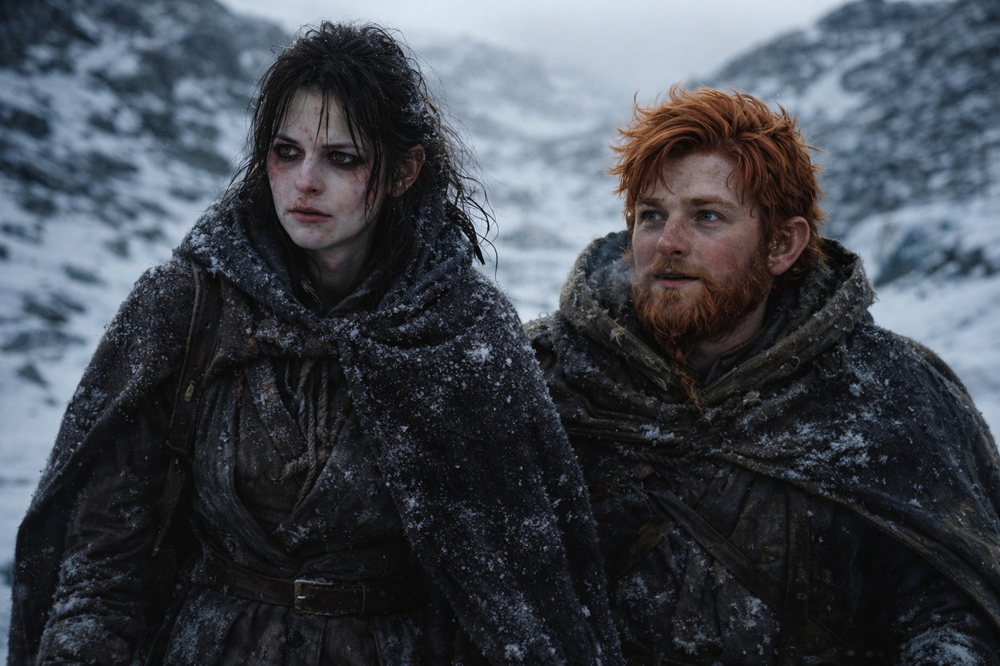
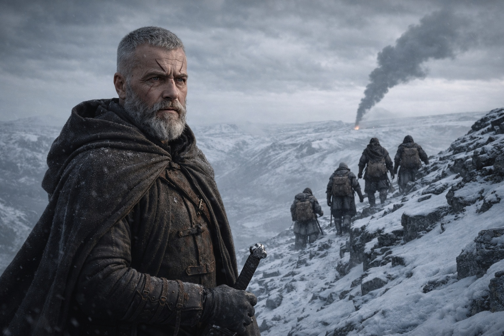

## Capítulo 35 | Parte 4 | El Fuego

---

Tres días después de la visión, vieron el humo.

Balin caminaba al alcance de su codo. Ella no había pedido ayuda, pero esa mañana ya la había sujetado dos veces al tropezar.

Las hemorragias nasales habían cesado el segundo día. La sangre seca aún le taponaba los oídos y amortiguaba las voces. Seguía viendo borroso con el ojo izquierdo. Lo comprobaba cuando Balin apartaba la vista, cerrando el derecho para ver si había mejorado.

Dulint mantenía un ritmo agotador. Xandor se apoyaba con fuerza en el bastón y Balin volvía a cojear. Aldric vigilaba la cresta donde las capas grises habían aparecido al amanecer. Estaban más cerca, al paso del grupo.

El pastizal helado había dado paso a colinas rocosas. Xandor las llamaba la sombra de la barrera. Maris solo sabía que respirar le dolía más en las subidas y que no conseguía calentarse los dedos.

El Faro mantenía un rumbo fijo. Dulint había dejado de comprobarlo en cada cresta.

El humo apareció en la mañana del tercer día.

Aldric se detuvo en lo alto y levantó una mano. Los demás subieron hasta él.

Una columna espesa ascendía más allá de las colinas del nordeste. Se extendía por encima del horizonte, demasiado ancha para una hoguera de campamento. Maris no veía de dónde salía.

—Ahí es donde apunta el Faro —dijo Dulint.

Maris siguió la dirección de su mano extendida. El humo ascendía en el mismo rumbo.

Maris miró fijamente el humo y sintió la imagen residual detrás de sus ojos, la torre ardiendo, la piedra agrietándose, la cosa con alas.

—Esa es la torre —dijo.

Su voz le sonó apagada. Tres días desde la visión y aún veía el muro ardiendo cada vez que cerraba los ojos.

—La torre de la visión. —La voz de Xandor era firme. Sus manos en el bastón no.

—La misma dirección. Humo de sobra. —Maris observó la columna—. Ella no puede ver la torre desde aquí. Pero ahí es donde la vio arder.

Permanecieron en la cresta helada sin hablar.

—¿A qué distancia? —preguntó Aldric.

—Dos días a este ritmo —dijo Dulint—. Quizá menos si el terreno se abre pasadas estas colinas.

—Dos días. —Aldric miró el humo—. Lo que sea que ocurrió allí ya terminó.

—El fuego sigue ardiendo.

—Los fuegos arden durante días después del evento. Eso no significa que lleguemos a tiempo para cambiar nada.

Dulint miró la pendiente que acababan de subir. Xandor aún respiraba con dificultad. Apenas podrían haberla recorrido más deprisa.

—No llegamos a tiempo —dijo Dulint—. Llegamos.

Xandor se sentó en una roca, con ambas manos apoyadas en el bastón. Esperó hasta poder hablar sin jadear.

—Si era una estación de calibración, perderla podría suponer perder sus mediciones. No sabemos qué guardaban allí.

—¿Qué significa eso? —preguntó Balin.

—Si siguen adelante, quizá tengan que actuar sin esas comprobaciones. —Xandor miró el humo—. Esa mujer lo empujaba hacia delante. Nada de lo que vio Maris indica que se detuvieran.

A Maris le fallaron las rodillas. Balin la agarró del brazo y la ayudó a sentarse. El frío le calaba los pantalones mientras observaba el humo.

Podía encontrarlo otra vez. Quizá eso la dejara sin poder caminar y aún no tenía forma de avisarlo. Se concentró en la mano de Balin hasta que pasó el impulso de buscarlo.

—Ahí es donde está —susurró.

—Estaba —corrigió Aldric.

Nadie discutió.

Las capas grises se habían detenido en una cresta al sur. Aldric las contó mientras Dulint comprobaba la ruta.

Dulint se echó la mochila al hombro.

—Dos días —dijo—. Caminamos hasta que oscurezca.

Balin la ayudó a levantarse. Siguieron a Dulint cuesta abajo, con el humo visible por encima de la siguiente colina.

Mantuvo el ojo sano en el camino. Intentar otra visión los retrasaría.

Al pie de la pendiente, se soltó del brazo de Balin y probó a dar unos pasos sola.

Llegó hasta la siguiente subida antes de volver a necesitarlo.

**Fin del Capítulo 35.4 —> 36.1: [La Escala de la Guerra: La Confrontación](/la-escala-de-la-guerra-la-confrontacion/)**
