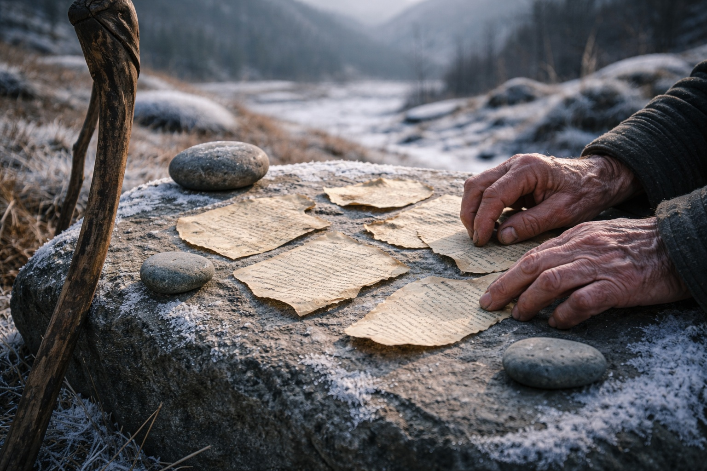
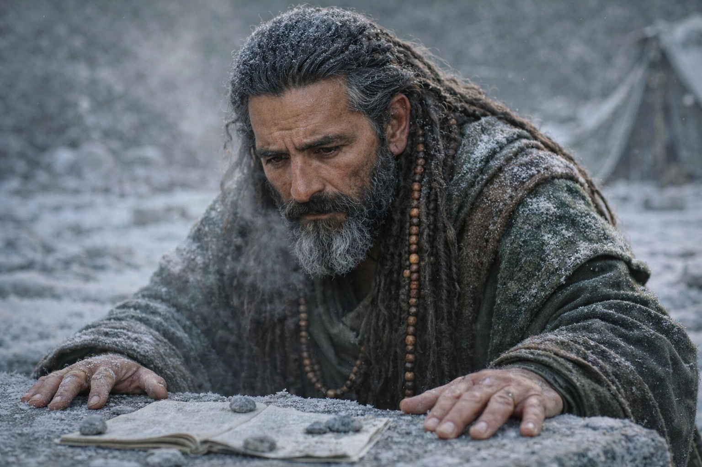
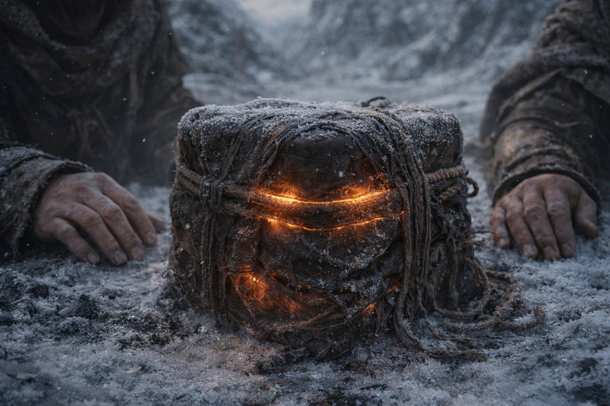
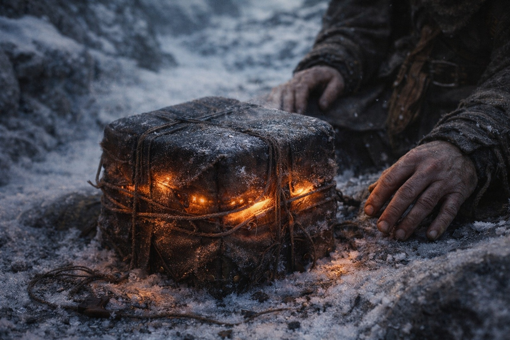
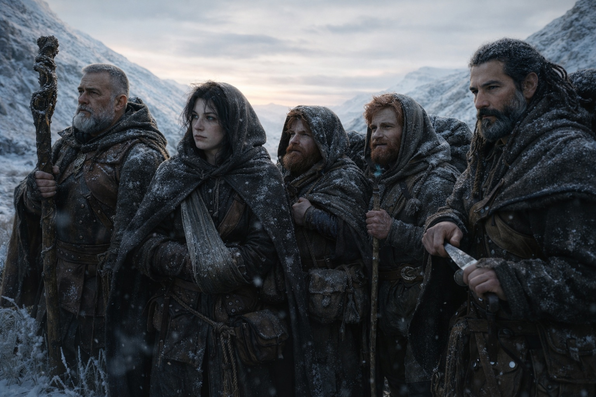

# Capítulo 35.1 | El Mapa Que Sangra: La Alineación

Xandor extendió los fragmentos sobre una piedra plana y sujetó las esquinas con guijarros del río.

Habían acampado en una depresión poco profunda entre dos crestas, el tipo de terreno que bloqueaba el viento pero no la vista. Aldric lo había elegido por las líneas de visión. Balin lo había elegido porque era el primer terreno llano que habían encontrado en seis horas de caminata. Maris se sentó en el borde y observó a Xandor trabajar porque ver a alguien organizar pruebas era mejor que quedarse sentada con el tirón en el pecho.

Los fragmentos eran todo lo que habían reunido desde Zuraldi. Retazos de texto que Xandor había copiado de tres bibliotecas de templos diferentes antes de que los caminos se deterioraran. Los relatos de las visiones de Maris, dictados a Balin por las mañanas cuando los detalles aún eran nítidos, escritos con su letra cuidadosa en papel que no podían permitirse desperdiciar. El registro de comportamiento del Faro, que era la memoria de Dulint, porque a nadie se le había ocurrido llevar registros hasta que Aldric lo sugirió dos semanas demasiado tarde.

—Aquí. —Xandor golpeó una página amarillenta con el dedo índice. El dedo estaba firme. El resto de él, no. Su bastón se apoyaba contra la roca junto a él, y Maris notó que no le había hablado a una sola planta en tres días—. El Pacto Quebrado. Fragmento nueve. «Cuando la membrana se adelgaza, el sistema busca un portador. No un héroe. No un instrumento elegido. Una coincidencia de frecuencia. Doble afinidad. Aire y agua, los elementos vinculantes.»

—Eso ya nos lo has leído antes —dijo Aldric. Estaba afilando su espada. El movimiento era metódico y familiar, el sonido de un hombre que procesaba mejor la información cuando sus manos estaban ocupadas.

—Así es. Pero antes no tenía esto. —Xandor colocó una segunda página junto a la primera. Su letra, más pequeña que la de Balin, apretada con la urgencia de alguien que transcribe con poca luz—. El fragmento del Ateneo. Recuperado del monasterio de Frostgard, el que se incendió. Traducción parcial: «El mecanismo requiere interfaz. Interfaz viviente. La barrera no puede renovarse a sí misma. No fue construida para eso. Requiere un cuerpo que porte ambas afinidades elementales en concentración suficiente para servir como conducto entre el componente del Nexo y la frecuencia central de la barrera.»

Silencio.

El viento recorrió la depresión. El Faro zumbaba dentro de su envoltorio en el fardo de Dulint, constante, direccional, apuntando al noreste.

—Un conducto —dijo Dulint. Su voz era plana. No incredulidad. La planitud particular de un hombre que escuchaba confirmar lo que había sospechado y deseaba no haber sospechado.

—Un conducto viviente. Afinidades de aire y agua. Portando el componente del Nexo. El fragmento lo llama «el chasis». —Xandor miró a Maris—. Lo que has estado rastreando. Aquello a lo que el Faro se enganchó. No es solo un artefacto. Es la mitad de un mecanismo. La otra mitad es la persona que lo lleva.

La nariz de Maris palpitaba. La fosa nasal izquierda había sangrado otra vez esa mañana, sin provocación, un goteo lento que había taponado con una tira de tela e intentado ignorar. La frecuencia del Faro había sido más fuerte durante días. No más aguda. Más fuerte. Como un sonido se hace más fuerte cuando caminas hacia él, excepto que ella no caminaba hacia nada. Aquello caminaba hacia la barrera desde el otro lado.

—Ahora combínenlo con lo que ella ha visto. —La voz de Xandor cambió. Más baja. El tono que usaba cuando estaba a punto de decir algo que había estado conteniendo—. Maris. Las visiones. El hombre que ves.

—Elfo oscuro. Doble afinidad. Ella lo ve con el artefacto en su fardo. —El lenguaje distante vino automáticamente. Era más fácil describir desde afuera cuando el interior era un lugar que costaba sangre—. Cristales en su cinturón. Caminando hacia el este a través de un paisaje que no debería existir. Algo dentro de él que el Faro reconoce y del que se estremece.

—Doble afinidad —repitió Xandor—. Aire y agua.

—Ella no sabe cuáles son sus afinidades.

—Sí las sabes. Describiste patrones de viento que responden a su movimiento. Describiste agua que fluye hacia él en lugar de alejarse. Describiste su cuerpo resonando a una frecuencia que el Faro identifica como compatible. —Las manos de Xandor estaban sobre la piedra, palmas hacia abajo, estabilizándose—. Coincide. Cada criterio que los fragmentos describen. Él es el conducto que el sistema de la barrera está esperando.

El zumbido del Faro cambió. Más agudo. Insistente. Como si escuchar su función nombrada en voz alta le hubiera dado permiso para ser más ruidoso sobre lo que había estado intentando decir durante semanas.

—Y el momento —dijo Xandor. No quería decir esta parte. Maris podía verlo en la forma en que su mandíbula se tensaba y sus ojos iban al horizonte, el horizonte noreste, donde el Faro apuntaba y el humo aún no había aparecido—. Los fragmentos describen una ventana de renovación. Un período en que la barrera se adelgaza lo suficiente para que el mecanismo se active. La ventana es natural. Ocurre en ciclos. De siglos de duración.

—¿Pero? —Aldric dejó de afilar.

—Pero la frecuencia del Faro se está acelerando. No está ciclando. Acelerándose. La ventana no se está abriendo de forma natural. Algo la está forzando. Desde el otro lado.

—¿Qué tipo de algo? —preguntó Balin.

Nadie respondió de inmediato. Xandor miró a Maris. Maris miró al horizonte noreste. El tirón en su pecho era un puño ahora, apretado y constante, estrujando a un ritmo que coincidía con el zumbido del Faro.

—Es un mecanismo de renovación —dijo Xandor. Sus manos estaban firmes sobre la piedra. Su voz, no—. Y alguien está a punto de usarlo en el momento equivocado. El Faro lo sabe. Por eso está gritando.

La palabra se quedó entre ellos como algo dejado caer desde gran altura. Gritando. El Faro no estaba gritando. Estaba zumbando. Pero Maris sentía la verdad en su pecho, en la arquitectura de dolor que vivía detrás de su ojo izquierdo, en la sangre que goteaba de su nariz cuando la frecuencia se disparaba. El Faro estaba haciendo lo único que podía hacer desde este lado de la barrera: señalar, cada vez más fuerte, que algo estaba ocurriendo en el otro lado que reconocía como incorrecto.

No roto. No corrompido.

Mal momento. El mecanismo haciendo aquello para lo que fue construido, en un instante en que hacerlo desgarraría la barrera en lugar de sellarla.

—¿Cuánto tiempo? —preguntó Dulint.

Xandor miró los fragmentos sobre la piedra. Las respuestas estaban todas ahí, compiladas de tres bibliotecas y dos visiones y mil leguas caminando hacia el noreste. Cada pieza apuntaba en la misma dirección. Cada pieza decía lo mismo.

—No lo sé. Días. Semanas. La aceleración hace que la predicción no sea fiable. —Hizo una pausa—. Pero es pronto. Los fragmentos describen lo que sucede cuando la ventana se abre en el punto equivocado del ciclo. «Brecha, no renovación. Apertura, no sellado. Todo lo que la barrera contiene se vuelve breve y catastróficamente visible.»

Brevemente. Catastróficamente.

Maris cerró los ojos. El tirón en su pecho se apretó. Al otro lado de la barrera, imposiblemente lejos e imposiblemente cerca, un elfo oscuro caminaba hacia un mecanismo que estaba hecho para operar, llevando la pieza que lo hacía funcionar, y el momento era el equivocado, y las personas que sabían que el momento era el equivocado estaban en el lado equivocado de una frontera que no podían cruzar.

Abrió los ojos. El horizonte noreste estaba despejado. El Faro zumbaba.

—Necesitamos movernos más rápido —dijo.

Nadie discrepó.

**Fin del subcapítulo — continúa en el Capítulo 35.2**
