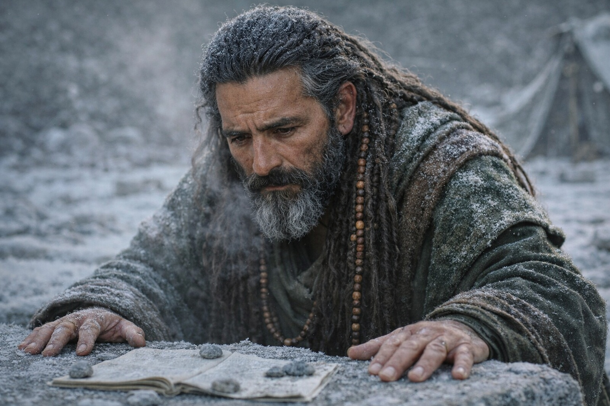
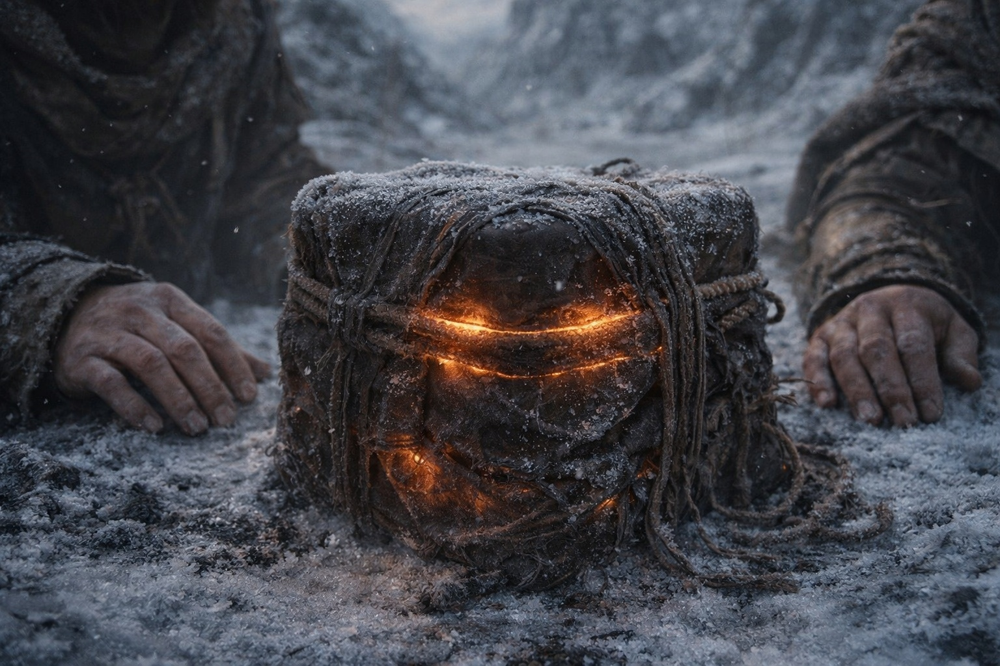
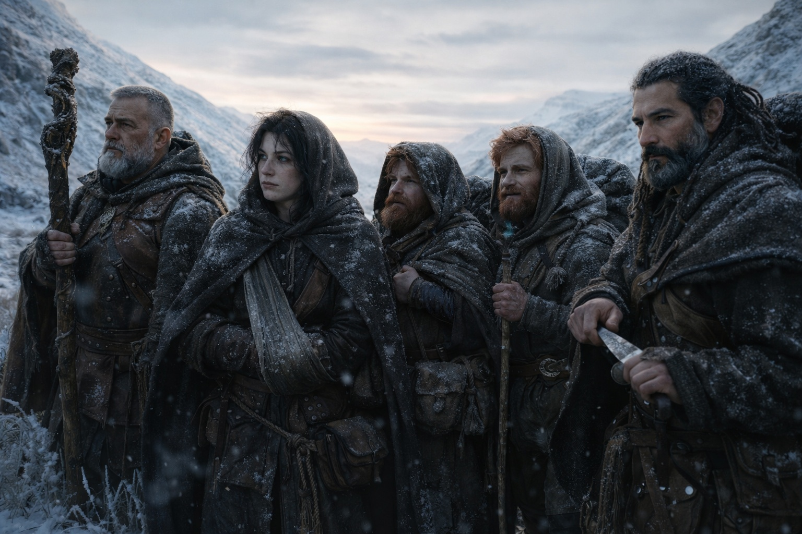

## Capítulo 35 | Parte 1 | La Alineación

---

Xandor extendió los fragmentos sobre una piedra plana y sujetó las esquinas con guijarros del río.

Aldric había elegido la hondonada porque permitía vigilar los alrededores. Balin había aceptado porque era el primer terreno llano que encontraban en seis horas. Maris se sentó junto a Xandor e intentó ignorar el tirón en el pecho.

Los fragmentos eran todo lo que habían reunido desde Zuraldi. Retazos de texto que Xandor había copiado de tres bibliotecas de templos diferentes antes de que los caminos se deterioraran. Los relatos de las visiones de Maris, dictados a Balin por las mañanas cuando los detalles aún eran nítidos, escritos con su letra cuidadosa en papel que no podían permitirse desperdiciar. El registro de comportamiento del Faro, que era la memoria de Dulint, porque a nadie se le había ocurrido llevar registros hasta que Aldric lo sugirió dos semanas demasiado tarde.

—Aquí. —Xandor tocó una página amarillenta—. El Pacto Quebrado. Fragmento nueve. «Cuando la membrana se debilita, el sistema busca un portador. No un héroe. No un instrumento elegido. Una frecuencia compatible. Doble afinidad. Aire y agua, los elementos de unión». —El bastón estaba apoyado en la roca. Maris no lo había oído hablar con una planta en tres días.

—Ya nos lo has leído —dijo Aldric, pasando la piedra por el filo.

—Así es. Pero antes no tenía esto. —Xandor colocó una segunda página junto a la primera. Su letra, más pequeña que la de Balin, apretada con la urgencia de alguien que transcribe con poca luz—. El fragmento del Ateneo. Recuperado del monasterio de Frostgard, el que se incendió. Traducción parcial: «El mecanismo requiere interfaz. Interfaz viviente. La barrera no puede renovarse a sí misma. No fue construida para eso. Requiere un cuerpo que porte ambas afinidades elementales en concentración suficiente para servir como conducto entre el componente del Nexo y la frecuencia central de la barrera.»

Silencio.

El viento recorrió la depresión. El Faro zumbaba dentro de su envoltorio en el fardo de Dulint, constante, direccional, apuntando al noreste.

—Un conducto —dijo Dulint. Miró hacia su mochila.

—Un conducto vivo, si la traducción es correcta. Pero esta palabra podría significar componente o armazón. —Xandor señaló la línea dudosa—. Dulint lleva el chasis. El otro portador tiene Borrar. Este texto no nos dice qué más necesitan.

La fosa nasal izquierda de Maris palpitaba alrededor de la tira de tela que se había colocado esa mañana. El zumbido había aumentado mientras caminaban. No sabía cuánto se debía a que ellos se acercaban y cuánto a que lo hacía él.

—Ahora combínenlo con lo que ella ha visto. —La voz de Xandor cambió. Más baja. El tono que usaba cuando estaba a punto de decir algo que había estado conteniendo—. Maris. Las visiones. El hombre que ves.

—Elfo oscuro. Un artefacto bajo la camisa. Cristales al cinturón. —Maris mantuvo la vista en la página—. Avanza por el bosque muerto. Hay algo más dentro de él. Ella lo siente, pero no puede identificarlo.

—¿Y las afinidades? ¿Aire y agua? —preguntó Xandor.

—Ella no sabe cuáles son sus afinidades.

—Entonces esa parte sigue sin confirmar. —Xandor alisó la página—. Un portador con un artefacto, atraído hacia la barrera. Basta para compararlo con los fragmentos. No para estar seguros.

El zumbido del Faro aumentó. Maris se pasó un dedo bajo la nariz y encontró sangre fresca.

—También está el momento. —Xandor comprobó otro fragmento—. Estos registros describen un intervalo de renovación que se repite tras siglos. Un periodo en el que el contacto se vuelve posible.

—¿Pero? —Aldric dejó de afilar.

—Los cambios que estamos registrando son más rápidos de lo que indican los textos. Algo podría estar forzando la apertura. Desde el otro lado.

—¿Qué tipo de algo? —preguntó Balin.

Xandor no tenía respuesta. Maris miró al nordeste, con la palma contra el dolor del pecho.

—Si alguien actúa antes de que se abra el intervalo, estos fragmentos predicen una brecha. —Xandor mantuvo las manos sobre la página—. El cambio de señal podría ser nuestro único aviso.

Maris se sostuvo el paño manchado bajo la nariz. Había aprendido a notar los cambios del zumbido por el dolor. Aún no sabía interpretarlos.

Pasó la mirada de un fragmento al siguiente.

Una brecha. Si Xandor tenía razón, llegar a la barrera podía ser peor que no alcanzarla.

—¿Cuánto tiempo? —preguntó Dulint.

Xandor volvió a revisar las copias. Una terminaba a mitad de una frase.

—No lo sé. Días. Semanas. La aceleración hace que la predicción no sea fiable. —Hizo una pausa—. Pero es pronto. Los fragmentos describen lo que sucede cuando la ventana se abre en el punto equivocado del ciclo. «Brecha, no renovación. Apertura, no sellado. Todo lo que la barrera contiene se vuelve breve y catastróficamente visible.»

Brevemente. Catastróficamente.

Maris cerró los ojos. Podía encontrar al portador a través del Faro, pagando un precio. No había encontrado ninguna forma de hacerse oír por él.

Abrió los ojos. El horizonte noreste estaba despejado. El Faro zumbaba.

—Necesitamos movernos más rápido —dijo.

Nadie discrepó.

---

**Fin del Capítulo 35.1 —> 35.2: [El Mapa Que Sangra: Los Nombres](/el-mapa-que-sangra-los-nombres/)**
