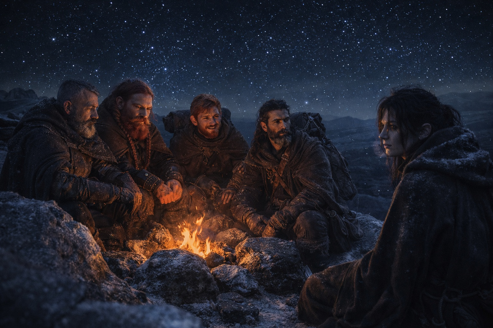
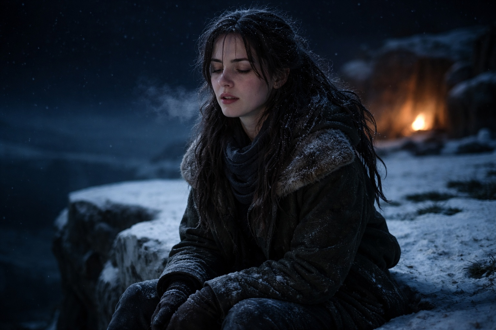
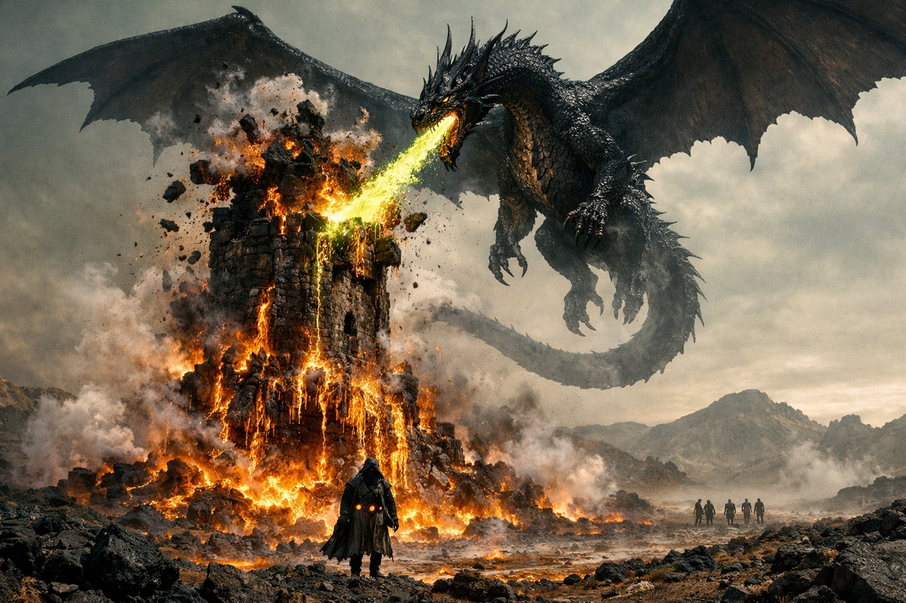
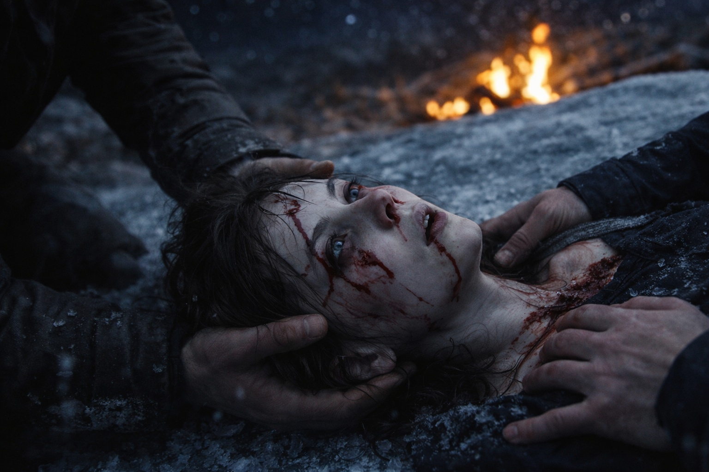
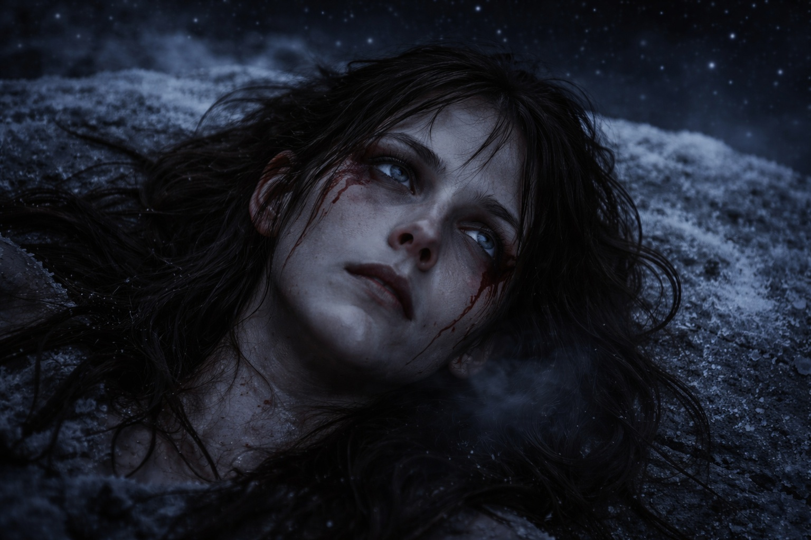

# Capítulo 35.3 | El Mapa Que Sangra: La Visión

Alcanzó el otro lado en la cuarta noche porque el Faro no la dejaba dormir.

El zumbido había cambiado. No más fuerte. Diferente. Un cambio de frecuencia que se asentaba detrás de su ojo izquierdo y pulsaba al ritmo de su corazón, un ritmo que no tenía nada que ver con su cuerpo y todo que ver con lo que estuviera ocurriendo al otro lado de la barrera. El cambio comenzó al anochecer y escaló a lo largo de las horas de la noche como una marea que entra, constante y paciente e imparable.

Habían acampado en una meseta rocosa. Aldric había elegido el sitio por la elevación. Balin había encendido un pequeño fuego en una depresión entre rocas, protegido del viento y de las capas grises que seguían en algún lugar al sur, aún pacientes, aún irrelevantes. Dulint estaba sentado contra su mochila con el Faro envuelto y zumbando a su espalda. Xandor se había quedado dormido sentado erguido, con el bastón sobre las rodillas, respirando de esa manera en que los hombres viejos respiran cuando sus cuerpos anulan a sus mentes.

Maris se sentó en el borde de la meseta y miró al noreste y sintió la frecuencia escalar.

No lo anunció. Balin habría intentado detenerla, con sus ojos avellana y sus manos cuidadosas y su creencia de que su cuerpo importaba más que lo que este podía ver. Aldric lo habría registrado. Dulint habría observado.

Cerró los ojos y se extendió.

La barrera la encontró a medio camino. Se había estado adelgazando durante días, la membrana entre este lado y el otro volviéndose translúcida a la frecuencia del Faro, y cuando la atravesó ahora la resistencia era menos de la mitad de lo que había sido la primera vez que lo intentó. Se deslizó como una mano a través de gasa y la visión se abrió.

Piedra. Piedra negra. Una torre construida con ella, antigua y funcional, alzándose desde un paisaje de cordilleras volcánicas y bosque muerto. Había visto fragmentos de este lugar antes, a través de la estática, a través del costo. Ahora lo veía entero. La torre se erguía al borde de algo, un límite dentro de un límite, un lugar donde el paisaje ya perturbado se volvía más perturbado aún. El aire alrededor sabía a ozono y cobre y a la particular rancidez de un entorno donde nada se había descompuesto en siglos porque nada vivo quedaba para iniciar el proceso.

Él estaba dentro. El elfo oscuro. Lo sintió antes de verlo, su frecuencia resonando a través de la piedra de la torre como un diapasón presionado contra una mesa. Tenía miedo. No el miedo difuso que había sentido antes, el zumbido de fondo de alguien que había tenido miedo durante tanto tiempo que el miedo se había convertido en arquitectura. Este era agudo. Inmediato. Algo había cambiado.

Tres figuras con él. Las dos pequeñas grises, cerca, vigilantes. Y alguien más. Alguien alto y con armadura que irradiaba una frecuencia que el Faro no podía leer, un vacío donde debería haber habido una señal. Esta figura se mantenía a distancia de los demás, y la distancia era deliberada, y la deliberación tenía una cualidad que Maris no podía nombrar pero sí sentir: la cualidad de alguien que ya había decidido algo que todos los demás aún estaban debatiendo.

Entonces el fuego.

Vino de arriba. No del interior de la torre. Del cielo. De algo en el cielo, algo masivo que la visión no podía resolver en claridad porque su frecuencia era más antigua que la calibración del Faro, más antigua que la barrera, más antigua que el marco que el Faro usaba para interpretar lo que la mente de Maris recibía. Vio alas. Vio fuego. Vio la piedra de la torre agrietarse a lo largo de líneas de falla que habían existido desde que fue construida, esperando este calor específico, esta fuerza específica.

El elfo oscuro se movía. No corría. Estaba siendo movido. Empujado hacia adelante por la figura con armadura, hacia la barrera, hacia la cosa que la torre había estado protegiendo o conteniendo o señalando, no podía distinguirlo, la distinción entre esas funciones se disolvía en el fuego y el calor y las alas.

FUEGO.

La palabra no fue pensamiento. Fue experiencia. La visión se convirtió en el fuego. Maris estaba dentro de él, no observándolo, su frecuencia enredada con la de él, su cuerpo registrando el calor que el cuerpo de él registraba, su miedo superpuesto al miedo de él, los dos miedos armonizando en un solo acorde que el Faro amplificó hasta que fue lo único en el mundo.

La torre ardía. La piedra se agrietaba. La cosa con alas viró y regresó para una segunda pasada, y en el medio segundo en que cruzó entre el fuego y el cielo Maris la vio con claridad: vasta, escamada, ardiendo desde dentro, antigua de una manera que hacía que la torre pareciera reciente. Se movía por el aire como si el aire le perteneciera. Como si el aire fuera un espacio que había desocupado temporalmente y ahora estaba reclamando.

El elfo oscuro caminaba a través del fuego. No se quemaba. No porque el fuego no pudiera tocarlo. Porque los cristales en su cinturón lo estaban absorbiendo, cuatro puntos negros bebiendo calor y luz y convirtiéndolos en algo que su cuerpo podía sobrevivir. La figura con armadura estaba detrás de él, empujando, dirigiendo, y el vacío donde su señal debería haber estado crecía, llenando el espacio que la torre había ocupado, convirtiéndose en la nueva arquitectura del momento.

Maris gritó.

No en la visión. En el mundo. Su cuerpo gritó porque su cuerpo era lo que pagaba por lo que su mente recibía, y el costo de esta visión era mayor que cualquier costo anterior, era el precio completo de la claridad.

Estaba en el suelo. Piedra bajo su espalda. El cielo sobre ella era el cielo real, estrellas, frío, correcto. Su cuerpo convulsionaba. Sus manos arañaban la roca. Sangre de su nariz, ambas fosas nasales, espesa y rápida. Sangre de su oído izquierdo, tibia, deslizándose por su cuello. Sangre de su oído derecho. Y desde algún lugar que no podía localizar, un calor detrás de sus ojos que se resolvió en humedad, humedad roja, sangre acumulándose en sus párpados inferiores y derramándose por sus sienes.

Dulint estaba sobre ella. Sus manos estaban bajo su cráneo. Su rostro era piedra y pánico en proporciones iguales.

—LA TORRE ESTÁ ARDIENDO —dijo. Las palabras se arrancaron de ella. No voluntarias—. ÉL ESTÁ CAMINANDO A TRAVÉS DE ELLA Y ALGO CON ALAS, ALGO ANTIGUO, VINO DEL CIELO Y LA TORRE YA NO ESTÁ Y LO ESTÁN EMPUJANDO HACIA LA BARRERA Y LA MUJER, LA ALTA, ELLA SABE, ELLA YA DECIDIÓ...

Su cuerpo se contrajo. Su columna se arqueó. Dulint le atrapó la cabeza antes de que golpeara la piedra y Balin estaba allí, con las manos en sus hombros, presionándola hacia abajo, su voz diciendo palabras que ella no podía oír porque la frecuencia del Faro aún gritaba dentro de su cráneo, aún transmitiendo la señal del otro lado, la señal que decía: fuego, alas, adelante, ahora, ahora, ahora.

La convulsión duró ocho segundos. Maris los contó después por los moretones en su lengua donde se la había mordido. Ocho segundos de su cuerpo traduciendo el costo de la visión en movimiento, sus músculos contrayéndose y soltándose en patrones que no tenían nada que ver con su sistema nervioso y todo que ver con la frecuencia de la barrera atravesándola como electricidad a través del agua.

Se quedó quieta. Respiró. Las estrellas estaban sobre ella, frías y distantes e indiferentes.

—Maris. —La voz de Balin. Cerca. Asustada. Sus manos seguían en sus hombros—. Maris, ¿puedes oírme?

—Te oigo.

—No te muevas.

—No me estoy moviendo. —Una pausa. La sangre se secaba en su cara. Se enfriaba en su cuello. Se acumulaba en sus oídos, amortiguando el mundo—. Tampoco me estaba moviendo cuando empezó.

El rostro de Aldric apareció sobre ella. Se había agachado. Sus ojos grises recorrieron su cara, leyendo la sangre, calculando el costo.

—¿Qué tan mal?

—Ella no puede decirlo todavía. —El lenguaje de distancia. Automático. El escudo entre Maris y la cosa que la estaba devorando desde dentro—. Nariz. Ambos oídos. Ojos, ella cree. La convulsión fue nueva.

—Ojos —repitió Aldric. No era una pregunta. Era un dato.

—La torre ya no está. —Maris cerró los ojos. La imagen residual ardía detrás de sus párpados: fuego, alas, piedra agrietándose, el elfo oscuro caminando a través de ella—. Él está solo ahora. La torre ya no está y algo la destruyó y lo están empujando hacia adelante. La mujer con armadura. Ella lo empuja hacia la barrera. Ella ya sabía que esto pasaría. Lo planeó.

—¿Planeó el fuego? —Xandor estaba despierto ahora. Su voz era la voz de un hombre que había sido despertado por gritos e intentaba sonar como si hubiera estado despierto todo el tiempo.

—Planeó algo. No estaba sorprendida. Estaba lista. Cuando la torre ardió, lo movió hacia adelante. No lejos del fuego. A través de él. Hacia la barrera. —Maris abrió los ojos. Las estrellas nadaban. El rostro de Balin era un borrón sobre ella, joven y asustado—. Lo que acaba de pasar allá fue el comienzo de algo. No el final.

Silencio. El viento cruzó la meseta. El fuego en su depresión se había consumido hasta quedar en brasas naranjas que pulsaban como un latido.

—¿Cuándo? —preguntó Dulint.

Maris sacudió la cabeza. El movimiento envió dolor a través de su cráneo en oleadas.

—Ella no lo sabe. La visión no viene con marcas de tiempo. Podría estar pasando ahora. Podría haber pasado ayer. La frecuencia del Faro cambió al anochecer, así que. —Tragó sangre—. Recientemente. Muy recientemente.

Dulint se puso de pie. Miró al noreste. El horizonte estaba oscuro. Estrellas y nada.

—¿Puedes caminar? —preguntó.

—Por la mañana.

—¿Puedes caminar ahora?

Maris yacía sobre la piedra con la sangre secándose en su cara y la imagen residual del fuego detrás de sus ojos y el Faro gritando en su cráneo. Pensó en el elfo oscuro caminando a través de las llamas con cuatro cristales negros bebiendo calor y una mujer con armadura empujándolo hacia adelante y algo con alas incendiando el cielo sobre ellos.

—Dame una hora —dijo.

Nadie discutió. Las manos de Balin permanecieron en sus hombros. Las estrellas giraban sobre ellos en su lento círculo indiferente. El Faro zumbaba, direccional, insistente, apuntando a una torre en llamas que podría ser ya cenizas.

Maris yacía sobre la piedra y sangraba y esperaba a que su cuerpo decidiera si la llevaría o no.

**Fin del subcapítulo — continúa en el Capítulo 35.4**
