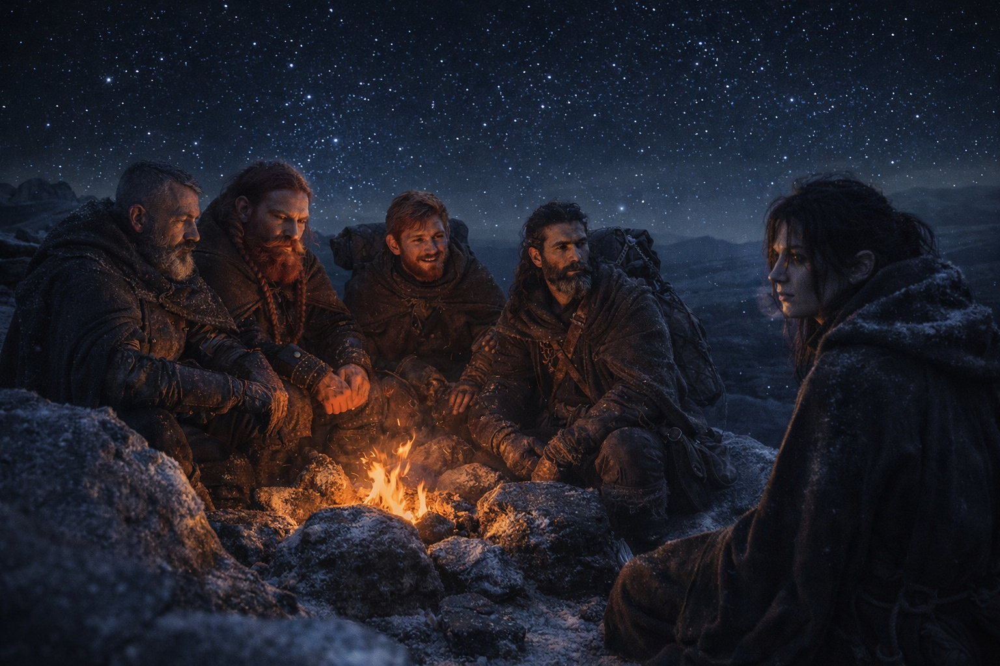
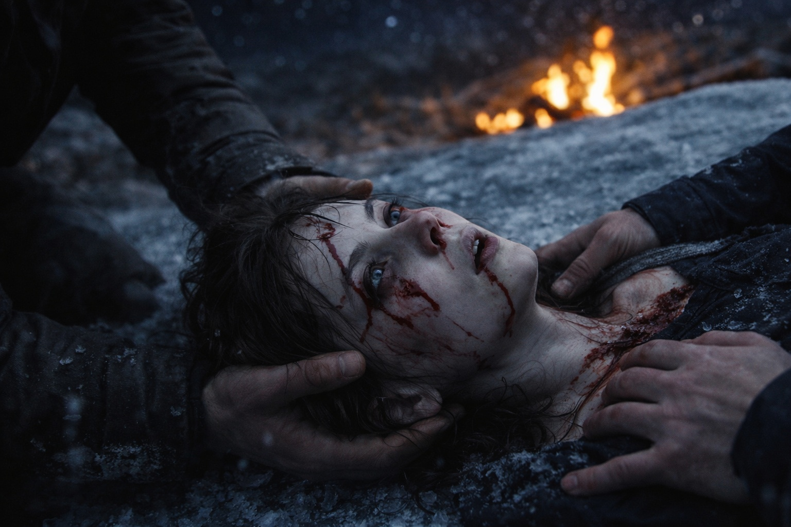
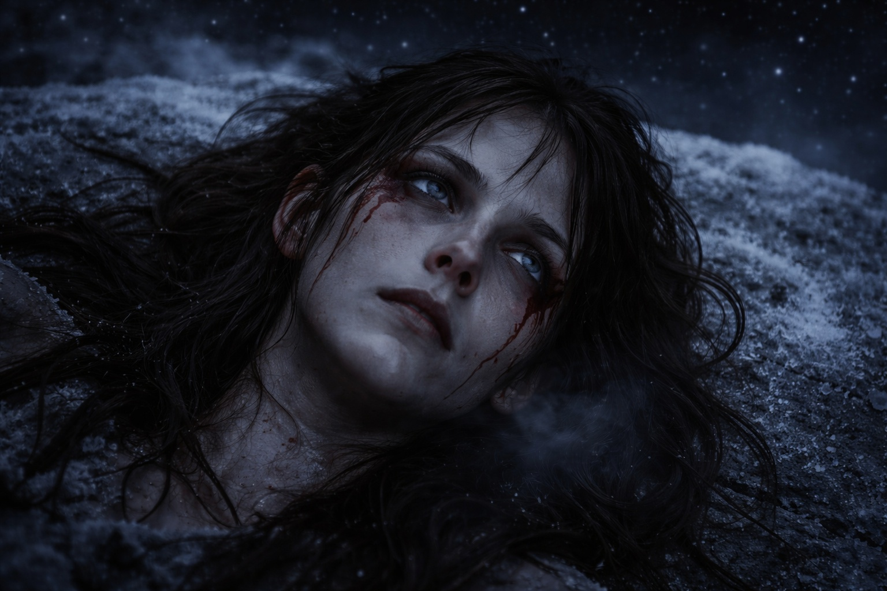

## Capítulo 35 | Parte 3 | La Visión

---

Alcanzó el otro lado en la cuarta noche porque el Faro no la dejaba dormir.

El zumbido había cambiado al atardecer. Al caer la noche, el dolor detrás del ojo izquierdo seguía el ritmo de su latido. Lo sentía incluso cuando Dulint alejaba la mochila.

Aldric había elegido una meseta pedregosa desde la que podía vigilar la ladera sur. Balin resguardó un fuego pequeño entre las rocas. Dulint estaba sentado contra su mochila, con el Faro envuelto a la espalda. Xandor se había dormido con el bastón sobre las rodillas.

Maris se sentó en el borde de la meseta y miró al noreste y sintió la frecuencia escalar.

No le dijo a Balin lo que estaba a punto de hacer. Él aún lavaba la sangre del paño que había usado aquella mañana.

Cerró los ojos y se extendió.

Esta vez encontró menos resistencia. La atravesó antes de que el dolor la obligara a detenerse.

Una torre de piedra negra se alzaba sobre el bosque muerto. Antes había vislumbrado partes de ella. Ahora veía el terreno quebrado de su base y un acceso estrecho entre las crestas.

El elfo oscuro estaba dentro. El miedo la golpeó en cuanto lo encontró. Él miraba más allá de ella, hacia algo que aún no podía ver.

El goblin y el elfo pálido estaban junto a él. Más lejos, una mujer alta, con armadura, los observaba. Maris la veía con claridad, pero no podía sentirla a través del Faro.

Entonces el fuego.

Cayó desde arriba. Unas alas cruzaron el cielo, medio ocultas por el humo. El muro de la torre se agrietó con el calor.

La imagen cambió. La mujer de la armadura empujaba al elfo oscuro hacia delante, lejos del muro roto. Maris intentó ver adónde iban, pero el fuego cubría el camino.

FUEGO.

El calor le golpeó el rostro. Intentó apartarse y no pudo. Seguía sintiendo el miedo de él, mezclado con el suyo.

La figura alada giró sobre la torre. Por un momento distinguió escamas entre el humo. Después volvió hacia el tejado.

El elfo oscuro avanzó a trompicones entre las llamas, con un brazo sobre el rostro. Le ardía la manga. Se agachó y siguió moviéndose, con los cuatro cristales aún al cinturón. Maris lo perdió de vista tras las piedras que caían. No veía cómo podría salir de allí.

Maris gritó.

Alguien la llamó desde la meseta. No pudo responder.

Estaba en el suelo. Piedra bajo su espalda. El cielo sobre ella era el cielo real, estrellas, frío, correcto. Su cuerpo convulsionaba. Sus manos arañaban la roca. Sangre de su nariz, ambas fosas nasales, espesa y rápida. Sangre de su oído izquierdo, tibia, deslizándose por su cuello. Sangre de su oído derecho. Y desde algún lugar que no podía localizar, un calor detrás de sus ojos que se resolvió en humedad, humedad roja, sangre acumulándose en sus párpados inferiores y derramándose por sus sienes.

Dulint se arrodilló sobre ella y le sostuvo la cabeza antes de que volviera a golpear la piedra.

—LA TORRE ESTÁ ARDIENDO. —No podía bajar la voz—. ÉL ESTÁ EN EL FUEGO. ALGO CON ALAS. LA MUJER LO EMPUJA HACIA DELANTE…

Se le arqueó la espalda. Balin apartó las piedras sueltas y dobló una capa bajo su cabeza. Movía los labios, pero ella no podía oírlo por encima del zumbido.

Balin le dijo después que había contado ocho segundos. Ella no recordaba ninguno. Le dolía la lengua donde se la había mordido.

Cuando pudo quedarse quieta, se quedó mirando las estrellas e intentó respirar más despacio.

—Maris. —La voz de Balin. Cerca. Asustada. Sus manos seguían en sus hombros—. Maris, ¿puedes oírme?

—Te oigo.

—No te muevas.

—No me estoy moviendo. —Una pausa. La sangre se secaba en su cara. Se enfriaba en su cuello. Se acumulaba en sus oídos, amortiguando el mundo—. Tampoco me estaba moviendo cuando empezó.

El rostro de Aldric apareció sobre ella. Se había agachado. Sus ojos grises recorrieron su cara, leyendo la sangre, calculando el costo.

—¿Qué tan mal?

—Ella aún no lo sabe. —Maris tragó saliva—. Nariz. Ambos oídos. Los ojos, cree. Las convulsiones son nuevas.

—Los ojos —repitió Aldric. Miró a Balin.

—La torre se derrumbaba. —Maris cerró los ojos—. La mujer seguía empujándolo hacia delante. Él entró en las llamas. Ella no vaciló.

—¿Crees que esperaba el fuego? —preguntó Xandor. Aún estaba incorporándose.

—Seguía llevándolo hacia la barrera. Eso es lo que ella vio. —Maris abrió los ojos. El rostro de Balin se desdibujaba sobre ella—. Lo perdió entre el humo.

El viento barrió la meseta. Balin se acercó para resguardarla.

—¿Cuándo? —preguntó Dulint.

Maris intentó negar con la cabeza y se detuvo por el dolor. —Ella no lo sabe. Podría haber ocurrido. Podría estar por venir. El zumbido cambió al atardecer. Eso es lo único que puede fechar.

Dulint se puso de pie. Miró al noreste. El horizonte estaba oscuro. Estrellas y nada.

—¿Puedes caminar? —preguntó.

—Por la mañana.

—¿Puedes caminar ahora?

Maris se tocó la sangre seca de la mejilla. Cada vez que cerraba los ojos veía la manga ardiendo. Aún no lo había visto escapar.

—Dame una hora —dijo.

Balin se sentó junto a ella con el agua. Dulint permaneció de pie, mirando al nordeste.

Esperó a que las estrellas dejaran de desdibujarse antes de intentar sentarse.

**Fin del Capítulo 35.3 —>  35.4: [El Mapa Que Sangra: El Fuego](/el-mapa-que-sangra-el-fuego/)**
