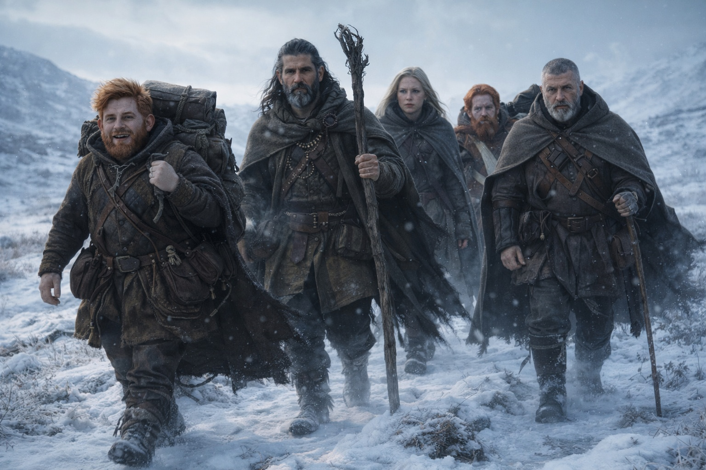
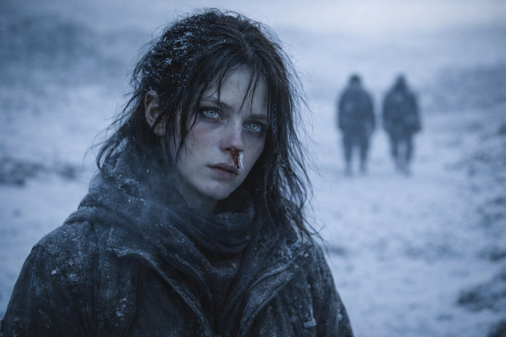
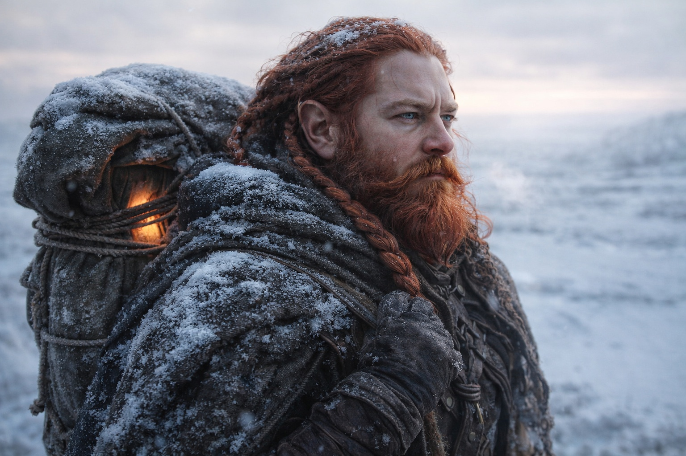

## Capítulo 35 | Parte 2 | Los Nombres

---

El segundo día siguieron caminando hacia el nordeste. Nadie pidió a Xandor que volviera a leer los fragmentos.

Dulint iba delante por el terreno abierto. Comprobaba el tirón del Faro en cada desvío y marcaba el paso sin mirar atrás.

Maris caminaba detrás de Xandor e intentaba ensamblar el rostro.

Recordaba el pelo blanco y la piel gris azulada. Los ojos amarillos, cuando la visión se aclaraba lo suficiente. Distinguía los cristales del cinturón mejor que el rostro.

Había sentido su miedo y lo había visto avanzar hacia la barrera. No sabía quién lo había enviado ni si sabía más del peligro que ellos.

No sabía su nombre.

—Estos fragmentos no lo nombran —dijo Xandor. Sostenía el bastón cruzado ante el cuerpo para equilibrarse—. Describen lo que necesita un portador. No es lo mismo que describir al hombre.

—Entonces tendremos que preguntárselo —dijo Aldric. Vigilaba la cresta donde las capas grises habían aparecido aquella mañana, con la mano izquierda en la espada.

—Ella ve su rostro —dijo Maris—. No reconocería el lugar del que viene. Pero los cristales se ven claros. Cuatro al cinturón. Negros. Puede sentirlos a través del Faro.

—Cuatro cristales negros —repitió Xandor. Dejó de caminar. Su bastón se clavó en el suelo helado—. ¿Estás segura?

—Ella está segura.

—Los textos asocian esos cristales con la adaptación a Wyrmreach. Compatibilidad, no poder añadido. —Xandor volvió a caminar—. Cuatro nos dice cuántos lleva. No cuánto tiempo lleva allí.

Balin ajustó el bastón. —Sabemos lo que lleva y adónde va. Eso es algo.

—Eso sabemos —dijo Dulint sin reducir el paso—. Aún no sabemos quién es.

—¿Importa? —preguntó Balin.

Dulint se recolocó la mochila. El bastón de Xandor tropezó con un surco helado.

—Importa —dijo Maris— porque la profecía no dice que él salve nada.

Todos la miraron. Caminaba con las manos en los bolsillos y la fosa nasal taponada con tela costrosa y oscura y sus ojos pálidos fijos en un punto al noreste que ninguno de ellos podía ver.

—Los fragmentos describen el contacto. No prometen una reparación. —Sacó la mano izquierda del bolsillo, la vio temblar y volvió a guardarla—. Y si el momento es incorrecto…

—Brecha —terminó Xandor.

—Dice que llega —dijo Dulint, deteniéndose—. Dice que la barrera responde. No dice que sobrevivamos a esa respuesta.

El viento tiraba del abrigo de Xandor. Se lo cerró y esperó a que Dulint avanzara.

—Entonces, ¿qué hacemos? —preguntó Balin.

Dulint miró al noreste. Su mandíbula estaba apretada. La mochila con el Faro descansaba contra su columna, zumbando su dirección de una sola nota.

—Llegamos. Rápido. Llegamos a donde sea que la barrera sea más delgada y esperamos el momento en que el mecanismo se active, y hacemos lo que podamos desde este lado. —Empezó a caminar de nuevo—. Quizá eso no sea nada. Quizá nos quedemos en el lado equivocado de un muro y escuchemos cómo se rompe. Pero estaremos allí. Y si hay un momento en que estar a este lado importa, no lo perdemos por habernos quedado tres días atrás.

—Ni siquiera sabemos qué podremos hacer cuando lleguemos —dijo Aldric.

—No —coincidió Dulint—. No lo sabemos.

Siguió caminando y los demás lo siguieron por la larga pendiente. El aire se volvía más húmedo a medida que descendían. Aldric miró atrás en busca de las capas grises.

Maris resistió el tirón. Aún le dolía la cabeza. La próxima vez que intentara ver, quería averiguar algo más que cuánta sangre le costaría.

Caminó hacia el noreste y guardó su sangre para cuando contara.

---

**Fin del Capítulo 35.2 —>  35.3: [El Mapa Que Sangra: La Visión](/el-mapa-que-sangra-la-vision/)**
