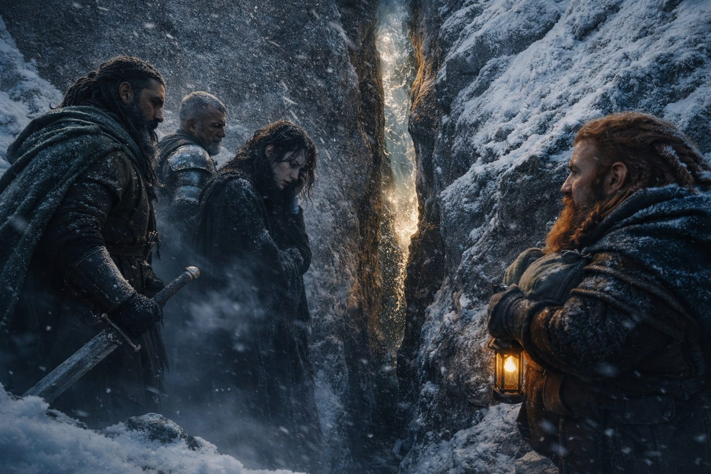
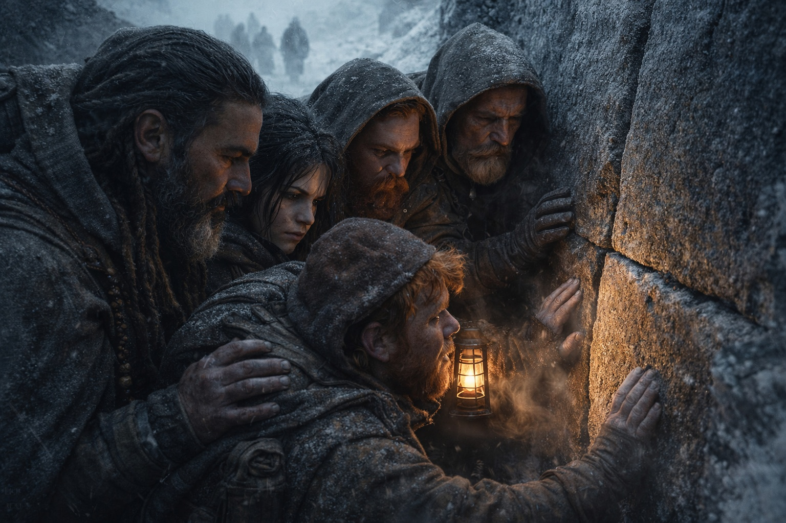
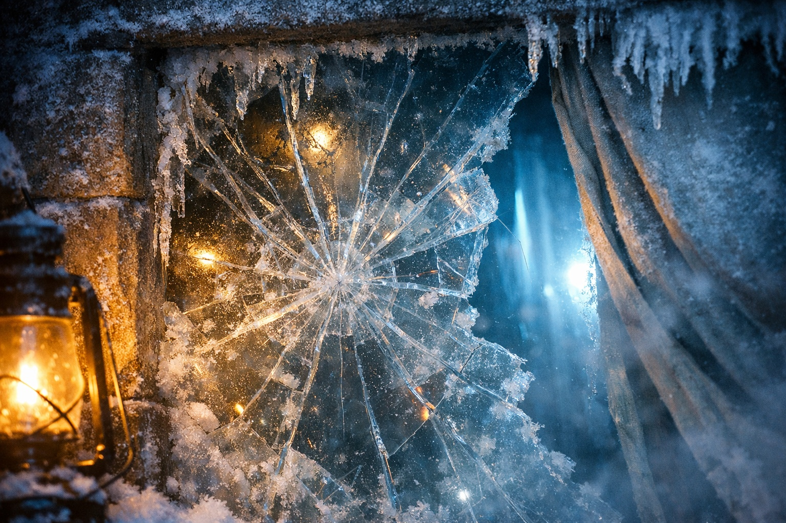
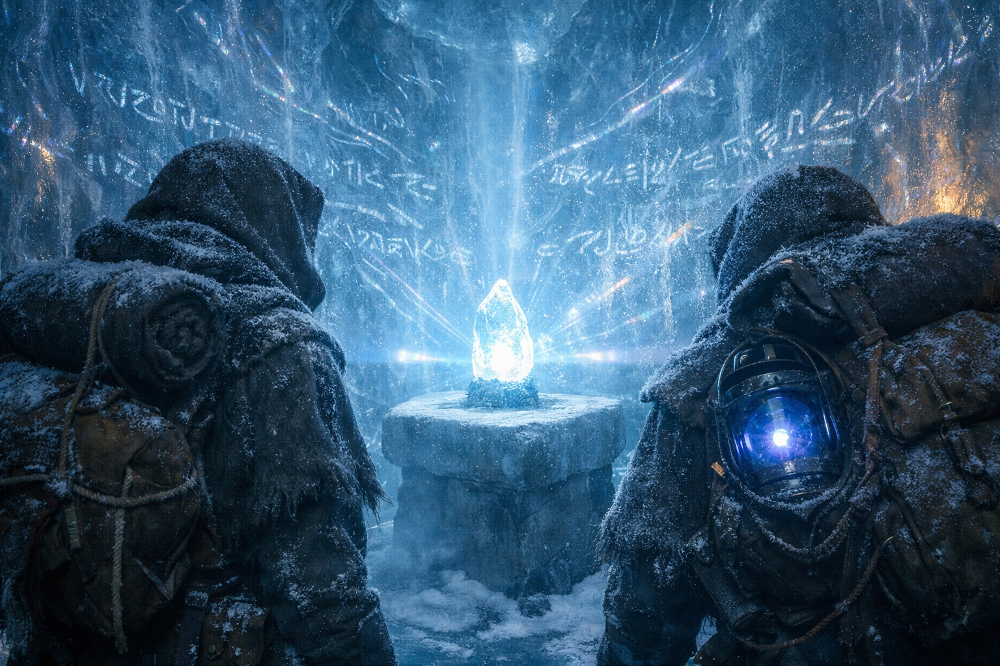

## Capítulo 20 | Parte 2

--- 

Encontraron la cueva al mediodía.

Una cresta había ocultado la fisura hasta que estuvieron casi encima. Partía el granito de arriba abajo y tenía poco más de un metro de ancho. De ella salía aire frío con el olor mineral del hielo profundo.

—Construcción pre-reino —dijo Xandor, pasando los dedos por el borde de la fisura. Su voz se había vuelto callada, reverente—. Mira la cantería. ¿Ves cómo encaja? Sin mortero. Sin marcas de herramientas. Esto fue moldeado, no tallado.

Maris buscó una junta en la piedra que rodeaba la entrada. No encontró ninguna. No había visto nada parecido en los libros de Xandor.

—Frostgard usa hielo-sello en sus sitios sagrados —dijo Eldric, asomándose a la oscuridad del otro lado—. Sellos que solo se derriten para el linaje correcto. Los he visto a lo largo de los pasos del norte.

—Esto no es obra de Frostgard. —Xandor negó con la cabeza—. Los antecede. Lo encontraron, quizá lo usaron, pero no lo construyeron.

—¿Entonces quién lo hizo?

El druida no respondió. Miraba fijamente algo dentro de la entrada que Maris no podía ver desde su ángulo.

—La puerta —dijo Xandor—. Hay una puerta.

Avanzaron en fila india, Eldric primero con la espada desenvainada, luego Dulint con el fardo y una linterna, después Maris, y por último Xandor y Balin cubriendo la retaguardia.

La fisura se abría después de veinte pasos en un túnel lo bastante alto para caminar erguido, sus paredes cubiertas por una capa de hielo tan cristalina que Maris podía ver la piedra debajo.

La puerta estaba empotrada en la pared de hielo al final del túnel. No era una formación natural. Una barrera construida, gruesa como el brazo de un hombre, encajada a la perfección en un marco tallado de la misma piedra sin junturas. Hielo-sello, lo había llamado Eldric. El tipo de cierre hecho para aguantar siglos.

La puerta estaba abierta.

Maris sintió lo incorrecto de ello antes de que nadie hablara. El hielo-sello no se derretía. El hielo-sello no se desbloqueaba. El hielo-sello aguantaba hasta que la persona adecuada pronunciara las palabras adecuadas, y aun así tomaba horas de ritual.

Esa puerta había sido empujada hacia adentro. El hielo alrededor del marco estaba agrietado, astillado, forzado.

—Alguien ha estado aquí —dijo Eldric.

—Alguien *está* aquí —corrigió Maris. Podía verlo a través del hueco: luz moviéndose dentro de la cámara del otro lado. No era luz de linterna, no era luz solar. Algo que se desplazaba y pulsaba con un ritmo que reconocía.

El ritmo del Faro.

Dulint la miró. Bajo la luz de la linterna, su rostro era todo sombras y ángulos afilados.

—¿Cuántos?

Cerró los ojos y buscó el sentido que vivía detrás de sus visiones. La presión floreció de inmediato, dolor conocido, y empujó a través de él. Una presencia. Quizá dos. Difícil de saber porque la señal del fragmento era tan fuerte que ahogaba todo lo demás.

—Uno, creo. Pero el fragmento hace difícil leer. Está gritando.

—¿Gritando?

—No es la palabra correcta. —Se presionó las yemas de los dedos contra los ojos—. Transmitiendo. Como una campana que no deja de sonar.

Eldric se movió hacia la puerta rota y se pegó al marco, buscando ángulo para ver dentro. Se quedó quieto un largo rato. Luego se retiró y su expresión era cuidadosa, controlada.

—Una cámara —dijo en voz baja—. Diez metros de diámetro, quizá más. Paredes de hielo. Y hay algo en el centro, sobre un pedestal de piedra. Brillando. —Hizo una pausa—. No veo a nadie. Pero hay una segunda salida en el lado opuesto. Abierta.

—Podrían haberse ido —dijo Balin.

—O están esperando al otro lado.

—O —dijo Xandor, pasando entre los dos— querían que lo encontráramos.

El viejo druida cruzó la puerta rota antes de que nadie pudiera detenerlo. La luz del interior se avivó, luego se asentó. Maris lo oyó inhalar con brusquedad.

—Venid —dijo—. Todos. Tenéis que ver esto.

Entraron uno a uno.

La roca se veía a través de las paredes de hielo translúcido. Todas las superficies estaban cubiertas de signos que Maris no sabía leer. Cuando volvía a mirar un grupo de marcas, parecían haber cambiado de posición.

El aire era frío pero no helado, cargado con el mismo zumbido profundo que producía el Faro.

Y en el centro, sobre un pedestal de aquella piedra sin junturas del pre-reino, el fragmento esperaba.

Era pequeño. Apenas más grande que el puño de Maris. Pero la luz que proyectaba llenaba toda la cámara, y cuando el Faro en el fardo de Dulint respondió con su propio pulso, las paredes cantaron.

—No lo toquéis —dijo Xandor—. Todavía no. Dejadme que...

El zumbido aumentó dentro de la mochila de Dulint. Aferró la lona, pero la luz la atravesó y se extendió hacia el pedestal.

El fragmento respondió.

Y el mundo de Maris se volvió blanco.

---

**Fin de Capítulo 20.2 —> 20.3: [El Primer Fragmento: El Fragmento](/el-primer-fragmento-el-fragmento/)**
