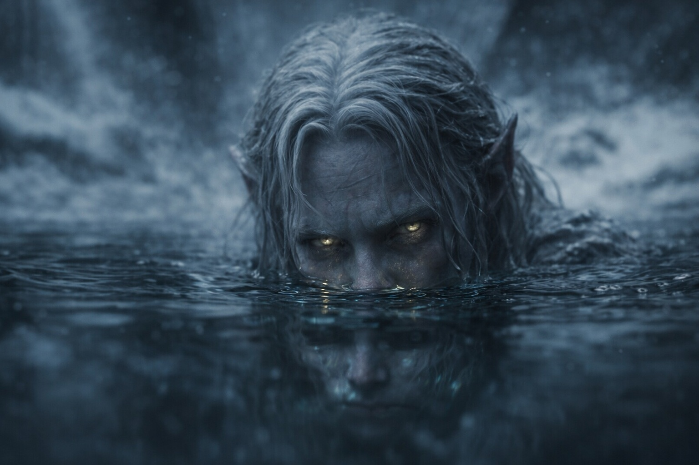
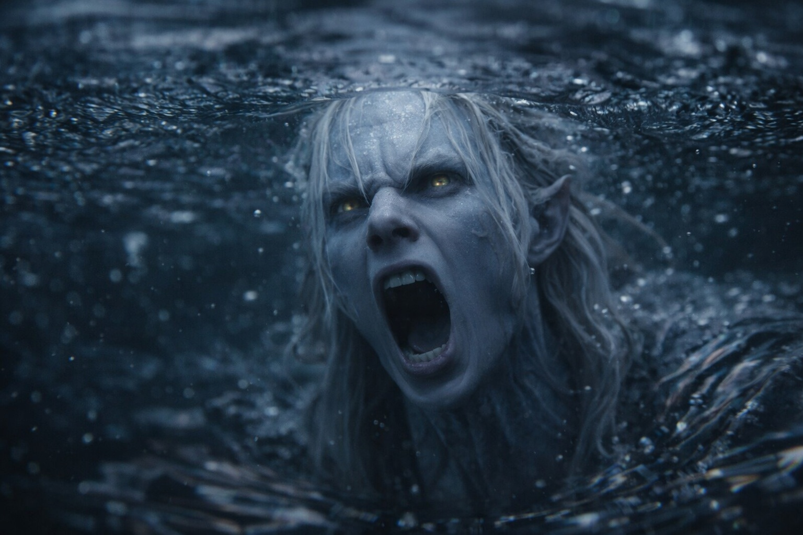

## Capítulo 20 | Parte 4

--- 

La visión llegó esa noche.

Habían puesto distancia entre ellos y la cueva de hielo, moviéndose rápido por un terreno que se volvía más rocoso con cada hora. Eldric los empujó hasta que las piernas de Maris cedieron, y luego los empujó otra legua antes de conceder un descanso en un barranco poco profundo donde el viento no alcanzaba.

Maris apenas sintió el suelo cuando se sentó. La nueva señal del Faro había estado presionando contra el interior de su cráneo todo el día, más fuerte ahora, insistente. Había estado contando los sangrados de nariz. Cuatro desde la cueva. La sangre venía sin aviso, un hilillo tibio que limpiaba antes de que alguien lo notara.

Siempre lo notaban.

—Come algo. —Xandor se acuclilló a su lado, ofreciéndole carne seca de sus provisiones menguantes—. Tu cuerpo está quemando reservas más rápido de lo que debería.

—No tengo hambre.

—Eso no es lo que pregunté.

Tomó la carne. Masticó mecánicamente. Tragó.

El Faro pulsaba en la mochila de Dulint, al otro lado del campamento. Cada pulso le causaba dolor detrás de los ojos. Antes de encontrar el fragmento, a veces conseguía dejar de percibir la señal. Ahora persistía incluso cuando se apartaba.

Se recostó contra la pared del barranco y cerró los ojos.

La visión la atrapó.

Sin preámbulo. Sin destello de advertencia. Un momento estaba en el barranco con roca fría contra la espalda, y al siguiente estaba en otro lugar por completo.

Agua. Agua negra, espesa como aceite, extendiéndose hasta un horizonte que no existía. Flotaba en ella sin hundirse, o quizá era el agua, mirando hacia arriba a través de su superficie hacia un cielo hecho de piedra.

La Imagen Estable llegó.

La imagen que la había perseguido durante semanas se resolvió con una claridad que le cortó el aliento. Un bote pequeño en agua negra. Una mano extendiéndose por el borde, arrastrando los dedos por la superficie. Lo había visto cien veces, siempre fragmentario, siempre disolviéndose antes de que pudiera darle sentido.

Esta vez la imagen se mantuvo.

Ahora podía ver el brazo, largo y delgado, de piel gris azulada. La mano rozaba el agua; sus largos dedos acababan en uñas afiladas.

El brazo conducía a un hombro. El hombro conducía a un rostro.

El rostro tenía la misma piel gris azulada. El pelo blanco se le pegaba a la cabeza, enredado y húmedo de agua o sudor. Con aquella luz escasa, apenas distinguía el amarillo de sus ojos.

El rostro era joven. No el de un niño, pero tampoco el de un hombre. Algo intermedio. Los rasgos eran demasiado afilados para un humano, pómulos cortados en alto, mandíbula estrecha, orejas que terminaban en puntas visibles incluso a través del pelo apelmazado.

La estaba mirando.

La miró a los ojos sin sorpresa.

Su boca se abrió.

La voz se le quebró al pronunciar la primera palabra.

*"Ayúdame."*

Lo oyó con claridad. Entonces terminó la visión.

Volvió gritando.

Balin la sujetaba. Eldric le inmovilizaba las piernas. Xandor le presionaba un trapo contra la nariz, que sangraba en un chorro constante, empapando su camisa, formando un charco en la tierra bajo ella.

—Ha vuelto —dijo Balin—. Maris, ¿me oyes? Estás a salvo. Estás en el barranco. Estás a salvo.

No podía dejar de temblar. Los dientes le castañeteaban tan fuerte que se mordió la lengua. El sabor de la sangre se mezcló con el sabor fantasma del agua negra.

—¿Cuánto tiempo? —susurró.

Balin y Eldric intercambiaron una mirada.

—Dos minutos —dijo Eldric—. Quizá tres. Estabas convulsionando. Espuma en las comisuras de la boca.

Tres minutos. La visión más larga que había tenido jamás. Y la más clara.

Xandor la ayudó a sentarse despacio, sosteniéndole la cabeza, limpiándole la sangre de la barbilla. Sus manos eran firmes, pero sus ojos no.

—¿Qué viste? —preguntó.

—Un rostro. —Le dolía la garganta—. Vi un rostro. Piel gris azulada, pelo blanco, orejas puntiagudas. Ojos amarillos. Estaba en el agua, agua negra, y me miró. Dijo... —Tragó saliva—. Dijo *ayúdame*.

Silencio.

Dulint miró a Xandor. Algo pasó entre ellos, una comunicación que Maris estaba demasiado destrozada para interpretar.

—Un drow —dijo Xandor en voz baja—. Estás describiendo un drow.

—¿Un qué?

—Elfos oscuros. De las civilizaciones de la oscuridad profunda. —La voz del druida era cuidadosa, medida—. Se supone que no existen en la superficie. No en esta parte del mundo. No desde hace siglos.

Maris cerró los ojos. Aún lo veía en el agua, asustado, mirándola de frente.

—Es real —dijo—. Dondequiera que esté, sea lo que sea, es real. Y se le acaba el tiempo.

---

**Fin de Capítulo 20.4 —> 20.5: [El Primer Fragmento: Los Cazadores](/el-primer-fragmento-los-cazadores/)**
