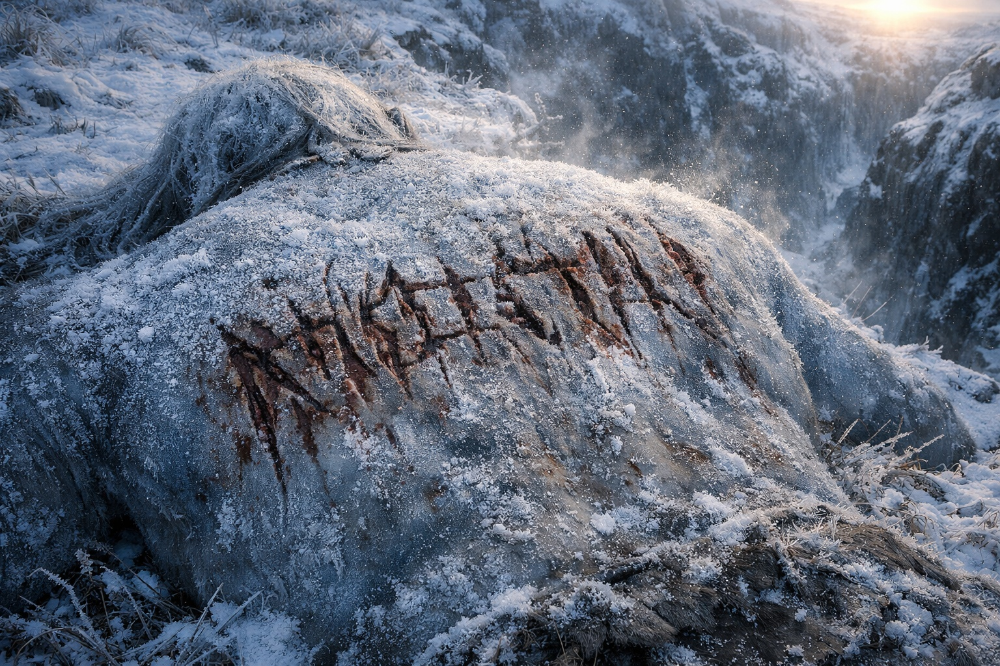
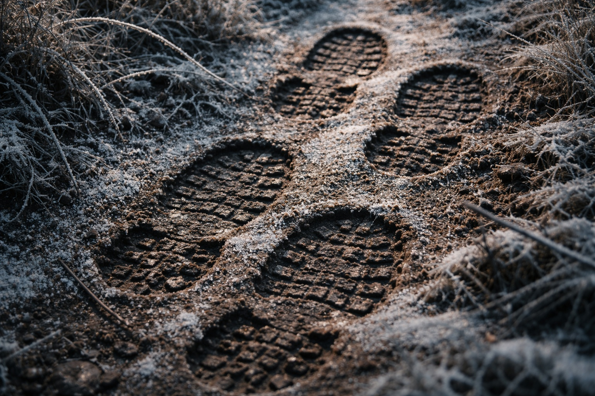
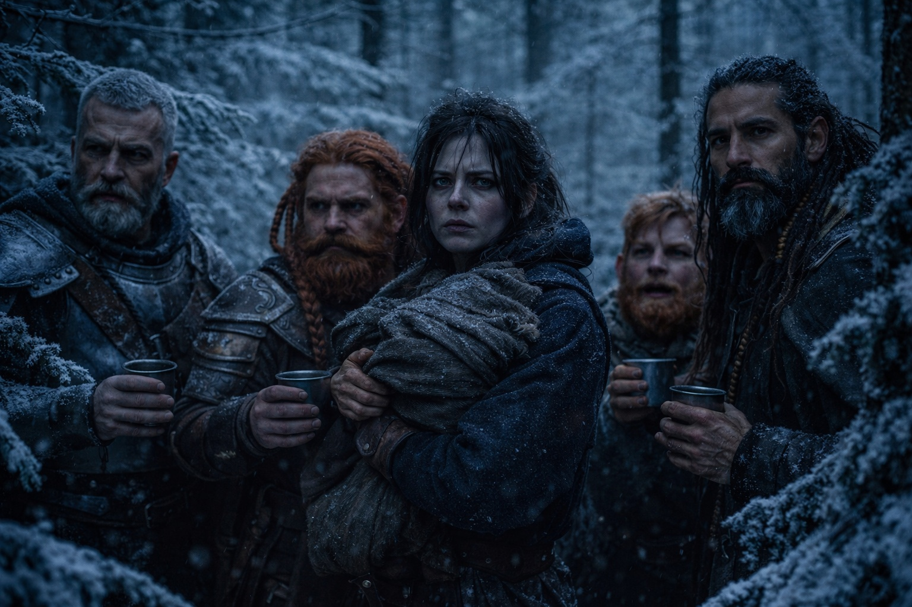
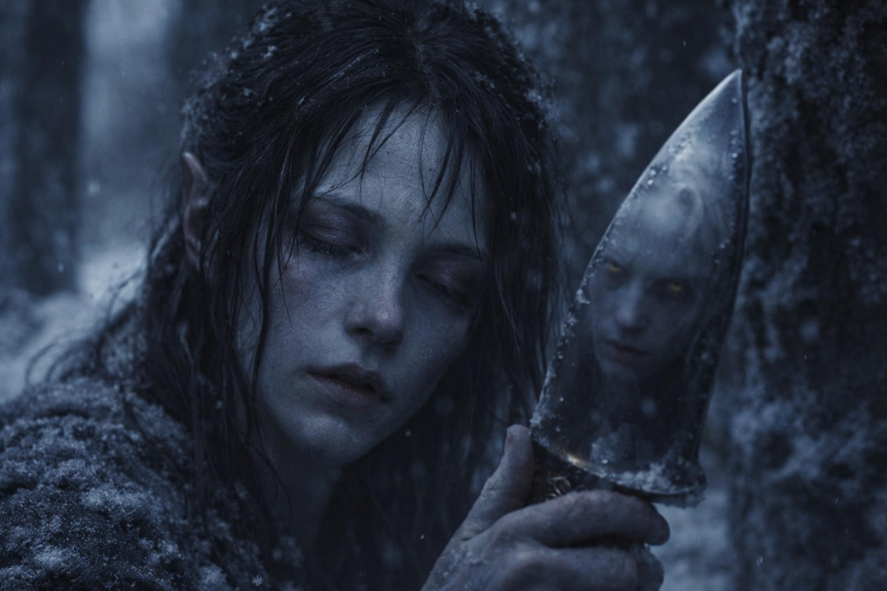

## Capítulo 20 | Parte 5

--- 

Eldric encontró el cuerpo al amanecer.

Había ido a revisar el perímetro, un hábito tan arraigado que lo hacía antes de comer, antes de hablar, antes de reconocer que el sol había salido. Maris lo oyó marcharse y volver. El tiempo entre ambos fue demasiado largo.

—Que nadie se mueva —dijo desde el borde del barranco. Su espada ya estaba desenvainada—. Dulint. Sube. Solo tú.

Los demás esperaron. Maris contó latidos. Treinta y siete antes de que la sombra de Dulint regresara al borde, y aun desde abajo podía ver cómo su postura había cambiado. Más rígida. Más vieja.

—Balin, quédate con Maris y Xandor. —La voz de Dulint llevaba esa planitud particular que usaba cuando necesitaba que todos obedecieran sin preguntas—. No subáis.

Subieron de todos modos.

El Gigante de Hielo yacía a veinte pasos del barranco, boca abajo sobre la hierba cubierta de escarcha. Maris llevaba días sintiendo que alguien los seguía. Había pensado que podía ser uno de los Grukmar que los perseguía desde la emboscada.

Ya nunca atacaría a nadie.

Al gigante lo habían matado con una precisión que hacía parecer torpe la emboscada. Sin cortes desperdiciados. Sin heridas defensivas. Lo que fuera que hubiera hecho esto había golpeado una sola vez, desde atrás, seccionando la espina dorsal en la base del cráneo. El gigante ni siquiera había tenido tiempo de darse la vuelta.

Dulint se quedó mirando la espalda del gigante.

Habían cortado el cuero y la carne para escribir un mensaje. Los trazos eran profundos y regulares; todas las letras se leían con claridad.

DADNOS EL FARO.

Cuatro palabras. Escritura comercial común. Sin dialecto, sin floritura, nada que identificara al autor. Solo una exigencia, inscrita en un cuerpo dejado lo bastante cerca para ser encontrado.

—No es un gigante —dijo Eldric. Estudiaba el suelo alrededor del cuerpo, leyendo huellas del mismo modo en que Maris leía visiones—. Fíjate en las pisadas. Botas, no pies descalzos. Dos pares, ambos del mismo tamaño, ambos con la misma zancada. Entrenamiento militar. Moviéndose en formación incluso aquí fuera.

—Los gigantes no escriben en escritura comercial —añadió Xandor. No había mirado el cuerpo directamente. Observaba la línea de árboles—. Y no envían mensajes. Envían partidas de guerra.

—Entonces, ¿quién? —La voz de Balin estaba tensa. Miraba las letras talladas con la expresión de alguien tratando de entender un idioma que no habla.

—Alguien que quiere el Faro —dijo Maris—. Alguien que sabe que lo tenemos.

—Alguien que nos encontró antes de que nosotros encontráramos el fragmento. —Eldric se agachó junto a las huellas de bota más cercanas y las midió contra su mano—. Estas huellas son viejas. Dos días, quizá tres. Nos han estado observando desde antes de la cueva.

Dulínt guardaba silencio. Permanecía de pie sobre el cuerpo con el fardo apretado contra el pecho, el Faro pulsando dentro, más fuerte ahora, más potente, como si la integración del fragmento hubiera subido el volumen de una señal que ya era demasiado fuerte.

—El fragmento cambió la transmisión —dijo Dulint en voz baja—. La hizo más fuerte. Más amplia. Más... específica. —Miró a Maris—. Lo sentiste. En la cueva. Algo se dio cuenta.

—Algo ya se estaba dando cuenta —dijo Maris—. Esto solo les facilitó encontrarnos.

Eldric se incorporó.

—Nos movemos. Dirección diferente a la que el Faro quiere. Necesitamos distancia, cobertura y un lugar para pensar.

—Al Faro no le va a gustar eso —dijo Dulint.

—El Faro no tiene voto.

Ocultaron sus huellas lo mejor que pudieron y dejaron el cadáver donde estaba. Los dos rastros de botas se dirigían al noroeste. Eldric miró en aquella dirección antes de marcharse.

Se dirigieron al este y entraron en un bosque denso, donde las ramas los obligaron a reducir el paso. Eldric no les dejaba detenerse. Maris miraba al suelo, sorteando las raíces mientras intentaba quitarse de la cabeza el mensaje en la espalda del gigante.

Al mediodía, se detuvieron el tiempo justo para beber agua.

—No son bandidos —dijo Eldric. No se había sentado—. Los bandidos son oportunistas. Esto es un equipo de recuperación. Saben lo que llevamos, saben lo que hace, y lo quieren intacto.

—¿Cómo sabes que lo quieren intacto? —preguntó Balin.

—Porque seguimos vivos. —Eldric escudriñó el dosel sobre ellos—. Un equipo con esta habilidad podría habernos eliminado en cualquier momento. Mataron al gigante para demostrar que podían, y dejaron una nota en vez de una flecha. Eso es contención profesional. Nos están dando la oportunidad de entregarlo.

—¿Y si no lo hacemos?

Eldric no respondió a eso.

Dulint abrió el fardo y miró el Faro. El fragmento descansaba a su lado, ambos pulsando al unísono, y las costuras en la superficie del Faro se habían ensanchado ligeramente desde la cueva. A través de la abertura más grande, Maris vislumbró algo que no parecía metal. Oscuro. Texturado. Húmedo.

Apartó la mirada.

—No podemos entregárselo —dijo Dulint—. No sé qué es. No sé qué quiere. Pero sé que dárselo a personas que tallan mensajes en cuerpos no es la respuesta.

—Entonces necesitamos movernos más rápido que ellos y más lejos de lo que esperan. —Eldric ajustó las correas de su fardo—. Al este, no al norte. Alejarnos del rumbo del Faro, encontrar un lugar defendible, decidir el siguiente paso.

—El Faro apunta al norte —dijo Xandor—. Hacia el siguiente fragmento. Si vamos al este, perdemos el rastro.

—Mejor que perder la vida.

El druida miró a Dulint, que se volvió hacia Maris. Ella bajó la vista. Aún tenía sabor a sangre en la boca.

—La persona de mi visión —dijo—. El drow. Está conectado al Faro. No sé cómo. Pero cada vez que el Faro se hace más fuerte, la visión se vuelve más clara. Si dejamos de buscar los fragmentos, podríamos perder la conexión.

—Y si seguimos buscándolos —dijo Eldric— podríamos perder todo lo demás.

Silencio.

—Un compromiso —dijo Dulint al fin—. Vamos al este por ahora. Ponemos distancia entre nosotros y los cazadores. Pero no abandonamos el rumbo por completo. Hacemos un arco. Este, luego norte, luego oeste para reconectar. —Miró a Eldric—. Más lento, pero vivos.

Eldric lo consideró. Asintió una vez.

Eldric los guio hacia el este por el bosque. Balin se quedó junto a Maris.

Detrás de ellos, el mensaje en la espalda del gigante se secaba al sol.

Dentro de la mochila de Dulint, el Faro seguía apuntando al norte.

---

**Fin de Capítulo 20.5 —> 21.1: [El Jardín Negro: Las Tierras Fronterizas](/el-jardin-negro-las-tierras-fronterizas/)**
