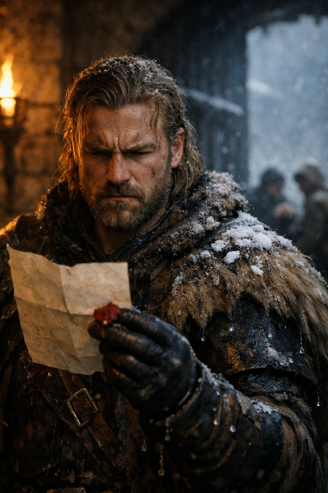
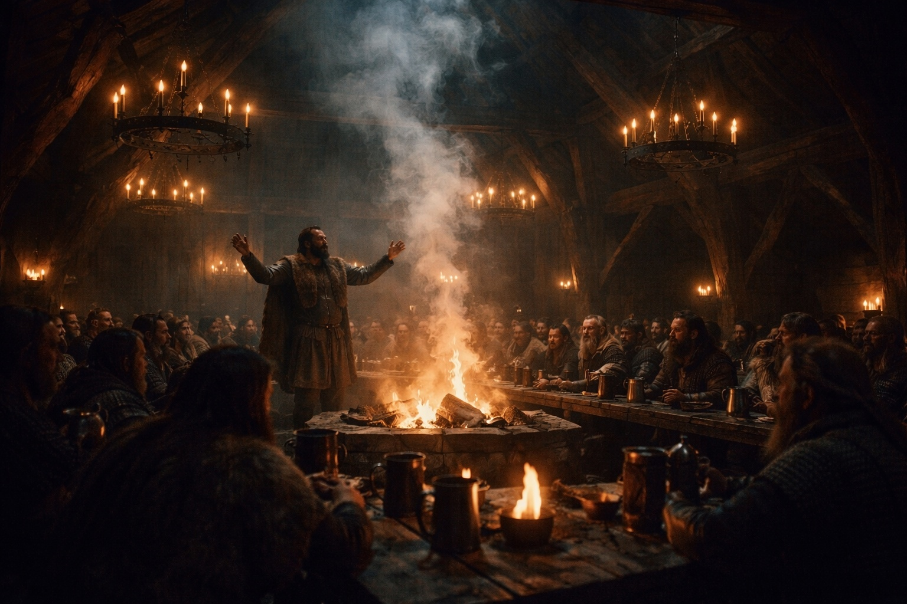
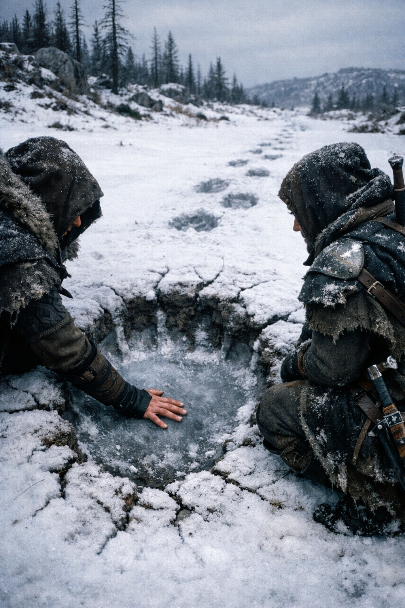

## Lore | Hielo y Hierro: Los Guerreros del Imperio de Frostgard

---

Los labios del mensajero se habían vuelto azules para cuando llegó a las puertas de Jotunheim.

El Guardián Thorvald observó cómo dos soldados cargaban al hombre hacia el interior, sus pieles rígidas por el hielo, su barba una máscara congelada. La bolsa de mensajes aún colgaba de su cinturón. Cualquiera que fuera la noticia que llevaba, había sido lo suficientemente importante como para cabalgar durante una ventisca de tres días.

"De los pasos del sur," dijo uno de los guardias. "Lo encontramos a un cuarto de milla. El caballo murió bajo él."

Thorvald tomó la bolsa. El sello era lumeshireano: el sol dorado que nunca calentaba nada tan al norte. Lo rompió y leyó a la luz de las antorchas.

*Respecto al asunto de los acuerdos comerciales del norte y las consideraciones de defensa mutua...*

Dejó de leer. El lenguaje diplomático de siempre. Las mismas frases que habían enviado la temporada pasada, y la anterior. Peticiones disfrazadas de ofertas. Exigencias vestidas con ropas de amistad.

Dobló la carta y se la entregó a su ayudante.

"Archívala con las demás."

"El Rey Supremo querrá ver..."

"El Rey Supremo ha visto cien cartas como esta." Thorvald observó a los sanadores llevar al mensajero hacia la sala de calor. "Y a cien mensajeros que casi murieron trayéndolas."

En el gran salón, los bardos cantaban sobre los Jotun. Las canciones antiguas, las que afirmaban que los primeros frostgardianos fueron tallados de glaciares, sus corazones duros como el norte helado. Thorvald había escuchado las canciones desde la infancia. Las había creído, una vez.

Ahora observaba a los jóvenes guerreros escuchar con ojos brillantes, y se preguntaba cuántos de ellos sobrevivirían a su primera patrulla real de invierno.

"Los gigantes se movieron otra vez," dijo Ingrid, su segunda al mando. Apareció a su lado con un mapa enrollado. "Tres avistamientos cerca de los Dientes Rotos. Las huellas sugieren al menos dos grupos distintos."

"¿Moviéndose al sur?"

"Moviéndose. Dirección incierta." Extendió el mapa sobre una mesa lateral. "Los exploradores no se ponen de acuerdo. Halvard dice que están migrando. Sven insiste en que se están agrupando."

"¿Y tú qué piensas?"

Ingrid se quedó en silencio un momento. "Creo que los gigantes no nos explican sus movimientos. Observamos. Adivinamos. A veces adivinamos bien."

Thorvald apreciaba su honestidad. Demasiados de los oficiales más jóvenes hablaban con certeza sobre cosas que no podían saber. El norte tenía una forma de castigar la certeza.

---

Una semana después, llegó otro mensajero. Este desde los asentamientos del este. Un pueblo llamado Frosthollow había quedado en silencio. La caravana mensual de suministros había encontrado casas vacías, hogares fríos, ningún cuerpo.

"¿Ventisca?" preguntó Thorvald.

"Sin tormentas importantes en esa región." El mensajero era joven, intentando no mostrar miedo. "Lo más extraño: aún había comida en algunas mesas. Congelada, sólida, pero ahí. Como si todos simplemente... se hubieran ido."

"O fueron llevados."

El mensajero no dijo nada. Algunas cosas eran más fáciles de no nombrar.

Thorvald envió una patrulla. Tres semanas después, solo dos de los seis regresaron. Hablaban de huellas en la nieve, enormes, inhumanas, y de sonidos en la noche que no coincidían con ninguna criatura conocida. Uno de ellos había dejado de hablar por completo para cuando llegaron a Jotunheim.

El informe fue archivado. Oficialmente, Frosthollow fue catalogado como *abandonado por condiciones adversas*. Los hallazgos reales fueron sellados en el archivo del Guardián, donde se unieron a una creciente colección de cosas que no se le contaban al pueblo.

---

> *"Los débiles no sobreviven en Frostgard, solo los fuertes, los astutos y los tenaces."*

Thorvald solía recitar esa frase con orgullo. Ahora sonaba menos a sabiduría y más a excusa. Los fuertes sobrevivían. Pero ¿qué pasaba con los asentamientos que quedaban en silencio? ¿Habían sido débiles, o simplemente desafortunados?

Las canciones nunca mencionaban la suerte.

Esa noche, llegó otra bolsa diplomática de Lumeshire. Esta llevaba un sello diferente: militar, no comercial. Thorvald la leyó dos veces, y luego la quemó.

Algunas ofertas era mejor dejarlas sin respuesta.

La primavera llegaría eventualmente. Los pasos se despejarían. Y entonces descubrirían si la paciencia de Lumeshire tenía límites. Hasta entonces, Frostgard haría lo que siempre había hecho: vigilar la nieve, contar a los desaparecidos, y fingir que las canciones eran ciertas.

El viento aullaba fuera del gran salón. Dentro, los bardos seguían cantando sobre la gloria.

Thorvald se sirvió otra bebida e intentó no contar los asientos vacíos.

**Fin del Lore 2 — continúa en Lore 2: [La Fuerza Indomable de las Tribus Grukmar](/la-fuerza-indomable-de-las-tribus-grukmar/)**
