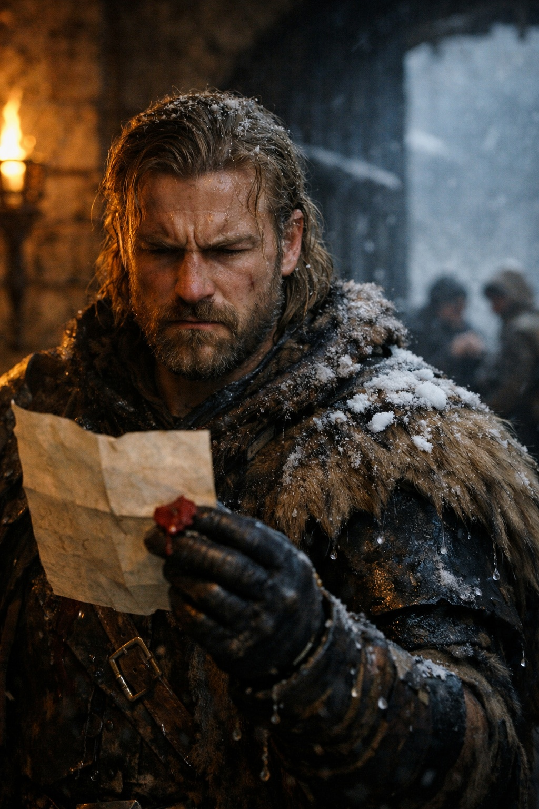
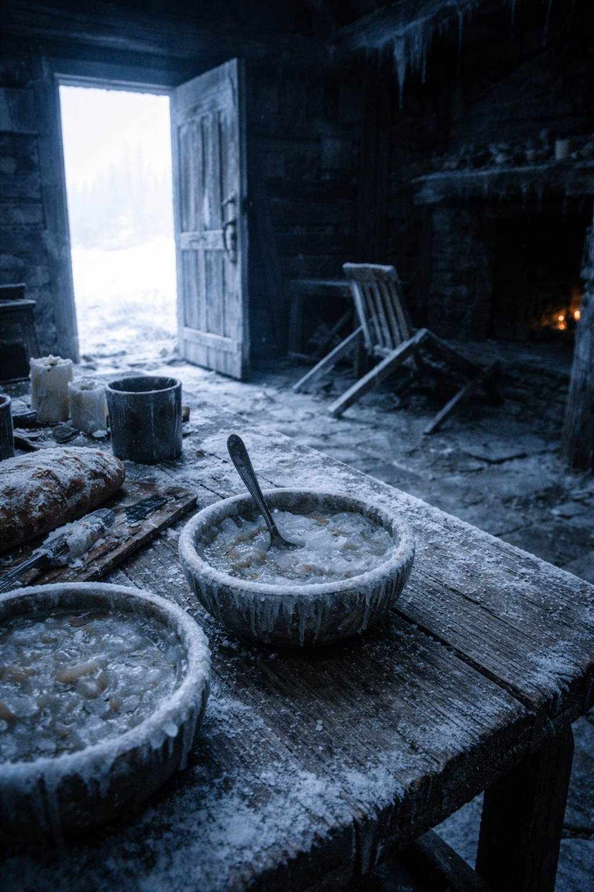

## Lore | Hielo y Hierro: Los Guerreros del Imperio de Frostgard

---

Los labios del mensajero se habían vuelto azules para cuando llegó a las puertas de Jotunheim.

El Guardián Thorvald observó cómo dos soldados cargaban al hombre hacia el interior, sus pieles rígidas por el hielo, su barba una máscara congelada. La bolsa de mensajes aún colgaba de su cinturón. Cualquiera que fuera la noticia que llevaba, había sido lo suficientemente importante como para cabalgar durante una ventisca de tres días.

—De los pasos del sur —dijo uno de los guardias—. Lo encontramos a un cuarto de legua. El caballo murió bajo él.

Thorvald tomó la bolsa. El sello era lumeshireano: el sol dorado que nunca calentaba nada tan al norte. Lo rompió y leyó a la luz de las antorchas.

*Respecto al asunto de los acuerdos comerciales del norte y las consideraciones de defensa mutua...*

Se detuvo en la petición de paso por las puertas del sur. El encabezamiento seguía llamándolo acuerdo de defensa mutua. Cotejó la firma con la última carta: el mismo enviado.

Dobló la carta y se la entregó a su ayudante.

—Archívala con las demás.

—El Rey Supremo querrá verla...

—El Rey Supremo ha visto cien cartas como esta. —Thorvald observó a los sanadores llevar al mensajero a la sala caldeada—. Y a cien mensajeros que casi murieron trayéndolas.

En el gran salón, los skalds cantaban sobre los Jotun. La vieja estrofa decía que los primeros habitantes de Frostgard habían sido tallados en los glaciares. Thorvald recordaba haberla cantado con sus hermanos antes de que ninguno tuviera edad para hacer guardia.

Ahora observaba a los jóvenes guerreros escuchar con ojos brillantes, y se preguntaba cuántos de ellos sobrevivirían a su primera patrulla real de invierno.

—Los gigantes volvieron a moverse —dijo Ingrid, su segunda al mando. Apareció a su lado con un mapa enrollado—. Tres avistamientos cerca de los Dientes Rotos. Las huellas sugieren al menos dos grupos distintos.

—¿Hacia el sur?

—Se mueven. No sabemos hacia dónde. —Extendió el mapa sobre una mesa lateral—. Los exploradores discrepan. Halvard dice que migran. Sven insiste en que se están agrupando.

—¿Y tú qué piensas?

Ingrid tocó dos marcas del mapa. —Halvard vio huellas. Sven vio a los gigantes. Ninguno estaba allí cuando se movieron. Necesito otro avistamiento.

Thorvald apartó la copa del mapa para que ella pudiera comparar las rutas de los exploradores.

---

Una semana después, un mensajero de los asentamientos orientales entró en el salón, dejando caer nieve de la capa. La caravana de suministros había encontrado Frosthollow vacío. Traía una lista de las casas registradas, pero ningún nombre de superviviente.

—¿Una ventisca? —preguntó Thorvald.

—No hubo grandes tormentas en esa región. —El mensajero era joven y trataba de ocultar el miedo—. Lo más extraño es que aún había comida en algunas mesas. Congelada, pero allí. Como si todos se hubieran marchado sin más.

—O se los hubieran llevado.

El mensajero estrujó un guante húmedo entre las manos.

Thorvald envió a seis hombres. Solo dos regresaron tres semanas después. Uno describió huellas enormes más allá de las casas y sonidos que no podía identificar. El otro negó con la cabeza al preguntarle por las huellas; después no quiso decir nada más.

El informe fue archivado. Oficialmente, Frosthollow fue catalogado como *abandonado por condiciones adversas*. Los hallazgos reales fueron sellados en el archivo del Guardián, donde se unieron a una creciente colección de cosas que no se le contaban al pueblo.

---

> *«Frostgard solo conserva a quienes resisten.»*

Thorvald oyó la frase desde su asiento junto al hogar. Había elegido él mismo a los seis hombres. Los seis habían pasado antes otros inviernos en la frontera.

Aquella noche llegó otra bolsa de Lumeshire, con un sello militar. Thorvald leyó la carta dos veces y la sostuvo dentro del hogar hasta que la llama le alcanzó los dedos.

Dejó caer el último trozo entre las brasas. El ayudante aguardaba con una hoja para la respuesta; Thorvald lo despidió con un gesto.

Cuando se despejaran los pasos, podía venir otro enviado a pedir una respuesta. Thorvald dejó la bolsa vacía junto a los informes de Frosthollow. Tampoco tenía respuesta para aquellos.

El viento aullaba fuera del gran salón. Dentro, los bardos seguían cantando sobre la gloria.

Thorvald se sirvió otra bebida e intentó no contar los asientos vacíos.

**Fin del Lore 2 — continúa en Lore 2: [La Fuerza Indomable de las Tribus Grukmar](/choque-de-clanes-el-poder-indomito-de-las-tribus-grukmar/)**
