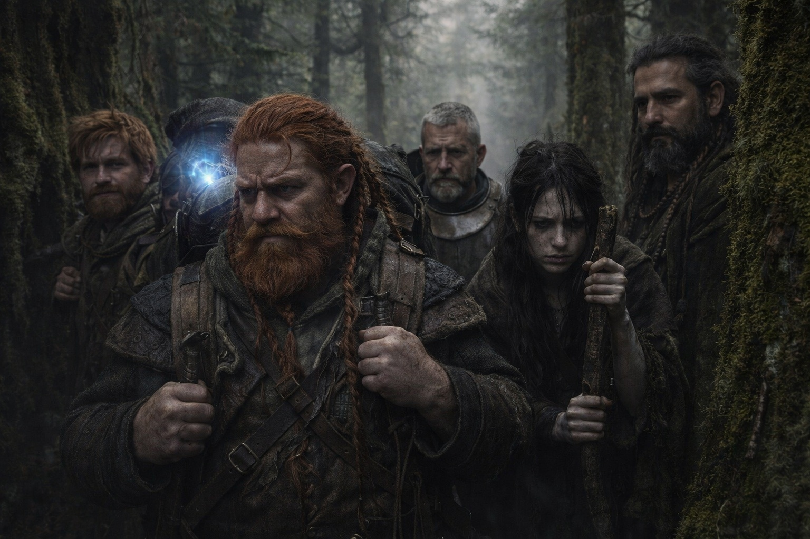
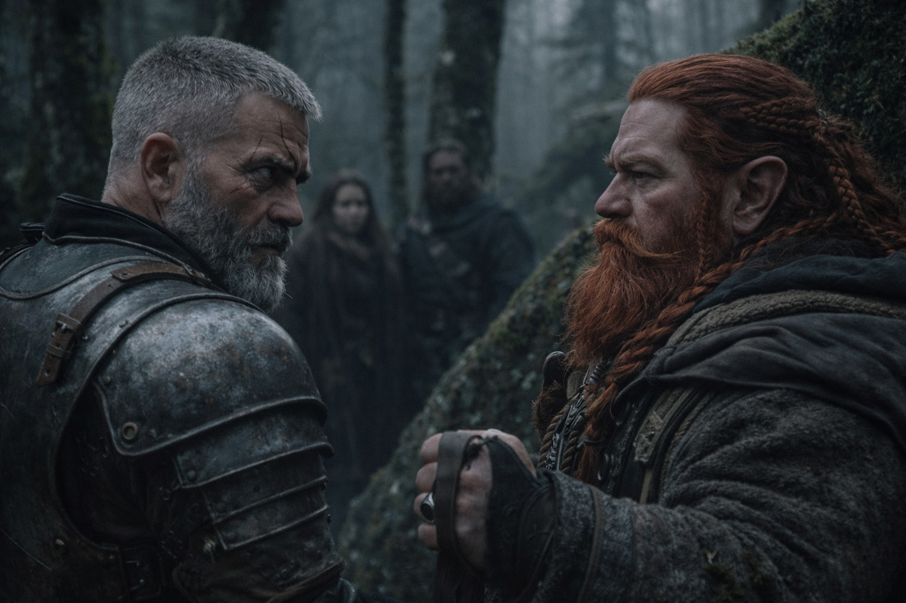
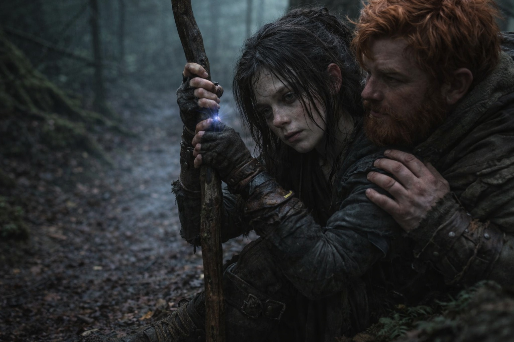
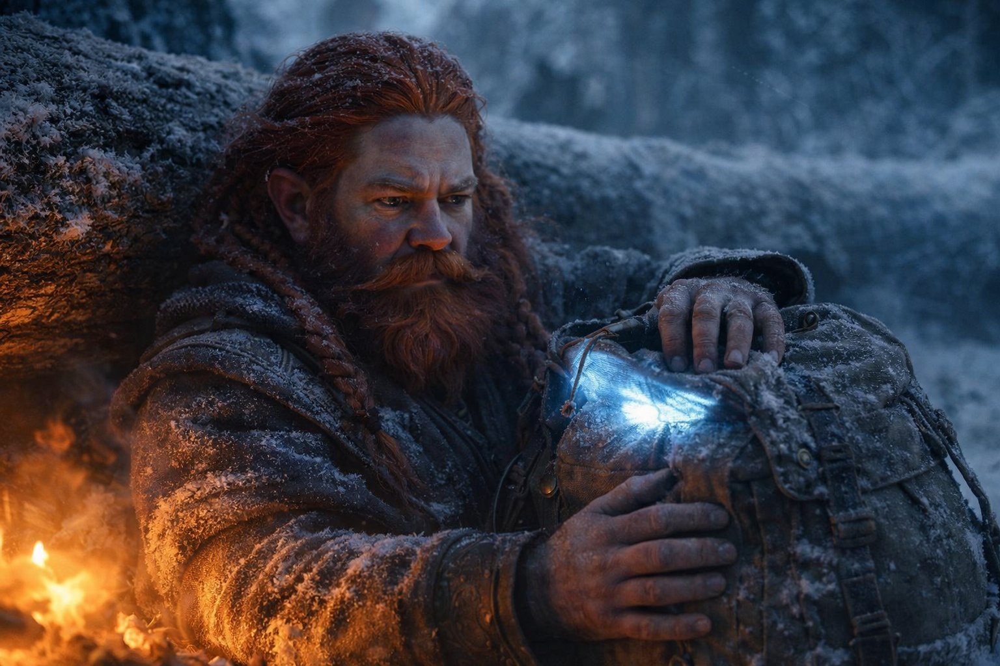

## Capítulo 22 | Parte 1 | La Presión

--- 

Dulint no había dormido bien en seis días.

Desde que encontraron el cadáver, veía el mensaje tallado cada vez que cerraba los ojos: DADNOS EL FARO. No dejaba de recordar lo que le había dicho la vidente antes de partir.

*Fracasarás.*

Llevaba en la mochila el Faro y el fragmento de la cueva de hielo. Todavía no comprendía qué había provocado su unión. Tampoco podía dejar de preguntarse qué decisión acabaría dándole la razón a la vidente.

Avanzaban hacia el este a través de un bosque denso, siguiendo la ruta de compromiso de Eldric que sacrificaba la dirección deseada por el Faro a cambio de cobertura y distancia respecto a los cazadores. El soldado había tenido razón sobre los árboles. Bajo la bóveda vegetal, eran más difíciles de rastrear, más difíciles de avistar, más difíciles de alcanzar. Pero más difícil no significaba imposible, y Dulint podía sentir la persecución como una mano apoyada en su nuca.

—Más despacio —dijo cuando llegaron a una bifurcación en el sendero.

Eldric se volvió.

—¿Qué?

—El desvío izquierdo. Rodea la cresta. Más cobertura.

—Nos añade medio día.

—Nos añade cobertura.

La mandíbula de Eldric se tensó. Esto había estado ocurriendo con más frecuencia durante la última semana. Dulint eligiendo el camino más lento. La opción cautelosa. La ruta que intercambiaba velocidad por seguridad. Cada vez, el argumento era sólido. Cada vez, Eldric cedía. Pero las concesiones se estaban adelgazando.

—El desvío derecho es más rápido y nos lleva a terreno elevado —dijo Eldric—. Terreno elevado significa mejores líneas de visión. Mejores líneas de visión significan que vemos a los cazadores antes de que ellos nos vean a nosotros.

—Terreno elevado también significa siluetas. Seríamos visibles desde cualquier dirección.

—Seríamos visibles y *armados*. Eso es mejor que escondidos y acorralados.

Se detuvieron en la bifurcación y los demás observaban. Maris, pálida y demacrada, apoyada en su bastón como si fuera lo único que la mantenía en pie. Balin mantenía la mano en la espada, mirando alternativamente a su tío y al soldado. Xandor no decía nada y lo veía todo.

—Izquierda —dijo Dulint.

La voz le salió firme. Ojalá hubiera sentido la misma seguridad.

Eldric tomó el desvío izquierdo. No dijo nada. No necesitaba hacerlo. La tensión de sus hombros decía suficiente.

Caminaron sin hablar. El musgo colgaba de las ramas y los árboles crecían tan juntos que Dulint apenas podía ver unos pasos más allá del sendero.

Dulint agarró las correas de la mochila e intentó pensar con claridad.

La vidente había dicho que fracasaría. No *podría* fracasar. *Fracasaría*. La certeza había sido lo peor, peor que cualquier predicción concreta. No "morirás" ni "perderás el artefacto". Solo: *fracasarás*. La condena más completa posible. Sin parámetros. Sin condiciones. Sin escapatoria.

No se lo había contado a nadie.

¿Cómo podría? Decirle a Balin que su tío estaba destinado a arruinarlos. Decirle a Eldric que cada decisión ya estaba comprometida. Decirle a Maris, que estaba siendo literalmente destrozada por las visiones, que la persona responsable de mantenerlos con vida le habían dicho que no podría.

Había estado a punto de contárselo a Balin dos veces. Las dos había encontrado un motivo para esperar.

El compromiso había sido idea suya. Este, luego norte, luego oeste. Un arco que perdería a los cazadores y reconectaría con la dirección del Faro. Era una estrategia sólida. También era una demora. Cada día pasado trazando el arco era un día sin seguir la señal del Faro, y el Faro no entendía de demoras. Pulsaba y señalaba y exigía con la paciencia de algo que sobreviviría a todos los que lo cargaban.

Al atardecer, acamparon en una hondonada donde dos árboles caídos habían creado un refugio natural. Eldric asignó las guardias. Xandor preparó una comida con sus provisiones menguantes. Balin recogió leña, moviéndose por el bosque con la nueva competencia silenciosa que había desarrollado desde la emboscada.

Dulint se sentó con la espalda contra un árbol y la mano en la mochila y observó la luz del Faro filtrarse a través de la lona, pulsando sin pausa.

*Fracasarás.*

¿Cuándo? ¿Cómo? ¿Fracasar en entregar el artefacto? ¿Fracasar en mantenerlos con vida? ¿Fracasar en ser el líder que necesitaban?

La vidente no le había dicho nada que le permitiera prepararse. Se lo reprochaba a ella, y se reprochaba a sí mismo seguir intentándolo.

—Tío. —Balin se acuclilló junto a él, ofreciéndole un vaso de agua—. Necesitas beber.

—Estoy bien.

—No estás bien. No has estado bien desde Stonehold, y lo que sea que no nos estás contando, te está devorando por dentro. —La voz de su sobrino era suave. No acusatoria. Todavía no—. Podemos verlo. Todos nosotros.

—No hay nada que contar.

Dulint bebió para no tener que mirar a su sobrino a los ojos.

---

**Fin de Capítulo 22.1 —> 22.2: [La Fractura: El Desafío](/la-fractura-el-desafio/)**
