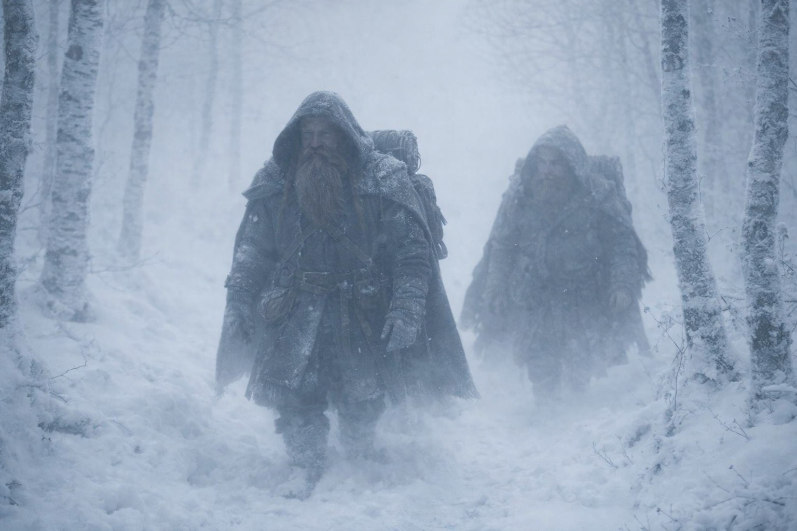
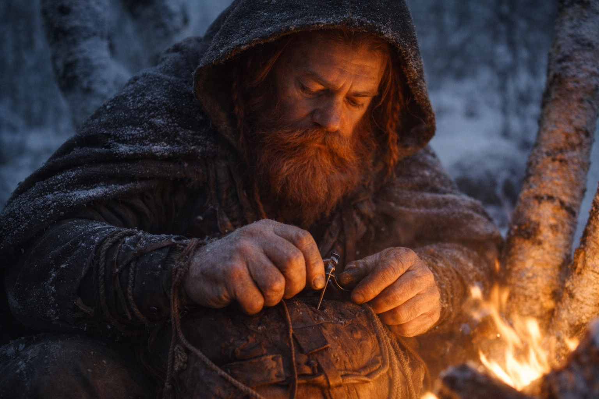

# Capítulo 26.4 | La Grieta: El Casi

Tenía las palabras. Las había estado cargando durante dos días, pulidas como piedras de río en sus bolsillos.

*Encontré la nota.*

Cuatro sílabas. Simple. Limpia. El tipo de oración que cae como un martillo sobre un yunque y resuena hasta que la forja queda en silencio. La había ensayado mientras caminaba detrás de su tío a través de los corredores de pinos helados, había ajustado el ritmo a sus pasos, calculado la respiración que vendría antes y el silencio que seguiría después. Sabía exactamente cómo se tensarían los hombros de Dulint. Sabía que el viejo enano dejaría de caminar. Sabía que la barba se movería antes que la boca, ese espasmo muscular de la mandíbula que precedía cada palabra difícil que Dulint había pronunciado jamás.

*La que dice que muero.*

Lo diría con calma. Sin temblor. Lo había decidido tres cruces de río atrás, mientras su tío los guiaba por aguas a la altura de la espinilla cuando el puente estaba ahí mismo, visible, sólido, burlándose de los dos. Lo diría como Eldric reportaba las bajas. Nombres, números, sin adornos. Que los hechos carguen el peso.

La mañana no era la adecuada para eso.

La niebla había subido de un barranco durante la noche y se había posado en los árboles como gasa empacada en una herida. El mundo se había reducido a veinte pasos en todas direcciones, los pinos apareciendo y disolviéndose en los bordes de la visibilidad, sus troncos columnas oscuras en una catedral gris. El sonido viajaba de manera extraña. Balin podía escuchar el murmullo de Xandor desde cincuenta metros atrás, el viejo druida dirigiéndose al musgo de un tronco caído con la formalidad paciente de un diplomático. Maris caminaba entre Eldric y Dulint, erguida hoy, aunque sus pasos tenían la precisión mecánica de alguien que contaba cada uno para no caer.

Dulint se detuvo en una bifurcación del sendero.

La izquierda subía, hacia la niebla. La derecha descendía por un barranco donde los árboles se aclaraban y el suelo se nivelaba. Balin observó a su tío estudiar ambas opciones. Observó cómo la mano del viejo enano subió para frotarse la nuca, el gesto que siempre precedía una mala decisión disfrazada de razonable.

Dieciocho.

—A la izquierda —dijo Dulint.

Balin abrió la boca.

Las palabras estaban ahí, cargadas, listas, posadas en la parte posterior de su lengua como flechas encordadas y tensadas. *Encontré la nota.* Podía sentir la oración presionando contra sus dientes. Su pecho estaba apretado con ella, la presión particular de una verdad que quería salir como el agua quiere pasar por una grieta en una presa.

Dulint se volvió para mirarlo. La niebla se asentó en la barba del viejo enano y la tornó plateada. Sus ojos de mineral de hierro estaban cansados. No el cansancio de caminar. El cansancio que vive detrás de los ojos de la gente que carga fardos que no puede dejar y no puede describir y no puede compartir porque compartirlos haría el fardo real, le daría peso en el cuerpo de otro, y eso era peor que cargarlo solo.

Balin había visto ese cansancio antes. En la cara de su madre, el año que la mina se derrumbó y se llevó a cuatro de los suyos. En las caras de las viudas en Stonehold que sonreían en el mercado porque la alternativa era responder preguntas sobre la silla vacía en su mesa. Era el cansancio de la gente que se hace daño a sí misma en silencio, metódicamente, porque el daño evitaba que alguien más se quebrara.

Su tío se estaba quebrando.

No de la manera ruidosa. No como se agrietan los muros o se rompen las hachas. De la manera lenta. Como el hierro se oxida cuando lo dejas bajo la lluvia. Día a día, molécula a molécula, la superficie picándose y descamándose mientras el núcleo aún mantiene su forma. Dulint parecía un hombre que había estado bajo la lluvia durante meses y fingía que la descamación no dolía.

—¿Algo que quieras decir, muchacho?

La voz del viejo enano era cuidadosa. Controlada. La voz de un hombre parado sobre hielo delgado que sabe exactamente qué tan delgado es.

*Encontré la nota. La que dice que muero.*

Balin tragó saliva. Las palabras bajaron como grava.

—La izquierda es más empinada —dijo.

Dulint sostuvo su mirada dos latidos más. Tres. Luego los hombros del viejo enano cayeron un poco, y la tensión en su mandíbula se soltó, y el cansancio detrás de sus ojos parpadeó con algo que podría haber sido alivio o podría haber sido decepción, y Balin no podía decir cuál era peor.

—Sí —dijo Dulint—. Pero el barranco estará lleno de barro bajo esa niebla. Nos congelará las botas para el anochecer.

Era una excusa razonable. También era una mentira. Balin asintió y se colocó detrás de su tío, y la niebla los envolvió a ambos.

Caminaron durante una hora sin hablar. El bosque cambió a su alrededor, los pinos cediendo el paso a abedules sin hojas que se erguían como huesos despojados de carne, su corteza blanca pelándose en rizos que atrapaban la niebla y la retenían. Balin contó sus pasos. Perdió la cuenta. Volvió a empezar. Perdió la cuenta de nuevo porque su mente seguía volviendo a la expresión en la cara de su tío cuando sus ojos se habían encontrado.

Alivio. Había sido alivio.

Su tío estaba aliviado de que Balin no hubiera preguntado.

Lo que significaba que la respuesta era peor que la pregunta.

Eldric retrocedió para caminar a su lado. El soldado se movía por la niebla como un hombre que había aprendido a orientarse solo por el sonido, sus pasos colocados con la precisión automática de alguien que había marchado en peores condiciones cargando el doble del peso. No miró a Balin. Observó los árboles.

—Tu tío necesita descanso —dijo Eldric. Bajo, por debajo del amortiguamiento de la niebla.

—No lo tomará.

—No. —La nariz rota de Eldric se contrajo. Su versión de acuerdo—. Pero lo necesita.

Balin quería contarle a Eldric sobre la nota. Sobre los diecisiete retrasos. Sobre la conversación que había escuchado en la oscuridad, su tío discutiendo consigo mismo sobre algo que no podía detenerse. Quería entregar este peso a alguien cuyos hombros estuvieran hechos para cargar, alguien profesional, alguien que lo tomara y lo archivara bajo *inteligencia accionable* y lo manejara como los soldados manejan las cosas.

No dijo nada. La niebla absorbió el silencio y no devolvió nada.

El campamento esa noche fue un hueco entre tres abedules, sus troncos inclinados juntos como conspiradores. Xandor coaxó un pequeño fuego de madera húmeda, hablando a las ramas en un idioma que Balin no entendía, y las ramas prendieron a pesar de la humedad. Maris comió media porción de carne seca y bebió dos tazas de agua y dijo —Estoy bien— cuando Dulint preguntó, con una voz que no convenció a nadie.

Balin se sentó al otro lado del fuego frente a su tío y practicó las palabras en su cabeza.

*Encontré la nota.*

Dulint estaba reparando una correa de su mochila. Sus dedos gruesos trabajaban el cuero con la competencia inconsciente de décadas, ensartando el punzón, jalando el cordón, atando el nudo. Trabajo simple. El tipo de trabajo que mantiene las manos ocupadas mientras la mente se devora a sí misma.

*La que dice que muero.*

El fuego crepitó. Una brasa rodó libre y Dulint la empujó de vuelta con la bota, sin levantar la vista.

*El tiempo suficiente para odiarte por ello. Y amarte de todos modos.*

La oración completa se ensambló en el pecho de Balin, cada palabra en su lugar, cada ritmo calculado, y podía sentir lo correcto de ella, la limpieza, cómo cortaría la niebla y las mentiras y los diecisiete retrasos deliberados y aterrizaría donde necesitaba aterrizar. Podía sentir cómo sabría el silencio después. Cómo cambiaría la cara de su tío.

Abrió la boca.

Dulint levantó la vista de la correa. Y la luz del fuego atrapó su cara en un ángulo que dejó al viejo enano al descubierto, que peló la competencia y la terquedad y las décadas de resistencia de granito, y debajo de todo ello Balin vio a un hombre que estaba aterrorizado. No del bosque. No de lo que esperaba en la grieta. Aterrorizado del sobrino sentado al otro lado del fuego, aterrorizado de las palabras que podía ver formándose en los labios de Balin, aterrorizado de la conversación que haría todo real e irreversible y compartido.

Balin cerró la boca.

—La correa se está desgastando —dijo.

Dulint parpadeó. Miró hacia abajo el cuero entre sus manos. —Sí —dijo, y su voz se quebró en la única sílaba, y aclaró la garganta, y se quebró de nuevo—. Sí, así es.

Se sentaron a la luz del fuego y no dijeron nada que importara, y la niebla se cerró, y en algún lugar al norte la grieta en la barrera esperaba con la paciencia de algo que había estado esperando durante mucho tiempo.

Balin se subió la manta hasta la barbilla y cerró los ojos y ensayó las palabras una vez más. No para esta noche. Para la mañana en que fuera lo suficientemente valiente para decirlas. Para la mañana en que miraría a su tío y diría la verdad y observaría lo que llegara después.

*Encontré la nota. La que dice que muero. El tiempo suficiente para odiarte por ello. Y amarte de todos modos.*

Esta noche no.

Pronto.

---

*Siguiente: La Grieta: El Vínculo Cambiado*

**Fin del Capítulo 26.4 — continúa en el Capítulo 26.5: [La Grieta: El Vínculo Cambiado](/la-grieta-el-vinculo-cambiado/)**
