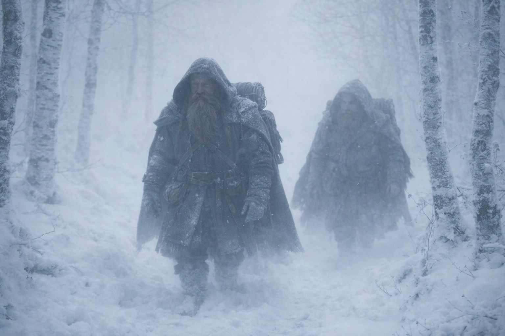
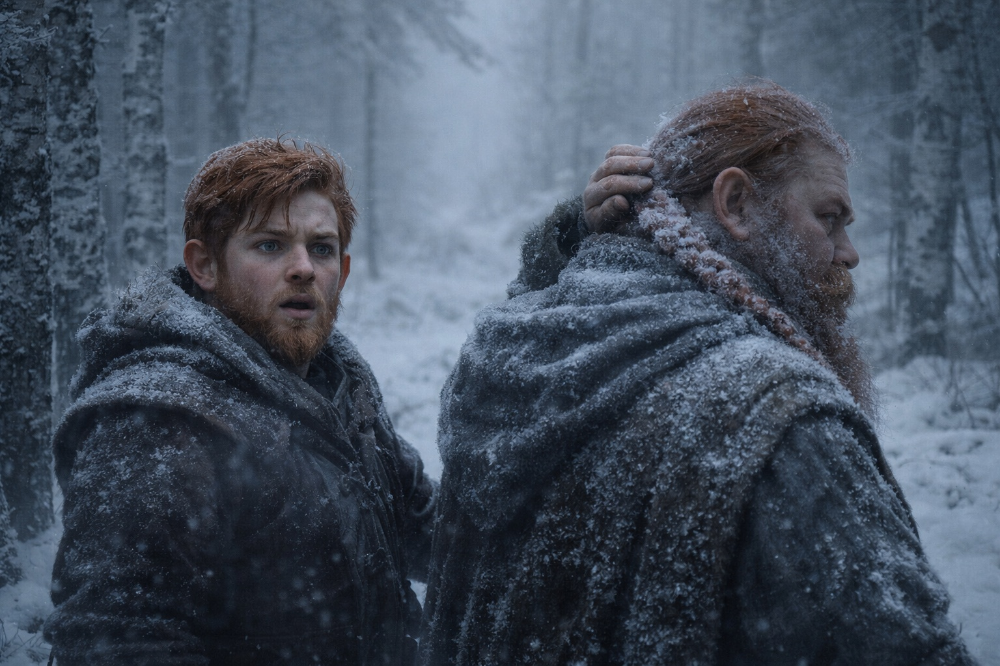
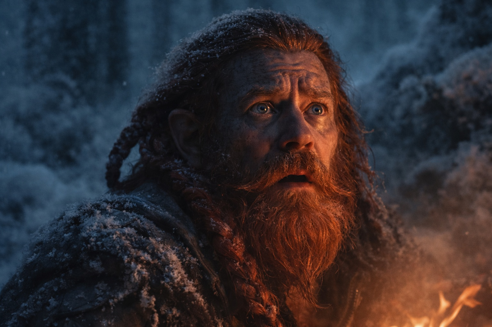

## Capítulo 26 | Parte 4 | El Casi

---

Balin llevaba dos días ensayando las palabras.

*Encontré la nota.*

Sabía que Dulint dejaría de caminar y movería la mandíbula antes de responder. Balin también había ensayado qué hacer durante ese silencio.

*La que dice que muero.*

Lo diría con calma. Sin temblor. Lo había decidido tres cruces de río atrás, mientras su tío los guiaba por aguas a la altura de la espinilla cuando el puente estaba ahí mismo, visible, sólido, burlándose de los dos. Lo diría como Aldric reportaba las bajas. Nombres, números, sin adornos. Que los hechos carguen el peso.

La mañana no era la adecuada para eso.

La niebla no dejaba ver a más de veinte pasos. En algún lugar detrás de ellos, Xandor le hablaba al musgo de un tronco caído. Maris caminaba entre Aldric y Dulint, erguida hoy, pero pendiente de cada paso.

Dulint se detuvo en una bifurcación del sendero.

La izquierda subía, hacia la niebla. La derecha descendía por un barranco donde los árboles se aclaraban y el suelo se nivelaba. Balin observó a su tío estudiar ambas opciones. Observó cómo la mano del viejo enano subió para frotarse la nuca, el gesto que siempre precedía una mala decisión disfrazada de razonable.

Dieciocho.

—A la izquierda —dijo Dulint.

Balin abrió la boca.

*Encontré la nota.* Tomó aire para decirlo.

Dulint se volvió. La humedad se le pegaba a la barba. Parecía que no había dormido.

Balin había visto esa expresión en la cara de su madre después del derrumbe de la mina. Aquel año ella había seguido sonriendo a la gente en el mercado.

Su tío se estaba quebrando.

Seguía comprobando la ruta y cargando con su parte. Luego alguien le hablaba y tardaba demasiado en responder.

—¿Algo que quieras decir, muchacho?

Dulint esperó, atento a su cara.

*Encontré la nota. La que dice que muero.*

Balin tragó saliva.

—La izquierda es más empinada —dijo.

Dulint sostuvo su mirada dos latidos más. Tres. Luego los hombros del viejo enano cayeron un poco, y la tensión en su mandíbula se soltó, y el cansancio detrás de sus ojos parpadeó con algo que podría haber sido alivio o podría haber sido decepción, y Balin no podía decir cuál era peor.

—Sí —dijo Dulint—. Pero el barranco estará lleno de barro bajo esa niebla. Nos congelará las botas para el anochecer.

Era una excusa razonable. También era una mentira. Balin asintió y se colocó detrás de su tío, y la niebla los envolvió a ambos.

Caminaron una hora sin hablar. Los abedules desnudos sustituyeron a los pinos. Balin intentó contar sus pasos, pero seguía pensando en la expresión de su tío.

Alivio. Había sido alivio.

Su tío estaba aliviado de que Balin no hubiera preguntado.

Lo que significaba que la respuesta era peor que la pregunta.

Aldric retrocedió para caminar a su lado. El soldado se movía por la niebla como un hombre que había aprendido a orientarse solo por el sonido, sus pasos colocados con la precisión automática de alguien que había marchado en peores condiciones cargando el doble del peso. No miró a Balin. Observó los árboles.

—Tu tío necesita descanso —dijo Aldric. Bajo, por debajo del amortiguamiento de la niebla.

—No lo tomará.

—No. —La nariz rota de Aldric se contrajo. Su versión de acuerdo—. Pero lo necesita.

Balin quería contarle a Aldric lo de la nota y los retrasos. Que le preguntara él a Dulint. El soldado preguntaría una vez y esperaría hasta obtener respuesta.

Pero Balin lo dejó seguir.

Acamparon entre tres abedules. Xandor habló sobre las ramas húmedas hasta que prendieron y luego se sentó a frotarse la mano temblorosa. Maris comió la mitad de su carne y bebió dos tazas de agua. Cuando Dulint preguntó, dijo que estaba bien.

Balin se sentó al otro lado del fuego frente a su tío y practicó las palabras en su cabeza.

*Encontré la nota.*

Dulint remendaba una correa de la mochila. Sus dedos gruesos pasaban el cordón por los agujeros del punzón.

*La que dice que muero.*

El fuego crepitó. Una brasa rodó libre y Dulint la empujó de vuelta con la bota, sin levantar la vista.

*Te odio por haberlo ocultado. Y aun así te quiero.*

Quería que Dulint lo oyera todo. Incluso lo último.

Abrió la boca.

Dulint alzó la vista. Sus dedos se detuvieron sobre la correa. Tenía miedo, comprendió Balin. Miedo de lo que su sobrino iba a decir.

Balin cerró la boca.

—La correa se está desgastando —dijo.

Dulint parpadeó. Miró hacia abajo el cuero entre sus manos. —Sí —dijo, y su voz se quebró en la única sílaba, y aclaró la garganta, y se quebró de nuevo—. Sí, así es.

Siguieron junto al fuego hasta que la niebla les humedeció las mantas.

Balin se subió la manta hasta la barbilla y ensayó una vez más.

*Encontré la nota. La que dice que muero. Te odio por haberlo ocultado. Y aun así te quiero.*

Esta noche no.

Pronto.

---

**Fin del Capítulo 26.4  —> 26.5: [La Grieta: El Vínculo Cambiado](/la-grieta-el-vinculo-cambiado/)**
