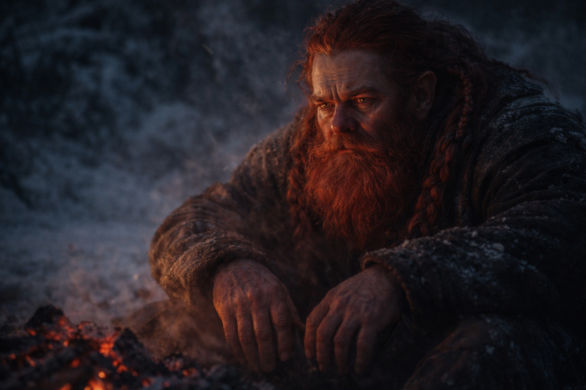
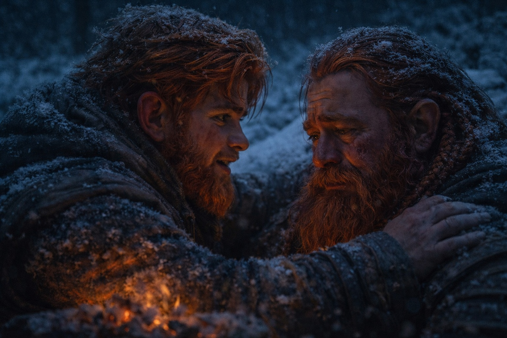

## Capítulo 26 | Parte 5 | El Vínculo Cambiado

---

Balin dejó de reírse de las historias de Dulint hace tres días.

No porque no fueran graciosas. Algunas lo eran. La del minero que había vendido su propio pico sin saberlo a través de una cadena de doce mercaderes tenía un remate genuino, y Dulint lo entregaba como siempre, con esa cadencia ondulante que hacía que el oyente se inclinara hacia adelante. Pero Balin ya reconocía el ritmo. Cada historia comenzaba cuando el sendero se estrechaba hacia un punto de decisión. Cada remate llegaba en el momento exacto en que alguien podría preguntar qué bifurcación tomar.

Igual se rió, las dos primeras veces. Por costumbre. Por algo que no estaba listo para nombrar, algo que se sentaba entre la lealtad y la lástima y le apretaba el estómago cada vez que Dulint se aclaraba la garganta para comenzar.

La tercera vez, simplemente caminó adelante.

Dulint no lo llamó. Esa fue la parte que lo confirmó. El viejo enano que habría vociferado "¡Oi, que no he terminado!" en cualquier mina desde Stonehold hasta Zuraldi simplemente observó cómo la espalda de su sobrino desaparecía detrás del recodo y no dijo nada.

Viajaron así el resto del día. Balin al frente con Aldric, igualando el paso del soldado, haciendo preguntas sobre el terreno cuyas respuestas ya conocía. Aldric respondía a su manera escueta, señalando líneas de cresta y patrones de drenaje, y si notaba que la mandíbula del joven enano trabajaba entre pregunta y pregunta, no lo comentó.

Maris caminaba entre ellos y Xandor, con pasos cuidadosos pero firmes. Al menos volvía a comer. El temblor en sus manos se había asentado en algo intermitente. Una vez, cerca del mediodía, lo atrapó mirándola y le lanzó una mirada demasiado perspicaz para su comodidad.

Dulint cerraba la marcha con Xandor.

Balin solo captaba fragmentos de la conversación. Xandor preguntaba algo y Dulint respondía largamente. El druida esperaba y volvía a preguntar.

Esa tarde en el campamento, Balin tomó el primer turno de guardia sin que se lo pidieran.

—Yo cubriré el segundo —dijo Aldric. No era una pregunta.

Balin asintió. Encontró un tronco caído en el borde del resplandor del fuego, se sentó y apoyó la espada sobre sus muslos. La hoja necesitaba aceite. Lo haría después. Por ahora solo necesitaba su peso, la presión específica del hierro a través del cuero contra sus piernas, el recordatorio de que cargaba algo real.

El fuego se asentó en brasas. Aldric durmió. Xandor durmió. Maris durmió o fingió hacerlo, su respiración demasiado regular, demasiado controlada.

Dulint se sentó al otro lado del fuego agonizante y lo observó.

Balin lo dejó. Había pasado días observando a su tío en busca de señales, catalogando las demoras, contando los desvíos. Ahora dejaba que la observación fuera mutua. Dejó que Dulint viera lo que necesitaba ver en un sobrino que se sentaba de manera diferente a como solía, cuyas manos descansaban sobre una espada en lugar de juguetear con lo que tuviera más cerca.

Pasó un buen rato sin que ninguno hablara.

—Estás enojado —dijo Dulint finalmente.

—No.

—Eres algo.

Balin miró las brasas. —Crecí.

A Dulint se le cortó la respiración. Balin lo oyó por encima del fuego.

—¿Cuándo? —preguntó el viejo enano. Su voz había perdido la cadencia narrativa. Lo que quedaba era crudo, despojado, la voz por debajo de la actuación.

—En algún lugar entre el decimoséptimo desvío y la nota en tu bota.

Dulint se quedó inmóvil. Sus manos, que habían estado descansando sobre sus rodillas, se cerraron en puños y luego se abrieron lentamente de nuevo. La luz del fuego atrapó el gris de su barba y lo convirtió en cobre. Sus ojos color mineral de hierro se mantuvieron fijos en el rostro de Balin, buscando algo, y lo que encontró lo hizo mirar hacia el suelo entre sus pies.

—¿Cuánto tiempo llevas sabiéndolo?

—El suficiente para contarlo.

Un leño se movió y soltó chispas. Detrás de ellos, la respiración de Maris vaciló. Estaba escuchando. Balin no apartó los ojos de su tío.

Dulint abrió la boca. La cerró. La abrió de nuevo. El viejo enano que podía llenar cualquier silencio con una historia, que podía hablar a través de derrumbes y reuniones de consejo y el dolor, estaba sentado en tierra helada sin nada que decir.

—No te estoy preguntando qué te dijo la vidente —dijo Balin—. No esta noche. —Hizo una pausa. Dejó que las palabras se asentaran.— Pero debes saber que he estado observando. Los caminos lentos. Las paradas adicionales. Las historias justo cuando necesitamos elegir una dirección.

—Te estaba protegiendo.

—Lo sé.

—No entiendes lo que ella dijo.

—Leí la nota, tío. "Balin muere rápido." Y debajo, con tu letra, "Solo si me apresuro." —Mantuvo la voz tranquila. Quieta. La voz de un hombre que expone hechos que ya procesó, no la de un chico que los descubre por primera vez.— Has estado frenándonos porque crees que la velocidad me mata.

Dulint movió la mandíbula. Los ojos se le enrojecieron. Se apretó los muslos con las manos.

—Ella no lo dijo así —logró decir—. Dijo decisiones. Dijo que habría un momento en que el camino hacia adelante costaría algo que yo no podía pagar, y cuanto más rápido llegáramos...

—Antes muero.

—No lo digas así.

Balin recorrió los cuatro pasos que los separaban y se agachó frente a su tío. A Dulint le temblaba el labio inferior.

—No voy a decirte que está bien —dijo Balin—. Porque no sé si lo está. Pero sé lo que has estado haciendo, y sé lo que te está costando, y sé que el grupo es más lento por eso. Maris nos necesita en movimiento. El Faro nos necesita al norte. Y tú has estado eligiendo mi vida por encima de la misión cada día desde Stonehold.

—Por supuesto que sí.

—Lo sé. Ese es el problema. —Balin le puso una mano en el hombro. Dulint se estremeció y luego se apoyó en ella—. Si morir rápido significa que tenemos éxito, elegiré eso. Siempre.

Dulint no dijo nada.

El fuego se derrumbó sobre sí mismo. Las brasas se apagaron de naranja a rojo profundo. En algún lugar del bosque, un pájaro nocturno llamó una vez y no volvió a llamar.

Balin apretó el hombro de su tío, se puso de pie y regresó a su puesto de guardia. Recogió su espada. La apoyó sobre sus muslos. Miró la línea oscura de los árboles donde terminaba la luz del fuego y comenzaban los bosques de Frostgard.

Detrás de él, Dulint permanecía exactamente donde estaba, manos abiertas sobre sus rodillas, mirando el lugar donde su sobrino había estado agachado. No habló. No contó ninguna historia. No se movió durante un largo rato.

---

**Fin del Capítulo 26.5 —> 27.1: [El Precio del Paso: La Boca](/el-precio-del-paso-la-boca/)**
