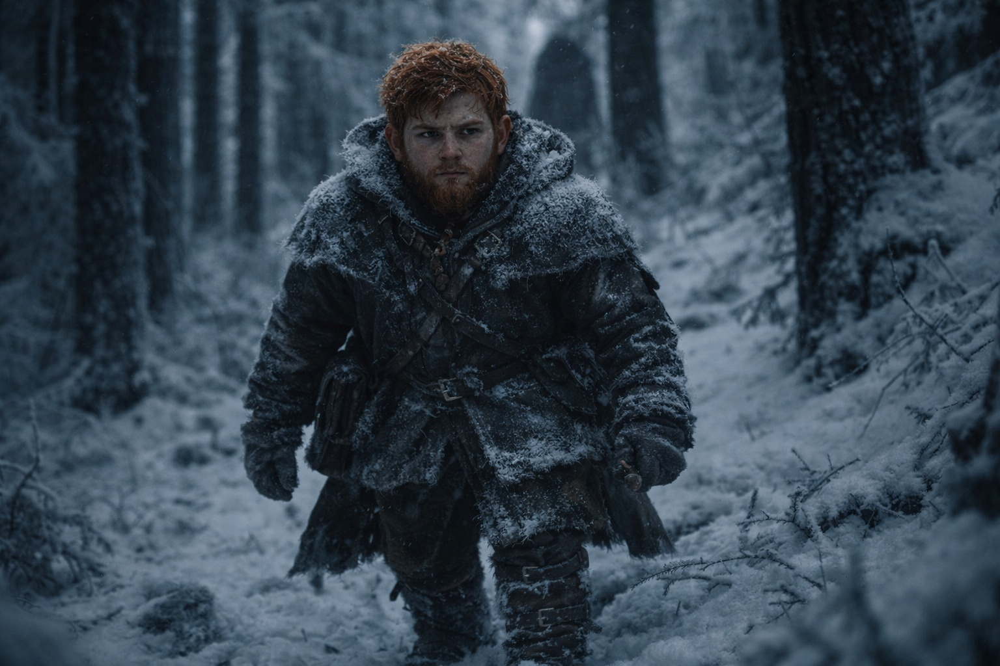
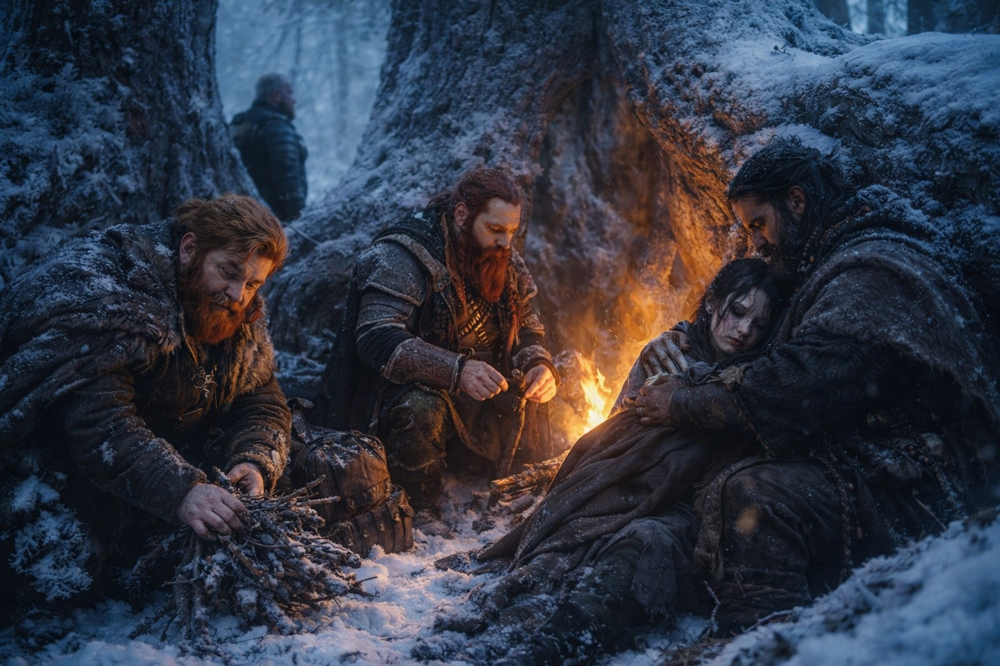

## Capítulo 26 | Parte 1 | La Duda

---

La mano izquierda de Dulint no dejaba de buscar el cierre de la correa de su mochila.

Antes de los cazadores y de la visión de siete minutos de Maris, Balin contaba cosas por diversión: grietas en las vigas de las tabernas, pasos entre claros, las veces que Aldric masticaba por un solo lado de la boca.

Ahora buscaba amenazas. La mano de su tío volvía una y otra vez al cierre y luego se apartaba.

Catorce veces desde la mañana. Balin estaba seguro del número porque había estado observando desde la primera.

Los pinos crecían más altos a medida que se acercaban a Frostgard. Apenas llegaba luz al suelo entre las agujas heladas. Balin distinguía a sus compañeros por las pisadas: la zancada larga de Aldric, el paso pesado de su tío, el arrastre de Xandor. Seguía atento por si Maris tropezaba.

Maris había insistido en caminar. Xandor se había negado a moverse hasta que comiera y, por una vez, había ganado la discusión. Ya no tenía sangre seca en la cara. Seguía pálida.

El Faro apenas había pulsado desde la visión. Dulint lo guardaba en la mochila y lo revisaba de vez en cuando.

Quince. El cierre otra vez. Esta vez Dulint lo sostuvo durante tres segundos antes de soltar.

—Vas a hacer un surco en esa hebilla —dijo Balin.

Dulint lo miró. La mirada fue breve, ilegible. —Costumbre.

—Tú no tienes esa costumbre. Tienes tres costumbres. Acariciarte la barba cuando piensas, golpetear el mango de tu hacha cuando estás impaciente, y hablar demasiado cuando estás evitando una pregunta. La hebilla es nueva.

Su tío se rio. Fue un buen intento. —Me has estado estudiando.

—He estado observando a todos. Es lo que hago ahora.

La risa de Dulint se apagó. Mantuvo la mano junto al costado el resto del camino.

Acamparon al atardecer en un hueco entre tres pinos enormes. Las raíces habían crecido juntas durante siglos, formando muros de madera nudosa que bloqueaban el viento del norte. Aldric aprobó la posición con un gruñido y comenzó a revisar el perímetro, lo cual le tomó siete minutos. Balin lo cronometró.

Xandor ayudó a Maris a sentarse contra una raíz y la arropó con su capa. Ella cerró los ojos. Balin oía un leve silbido en su respiración que no estaba allí una semana antes.

Balin recogió leña. Ya era bueno en eso. Sabía qué ramas arderían limpio y cuáles harían humo, cuáles estaban lo bastante secas a pesar de la escarcha, cuáles crujirían y estallarían y delatarían su posición. Primera vez número treinta y siete: primera vez recogiendo leña sin que se lo dijeran. Había perdido la cuenta de las primeras veces reales en algún lugar alrededor de la veinte, pero el hábito de nombrarlas persistía.

El fuego era pequeño, protegido por las raíces, apenas más que brasas. Regla de Aldric. Suficiente calor para mantener vivos, no suficiente luz para ser encontrados.

Dulint se sentó frente a Balin y comió en silencio. Eso también estaba mal. Dulint no comía en silencio. Dulint contaba historias durante las comidas. Historias largas, sinuosas, sin sentido, que Balin había pretendido encontrar molestas durante años mientras secretamente catalogaba cada detalle. Historias sobre Stonehold, sobre su padre, sobre las minas y los mercados y aquella vez que la Prima Brunnhild había intercambiado accidentalmente un barril de cerveza por una cabra que resultó estar preñada de gemelos.

Esta noche, nada. Solo el sonido de masticar y el crepitar bajo del fuego y el viento en la copa de los árboles arriba.

Balin intentó. —¿Te conté alguna vez lo del mercader en Zuraldi que intentó venderme una espada que en realidad era un espetón de cocina?

Dulint miró arriba. Sonrió. —No.

Balin esperó.

—Cuéntamelo por la mañana, muchacho. Estoy cansado.

Dulint había contado historias con un brazo roto. Balin nunca lo había visto demasiado cansado para contar una.

Balin se acostó en su saco y no durmió. Escuchó a Aldric tomar la primera guardia, botas crujiendo suavemente sobre la escarcha. Escuchó la respiración de Xandor asentarse en el ritmo profundo de la vejez y el agotamiento. Escuchó a Maris moverse, inquieta, su sueño perturbado por cosas que Balin no podía ver.

Y escuchó a su tío.

El saco de Dulint estaba a dos metros de distancia. Lo bastante cerca para escuchar el susurro cuando llegó. No palabras al principio, solo la forma del habla, los labios moviéndose contra un sonido demasiado pequeño para llevar. Balin contuvo el aliento y se esforzó.

—...qué hago si sucede?

Balin esperó. Dulint volvió a hablar.

—No puedes detenerlo.

La voz cambió. Seguía siendo la de Dulint, pero con un tono diferente. Más baja. Más plana. Como si estuviera citando las palabras de otra persona de memoria, ensayando una conversación que ya había tenido lugar.

—¿Entonces cuál es el sentido?

Dulint se dio la vuelta. La siguiente bocanada de aire se le atascó antes de salir despacio.

Balin miró fijamente la copa oscura arriba y contó. Uno. Dos. Tres. Cuatro. Sin contar nada, contando para evitar que su mente se desbocara.

¿Quién le había dicho a su tío que no podía detenerlo?

*¿Qué hago si sucede?*

¿Si *qué* sucede?

El fuego se había consumido hasta las cenizas. Los pasos de Aldric rodeaban el perímetro. El bosque crujía y se asentaba en el frío.

Balin no durmió.

---

**Fin del Capítulo 26.1  —> 26.2: [La Grieta: La Evidencia](/la-grieta-la-evidencia/)**
