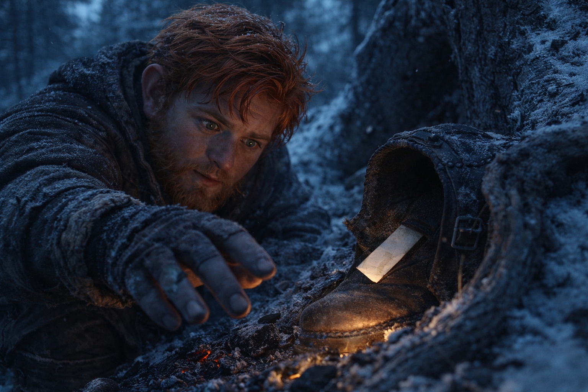
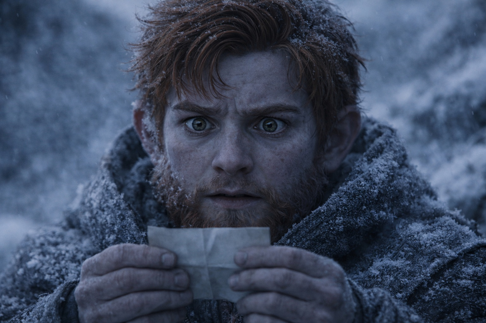

## Capítulo 26 | Parte 2 | La Evidencia

---

La bota estaba junto al fuego cuando Balin la encontró.

Dulint se había ido antes del amanecer. Balin lo había oído pasar por encima de su petate y había mantenido la respiración regular.

Llevaba horas despierto, pensando en los susurros y en las comidas que su tío ya no llenaba de historias.

Dulint había ido a relevar a Aldric con las zapatillas de campamento, dejando las botas mojadas a secar. Al salir había volcado la izquierda contra una raíz.

Balin se estaba poniendo sus propias botas cuando vio el borde de papel.

Un papel doblado asomaba entre el cuero y el forro de lana. Debía de haberse soltado al caer la bota.

Debería dejarlo. Su tío tenía derecho a guardarse cosas. Aun así, Balin alargó la mano hacia el papel.

Pero la confianza iba en ambas direcciones. Y su tío se había estado susurrando a sí mismo en la oscuridad, ensayando una conversación sobre algo que no podía detenerse, y el hombre que le había enseñado a Balin a enfrentar verdades difíciles se estaba escondiendo de una.

Sacó el papel.

El papel estaba blando por los pliegues, desgastado donde los dedos lo habían alisado.

La letra pequeña y cuidada no era de Dulint. Su tío escribía con letras grandes y desparramadas. La tinta se había vuelto marrón.

Dos líneas. La primera cruzaba el centro del papel en esa letra cuidadosa:

*Balin muere rápido.*

Debajo, apretada en el espacio que quedaba, había una segunda línea con la letra de Dulint:

*Solo si me apresuro.*

Balin leyó las palabras tres veces. Le sorprendió que no le temblaran las manos.

Su nombre. En la letra de otra persona. En la bota de su tío.

*Balin muere rápido.*

Quien lo había escrito no dejaba lugar a dudas.

Y la respuesta de su tío, escrita debajo: *Solo si me apresuro.*

Los rodeos. Las discusiones con Aldric sobre el ritmo de marcha. Dulint los había estado retrasando desde Stonehold.

Su tío tenía miedo de perderlo.

Él.

Voces en el perímetro. El retumbar de Dulint, la respuesta cortante de Aldric. Estaban volviendo. Balin dobló la nota por sus pliegues originales, sintiendo cuán naturalmente el papel encontraba su forma antigua, y la deslizó de vuelta entre el cuero y la lana. Enderezó la bota y la ajustó para que la abertura mirara en la misma dirección que antes.

Sus manos estaban firmes. Su respiración era firme. Su cara, cuando Dulint se agachó bajo la pared de raíces y encontró los ojos de su sobrino con una media sonrisa cansada, no mostró nada más que la habitual irritabilidad matutina de un enano joven que no había dormido bien.

—Buenos días, muchacho.

—Buenos días.

Dulint se sentó y se puso las botas. Izquierda, luego derecha. Sus dedos encontraron el interior de la bota izquierda, presionaron una vez contra el forro donde se escondía el papel, y continuaron atando los cordones. El movimiento era practicado, automático. Había revisado la nota cada mañana. Probablemente cada vez que se ponía las botas.

Balin observó sin reaccionar. Después comió la carne seca y recogió el petate.

Maris apareció de detrás de la pared de raíces, moviéndose despacio. Su color era marginalmente mejor. No bueno, pero mejor. Xandor caminaba a su lado, una mano cerca de su codo sin tocarlo, listo para atrapar lo que esperaba que no cayera.

—¿Cómo estás? —preguntó Balin.

—Vertical —dijo Maris—. Lo cual es una mejora sobre las ambiciones de ayer.

Balin sonrió. Se sintió lo bastante real. Se estaba volviendo bueno en eso.

Empacaron. Se movieron. Al norte, bajo la copa, paso constante. El compromiso del claro se mantenía. Aldric lideraba. Dulint caminaba detrás de él. Balin tomó su posición junto a Maris, cuyos pasos cuidadosos se habían convertido en un metrónomo que igualaba sin pensar.

Caminó y llevó su descubrimiento y no lo compartió. No todavía. Faltaban piezas. La nota le decía que algo existía, algo que su tío sabía, algo que involucraba la propia muerte de Balin entregada como certeza por alguien cuya letra hablaba de precisión y autoridad. Pero no le decía quién la había escrito, ni cuándo, ni por qué su tío había elegido cargar la advertencia en lugar de decirla en voz alta.

Dulint tenía opciones. Podría haberle dicho a Balin. Podría haberle dicho a Aldric, o a Xandor, o a Maris. Podría haberse dado la vuelta, ido a casa, mantenido a su sobrino a salvo tras muros de piedra. En cambio había traído a Balin al norte, a Frostgard, al frío y los cazadores y la vidente sangrante y la llamada del Faro, y lo había hecho mientras sostenía una nota que decía que su sobrino moriría si se movía demasiado rápido.

*Solo si me apresuro.*

Dulint creía que podía cambiar lo que predecía la nota eligiendo un camino más lento. Balin necesitaba saber qué había dicho la vidente en realidad.

¿Habían sido esas sus palabras exactas? ¿Cuándo las había dicho?

Observaría un poco más antes de preguntar.

El bosque se extendía adelante, gris e interminable. El Faro pulsó una vez, débilmente, desde la mochila de Dulint.

Balin contó sus pasos y caminó junto a su tío y no dijo nada.

---

**Fin del Capítulo 26.2  —> 26.3: [La Grieta: La Vigilia](/la-grieta-la-vigilia/)**
