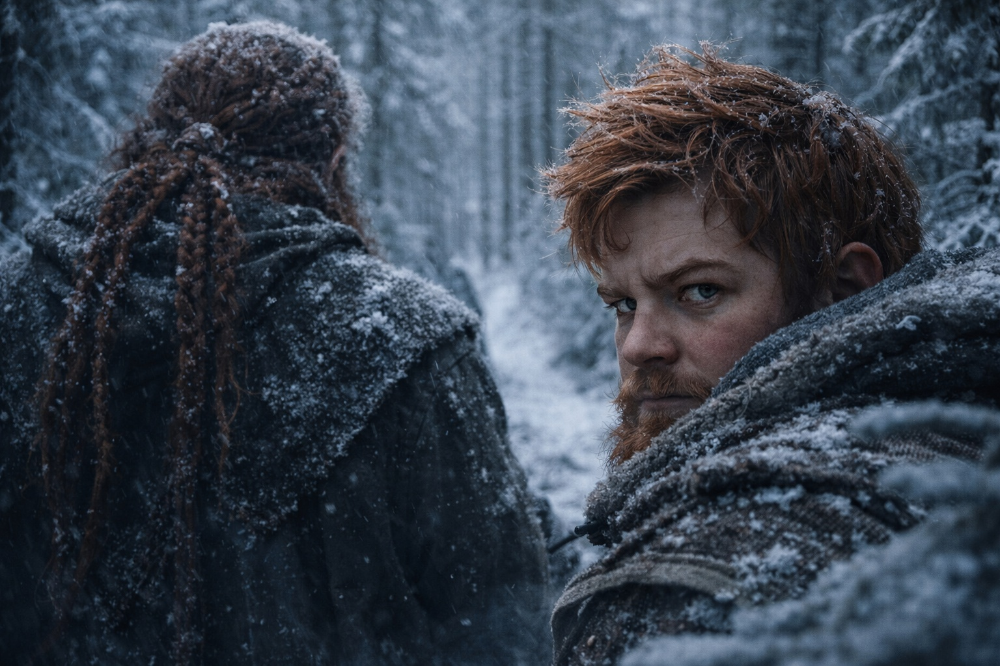
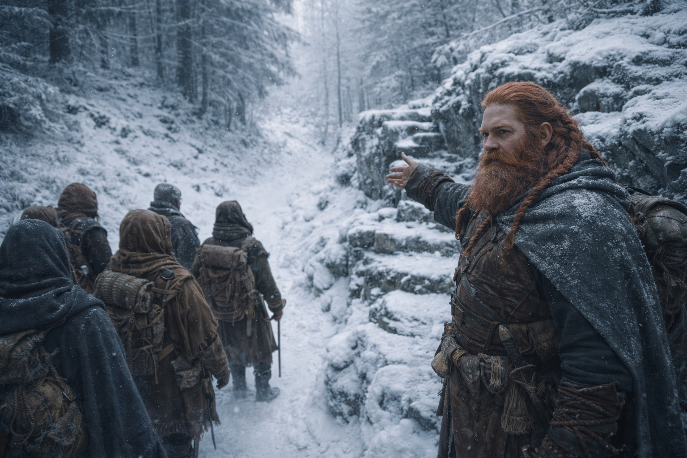
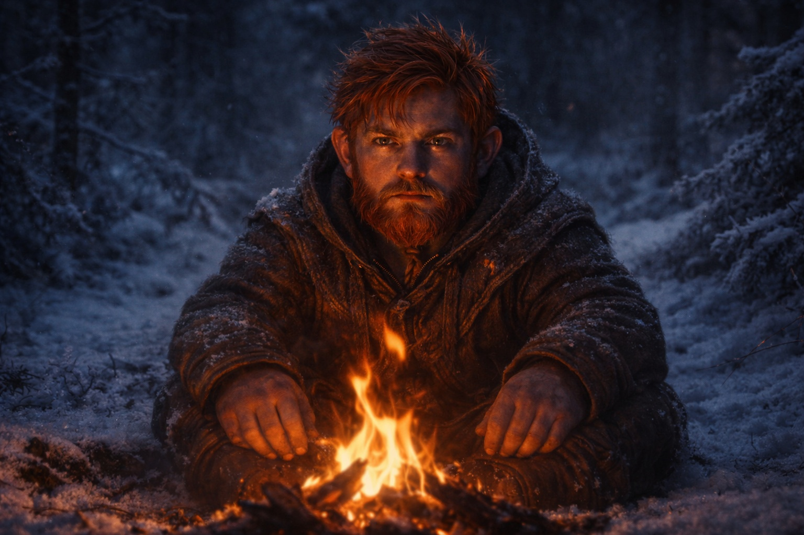
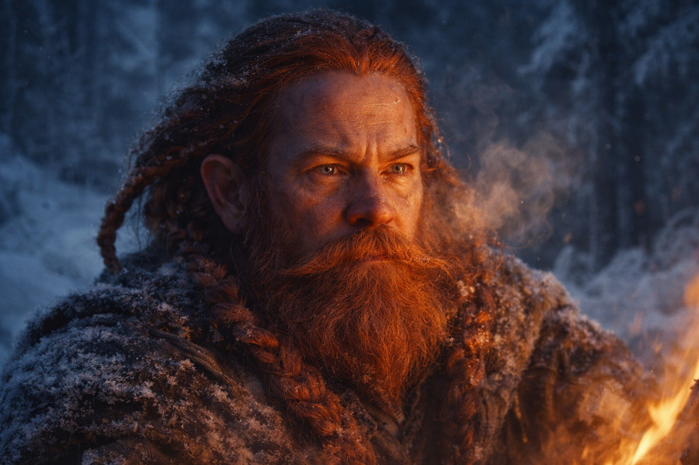
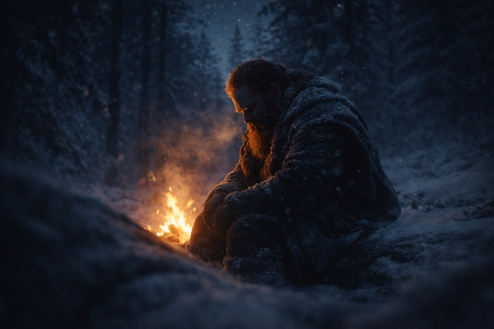

## Capítulo 26 | Parte 3 | La Vigilia

---

Balin empezó a contar el segundo día.

No deliberadamente. Los primeros los notó de la misma manera en que se nota una piedra en la bota: irritación sin comprensión. Un giro demasiado amplio. Un descanso pedido demasiado pronto. Un arroyo cruzado en el vado somero en lugar del puente de hielo a cincuenta pasos al norte, que era más rápido a la mitad. Cosas pequeñas. El tipo de decisiones que podían significar cautela en terreno desconocido, o no significar nada en absoluto.

Observaba las botas de su tío. Le decían más que el rostro de Dulint jamás podría.

Balin conocía el andar balanceado de su tío desde niño. Ahora Dulint se detenía antes de las subidas y miraba hacia atrás por el sendero. A veces movía los labios sin emitir sonido.

Tres.

Eran tres, a media mañana del segundo día. Tres retrasos innecesarios que no les costaban nada individualmente pero que sumaban una hora perdida cuando Aldric llamó el alto del mediodía.

—Tu tío está siendo cuidadoso —dijo Aldric, sin mirar a Balin. El soldado estaba en cuclillas junto a un pino caído, pasando los ojos por la cresta al norte. Revisión rutinaria de línea de visión. Balin había aprendido a leerlas también—. El terreno ha empeorado desde que se profundizó la escarcha.

—Está siendo algo —dijo Balin.

Los ojos de Aldric se movieron desde la cresta hasta el rostro de Balin. Se quedaron ahí. El soldado estaba decidiendo si preguntar. No lo hizo.

El cuatro ocurrió después del alto del mediodía. El camino se bifurcaba y Dulint los llevó a la izquierda, rodeando una repisa de granito que podría haberse escalado en minutos. El rodeo añadió otro cuarto de hora. El cinco fue una parada de agua en un arroyo que corría demasiado rápido para haberse congelado, donde Dulint pasó diez minutos rellenando odres que ya estaban a tres cuartos. El seis fue la decisión de acampar una hora entera antes del anochecer, en un claro que ofrecía menos refugio que la arboleda de cicutas que habían dejado atrás media legua antes.

Balin se sentó junto al fuego y no dijo nada. Su tío contó una historia sobre el macho cabrío de un primo que había aprendido a abrir los cerrojos de las portillas, y la historia no llegaba a ninguna parte, dando vueltas sobre sí misma, el remate siempre una frase más lejos que el último intento. Xandor escuchaba con cortesía, con las manos trabajando para soltar un nudo de corteza de su bastón. Maris yacía envuelta en una manta al borde del fuego, su respiración superficial y medida, su rostro del color de la cera de vela vieja. No había hablado desde la mañana.

Siete. Ocho. Nueve. Diez.

El tercer día los llevó a un bosque más denso donde los pinos crecían tan juntos que sus ramas se entretejían por encima, reduciendo la luz a un crepúsculo gris incluso a mediodía. Terreno bueno para moverse rápido. Senderos estrechos, suelo firme, sin visibilidad para nada que cazara desde arriba. Aldric lo dijo. Dulint asintió. Luego los llevó por el borde del límite del bosque en cambio, donde la nieve era más profunda y cada paso requería el doble de esfuerzo.

Once.

El doce fue elegir cruzar un riachuelo helado a pie en lugar de usar el roble caído que lo cruzaba limpiamente. Balin vio a su tío probar el hielo con el talón de la bota, declararlo sólido, y llevarlos a través con el agua filtrándose por la escarcha en cada paso. El calcetín izquierdo de Balin quedó empapado en segundos. El de Dulint también. El viejo enano no parecía notarlo.

—Tío —dijo Balin esa tarde, cuando los otros estaban ocupados. Maris durmiendo. Xandor hablando en suaves susurros con un abedul. Aldric recorriendo el perímetro, contando sombras.

Dulint levantó la vista del fuego. Sus ojos color mineral de hierro atraparon la luz y la devolvieron, planos, en guardia. —¿Mmm?

—El riachuelo de hoy. Había un tronco.

—El tronco estaba podrido.

No lo estaba. Balin había apoyado la palma en él al pasar. Corazón sólido. Marcas de escarabajo de la corteza en la superficie pero el núcleo intacto, seco, capaz de aguantar a diez enanos. No dijo nada de eso. Los ojos de su tío permanecieron en su rostro, esperando, y en esa espera Balin vio lo que había tenido miedo de nombrar.

Dulint sabía que Balin lo estaba observando.

La boca del viejo enano se movió detrás de su barba. El fuego crepitó. En algún lugar al norte, un pájaro que Balin no supo identificar lanzó un llamado de tres notas que rebotó en el dosel helado.

—Mejor dormir —dijo Dulint—. Mañana será un día largo.

Todos los días eran largos. Ese era el problema.

Trece. Catorce. Quince en la mañana del cuarto día, cuando Dulint detuvo la columna para examinar un montón de excrementos que cualquier habitante del bosque habría identificado como de alce a veinte pasos. Dieciséis cuando los hizo retroceder para recuperar un odre que afirmó haber soltado, y luego lo sacó de su propia mochila con una expresión confundida que fue la peor actuación que Balin había visto en su vida.

El diecisiete fue la colina.

El sendero subía directamente por una pendiente moderada, con dos curvas en zigzag entre pinos achaparrados. Una subida de quince minutos a paso honrado. Dulint la estudió como un albañil estudia una cimentación agrietada, frotándose la barba, desplazando el peso de un pie al otro. Luego giró al norte.

—La pendiente es más suave por el lado —dijo.

La pendiente por el lado tardó cuarenta y cinco minutos.

Balin seguía sin saber qué le había dicho la vidente a Dulint. Pero ya no dudaba de lo que estaba haciendo su tío.

Diecisiete veces su tío eligió el camino más lento.

La ruta apenas importaba. En cada cruce, Dulint elegía lo que los mantuviera más tiempo en el camino.

Y Balin lo había seguido.

Balin yació en su petate esa noche y observó a su tío sentarse en la primera guardia. La silueta de Dulint contra el fuego tenía la forma que Balin había conocido toda su vida, ancha e inamovible y segura. La forma de la persona que lo había alimentado, entrenado, arrastrado de vuelta de cada riesgo estúpido hacia el que su cuerpo joven se había lanzado.

Mañana, Balin elegiría la ruta.

---

**Fin del Capítulo 26.3  —> 26.4: [La Grieta: El Casi](/la-grieta-el-casi/)**
