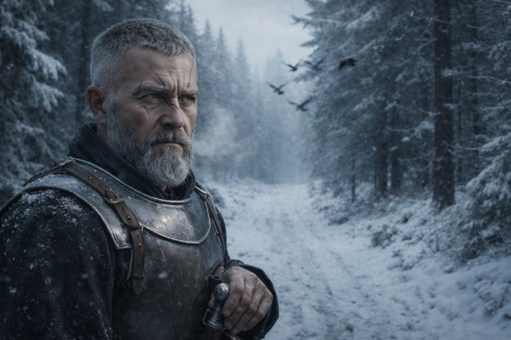
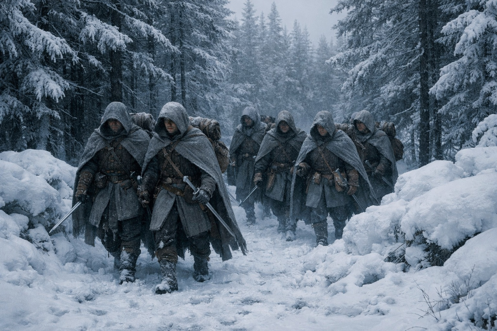
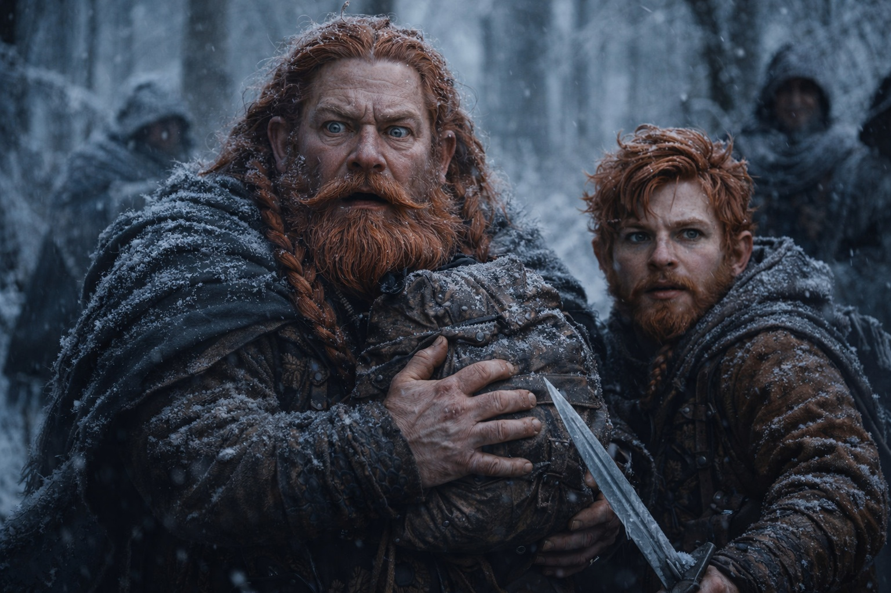
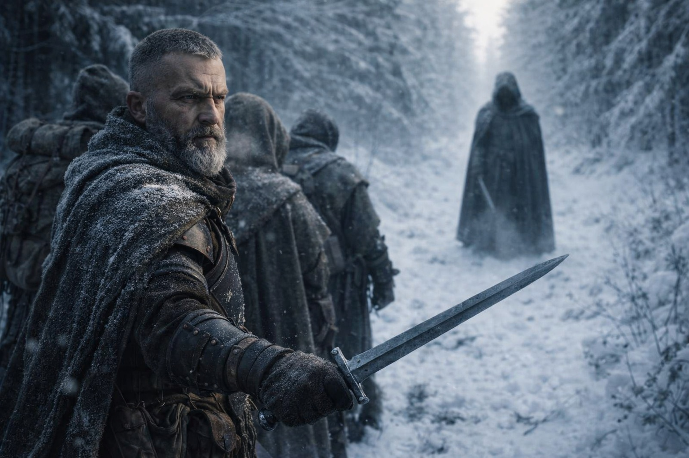
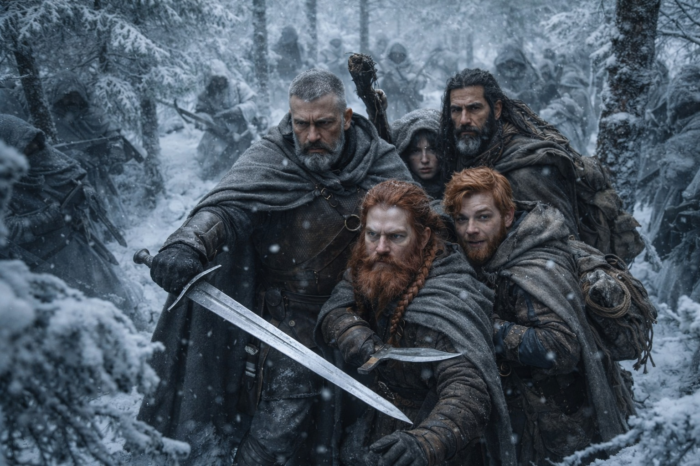

# Capítulo 28.1 | La Segunda Sangre: El Costo

---

Aldric vio la trampa tres segundos antes de que se cerrara.

El primer segundo fueron los pájaros. Una línea de grajillas se elevó de los pinos adelante, no asustadas sino deliberadas, como si algo hubiera estado parado en sus árboles y acabara de descender. El segundo segundo fue el sendero mismo. La nieve en el camino adelante estaba mal. No virgen, no pisoteada, sino reconfigurada. Alguien había caminado por ahí y barrido la superficie de vuelta a su forma, pobremente, con una escoba o una rama, y la textura del resultado era ligeramente más plana que la nieve que había caído por su cuenta.

El tercer segundo fue el cuerno.

Sonó una vez, grave y profesional, desde algún punto al noreste de su posición. No Grukmar. Los cuernos Grukmar eran latón tosco, cacofónicos, diseñados para aterrorizar por volumen. Este era un cuerno de señal, preciso, afinado para transportar una frecuencia específica a una distancia específica a un conjunto específico de oyentes que sabían exactamente lo que significaba.

—Formación. —La palabra salió de él antes de que terminara de girar. Memoria muscular de veinte años de emboscadas que no habían llegado a tiempo y la una que sí—. Dulint, Balin, centro. Xandor, flanco izquierdo. Maris, atrás. Ahora.

Se movieron. No lo suficientemente rápido. Ni remotamente lo suficientemente rápido, porque estos no eran peleadores de taberna ni exploradores Grukmar que se hubieran topado con ellos por accidente. Las figuras que aparecieron detrás de la línea de árboles en tres lados llevaban capas grises a juego, se movían en parejas disciplinadas y portaban armas que habían sido mantenidas por personas que entendían que una hoja desafilada mata primero a su dueño.

Seis de ellos. Dos bloqueando el sendero adelante. Dos en la cresta este. Dos más cerrando desde el sur, sellando la ruta por la que habían entrado.

Profesionales. Coordinados. Suficientemente pacientes para haber tendido la trampa y esperado.

—No nos quieren muertos —dijo Aldric, su voz cayendo al registro plano que significaba que su cerebro había dejado de procesar miedo y había empezado a procesar geometría—. Quieren lo que cargamos.

La mano de Dulint se movió hacia la mochila en su cadera donde el Cubo descansaba envuelto en piel de oveja. El movimiento fue involuntario, protector, como la mano de un padre encuentra el hombro de un niño en una multitud. Sus ojos de mineral de hierro escanearon la línea de árboles.

—¿Cuántos más? —preguntó Balin. Ya había desenvainado su espada. La hoja se veía demasiado grande para él y la sostenía correctamente de todas formas, como alguien sostiene una herramienta con la que ha practicado cuando nadie miraba.

—Al menos dos que no hemos visto. Siempre hay una reserva. Estos son bloqueadores. El equipo de eliminación está en otro lado.

La figura líder en el sendero adelante levantó una mano, palma hacia fuera. No una rendición. Una pausa. Era alto, humano, llevaba la misma capa gris que los demás, y cuando habló su voz llevaba la calma de alguien conduciendo un negocio.

—El dispositivo. Entréguenlo y váyanse caminando.

Aldric se posicionó entre el hablante y Dulint. Su espada estaba fuera. El peso de ella se sentía correcto, la gravedad específica del hierro forjado que había sido equilibrado para su brazo por un herrero que entendía que el arma de un luchador era una medida de su alcance.

—No.

La expresión del hombre alto no cambió.

—Capitán. —Dijo el rango como quien lee un manifiesto—. Dado de baja de la Novena Frontera bajo revisión disciplinaria. Compañía actual: dos enanos, un druida, una vidente. Carga algo que pertenece a personas que matarán a más de seis para recuperarlo. Nosotros somos la opción educada.

—Ha hecho su investigación. —Aldric mantuvo su voz nivelada. Detrás de él, el bastón de Xandor había comenzado su vibración apenas perceptible, la que precedía a la magia natural, sistemas de raíces bajo tierra desplazándose hacia su atención—. Váyase. Esta es su opción educada.

El hombre alto suspiró como un capataz suspira ante una cuadrilla que se niega a evacuar.

Entonces todas las salidas se cerraron a la vez.

Nadie dio una señal. No la necesitaban.

---

*Siguiente: La Segunda Sangre: La Línea*

**Fin del Capítulo 28.1 — continúa en el Capítulo 28.2: [La Segunda Sangre: La Línea](/la-segunda-sangre-la-linea/)**
