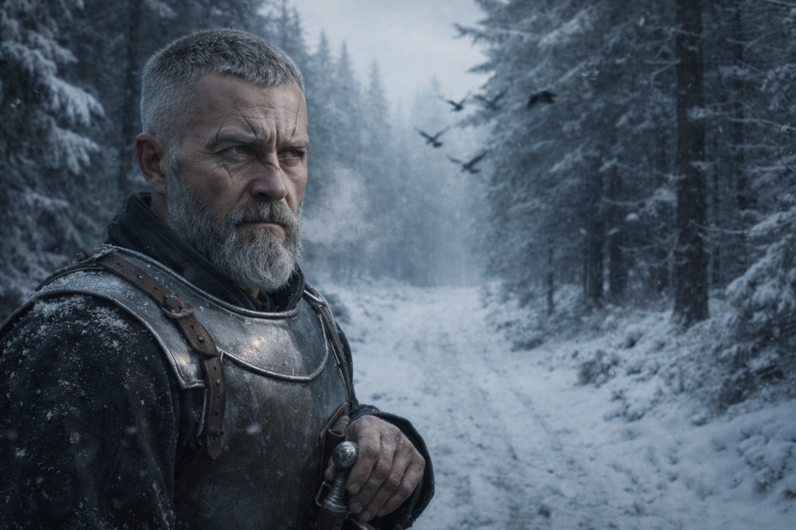
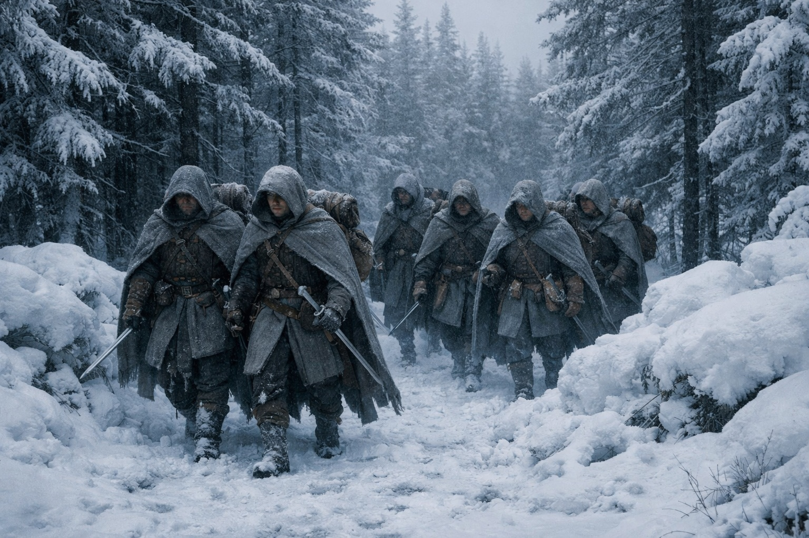
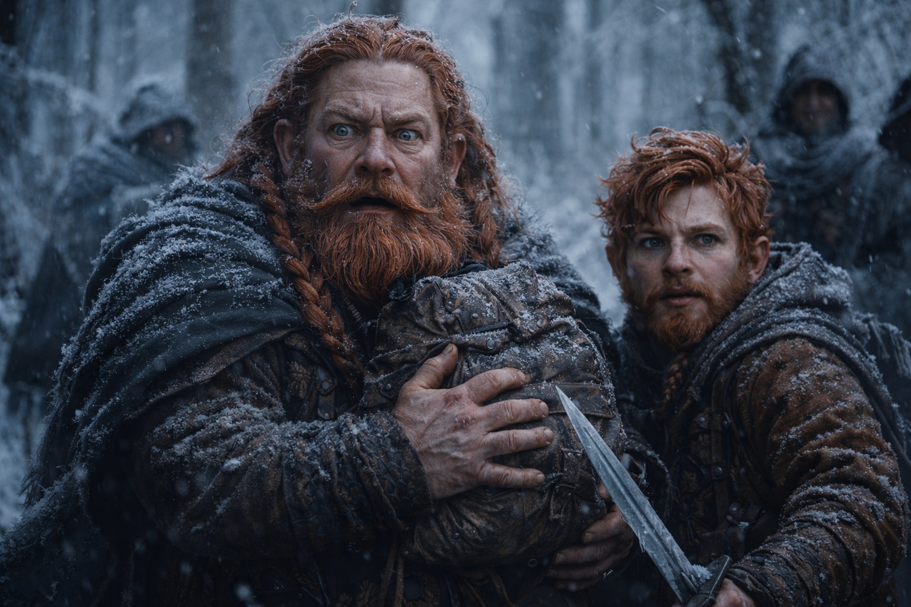
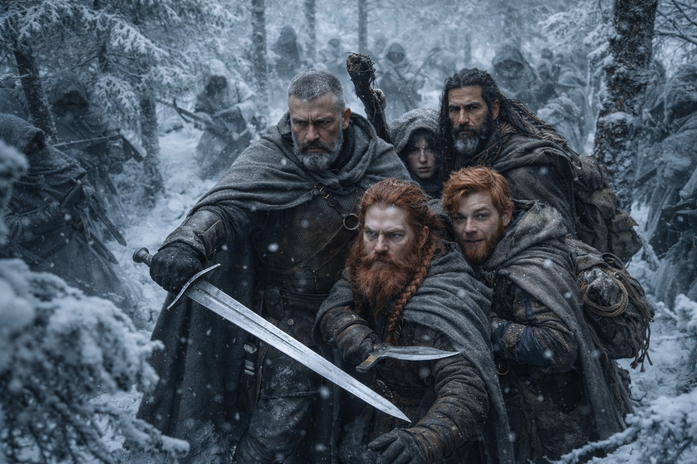

## Capítulo 28 | Parte 1 | El Costo

---

Aldric vio la trampa tres segundos antes de que se cerrara.

Primero, unas grajillas alzaron el vuelo entre los pinos de delante. Después vio la nieve. Alguien había borrado sus huellas con una rama, dejando surcos poco profundos en el sendero.

El tercer segundo fue el cuerno.

Un toque breve, al noreste. Un cuerno de señales, distinto del estruendo de latón que usaban los Grukmar.

—Formación. —La palabra salió de él antes de que terminara de girar. Memoria muscular de veinte años de emboscadas que no habían llegado a tiempo y la una que sí—. Dulint, Balin, centro. Xandor, flanco izquierdo. Maris, atrás. Ahora.

Se movieron demasiado tarde. Unas figuras con capas grises salieron de tres lados y avanzaron por parejas.

Seis de ellos. Dos bloqueando el sendero adelante. Dos en la cresta este. Dos más cerrando desde el sur, sellando la ruta por la que habían entrado.

Profesionales. Coordinados. Suficientemente pacientes para haber tendido la trampa y esperado.

—Quieren lo que llevamos —dijo Aldric—. No os separéis.

Dulint agarró la mochila que contenía el Cubo y examinó la línea de árboles.

—¿Cuántos más? —preguntó Balin. Ya había desenvainado su espada. La hoja se veía demasiado grande para él y la sostenía correctamente de todas formas, como alguien sostiene una herramienta con la que ha practicado cuando nadie miraba.

—Al menos dos que no hemos visto. Siempre hay una reserva. Estos son bloqueadores. El equipo de eliminación está en otro lado.

La figura líder en el sendero adelante levantó una mano, palma hacia fuera. No una rendición. Una pausa. Era alto, humano, llevaba la misma capa gris que los demás, y cuando habló su voz llevaba la calma de alguien conduciendo un negocio.

—El dispositivo. Entréguenlo y váyanse caminando.

Aldric se interpuso entre el hombre y Dulint, con la espada desenvainada.

—No.

La expresión del hombre alto no cambió.

—Capitán. —Dijo el rango como quien lee un manifiesto—. Dado de baja de la Novena Frontera bajo revisión disciplinaria. Compañía actual: dos enanos, un druida, una vidente. Carga algo que pertenece a personas que matarán a más de seis para recuperarlo. Nosotros somos la opción educada.

—Ha hecho sus averiguaciones. —Detrás de Aldric, Xandor apoyó el bastón. Las raíces se movieron bajo la nieve; la mano del druida se cerró sobre la madera, temblorosa—. Váyase. Esta es su opción cortés.

El hombre alto suspiró como un capataz suspira ante una cuadrilla que se niega a evacuar.

Entonces todas las salidas se cerraron a la vez.

Nadie dio una señal. No la necesitaban.

---

**Fin del Capítulo 28.1  —> 28.2: [La Segunda Sangre: La Línea](/la-segunda-sangre-la-linea/)**
