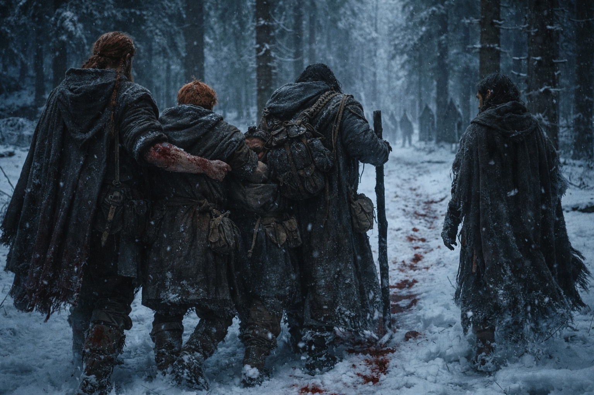
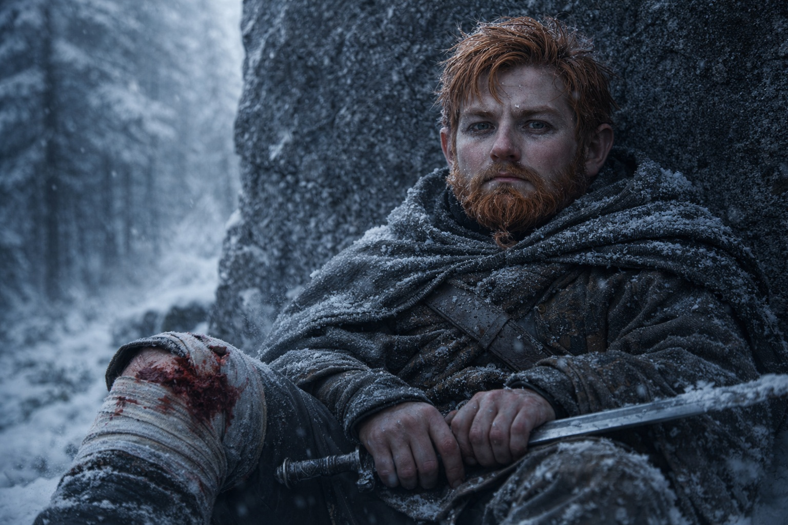
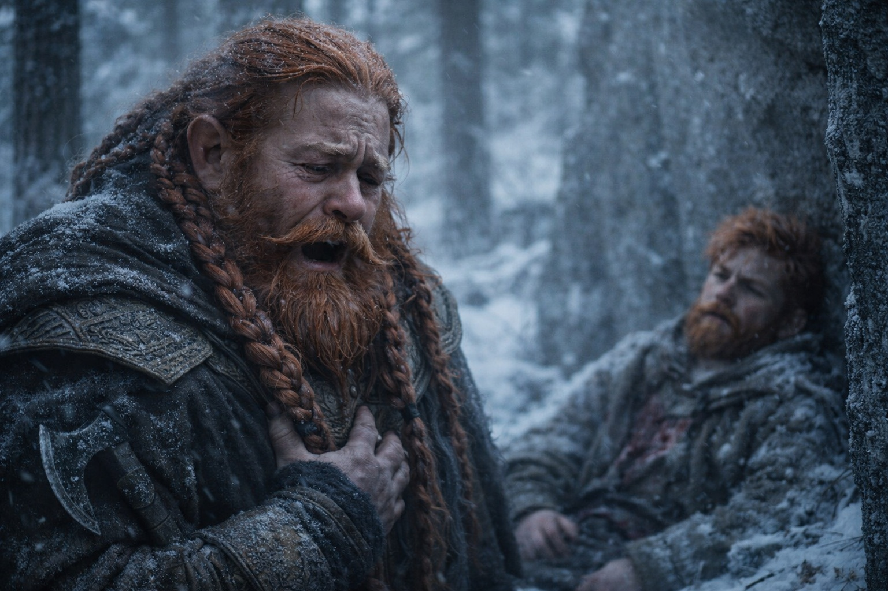
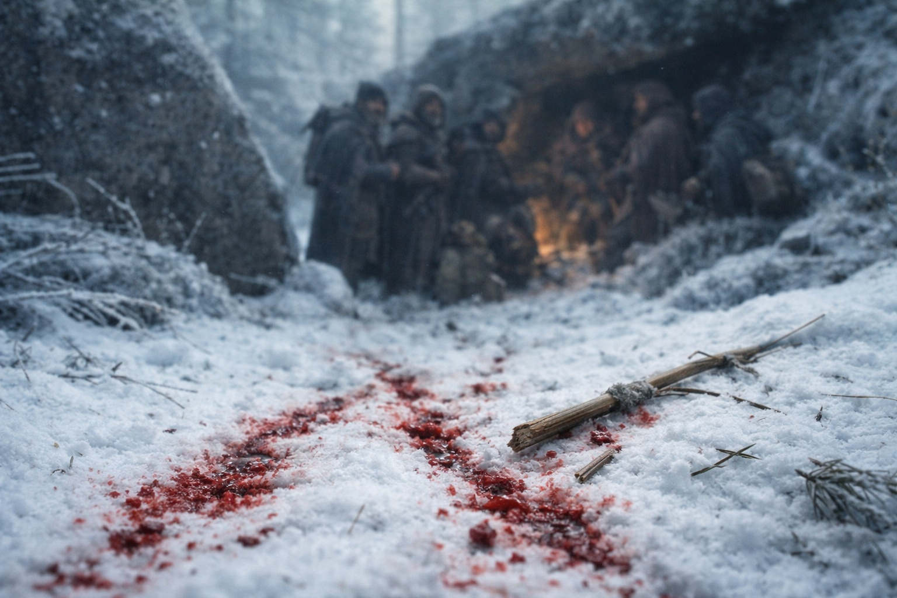

# Capítulo 28.3 | La Segunda Sangre: El Peso

---

Balin volvió cargando a Xandor, con una flecha en su propia pierna.

No su pierna originalmente. Una de las capas grises había disparado durante la retirada, un tiro de despedida colocado con la misma precisión profesional que el que había derribado a Xandor, y había alcanzado a Balin a través de la carne de su pantorrilla derecha mientras medio cargaba, medio arrastraba al druida por la línea de árboles. Había seguido caminando. Aldric había visto al joven enano absorber el impacto como había absorbido el golpe con el plano de la hoja, con un gruñido que era más rabia que dolor, y luego había ajustado su agarre en Xandor y seguido moviéndose porque detenerse no estaba disponible.

Habían puesto una cresta entre ellos y el sitio de la emboscada. Media legua de ladera congelada, los pinos espesándose mientras subían, crecimiento viejo que no había sido talado porque nadie vivía tan al norte para talarlo. Aldric encontró una depresión entre dos afloramientos de granito donde las paredes de roca proporcionaban cobertura en tres lados y el dosel arriba era lo suficientemente denso para romper su silueta desde la cresta.

Puso a Dulint de guardia. El viejo enano fue sin hablar, su hacha en la mano, su rostro del color de la nieve sucia.

Entonces Aldric se arrodilló junto a Xandor y se puso a trabajar.

La flecha en el hombro del druida tenía punta de hoja ancha, diseñada para alojarse en vez de atravesar. Sacarla directamente hacia atrás desgarraría el músculo. Aldric había visto esto en la Novena Frontera. Había visto a cirujanos de campo manejarlo, y había visto hombres morir porque cirujanos de campo no estaban disponibles.

—Maris. Necesito tus manos.

Apareció junto a él, pálida pero firme. Sus dedos eran delgados y fríos y no temblaron cuando mantuvo la herida abierta para que Aldric pudiera ver el ángulo de la púa. Eso era útil. Todo sobre Maris era útil o devastador, y el margen entre ambos era la disposición de su propio cuerpo a seguir funcionando.

—Tiene que salir hacia adelante, no hacia atrás. A través y afuera. —Encontró los ojos de Xandor. El viejo druida estaba consciente, sudor goteando sobre su piel olivácea a pesar del frío—. Esto va a ser muy malo por unos diez segundos.

—He tenido peores. —La voz de Xandor era firme, lo que significaba que estaba mintiendo o realmente había tenido peores, y Aldric respetaba ambas posibilidades por igual.

Empujó la flecha a través. Xandor hizo un sonido que no fue un grito porque había mordido la correa de cuero que Maris había colocado entre sus dientes, pero fue el tipo de sonido que existía en el mismo territorio que un grito, una vibración que venía de la parte más profunda del pecho y viajaba a través del suelo. La punta ancha emergió del frente de su hombro arrastrando sangre y tejido. Aldric quebró el asta y sacó el resto por detrás.

Maris empacó la herida. Sus manos se movieron con la eficiencia practicada de alguien que se había visto sangrar por la nariz y los oídos suficientes veces como para haber desarrollado opiniones sobre el manejo de heridas.

Balin se sentó contra la pared de granito y observó.

La flecha en su pantorrilla era más simple. Una punta de bodkin, estrecha, diseñada para penetrar armadura. Había pasado limpia a través del músculo. Aldric la sacó por ambos lados, empacó ambos agujeros y vendó la pierna con tiras arrancadas de la capa gris que había tomado del luchador que había herido. El joven enano no hizo un sonido.

—No morí —dijo Balin a Dulint.

Su tío estaba a seis metros de distancia, de guardia entre dos pinos, de espaldas al campamento. Dejó de moverse. No se giró.

—Se suponía que debía, ¿verdad? Rápido, escribiste. «Balin muere rápido.» —La voz del joven enano era plana. No triunfante. No acusatoria. Solo la voz de alguien recitando hechos que habían perdido su poder de sorprender pero no su poder de herir—. Corrí hacia la línea. Peleé. Sangré. Y no morí.

Dulint se giró. Sus ojos de mineral de hierro estaban húmedos. Su boca se abrió, y ningún sonido salió, y Aldric vio a uno de los hombres más fuertes con los que había viajado pararse en el bosque de pinos congelado y romperse sin hacer un ruido.

—Aquí no —dijo Aldric. Quedamente. A ambos—. Esa conversación sucede cuando no estemos sangrando y ellos no estén detrás de nosotros.

Balin lo miró con algo que podría haber sido gratitud o podría haber sido desprecio por la interrupción. Luego cerró los ojos y recostó su cabeza contra el granito.

Aldric terminó de vendarse su propio brazo. El corte era lo suficientemente superficial para formar costra, lo suficientemente profundo para limitar la fuerza de su agarre. Su brazo de espada. La aritmética era despiadada: cada enfrentamiento desde este punto sería peleado al ochenta por ciento. Ochenta por ciento contra profesionales que ya habían probado que podían coordinar, rastrear y ejecutar una emboscada en territorio que habían explorado de antemano.

Se recostó sobre sus talones y miró lo que tenía.

Un druida con una herida en el hombro que tomaría semanas para sanar apropiadamente y que iba a tener días como mucho. Un enano joven con una herida en la pierna que ralentizaría el paso del grupo al menos un cuarto. Un enano viejo que cargaba un secreto que acababa de ser dicho en voz alta. Una vidente que no se había desplomado aún, lo que significaba que el próximo desplome sería peor. Y él mismo, brazo de espada comprometido, responsable de todos ellos.

Había perdido hombres antes. En la Novena Frontera, cuando Varian y Elric cayeron, se había parado en la torre de vigía vacía y contado las cosas que podría haber hecho diferente. La lista tenía veintitrés ítems. La había memorizado. La cargaba como Dulint cargaba la nota en su bota.

Esto no era la Novena Frontera. Estas personas no eran soldados que habían aceptado el contrato. Eran un druida, dos enanos y una vidente que habían sido arrastrados a algo que ninguno de ellos entendía completamente, y él los estaba liderando porque alguien tenía que hacerlo y las alternativas eran peores.

El cuerno había sonado una vez, paciente, después de que huyeran. Paciente significaba persecución organizada. Paciente significaba que sabían exactamente a dónde iba el grupo porque el Cubo en la mochila de Dulint estaba transmitiendo su posición a cualquiera con los medios para escuchar.

Miró la sangre en la nieve. La suya. La de Xandor. La de Balin. Tres fuegos ardiendo en la misma cresta: uno por los heridos, uno por los muertos que aún no habían dejado atrás, uno por las personas que aún los seguían.

Esperó un segundo cuerno.

No llegó.

---

*Siguiente: La Segunda Sangre: El Silencio Después*

**Fin del Capítulo 28.3 — continúa en el Capítulo 28.4: [La Segunda Sangre: El Silencio Después](/la-segunda-sangre-el-silencio-despues/)**
