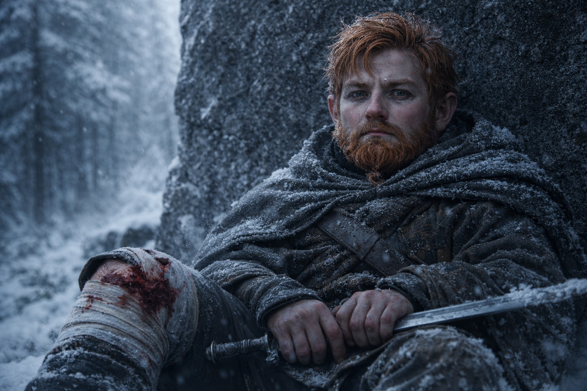
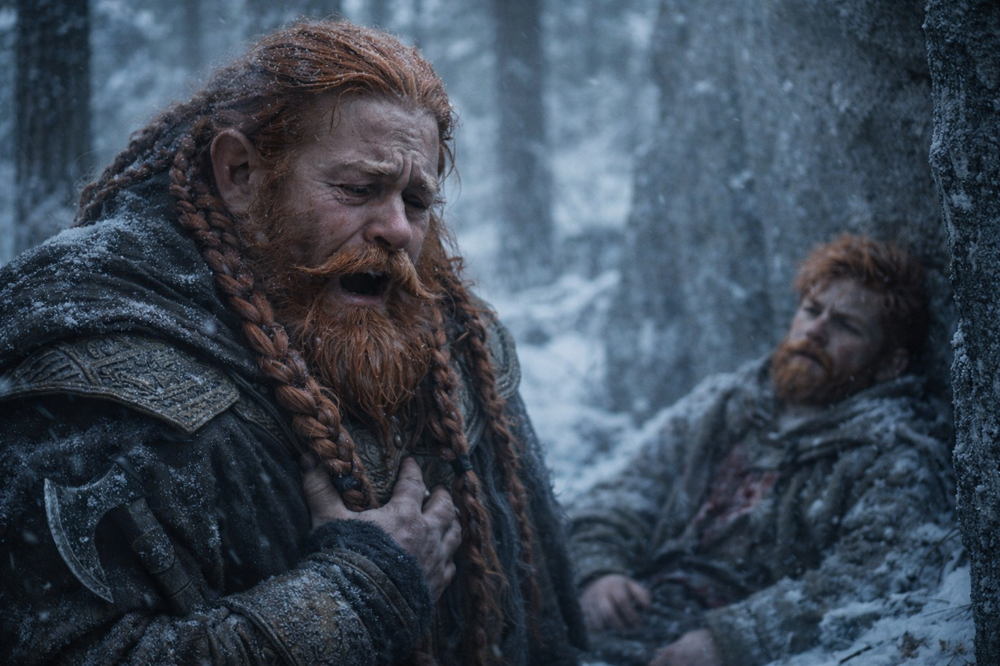

## Capítulo 28 | Parte 3 | El Peso

---

Balin volvió cargando a Xandor, con una flecha en su propia pierna.

Una flecha había alcanzado a Balin en la pantorrilla derecha durante la retirada. Había gruñido, aferrado mejor a Xandor y seguido arrastrando al druida hacia un refugio.

Habían puesto una cresta entre ellos y el sitio de la emboscada. Media legua de ladera congelada, los pinos espesándose mientras subían, crecimiento viejo que no había sido talado porque nadie vivía tan al norte para talarlo. Aldric encontró una depresión entre dos afloramientos de granito donde las paredes de roca proporcionaban cobertura en tres lados y el dosel arriba era lo suficientemente denso para romper su silueta desde la cresta.

Puso a Dulint de guardia. El viejo enano fue sin hablar, su hacha en la mano, su rostro del color de la nieve sucia.

Entonces Aldric se arrodilló junto a Xandor y se puso a trabajar.

La flecha en el hombro del druida tenía punta de hoja ancha, diseñada para alojarse en vez de atravesar. Sacarla directamente hacia atrás desgarraría el músculo. Aldric había visto esto en la Novena Frontera. Había visto a cirujanos de campo manejarlo, y había visto hombres morir porque cirujanos de campo no estaban disponibles.

—Maris. Necesito tus manos.

Maris se arrodilló a su lado. Tenía los dedos fríos, pero firmes, mientras apartaba la tela de la herida de Xandor.

—Tiene que salir hacia adelante, no hacia atrás. A través y afuera. —Encontró los ojos de Xandor. El viejo druida estaba consciente, sudor goteando sobre su piel olivácea a pesar del frío—. Esto va a ser brutal por unos diez segundos.

—He tenido peores. —La voz de Xandor era firme, lo que significaba que estaba mintiendo o realmente había tenido peores, y Aldric respetaba ambas posibilidades por igual.

Xandor mordió la correa que Maris le sujetaba entre los dientes. Aldric trabajó hasta liberar la punta, rompió el asta y retiró lo que quedaba. El cuero amortiguó el grito del druida.

Maris apretó un pliegue de tela limpia contra la herida mientras Aldric buscaba las vendas.

Balin se sentó contra la pared de granito y observó.

La flecha de Balin le había atravesado la pantorrilla. Aldric retiró el asta rota y vendó la herida con tiras de su camisa de repuesto. El joven enano no emitió un sonido.

—No morí —dijo Balin a Dulint.

Su tío estaba a seis metros de distancia, de guardia entre dos pinos, de espaldas al campamento. Dejó de moverse. No se giró.

—Se suponía que debía, ¿verdad? Rápido, escribiste. «Balin muere rápido.» —La voz del joven enano era plana. No triunfante. No acusatoria. Solo la voz de alguien recitando hechos que habían perdido su poder de sorprender pero no su poder de herir—. Corrí hacia la línea. Peleé. Sangré. Y no morí.

Dulint se volvió. Tenía los ojos húmedos. Abrió la boca, pero no pudo responder.

—Aquí no —dijo Aldric. Quedamente. A ambos—. Esa conversación sucede cuando no estemos sangrando y ellos no estén detrás de nosotros.

Balin sostuvo la mirada de Aldric. Luego apoyó la cabeza en el granito y cerró los ojos.

Aldric acabó de vendarse el antebrazo y probó a empuñar la espada. No podía cerrar bien la mano. Contra los hombres que los habían emboscado, eso podía bastar para matarlo.

Se recostó sobre sus talones y miró lo que tenía.

Un druida con una herida en el hombro que tomaría semanas para sanar apropiadamente y que iba a tener días como mucho. Un enano joven con una herida en la pierna que ralentizaría el paso del grupo al menos un cuarto. Un enano viejo que cargaba un secreto que acababa de ser dicho en voz alta. Una vidente que no se había desplomado aún, lo que significaba que el próximo desplome sería peor. Y él mismo, brazo de espada comprometido, responsable de todos ellos.

Había perdido hombres antes. En la Novena Frontera, cuando Varian y Elric cayeron, se había parado en la torre de vigía vacía y contado las cosas que podría haber hecho diferente. La lista tenía veintitrés ítems. La había memorizado. La cargaba como Dulint cargaba la nota en su bota.

Esto no era la Novena Frontera. Estas personas no eran soldados que habían aceptado el contrato. Eran un druida, dos enanos y una vidente que habían sido arrastrados a algo que ninguno de ellos entendía completamente, y él los estaba liderando porque alguien tenía que hacerlo y las alternativas eran peores.

El cuerno había sonado una vez, paciente, después de que huyeran. Paciente significaba persecución organizada. Paciente significaba que sabían exactamente a dónde iba el grupo porque el Cubo en la mochila de Dulint estaba transmitiendo su posición a cualquiera con los medios para escuchar.

Miró la sangre en la nieve. Tres heridos, y los perseguidores podían seguir su rastro con la misma facilidad que él.

Esperó un segundo cuerno.

No llegó.

---

**Fin del Capítulo 28.3  —> 28.4: [La Segunda Sangre: El Silencio Después](/la-segunda-sangre-el-silencio-despues/)**
