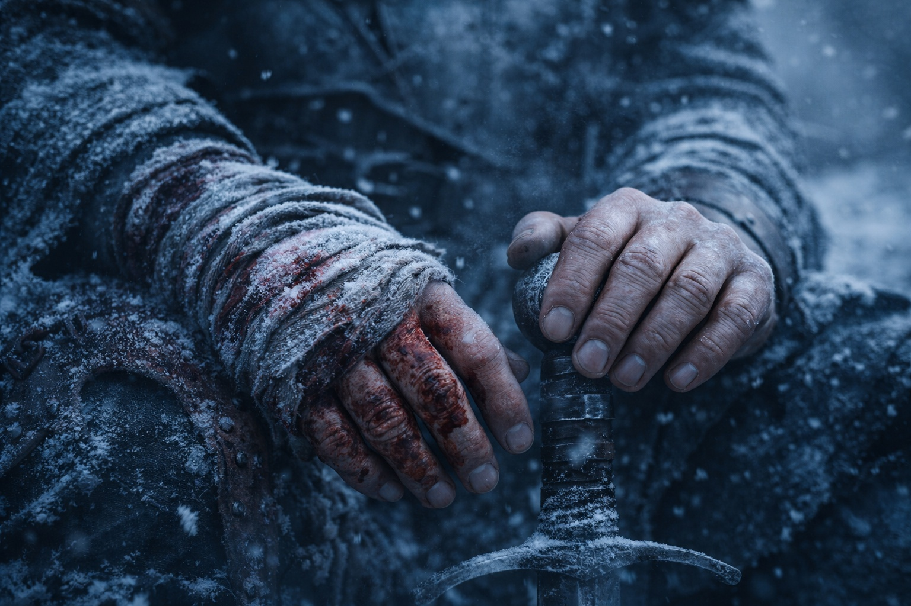

## Capítulo 28 | Parte 4 | El Silencio Después

---

Maris cambió el vendaje de Xandor a medianoche y no despertó a nadie.

Aldric la observó desde su posición contra la pared occidental de granito, donde había estado sentado las últimas cuatro horas con la espada cruzada sobre sus muslos, alternando entre escanear la línea de árboles y escuchar los sonidos que su compañía herida hacía mientras dormía. La respiración de Xandor era laboriosa, un ritmo superficial que se enganchaba con cada inhalación mientras los músculos dañados alrededor de su hombro protestaban la expansión. Balin dormía con la mano en la empuñadura de su espada, un hábito que había desarrollado en la última semana que Aldric reconocía de su propio servicio temprano. Dulint no dormía. Yacía con los ojos cerrados y su respiración demasiado regular, simulando descanso como alguien simula calma cuando es cualquier cosa menos eso.

Maris desenvolvió el vendaje, examinó la herida con la mínima luz de luna que se filtraba a través del dosel, la reempacó con la cataplasma de musgo que Xandor le había instruido preparar antes de que la consciencia lo abandonara, y la revendó con las tiras limpias que había cortado de su propia camisa de repuesto. Sus manos eran firmes. Su rostro no.

—Deberías dormir —dijo Aldric.

—Tú también.

Punto justo. Lo dejó estar.

Maris se sentó a su lado y se apretó los muslos con las manos. Seguía pálida desde la pelea.

—Ella lo vio antes de que sucediera —dijo Maris—. No la emboscada. El resultado. Tres heridos. Ningún muerto. El cuerno sonando una vez.

Aldric procesó eso.

—Viste el resultado y no nos advertiste.

—Ella lo vio durante la pelea. No antes. Las visiones no vienen con horario. Vienen cuando el Faro reacciona a la amenaza. —Sus ojos estaban fijos en la línea de árboles—. Para cuando ella supo el resultado, el resultado ya estaba sucediendo.

—Eso es conveniente.

—Tuvo segundos. —Maris lo miró—. Lo bastante para ver a los dos de la cresta. Te avisó en cuanto pudo.

Recordó el aviso. No le había dado las gracias.

El viento corría entre los pinos. Las ramas heladas crujían sobre ellos. No oía pasos más allá de la hondonada.

Eso le preocupaba más que su presencia habría.

—Están reagrupándose —dijo—. No retirándose. El cuerno fue una llamada de retorno, no una retirada. Vendrán de nuevo, mejor preparados, con más gente o un mejor ángulo. Herimos a uno de los suyos. Ellos hirieron a tres de los nuestros. No podemos permitirnos otra pelea así.

—Aldric.

—Qué.

—Estás hablando como un comandante evaluando bajas.

—Soy un comandante evaluando bajas. —Lo dijo sin inflexión. La Novena Frontera le había enseñado que las emociones sobre el mando eran un lujo comprado con la supervivencia de otras personas—. Xandor no puede pelear. Su brazo izquierdo es inútil por semanas. Balin puede caminar pero no correr. Mi agarre está comprometido. Tú no te has desplomado aún, lo que significa que la próxima visión que te golpee te tumbará por horas. Y el Cubo sigue transmitiendo nuestra posición a cualquiera que escuche.

Maris estuvo callada un momento.

—Ella vio algo más. Durante la pelea. Cuando el Faro reaccionó a las capas grises.

—Qué.

—Saben lo que es el Cubo. No solo que es valioso. Saben lo que hace. Cómo habló el líder, «el dispositivo», cómo lo describió como perteneciente a alguien. Estos no son oportunistas. Fueron enviados.

Aldric ya había llegado a esa conclusión. Coordinación profesional, conocimiento de su historial de servicio, familiaridad con el artefacto. Alguien con recursos y redes de inteligencia había despachado un equipo de recuperación. Los exploradores Grukmar habían sido peligrosos porque eran numerosos y agresivos. Estas personas eran peligrosas porque eran competentes.

—Nos vamos al amanecer —dijo—. Xandor camina o lo cargamos. Balin sigue con nosotros, al paso que pueda. Vamos al norte. Tan rápido como podamos.

—Aldric.

—Qué.

—No has dormido en treinta y seis horas.

Miró sus manos. La derecha envuelta en tela que ya se había empapado con una filtración delgada. La izquierda firme. Esa era la que importaba para sostener una espada si llegaba el momento, que llegaría.

—Dormiré cuando dejen de seguirnos.

Maris ajustó su capa. El frío se estaba asentando en el hueco de granito, condensación formándose en las paredes de roca. En algún lugar arriba, a través del dosel, nubes se movieron sobre la luna y la luz cambió.

—Ella nos ve llegando —dijo Maris quedamente—. No claramente. No completamente. Pero la forma de ello. Cinco personas caminando al norte. Las cinco.

—¿Visión o esperanza?

Maris no respondió. Aldric no insistió.

Escaneó la línea de árboles.

Ni cuerno. Ni movimiento.

Eso era peor.

---

**Fin del Capítulo 28.4  —> 28.5: [La Segunda Sangre: La Elección](/la-segunda-sangre-la-eleccion/)**
