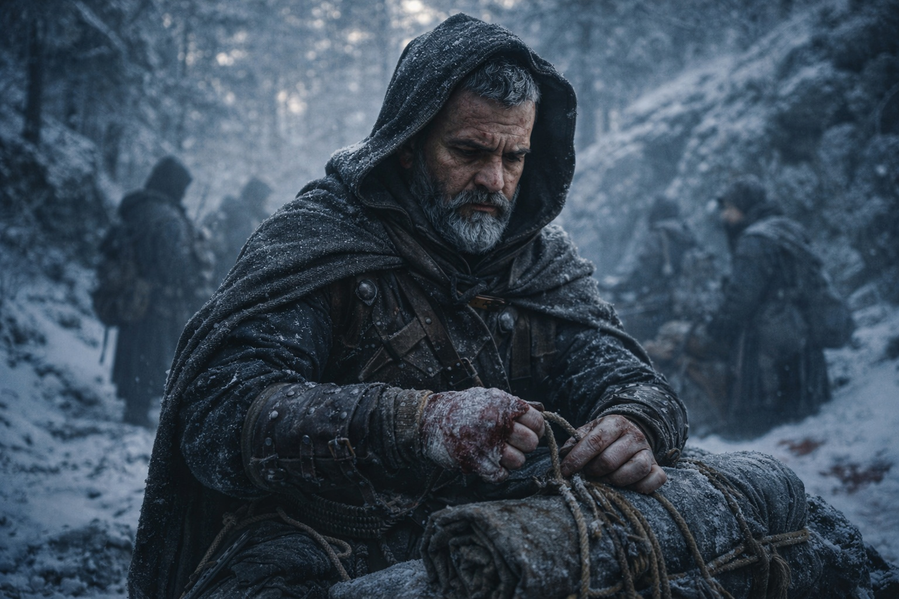
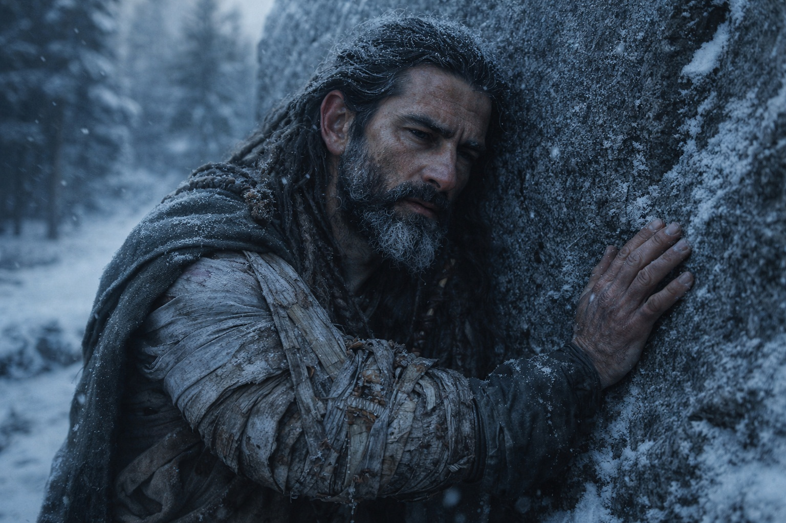
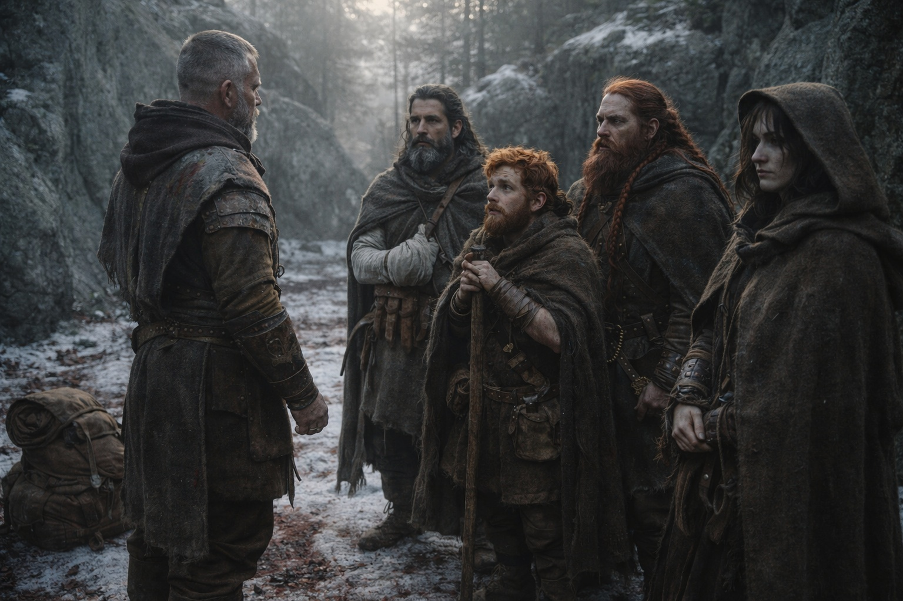
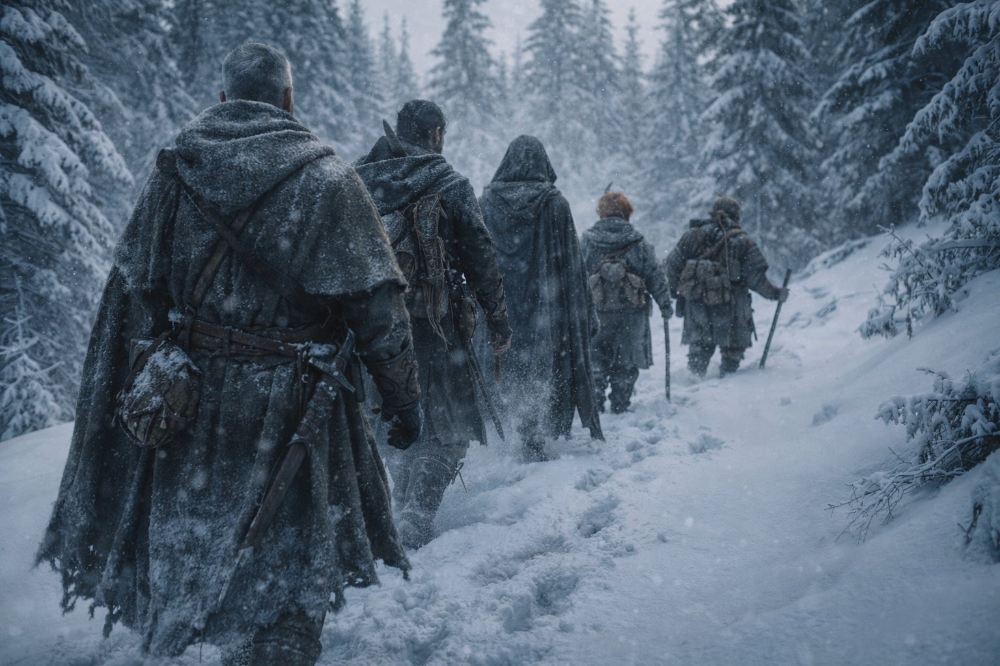
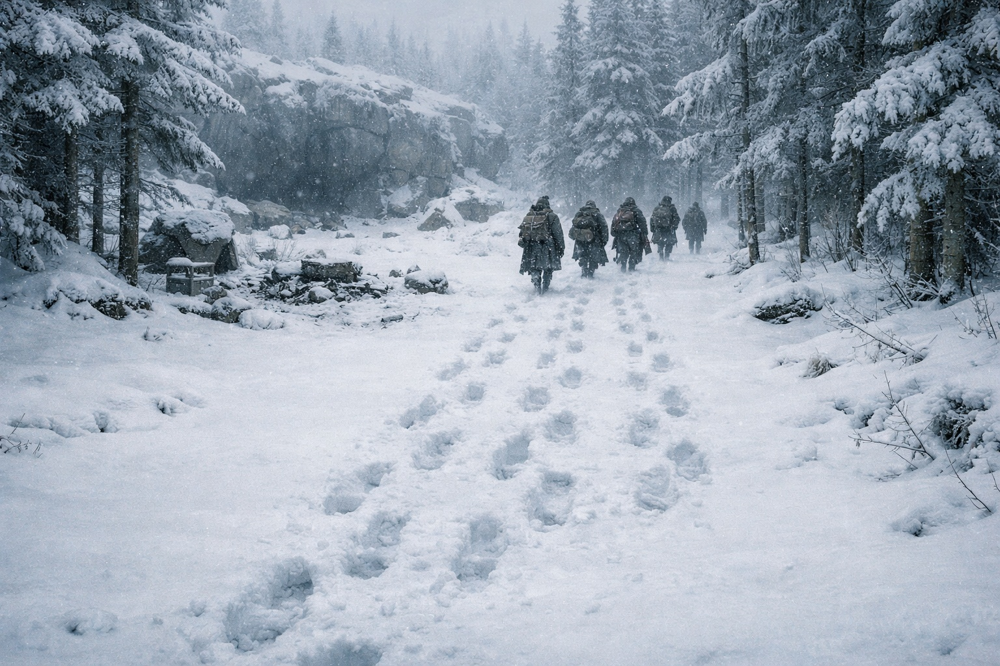

# Capítulo 28.5 | La Segunda Sangre: La Elección

---

Nadie se movió. Aldric se echó su mochila al hombro.

La primera luz llegó como llega a los bosques norteños a finales de otoño: no amanecer sino dilución, la oscuridad adelgazándose hasta que los árboles se convirtieron en formas, luego en troncos, luego en los pinos y abedules específicos de la cresta contra la que se habían refugiado. El hueco de granito tomó color. Sangre sobre nieve. Tela rasgada. El suelo revuelto donde cinco personas habían pasado una noche fingiendo descansar.

Aldric había estado de pie desde antes de que la luz los alcanzara, empacando en silencio metódico. Sus movimientos eran cuidadosos alrededor de la mano derecha, favoreciéndola sin reconocer el favor. La filtración se había ralentizado durante la noche. La venda aguantaba. Podía agarrar, pero la fuerza detrás del agarre estaba disminuida de maneras que importarían si la próxima pelea llegaba a trabajo sostenido.

Llegaría a trabajo sostenido.

Xandor estaba sentado contra el granito con su brazo izquierdo atado firme al pecho, el cabestrillo confeccionado con la bufanda de Maris y una tira de corteza de abedul para rigidez. Su rostro estaba gris con una palidez que no tenía nada que ver con el frío previo al amanecer. Cuando Aldric le ofreció agua, el druida bebió con una concentración que hacía que el acto pareciera la tarea más importante que hubiera intentado jamás. Su mano derecha estaba firme. Su izquierda estaba ausente, una cosa muerta atada a su cuerpo.

—¿Puedes caminar? —preguntó Aldric.

—Puedo caminar.

—¿Por cuánto tiempo?

Xandor consideró eso con la seriedad que merecía.

—Hasta que no pueda. Te avisaré antes de caer.

Suficiente. Aldric se volvió hacia Balin.

El enano ya estaba de pie, lo cual era terquedad o desafío o ambos. Había confeccionado un bastón de una rama de pino durante la noche, la había pelado con su cuchillo de cinturón mientras fingía dormir, y ahora se apoyaba en él con el equilibrio cuidadoso de alguien que había calculado exactamente cuánto peso su pantorrilla herida podía tolerar. La herida de flecha estaba limpia. Maris la había empacado y vendado correctamente. Caminaría. Caminaría lento.

—No voy a ser cargado —dijo Balin antes de que Aldric pudiera hablar.

—No iba a ofrecerlo.

—Lo estabas pensando.

—Estaba pensando que nos ralentizarías. Hay una diferencia.

La mandíbula de Balin se tensó. Luego, una fracción: algo que no era del todo una sonrisa.

—Mantendré el paso.

—Mantendrás algo cercano al paso. Y me dirás si el sangrado empieza de nuevo.

Dulint ya estaba empacado. Había estado empacado desde antes de que Aldric empezara, su saco de dormir atado firme, su hacha asegurada, su rostro fijado en una expresión que Aldric había visto en soldados que habían sobrevivido su primer enfrentamiento real. No la mirada de mil metros del quebrado. Algo más duro. La mirada de un hombre que se había visto fallar y aún estaba contabilizando el costo.

Dulint no había hablado desde las palabras de Balin la noche anterior. El viejo enano se movía por el campamento como una sombra del hombre que se había unido a ellos, manejando tareas con precisión mecánica, anticipando necesidades antes de que fueran expresadas, y sin decir nada. Sus ojos estaban claros. Sus manos estaban firmes. Todo detrás de ellos no lo estaba.

Aldric lo dejó estar. Había conversaciones que necesitaban suceder y conversaciones que necesitaban tiempo, y la diferencia entre ellas era usualmente obvia. Esta necesitaba tiempo.

Maris estaba de pie al borde del hueco, mirando al norte. Su mochila puesta. Su capucha levantada. Había comido lo último de su carne seca sin sentarse, masticando con el ritmo eficiente de alguien que había tenido suficiente hambre, suficientes veces, como para saber que la comida era combustible y el sentimentalismo sobre las comidas era un lujo.

Cinco personas. Tres heridos. Todos de pie. Todos empacados. Todos mirándolo.

Aldric dejó su mochila en el suelo.

—Vendrán de nuevo —dijo. Su voz cruzó el hueco con la claridad plana de alguien dirigiéndose a una formación. No fuerte. No suave. El tono de mando que asumía atención sin exigirla—. El cuerno de anoche fue una llamada de retorno. Están reagrupándose. Probablemente reforzándose. Saben que estamos heridos, saben que nuestro paso bajará, y saben aproximadamente a dónde vamos.

Miró a cada uno de ellos. Xandor, rostro gris y erguido. Balin, apoyado en su bastón con la barbilla levantada. Dulint, quieto como el granito. Maris, observando desde el borde.

—Vamos al norte. Nos movemos tan rápido como la pierna de Balin permita y no nos detenemos hasta llegar al cruce fronterizo de Frostgard. Son cuatro días a paso. Seis o siete al nuestro. Cada día entre aquí y allá es un día en que pueden alcanzarnos, y cuando nos alcancen, pelearemos de nuevo, y la aritmética será peor.

Silencio. Viento en los pinos. Un pájaro llamó una vez y calló.

—Quien quiera salir, que lo diga ahora. —Sostuvo el silencio por tres latidos—. Sin juicio.

Nadie habló. Nadie se movió. La respiración de Xandor era superficial y constante. Los nudillos de Balin estaban blancos en su bastón. Los ojos de Dulint estaban fijos en el rostro de Aldric con una intensidad que bordeaba algo que Aldric no quería nombrar.

—Bien. —Aldric recogió su mochila. La acomodó en sus hombros. Ajustó las correas con la precisión de un hombre que lo había hecho diez mil veces y pretendía hacerlo diez mil más—. Porque mentí. Habría juzgado. Severamente.

Empezó a caminar. Norte. Por entre los árboles, a lo largo de la cresta, siguiendo la ruta que había planeado en las horas oscuras mientras su compañía dormía y el bosque contenía la respiración. Detrás de él, uno por uno, lo siguieron. Xandor primero, moviéndose con pasos cuidadosos que protegían su hombro. Luego Maris, cayendo en el paso naturalmente. Luego Balin, su bastón encontrando agarre en el suelo congelado, cada paso deliberado y pagado. Último, Dulint, que miró atrás una vez al hueco donde su sangre se había empapado en la nieve, luego giró y siguió.

El hueco se vació detrás de ellos. La nieve empezó a llenar las huellas. La sangre en el granito se congelaría y agrietaría y eventualmente sería lavada por el deshielo de primavera, y nadie que encontrara este lugar después sabría lo que había costado dejarlo.

Aldric caminaba en punta. Su mano de espada dolía. Su agarre derecho estaba al ochenta por ciento y se quedaría ahí por días. Detrás de él, cinco juegos de huellas se extendían hacia el sur entre los árboles, haciéndose más superficiales mientras la nieve las cubría, y adelante el bosque se abría hacia terreno que había estudiado en el mapa y tendría que navegar a estima porque el mapa no contemplaba lo que el invierno le hacía a los pasos norteños.

Caminó. Caminaron. El bosque se los tragó.

Tres fuegos en la cresta detrás de ellos: viejas brasas de su campamento, visibles para cualquiera que rastreara. Había considerado dispersarlas. Decidió no hacerlo. Que los cazadores supieran que se habían movido. Que supieran la dirección. Que los siguieran y descubrieran lo que costaba.

Maris se puso a su nivel después de la primera hora. No habló. Caminó junto a él, igualando su paso, y después de un rato dijo:

—Ella ve el camino sosteniéndose.

—¿El camino o las personas?

—Ambos.

Aldric asintió. Eso era suficiente. Era más de lo que había tenido en la Novena Frontera, donde el camino se había sostenido y la mitad de las personas no, y había salido caminando de eso también. Salías caminando o no. El caminar era la elección. Todo lo demás era aritmética.

El bosque se adelgazó mientras subían. El viento arreció. En algún lugar detrás de ellos, pacientes y profesionales y seguros, las capas grises seguían.

Adelante, la frontera. Cuatro días a paso. Seis al suyo.

Detrás de ellos, tenue entre los árboles, un cuerno respondió una vez.

No miraron atrás.

---

*Siguiente: El Drow en la Torre: La Lección*

**Fin del Capítulo 28.5 — continúa en el Capítulo 29.1: [El Drow en la Torre: La Lección](/el-drow-en-la-torre-la-leccion/)**
