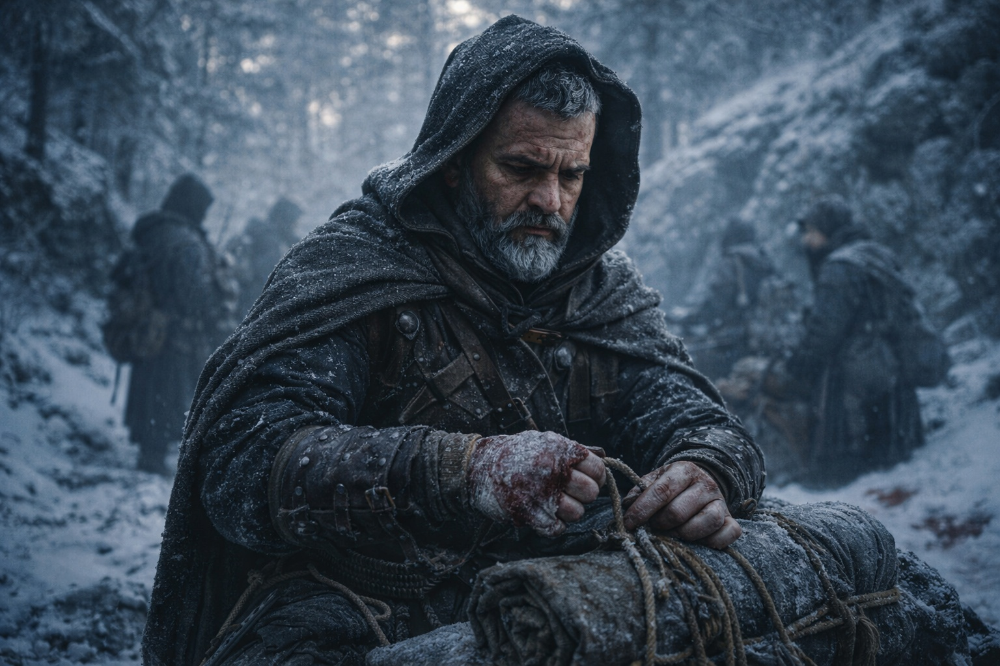
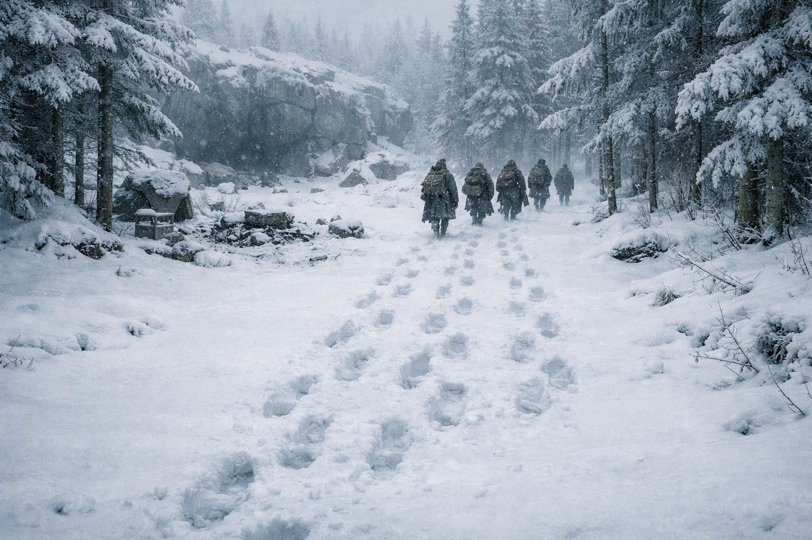
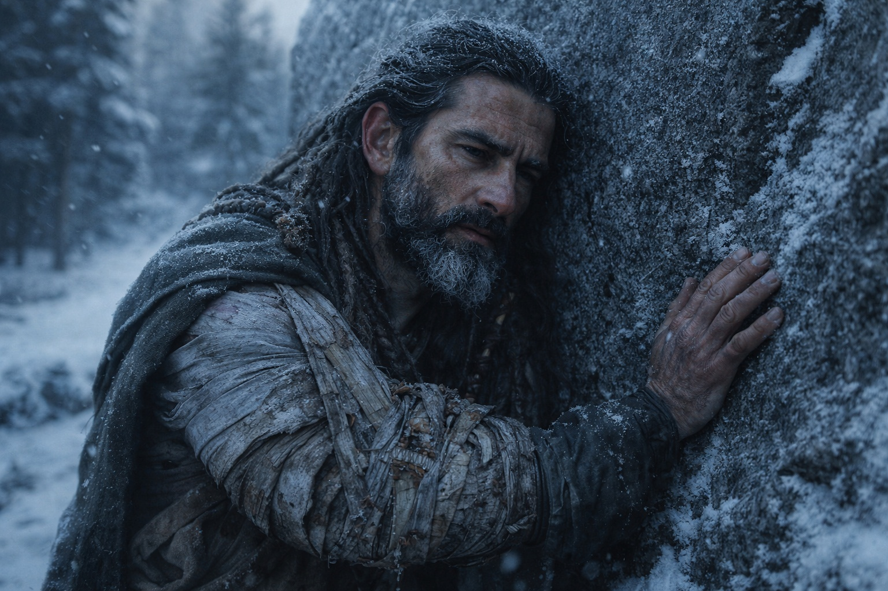

## Capítulo 28 | Parte 5 | La Elección

---

Nadie se movió. Aldric se echó su mochila al hombro.

Con la primera luz, Aldric pudo ver la sangre en la nieve y los restos de tela junto al petate de Xandor.

Recogió sus cosas con cuidado de no forzar el brazo derecho. El sangrado había disminuido, pero aún le faltaba fuerza en la mano.

Tendría que acabar pronto la siguiente pelea.

Xandor estaba sentado con el brazo izquierdo sujeto al pecho. Maris había usado su bufanda como cabestrillo. Aldric le pasó agua y esperó mientras bebía con la mano sana.

—¿Puedes caminar? —preguntó Aldric.

—Puedo caminar.

—¿Por cuánto tiempo?

Xandor consideró eso con la seriedad que merecía.

—Hasta que no pueda. Te avisaré antes de caer.

Suficiente. Aldric se volvió hacia Balin.

El enano ya estaba de pie, lo cual era terquedad o desafío o ambos. Había confeccionado un bastón de una rama de pino durante la noche, la había pelado con su cuchillo de cinturón mientras fingía dormir, y ahora se apoyaba en él con el equilibrio cuidadoso de alguien que había calculado exactamente cuánto peso su pantorrilla herida podía tolerar. La herida de flecha estaba limpia. Maris la había empacado y vendado correctamente. Caminaría. Caminaría lento.

—No voy a ser cargado —dijo Balin antes de que Aldric pudiera hablar.

—No iba a ofrecerlo.

—Lo estabas pensando.

—Estaba pensando que nos ralentizarías. Hay una diferencia.

La mandíbula de Balin se tensó. Luego, una fracción: algo que no era del todo una sonrisa.

—Mantendré el paso.

—Mantendrás algo cercano al paso. Y me dirás si el sangrado empieza de nuevo.

Dulint había recogido sus cosas antes que nadie. Ahora estaba junto al petate, con el hacha sujeta, esperando órdenes.

No había dicho nada desde que Balin habló junto a la roca. Revisó las mochilas de los otros, ajustó una correa suelta y volvió a la suya.

Aldric lo dejó estar. Había conversaciones que necesitaban suceder y conversaciones que necesitaban tiempo, y la diferencia entre ellas era usualmente obvia. Esta necesitaba tiempo.

Maris esperaba al borde de la hondonada, comiendo lo último de su carne seca. Llevaba puesta la mochila y la capucha levantada.

Cinco personas. Tres heridos. Todos de pie. Todos empacados. Todos mirándolo.

Aldric dejó su mochila en el suelo.

—Vendrán de nuevo —dijo. Su voz cruzó el hueco con la claridad plana de alguien dirigiéndose a una formación. No fuerte. No suave. El tono de mando que asumía atención sin exigirla—. El cuerno de anoche fue una llamada de retorno. Están reagrupándose. Probablemente reforzándose. Saben que estamos heridos, saben que nuestro paso bajará, y saben aproximadamente a dónde vamos.

Miró a cada uno de ellos. Xandor, rostro gris y erguido. Balin, apoyado en su bastón con la barbilla levantada. Dulint, quieto como el granito. Maris, observando desde el borde.

—Vamos al norte. Nos movemos tan rápido como la pierna de Balin permita y no nos detenemos hasta llegar al cruce fronterizo de Frostgard. Son cuatro días a paso. Seis o siete al nuestro. Cada día entre aquí y allá es un día en que pueden alcanzarnos, y cuando nos alcancen, pelearemos de nuevo, con menos manos capaces de empuñar una espada.

Silencio. Viento en los pinos. Un pájaro llamó una vez y calló.

—Quien quiera salir, que lo diga ahora. —Sostuvo el silencio por tres latidos—. Sin juicio.

Nadie habló. Nadie se movió. La respiración de Xandor era superficial y constante. Los nudillos de Balin estaban blancos en su bastón. Los ojos de Dulint estaban fijos en el rostro de Aldric con una intensidad que bordeaba algo que Aldric no quería nombrar.

—Bien. —Aldric recogió su mochila. La acomodó en sus hombros. Ajustó las correas con la precisión de un hombre que lo había hecho diez mil veces y pretendía hacerlo diez mil más—. Porque mentí. Habría juzgado. Severamente.

Empezó a caminar. Norte. Por entre los árboles, a lo largo de la cresta, siguiendo la ruta que había planeado en las horas oscuras mientras su compañía dormía y el bosque contenía la respiración. Detrás de él, uno por uno, lo siguieron. Xandor primero, moviéndose con pasos cuidadosos que protegían su hombro. Luego Maris, cayendo en el paso naturalmente. Luego Balin, su bastón encontrando agarre en el suelo congelado, cada paso deliberado y pagado. Último, Dulint, que miró atrás una vez al hueco donde su sangre se había empapado en la nieve, luego giró y siguió.

La nieve empezó a llenar sus huellas antes de que perdieran de vista la hondonada.

Aldric iba delante. Le dolía la mano de la espada. Había estudiado el mapa, pero la nieve ocultaría senderos y cerraría pasos que figuraban abiertos.

Caminó. Caminaron. El bosque se los tragó.

Los perseguidores encontrarían el fuego apagado y las vendas ensangrentadas. Aldric había enterrado las brasas. No había habido tiempo para ocultarlo todo.

Maris se puso a su nivel después de la primera hora. No habló. Caminó junto a él, igualando su paso, y después de un rato dijo:

—Ella ve el camino sosteniéndose.

—¿El camino o las personas?

—Ambos.

Aldric asintió. Miró atrás para comprobar cómo iba Balin. Mantenía el paso.

El bosque se adelgazó mientras subían. El viento arreció. En algún lugar detrás de ellos, pacientes y profesionales y seguros, las capas grises seguían.

Adelante, la frontera. Cuatro días a paso. Seis al suyo.

Detrás de ellos, tenue entre los árboles, un cuerno respondió una vez.

No miraron atrás.

---

**Fin del Capítulo 28.5  —> 29.1: [El Drow en la Torre: La Lección](/el-drow-en-la-torre-la-leccion/)**
