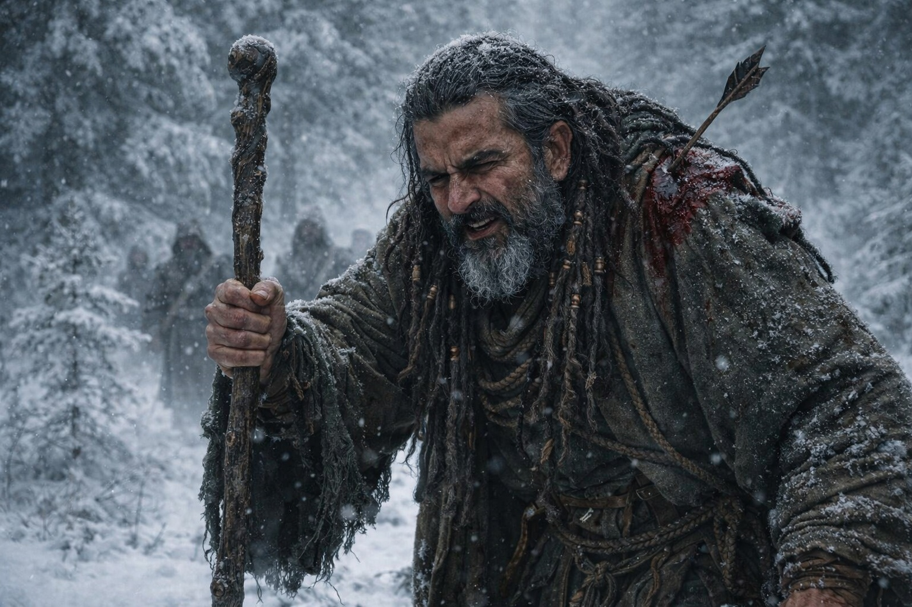
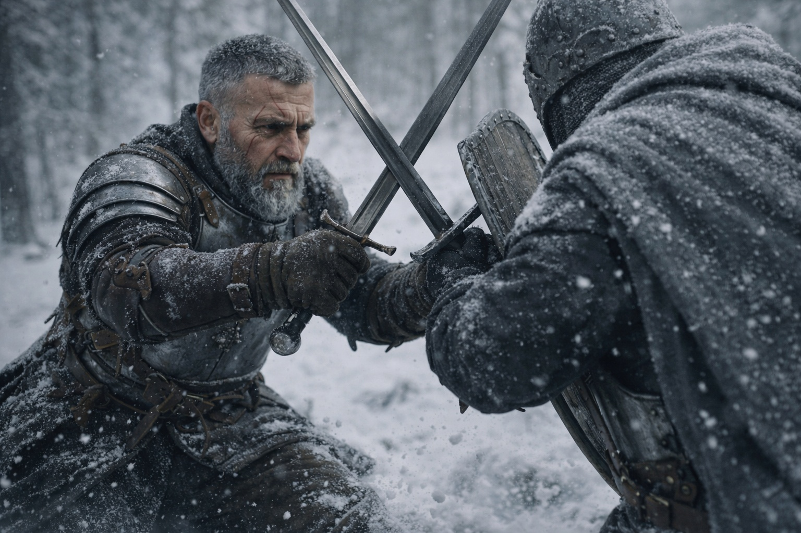
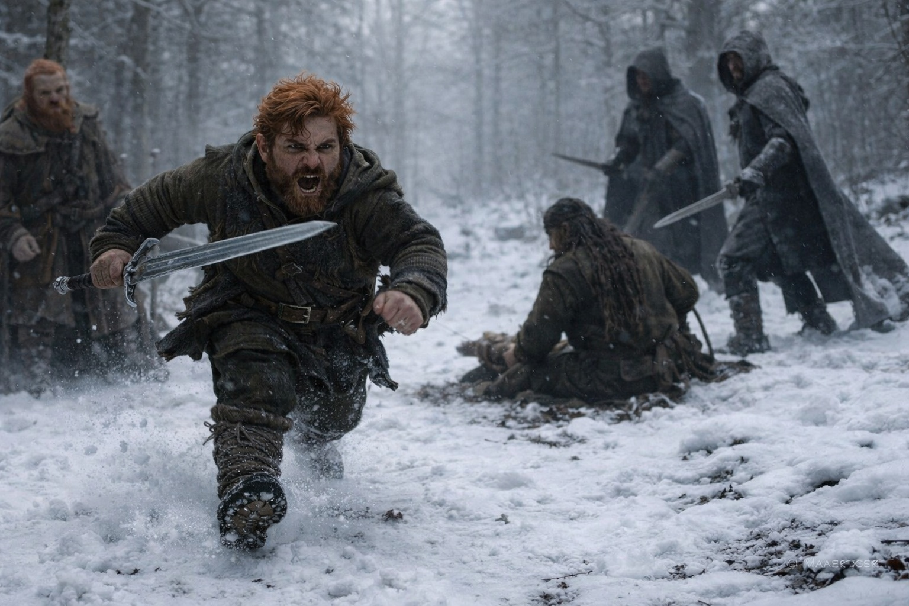
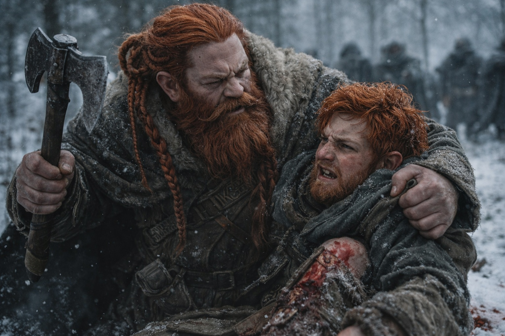
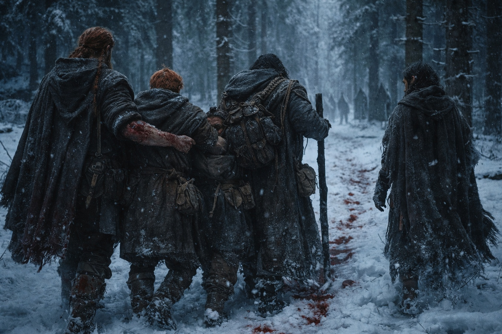

## Capítulo 28 | Parte 2 | La Línea

---

La primera flecha alcanzó a Xandor antes de que el viejo druida terminara de levantar su bastón.

La flecha se clavó en la carne del hombro izquierdo. A Xandor se le cayó el brazo.

Clavó el bastón en el suelo con la mano derecha. Las raíces rompieron la tierra helada bajo dos atacantes. Xandor se venció sobre el bastón, jadeando, mientras los hombres intentaban recuperar el equilibrio.

Entonces la línea colapsó.

No la de ellos. La de los atacantes. Vinieron desde tres lados a la vez, parejas disciplinadas rompiendo en una carga coordinada, y Aldric dejó de pensar y empezó a contar. Distancia. Ángulo. Velocidad. El más alto primero. Espada, diestro, escudo a la izquierda, cerrando desde el noreste con una zancada que cubría terreno eficientemente. Entrenamiento militar. Probablemente frontera, a juzgar por la economía de movimiento.

Aldric lo encontró a siete pasos de Dulint.

El hombre alto atacó deprisa. Aldric paró tres golpes y cedió terreno en el cuarto. En el quinto, el hombre se estiró demasiado y dejó las costillas al descubierto.

La hoja de Aldric atrapó el borde de la capa gris y mordió el cuero debajo. No profundo. El hombre saltó hacia atrás, sorprendido, y Aldric usó el hueco para escanear el campo.

—¡Déjalo! —gritó Aldric, porque Balin ya se estaba moviendo.

El joven enano corría hacia Xandor, que estaba sobre una rodilla ahora, la flecha en su hombro inutilizando su brazo izquierdo, su mano derecha aún aferrada al bastón mientras las raíces revolvían el suelo a su alrededor. Dos capas grises se cerraban sobre el druida, y Balin estaba esprintando directamente hacia ellos con la determinación sin gracia de alguien que había tomado una decisión y quemado cada alternativa detrás de ella.

Dulint vio correr a su sobrino. Aferró el hacha, pero no la sacó.

Balin llegó a Xandor. Su espada atrapó la primera hoja de la capa gris a centímetros del cuello del druida, un bloqueo que no debería haber funcionado a su altura y no lo hizo del todo, el impacto sacudiéndose a través de sus brazos y empujándolo a una rodilla en la nieve. Pero fue suficiente. El golpe se desvió. Xandor usó la apertura para arrastrarse hacia atrás, su bastón trazando una línea en la nieve que las raíces siguieron.

La segunda capa gris atacó bajo. Balin no pudo bloquearlo. Giró, recibió el plano de la hoja contra su muslo en vez del filo por su pantorrilla, y el impacto lo lanzó de costado contra Xandor.

Maris se apoyó en un pino de la retaguardia. Miraba más allá de los combatientes, hacia la cresta sur. Empezó a sangrar por la nariz.

—Dos más vienen de la cresta sur —dijo. Su voz era clínica, despojada de todo excepto el hecho mismo—. Treinta segundos.

Aldric golpeó la muñequera de su rival con el pomo. El hombre aflojó el agarre. Aldric lo apartó con el hombro y avanzó hacia el centro.

Los hombres de las capas grises se relevaban. Cuando Aldric se volvía para parar una hoja, otro lo atacaba por el flanco. Lo estaban alejando de Dulint.

Una hoja atravesó el brazal y le abrió el antebrazo. Cambió el agarre y siguió peleando.

No podía dejar que llegaran a la mochila.

La sangre empapaba la pernera izquierda de Balin donde el golpe le había abierto la piel. Luchaba de rodillas junto a Xandor. Cada parada llegaba más tarde que la anterior.

—Atrás —comandó Aldric—. Todos atrás. Oeste. Por los árboles. Ahora.

Dulint se movió primero. Hacha en una mano, la otra agarrando el cuello de la camisa de Balin, levantando a su sobrino con una fuerza que la edad debería haberle quitado pero la rabia había devuelto. Balin gruñó por el contacto pero sus piernas aguantaron su peso y tropezó hacia el oeste, sangrando en la nieve.

Xandor mantuvo las raíces hasta que los otros llegaron a los árboles. Al soltarlas, el bastón se le escapó de la mano. Balin lo sostuvo y Aldric cubrió la retirada.

Entonces estaban entre los árboles. Corriendo. No rápido, porque Xandor sangraba y Balin cojeaba y el brazo derecho de Aldric se estaba adormeciendo debajo del corte, pero moviéndose, hacia el oeste, lejos del sendero y la trampa y las personas que querían lo que cargaban.

Detrás de ellos, el cuerno sonó de nuevo. Una vez. Paciente.

Nadie respondió.

---

**Fin del Capítulo 28.2  —> 28.3: [La Segunda Sangre: El Peso](/la-segunda-sangre-el-peso/)**
