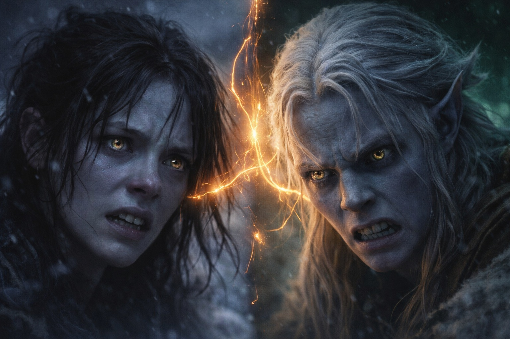
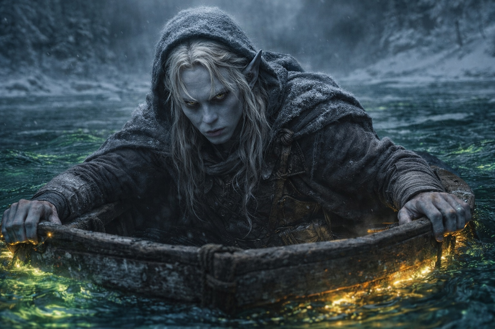

## Capítulo 24 | Parte 3 | El Hombre que se Ahoga

---

El bote desapareció. En su lugar llegó el calor.

El aire le quemaba la garganta. Tosió, o lo hizo él; ya no podía distinguirlo. Notaba sabor a azufre y sentía el sudor correrle por la cara.

Estaba viviendo lo que él vivía.

No podía controlar su cuerpo ni girarle la cabeza. Miraba adonde él miraba. Sentía su miedo y no podía aliviarlo.

Los cristales cubrían las paredes de la cámara. Su luz tenue cambiaba cuando él se movía y Maris no podía ver a qué altura estaba el techo. Bajo el calor de la piedra sentía una vibración constante.

Él estaba solo, junto a la pared. Más allá de la luz de los cristales, ella no distinguía nada.

Le temblaban las manos. Maris sentía el temblor en los dedos, en los antebrazos, hasta los hombros. No era por el calor, sino por lo que tenía delante.

Los ojos de él no conseguían fijarse en aquella forma. Ella percibía su tamaño y volvía a perderla. La presión en el pecho aumentaba cada vez que miraba hacia allí.

El zumbido se hizo más grave.

La presión aumentó en el pecho de él. Ella la sintió a través de su cuerpo, pero no oyó palabras.

Él intentó respirar hondo.

Quería apartarse. Maris lo sentía con tanta claridad como el calor. Sin embargo, permaneció junto a la pared de cristal, apoyado contra ella.

Entonces vio sus manos.

Le temblaban. Tenía la piel gris azulada, cicatrices finas en el dorso y cortes recientes en los nudillos. Las uñas eran afiladas. Pese a las heridas, eran manos jóvenes.

Él levantó la cabeza. La cámara parecía más grande, sin límites que pudiera distinguir. El sudor le entró en los ojos y parpadeó para despejarlos.

La presión aumentó.

Se llevó una mano a las costillas.

Tenía miedo y, por debajo, Maris sentía una pena cuyo origen desconocía. Aun así, él seguía de pie. Ella conocía aquel esfuerzo: levantarse después de una visión, todavía sangrando, cuando apenas podía sostenerse.

Extendió la mano hacia la pared.

Los dedos se abrieron sobre una zona de cristal. Maris sintió el calor a través de la palma y el esfuerzo que le costaba mantenerse en pie.

La vibración le subió por el brazo.

La vista de él empezó a fluctuar. Le salió sangre de la nariz y le tembló la mano apoyada en la pared. Maris sintió el dolor por todo su cuerpo y no pudo apartarse.

Se oyó gritar, muy lejos, en el bosque.

Bajo el zumbido de la cámara percibió otro pulso, cerca del pecho de él. Reconoció el ritmo.

La señal del Faro. Dentro de él.

Algo respondía en su pecho con el mismo ritmo que el artefacto de la mochila de Dulint. Lo sentía desde dentro. No podía distinguir dónde acababa y dónde empezaba el propio cuerpo de él.

No sabía si él lo percibía.

La vista de él se despejó un instante. En una cara lisa del cristal, Maris vio su reflejo: piel gris azulada, pelo blanco apelmazado por el sudor, orejas puntiagudas. Con aquella luz tenue distinguió el amarillo de sus ojos.

Era joven. Más joven que Balin.

Lo había llamado el hombre que se ahoga para mantenerlo apartado de su propia vida. Ahora conocía el dolor de su mano y cuánto deseaba tener a alguien a su lado.

La presión cedió. Él se apoyó en la pared y se limpió la nariz. La mano seguía temblándole. Maris sintió la roca contra el costado mientras él intentaba recuperar el aliento.

Levantó la vista.

Durante un instante, los ojos de él encontraron los suyos.

Sintió que su atención se volvía hacia ella. No podía saber qué veía, solo que parecía haber notado que había alguien más.

Él abrió la boca.

La imagen vaciló.

---

**Fin de Capítulo 24.3 —> 24.4: [La Visión Clara: La Distancia](/la-vision-clara-la-distancia/)**

