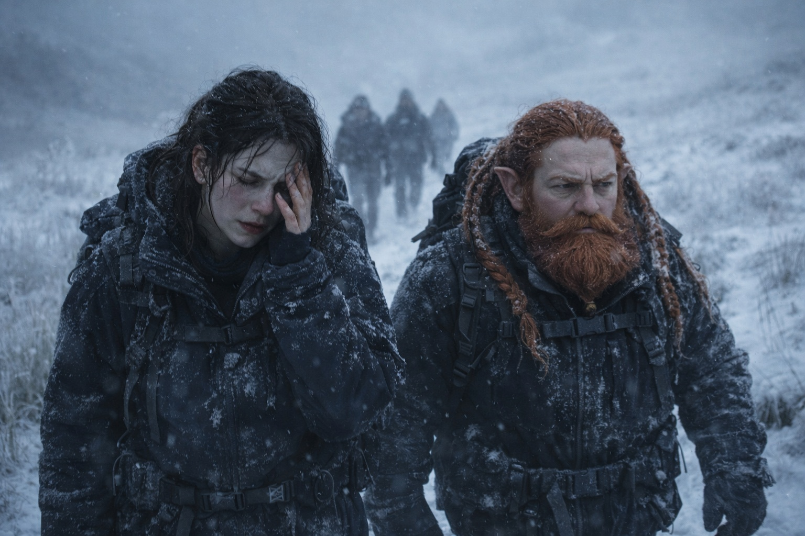
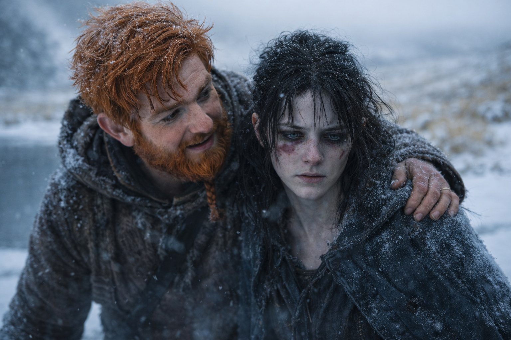
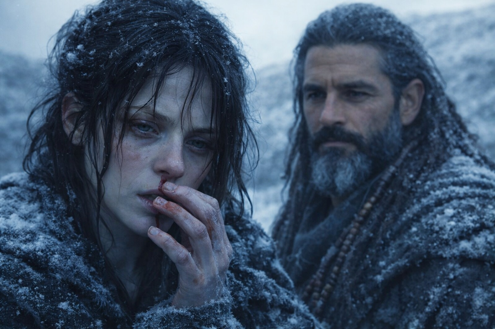
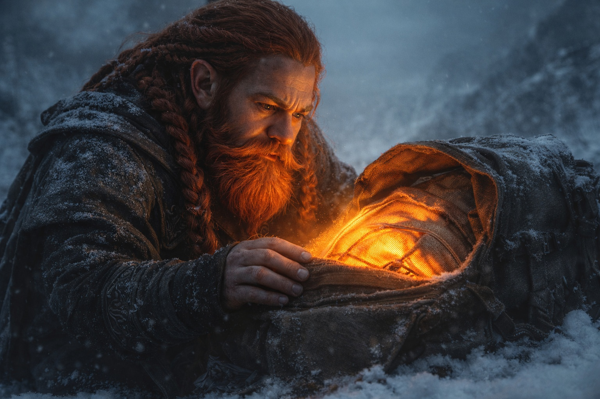
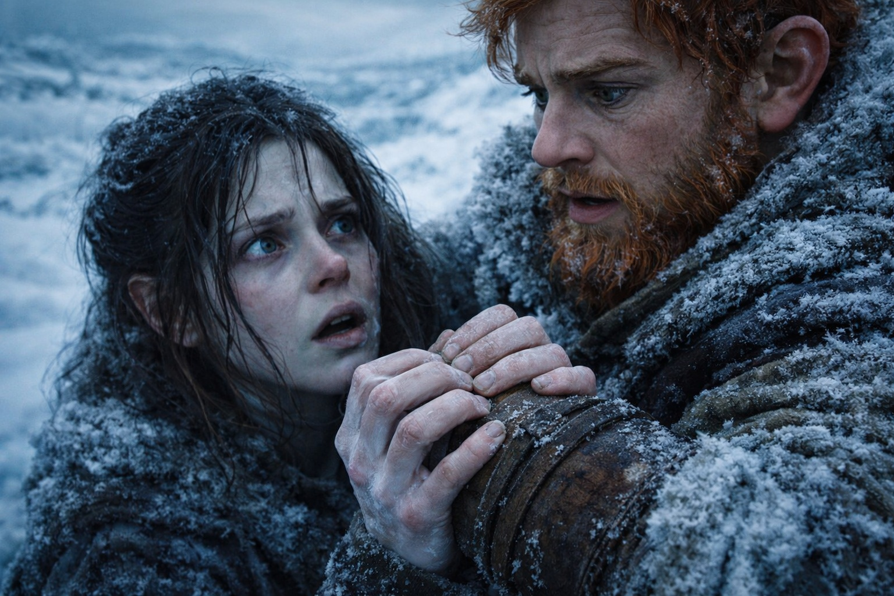

## Capítulo 24 | Parte 1 | La Acumulación

--- 

El dolor empezó detrás del ojo izquierdo y se extendió por la frente.

Maris se apretó la cuenca del ojo con dos dedos hasta ver manchas de colores. El dolor no cedió. Llevaba tres días sin ceder, pese al té de Xandor, el descanso y los paños fríos que Balin le ofrecía con una preocupación que creía disimular. El muchacho había aprendido mucho desde Stonehold. A ocultar lo que sentía, todavía no.

Caminaban hacia el norte. Maris sentía el ritmo del Faro en los dientes incluso cuando se alejaba de Dulint. Una semana antes había podido ignorarlo durante ratos. Ahora cada pulso dolía.

—Cargas el peso sobre el lado derecho —dijo Eldric desde delante, sin volverse. Aquel hombre tenía ojos en la nuca o un oído capaz de distinguir el menor cambio de paso. Probablemente ambas cosas.

—Tengo dormido el pie izquierdo.

—Lo tienes dormido desde ayer.

No respondió. Tenía razón. El entumecimiento había empezado en los dedos y había subido hasta el tobillo. Ella lo había atribuido al frío, a las botas, al terreno. Cada vez le costaba más creerse sus propias excusas.

Dulint se rezagó hasta ponerse a su lado. Pese a su tamaño, el enano caminaba sin hacer ruido. Durante cincuenta pasos no dijo nada; se limitó a seguir su ritmo. Maris agradeció el silencio. La mayoría intentaba tranquilizarla y solo conseguía empeorar las cosas.

—El pulso ha cambiado esta mañana —dijo él. No era una pregunta.

—Va más deprisa. Y debajo hay otra frecuencia, más grave. Casi no se oye. —Se frotó la nuca, donde tenía los músculos tensos—. Como si aumentara la presión.

—¿Hasta qué punto?

—No lo sé. Eso es lo que me asusta.

Balin exploraba el camino por delante, con una mano cerca de la espada. Xandor seguía a Maris. Cada vez que ella aflojaba el paso, lo oía acercarse.

Cruzaron un arroyo helado. El hielo aguantó, aunque las grietas crujieron bajo su peso. En una abertura de agua oscura, Maris vio su reflejo: mejillas hundidas, ojeras, el blanco del ojo izquierdo todavía enrojecido por los vasos que se habían roto dos noches antes. Tenía mal aspecto. Se sentía peor.

El Faro emitió un pulso más fuerte.

Tropezó. Dulint la sujetó por el codo y la sostuvo. Maris notó sabor a cobre al fondo de la garganta. Aún no era sangre. Pero ya conocía lo que venía después.

—Deberíamos parar —dijo Dulint.

—Paramos ayer. Y anteayer. Si nos detenemos cada vez que tropiezo, pasaremos aquí el invierno.

—Mejor eso que tener que llevarte a cuestas.

Ella soltó el brazo con cuidado. Quería caminar sin que nadie la sostuviera.

Una legua más adelante entraron bajo unos árboles de corteza rojo oscuro. Las ramas se unían por encima de ellos y ocultaban el cielo. Maris tiritó pese al esfuerzo de caminar.

El Faro volvió a pulsar. Esta vez lo sintió en la columna, una presión desde la base del cráneo hasta el final de la espalda. Vio agua negra y una mano extendida. Desaparecieron antes de que pudiera fijarse.

—Le está pasando algo —susurró.

Dulint la miró.

—Al hombre que se ahoga. —Se detuvo. Habló con el tono preciso que usaba cuando la alternativa era gritar—. Le está pasando algo ahora mismo. La señal aumenta por algo que está viviendo él. Siento la presión desde los dos lados.

—¿Los dos lados?

—El Faro y él. Como dos manos empujando la misma pared. —Se tocó la sien. Los dedos salieron limpios, pero el sabor a cobre era más intenso—. La pared se está haciendo más delgada.

Xandor se había detenido detrás de ellos. Su expresión se tensó. Maris recordó que el druida tenía edad suficiente para haber visto cosas que los demás solo conocían de oídas.

—¿Cuánto le queda? —preguntó Xandor.

—No lo sé. Días. Horas. No puedo distinguirlo.

Maris permaneció rígida mientras aumentaba la presión. Le daba miedo moverse, como si un gesto brusco pudiera acabar de romper lo que aún separaba su mente de la de él.

Balin volvió por el sendero al ver que se habían detenido. —¿Qué pasa?

Maris lo miró, después a Dulint y a la mochila por cuya lona se filtraba la luz del Faro.

Agarró el brazo de Dulint. Los dedos se le hundieron en el cuero del brazal con una fuerza que los sorprendió a ambos.

—Le está pasando algo terrible —dijo—. Ahora mismo. Lo siento cada vez más. Y cuando ocurra, me arrastrará con él.

El pulso del Faro se intensificó.

Maris se aferró a Dulint y esperó el siguiente.

---

**Fin de Capítulo 24.1 —> 24.2: [La Visión Clara: La Caída](/la-vision-clara-la-caida/)**

