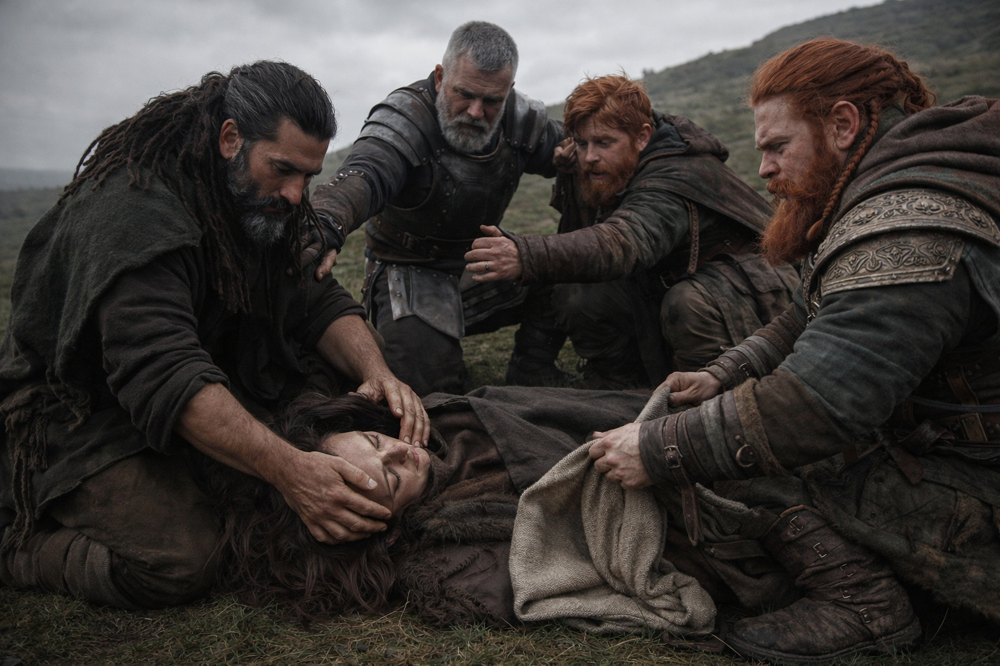
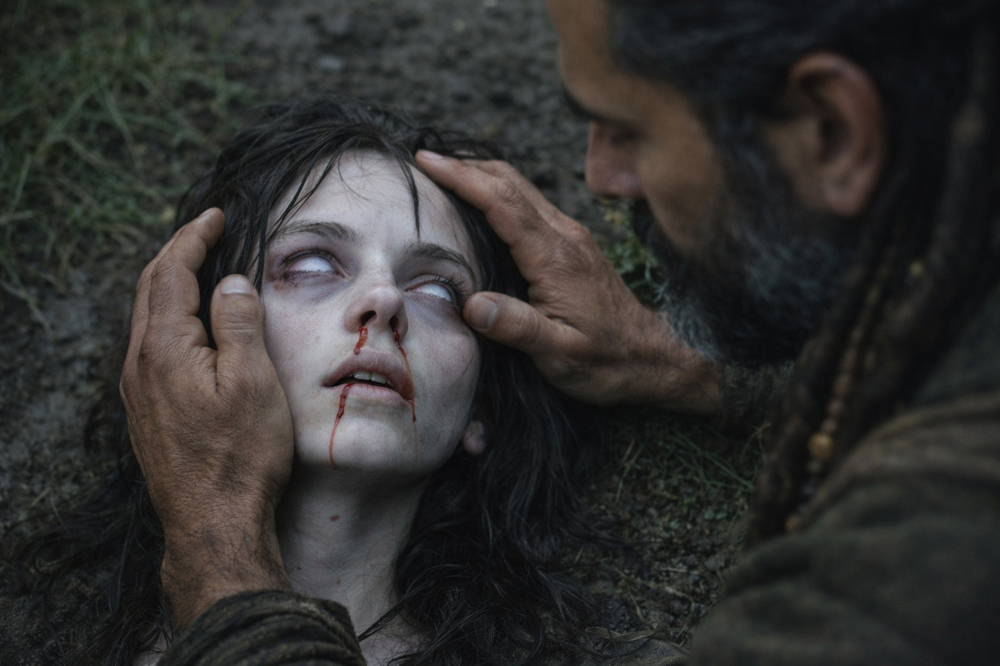

## Capítulo 24 | Parte 2 | La Caída

---

La alcanzó en pleno paso.

Tenía un pie en el suelo y el otro levantado cuando perdió la vista. Después de horas de dolor creciente, no hubo un último aviso ni tiempo para sentarse.

Ya no veía dónde poner el pie.

La mejilla le golpeó una raíz. Los dientes le abrieron el labio y sintió sabor a sangre. No había conseguido levantar las manos.

—¡Maris!

La voz de Balin sonaba lejana. Intentó volverse hacia ella.

Trató de decir su nombre, pero no pudo mover la lengua.

Unas manos la sujetaron por los hombros y la pusieron boca arriba. Las copas de los árboles giraban sobre ella. Las ramas se cruzaban contra un cielo demasiado brillante, que pulsaba.

—Sujétale la cabeza. Que no se golpee. —La voz de Eldric seguía serena, como cuando atendía a un herido—. Xandor, la nariz.

Sentía la sangre salir de ambas fosas nasales y correr hacia las orejas. Más que en las hemorragias anteriores. Xandor le puso un paño bajo la nariz; quedó empapado en segundos.

—Esto es distinto —dijo Xandor. Lo oyó con claridad, aunque el bosque parecía cada vez más lejano—. No es una visión normal. Las pupilas no están iguales. La izquierda está completamente dilatada.

—¿Qué significa eso?

—Que debemos protegerle la cabeza y evitar que se haga daño.

Quería decirles que los oía. Sentía sus manos, pero el bosque se desvanecía. Algo la alejaba de ellos.

El Faro chilló.

Dulint maldijo y arrojó la mochila al suelo. El sonido dolía incluso a través de la lona. Balin retrocedió a trompicones. Eldric desenvainó la espada, pero se detuvo con la hoja a medio sacar.

El sonido llegó a Maris a través del suelo. El tirón se intensificó y dejó de ver los árboles.

Aún sentía las manos de Dulint en la muñeca y la palma temblorosa de Balin en la frente. Xandor murmuraba a su lado. No podía distinguir si la estaba atendiendo o rezaba.

Lo sentía todo, pero no bastaba.

El tirón era más fuerte.

El agua negra subió a su alrededor. Sabía que estaba tendida en el suelo, pero sentía el frío en la garganta.

Su cuerpo se arqueó. Oyó a Eldric maldecir. La mano de Balin se apartó de su frente y volvió a apoyarse en ella.

—Que no se golpee. Protejan la cabeza y dejen libres los brazos y las piernas.

Intentó decirles que se ahogaba. No emitió ningún sonido.

El agua le cubrió la barbilla y alcanzó los ojos. No podía respirar. Sabía que estaba en un bosque, rodeada de gente que intentaba ayudarla, pero no conseguía tomar aire.

*Así no es como funciona.*

Fue lo último que pensó antes de perderse en la visión. Siempre había podido observar lo que ocurría desde fuera. Nunca había tenido que respirar por la persona que veía.

*Así no es como funciona.*

El agua negra le cubrió la cabeza.

Estaba mirando a través de los ojos de otra persona. Sentía el miedo de él con la misma intensidad que el suyo.

---

**Fin de Capítulo 24.2 —> 24.3: [La Visión Clara: El Hombre que se Ahoga](/la-vision-clara-el-hombre-que-se-ahoga/)**

