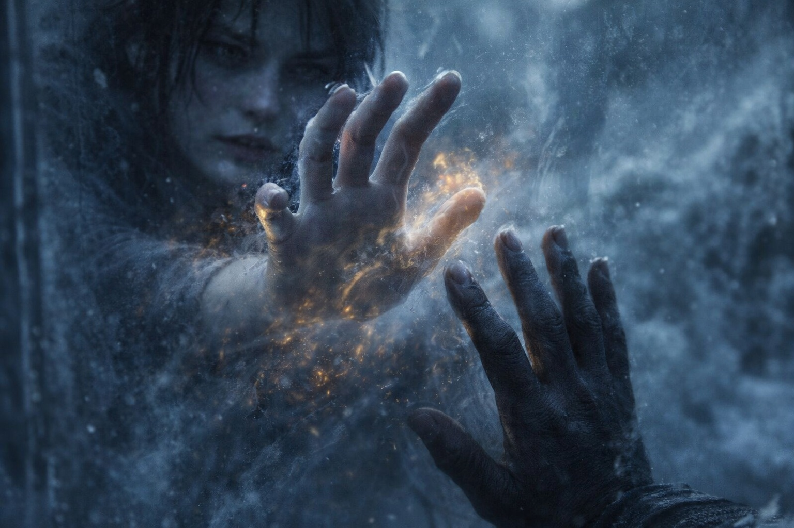
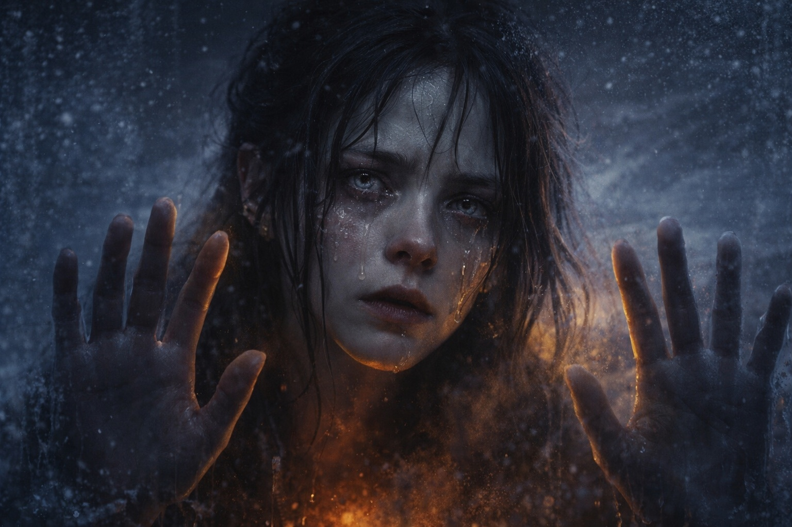

## Capítulo 24 | Parte 4 | La Distancia

---

Él la había visto.

Por un momento, la conexión se mantuvo. La respiración de él vaciló. Maris sintió que dejaba de prestar atención a la cámara y la buscaba a ella.

Había notado a alguien.

Parecía incapaz de creer que estuviera allí. Después intentó alcanzarla, y ella sintió cuánto necesitaba una respuesta.

Lo sintió buscarla. Por primera vez se preguntó cuánto de su propio miedo podía percibir él.

Intentaba hablar.

Usó un idioma que ella no reconoció. Como no obtuvo respuesta, se detuvo y volvió a intentarlo, más despacio.

*¿Quién eres?*

Maris no entendía el idioma, pero la pregunta le llegó. Quería saber quién estaba allí.

Intentó responder.

*Soy Maris. Te veo. No estás solo.* Intentó hacerle llegar las palabras. Algo las detuvo. Sentía que él esperaba, pero no sabía si la había oído.

Insistió. Nada cedió. Aún sentía su dolor, pero no conseguía hacerse oír.

El pulso junto al pecho de él respondía al Faro en la mochila de Dulint. Maris sentía el mismo ritmo a ambos lados de aquello que los separaba.

Él estaba muy lejos.

No podía calcular la distancia. No se parecía al espacio entre ciudades o países. Lo que los separaba no cedía cuando intentaba hablar.

Quizá el Faro los guiaba hacia un lugar donde aquella conexión pudiera mantenerse. No veía cómo bastaría con caminar hacia el norte para llegar hasta él.

Conocía el ritmo de su respiración y el dolor donde el costado rozaba la pared. El estómago de él se tensó cuando la presencia se movió. Ella también lo sintió.

No veía a nadie a su lado. Fuera lo que fuese lo que había ocurrido, lo había afrontado solo.

Volvió a intentar hablar. Concentró el esfuerzo en hacerle llegar una sola idea.

*Te veo. Voy a buscarte.*

Él abrió más los ojos. ¿Le había llegado algo? Ella lo intentó de nuevo, pero la resistencia era mayor.

Ya no sentía la mano de él.

La conexión estaba fallando.

El dolor llegó al perder el contacto. Maris gritó, pero ya no podía saber si él la oía.

La cámara desapareció. No supo dónde estaba su cuerpo hasta que sintió el suelo debajo.

Había vuelto.

Suelo frío. Agujas de pino contra la mejilla. Olor a escarcha y sangre.

Se oía gritar. Le dolía la garganta, pero no podía parar ni explicarles a los demás por qué.

---

**Fin de Capítulo 24.4 —> 24.5: [La Visión Clara: Las Consecuencias](/la-vision-clara-las-consecuencias/)**

