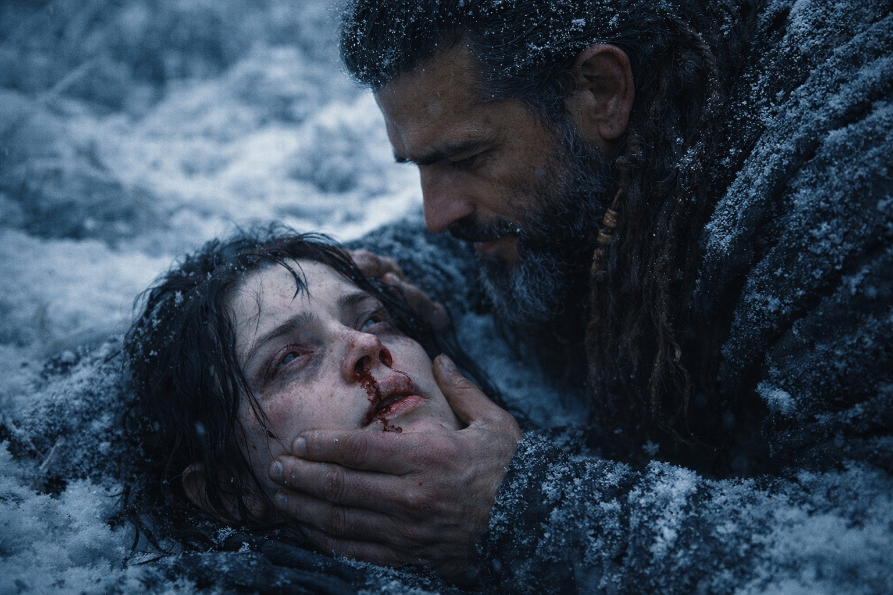
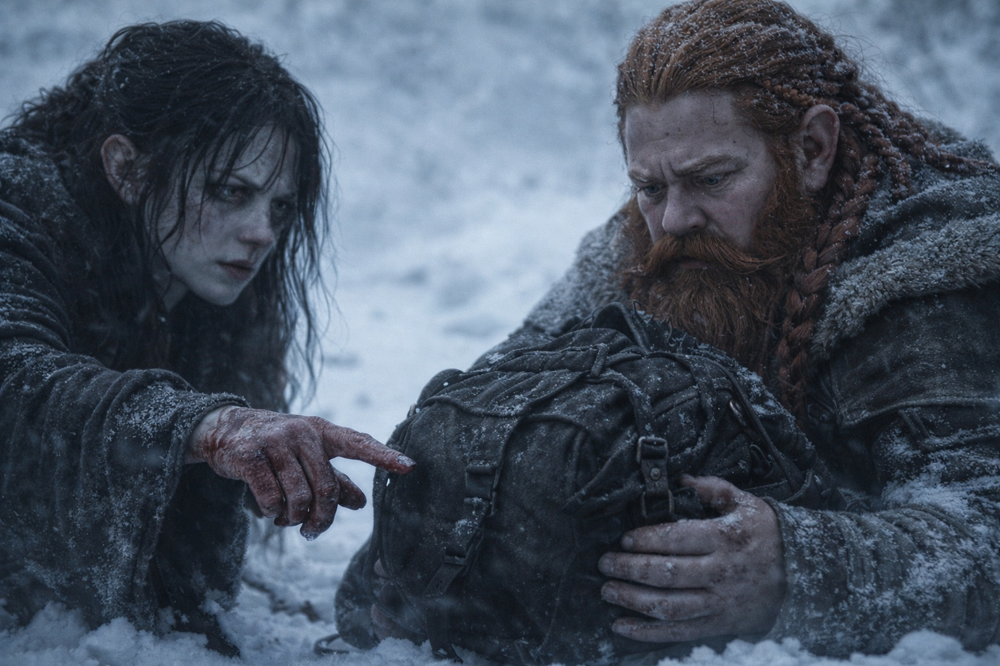

## Capítulo 24 | Parte 5 | Las Consecuencias

---

La sangre le corría por la nariz y el oído izquierdo. Una línea roja descendía desde el rabillo del ojo.

La garganta le falló. Intentó hablar y solo le salió un sonido ronco. Le temblaban las manos, tenía la pierna izquierda entumecida desde la cadera y no podía levantar la cabeza sin sentir un dolor agudo en la base del cráneo.

Xandor hablaba, pero ella no distinguía las palabras. Un pitido fino le llenaba los oídos. Por el movimiento de la boca, comprendió que le preguntaba si lo oía.

Asintió. Todo pareció inclinarse a un lado.

—No te muevas. —La voz le llegó por fin, lejana bajo el pitido—. Estás sangrando por donde no deberías. Quédate quieta.

Dulint apareció sobre ella, con la mandíbula apretada. Detrás, Balin sujetaba la espada sin apuntar a nada. Había oído gritar a su amiga y había sacado lo único que tenía para defenderla.

—Guárdala, muchacho —dijo Eldric—. Aquí no hay nada que cortar.

Balin no la guardó. A él también le temblaban las manos.

Xandor le puso un paño limpio bajo la nariz. La hemorragia había disminuido, pero la tela volvió a teñirse de rojo. Le inclinó la cabeza para examinarle la oreja y le limpió la sangre de la mejilla. Tenía los hombros tensos, aunque la tocaba con cuidado.

—¿Cuánto tiempo? —logró preguntar. La voz apenas le salía.

—Siete minutos —dijo Eldric—. Convulsionaste durante los tres primeros. Luego te quedaste rígida dos minutos. Los dos últimos gritaste.

Siete minutos. Más del doble que la visión anterior. Se concentró en el número mientras esperaba a que cediera el pitido.

—Agua. —Balin le acercó el odre antes de que terminara de pedirlo. Bebió y notó el sabor a cobre bajo el frío.

Le dieron diez minutos. Pasó los primeros cinco tendida, esperando a que las manos dejaran de temblar tanto. Después intentó sentarse. Xandor quiso detenerla, pero ella apartó sus manos. Necesitaba contar lo que había visto antes de olvidarlo.

—Lo vi.

Los cuatro se volvieron hacia ella.

—Al hombre que se ahoga. Lo vi con claridad. Estaba dentro de su cuerpo. Sentía lo que él sentía. —Se limpió el labio superior—. Piel gris azulada, pelo blanco, orejas puntiagudas. El elfo oscuro que describió Xandor. Parecía más joven que Balin.

Balin se estremeció.

—Estaba en una cámara dentro del volcán. Había algo allí. No podía verlo, pero él lo sentía y yo también. —Se llevó una mano al pecho—. Se sujetó a la pared. Le sangraba la nariz. Pensé que iba a caerse.

—¿Por qué? —preguntó Eldric.

—No lo sé. Quería alejarse, pero se quedó. Sentí cuánto le costaba.

Dulint se agachó a su lado. —El Faro. Dijiste algo mientras convulsionabas. Dijiste *dentro*.

Ella lo miró y después miró la mochila. Desde que terminó la visión, el pulso del Faro apenas producía una luz tenue.

—Hay algo cerca de su pecho que responde al Faro.

Nadie habló.

—Lo sentí desde dentro de él. No pude distinguir si lo llevaba encima o si formaba parte de su cuerpo. El ritmo coincidía con el nuestro.

—¿Qué te impedía hablar con él? —Xandor se acercó.

—Podía sentirlo, pero él apenas podía oírme. Algo nos lo impedía. —Se apretó la frente con la palma—. Creo que el Faro puede estar señalando un lugar por donde podamos pasar.

—Un paso —dijo Xandor—. ¿A través de una barrera entre mundos?

—No sé si es eso. Sé que podía sentirlo a través de ella, pero no conseguía hacerme oír.

Eldric caminó tres pasos y se detuvo. —Así que seguimos el Faro hasta ese hueco. Y al otro lado puede haber alguien con otra pieza.

—Sí.

—Y lo que haya en esa cámara puede alcanzarlo.

Maris cerró los ojos. Recordó cómo él extendía la mano pese al dolor.

—Creo que lo está cambiando —dijo—. No sé en qué. Sentí que algo respondía dentro de él cuando aumentó la presión.

—¿Él lo sabe?

—No pude distinguirlo. Intentaba mantenerse en pie.

El viento movió las ramas heladas. El Faro emitía una luz tenue dentro de la mochila de Dulint.

—Hay algo más —dijo Maris.

Esperaron.

—Me vio. Al final. Me miró y supo que estaba allí. Intentó hablar. —La voz se le quebró—. Preguntó quién era. Intenté responderle. No pude hacerme oír. Pero ahora sabe que hay alguien al otro lado.

Balin seguía con la espada en la mano. Maris lo miró hasta que la bajó y después se volvió hacia Dulint.

—Es real. Y lo que lo conecta con el Faro le está haciendo daño. —Se enderezó pese al dolor—. Tenemos que encontrar un paso.

Dulint miró a Eldric. Eldric se volvió hacia Xandor. El druida seguía observando a Maris, que aún sangraba y ya estaba dispuesta a intentarlo de nuevo.

—Al norte —dijo Dulint.

—Al norte —confirmó Maris—. Y más deprisa.

El Faro emitió un pulso débil. Maris ya no quiso preguntarse qué significaba.

Mantuvo la vista en Dulint.

---

**Fin de Capítulo 24.5 —> 25.1: [El Acercamiento: Más Allá de los Campos de Cristal](/el-acercamiento-mas-alla-de-los-campos-de-cristal/)**

